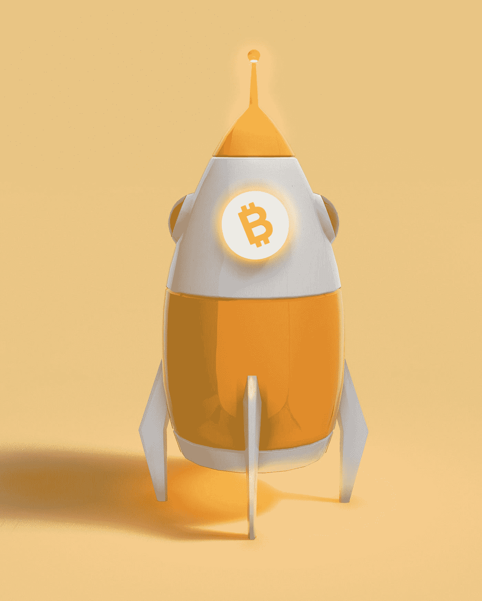
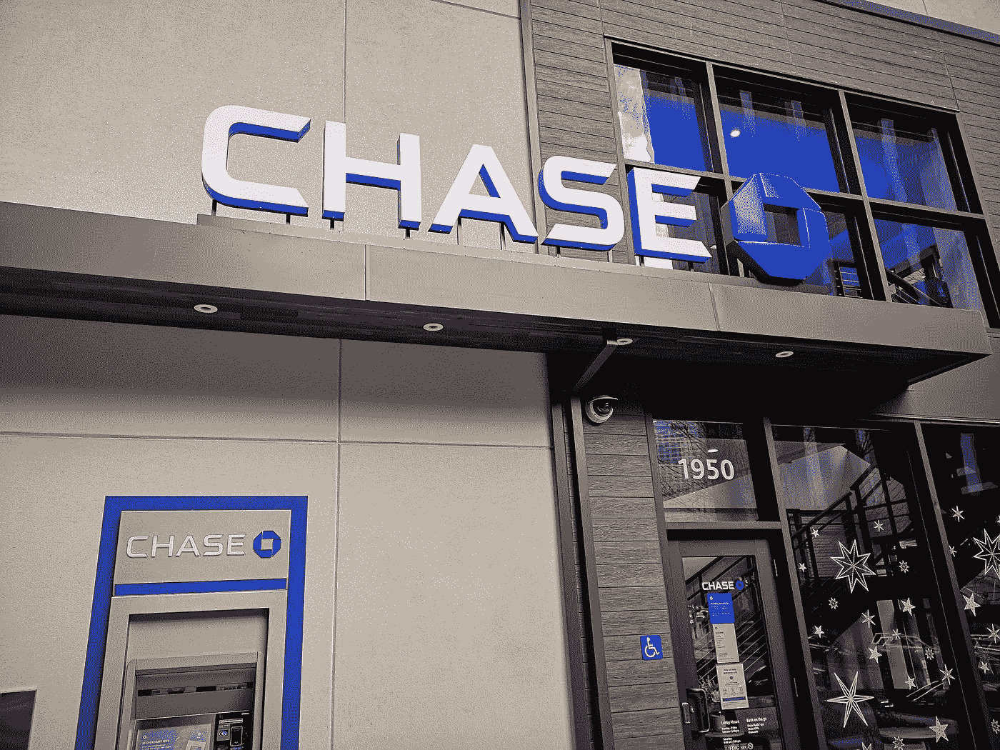
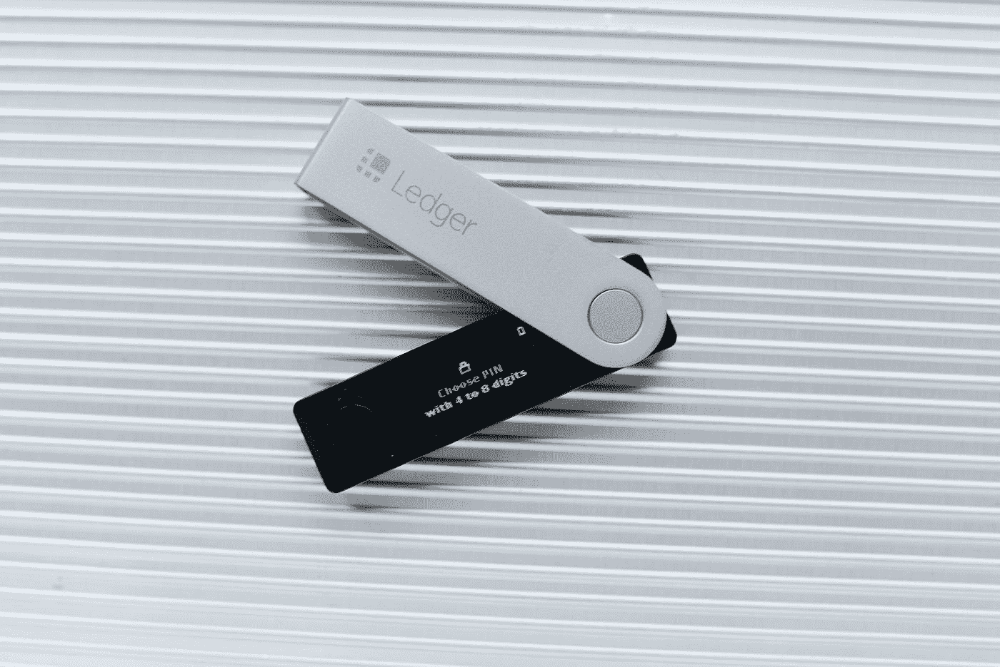

# DeFi 深潜:分散金融综合指南

> 原文：<https://medium.com/coinmonks/defi-deep-dive-a-comprehensive-guide-for-decentralized-finance-5c9f0c756ab2?source=collection_archive---------20----------------------->

Photo by [Kanchanara](https://unsplash.com/@kanchanara?utm_source=medium&utm_medium=referral) on [Unsplash](https://unsplash.com?utm_source=medium&utm_medium=referral)

DeFi 代表什么？ DeFi 代表“去中心化金融”，它通过创新的解决方案和协议彻底改变了金融行业。它将传统金融系统的透明度、信任度和效率提升到了一个新的水平，并创造了一个更加开放、公平和开放的金融世界。

让我们探索 DeFi 的力量，以及它如何改变我们交易和交换价值的方式。

## 目录:

**1。什么是分散金融？
2。DeFi 是如何工作的？
3。DeFi &比特币
4。DeFi &区块链
5。DeFi 与传统金融
6。集中财务与分散财务(DeFi)
7。你能用 DeFi 做什么？
8。DeFi 风险
9。如何参与 DeFi
10？底线&重述**

# 什么是分权金融？

Photo by [Shane](https://unsplash.com/@theyshane?utm_source=medium&utm_medium=referral) on [Unsplash](https://unsplash.com?utm_source=medium&utm_medium=referral)

**“什么是 DeFi”是一个常见问题，以下是答案。**

**DeFi 意为** : DeFi，即分散金融，是一种新型的金融技术，它使用安全的**分布式总账**系统，类似于加密货币所使用的系统。

虽然美国的传统金融机构，如银行和经纪公司，受到美联储和证券交易委员会的监管，并允许消费者直接获得资本和金融服务，但 DeFi 将使个人能够进行 T21 的点对点数字交易，而不需要中间人。

去中心化的融资方式消除了金融公司对其服务收取的费用，允许个人通过安全的数字钱包持有和转移资金，只需连接互联网。

还在迷茫？让我们仔细看看。

## DeFi 是如何工作的？

Photo by [Jorge Franganillo](https://unsplash.com/@franganillo?utm_source=medium&utm_medium=referral) on [Unsplash](https://unsplash.com?utm_source=medium&utm_medium=referral)

分散金融(DeFi)利用与加密货币相同的 [**区块链**](/illumination/a-definitive-guide-what-is-blockchain-how-it-works-56f00020d008) 技术。

区块链是一个分布式的安全数据库或分类帐，它由一系列**块组成，每个块包含关于先前块的信息。**区块链上的交易被分块记录，然后由其他用户**验证**。如果这些验证者对事务的有效性达成一致，则该块被关闭并加密，并且创建一个包括关于前一个块的信息的新块。

*Source:* [*Simplilearn*](https://www.youtube.com/@SimplilearnOfficial)

这些模块通过这些信息以链的形式连接在一起，这就是该技术的名称。**在不影响后续块**的完整性的情况下，先前块中包含的信息不能被更改，因此不可能篡改区块链。

在 DeFi 中，一个**智能合约**取代了交易中的金融机构。DeFi 系统利用类似以太坊的区块链上的[智能合约](https://www.investopedia.com/terms/s/smart-contracts.asp)来实现分布式共识，并根据预定义的条件自动执行某些操作。

例如，一个旨在提供津贴的智能合约可以被编程为每周五从账户 A 向账户 B 发送资金，只要账户 A 有足够的资金。没有人可以更改合同并将帐户 C 添加为接收者来窃取资金，因为智能合同是公开的，任何人都可以检查和审计。这意味着设计不良的合同经常会受到社区的审查。另一个例子:如果某个特定的运动队赢得了冠军，一份智能合同可以被写成向另一个人支付 500 美元。

虽然以太坊是第一个实现智能合约的平台，但其他区块链平台今天也在使用它们。

DeFi 使个人能够安全、直接地相互交易，而不需要中介或中央机构，与传统金融机构相比，提供了更低成本和更好利率的金融服务。

> **DeFi 针对金融不稳定和不稳定的国家的主要目标之一是什么？**
> 
> ***答*** *:无论你身在何处，都要增加获得金融服务的机会。*

## DeFi &比特币

Photo by [Choong Deng Xiang](https://unsplash.com/@dengxiangs?utm_source=medium&utm_medium=referral) on [Unsplash](https://unsplash.com?utm_source=medium&utm_medium=referral)

先说一下比特币的重要性。

分散金融(DeFi) [的概念可以追溯到比特币的出现。](https://www.bis.org/publ/qtrpdf/r_qt2112b.htm)

[**比特币**](/@chriswritesarticles/bitcoin-explained-for-complete-beginners-579de59c76c4) 是第一个 DeFi 加密应用，允许个人在世界任何地方拥有、控制和转移价值，而不需要中介。它之所以成为可能，是因为使用了分布式分类账，使得许多互不信任的人能够就账目记录达成一致。

比特币对任何人开放，其规则，如限量供应和开放使用，都被编码到技术中。这与传统金融不同，在传统金融中，政府可以印钞票，让储蓄贬值。

**比特币是 DeFi 的一部分。**

## DeFi &区块链

Photo by [Shubham Dhage](https://unsplash.com/es/@theshubhamdhage?utm_source=medium&utm_medium=referral) on [Unsplash](https://unsplash.com?utm_source=medium&utm_medium=referral)

区块链和加密货币是支持 DeFi 的底层技术。

当您在传统银行账户中进行交易时，交易记录在由金融机构管理的私人分类账中。另一方面，[区块链](https://www.ibm.com/topics/what-is-blockchain)是一个**去中心化、公开分布的分类账，金融交易用加密代码记录。**这意味着使用 DeFi 应用程序的各方都有一份公共分类账的副本，记录每一笔交易，确保用户的安全性和匿名性，以及支付的可验证性和资产所有权记录的不变性。

与依赖中介或看门人管理交易的传统金融系统不同，区块链依靠分散的用户网络，通过一个名为**[**挖掘**](https://www.simplilearn.com/bitcoin-mining-explained-article)**的过程来验证和记录交易，该过程涉及解决复杂的数学问题，并向链中添加新的交易块。****

****DeFi 的支持者认为，与私有且不透明的集中金融系统相比，区块链的分散性质使金融交易更加安全和透明。****

> ******“区块链无处不在的特性推动了 DeFi 的采用。同样，当一个 Dapp 被编码在区块链上时，它是全球可用的。”——福布斯******

## ****DeFi 与传统金融****

********

****Photo by [Frugal Flyer](https://unsplash.com/@frugalflyer?utm_source=medium&utm_medium=referral) on [Unsplash](https://unsplash.com?utm_source=medium&utm_medium=referral)****

****看到 DeFi 潜力的最好方法之一是理解传统金融中存在的问题。****

*   ******未被授予设立银行账户或使用金融服务的权限。缺乏获得金融服务的机会会阻碍人们就业。******
*   ******金融服务会阻止你获得报酬******
*   ******金融服务的一项隐性收费是你的个人数据******
*   ******交易时间通常仅限于特定时区的营业时间******
*   ****汇款可能需要几天时间****
*   ******金融服务存在溢价，因为中介机构需要从中分一杯羹******

## ****集中财务与分散财务(DeFi)****

********

****Photo by [Precious Madubuike](https://unsplash.com/@preciousm?utm_source=medium&utm_medium=referral) on [Unsplash](https://unsplash.com?utm_source=medium&utm_medium=referral)****

******集中金融** 集中金融是指银行和第三方等金融中介持有和管理资金，并收取费用以促进各方之间的交易。****

****例如，当进行信用卡收费时，它从商家传输到收单银行，收单银行将卡信息发送到信用卡网络。网络结算费用并要求银行付款。这一过程中的每个实体都因其服务而获得报酬，而商家通常不得不为使用信用卡和借记卡支付费用。****

****[中央金融](https://www.cbinsights.com/research/blockchain-disrupting-banking/)还控制和监控所有金融交易，从贷款申请到当地银行服务。DeFi 的目标是**通过实现没有中介的点对点数字交换，减少完成交易所需的时间，增加获得金融服务的机会。******

******分权财政******

********

****Photo by [Clay Banks](https://unsplash.com/@claybanks?utm_source=medium&utm_medium=referral) on [Unsplash](https://unsplash.com?utm_source=medium&utm_medium=referral)****

****DeFi 技术允许个人、商家和企业使用新兴技术进行金融交易，例如[点对点金融网络](https://cointelegraph.com/defi-101/defi-a-comprehensive-guide-to-decentralized-finance)、安全协议以及硬件和软件进步。****

****DeFi 允许个人使用记录和验证分布式金融数据库中金融行为的软件进行贷款、交易和借款，这些数据库可跨多个位置访问，并通过[共识机制](https://bitkan.com/learn/what-is-decentralized-finance-how-does-defi-work-9106)汇总来自所有用户的数据。这种去中心化的融资方式**消除了对中介的需求，使任何人都能从任何地方获得金融服务，无论其位置或身份如何。******

****DeFi 通过个人钱包和根据个人需求定制的交易服务，赋予用户更多控制资金的权力。****

## ****你能用 DeFi 做什么？****

********

****Photo by [Polina Kondrashova](https://unsplash.com/@fluffy7j?utm_source=medium&utm_medium=referral) on [Unsplash](https://unsplash.com?utm_source=medium&utm_medium=referral)****

****大多数金融服务都有一个分散的替代方案。例如，在以太坊区块链，有各种各样的机会:****

1.  ******向全球汇款******
2.  ******获取稳定货币******
3.  ******德克斯******
4.  ******借款******
5.  ******资助你的想法******
6.  ******买保险******
7.  ******NFTs******

******1。瞬间全球汇款******

****以太坊旨在促进安全的全球交易。像比特币一样，以太坊可以很容易地在世界各地汇款，类似于发送一封电子邮件。要发送或接收付款，您需要一个钱包。****

******2。稳定的货币******

********

****Photo by [Mathieu Stern](https://unsplash.com/@mathieustern?utm_source=medium&utm_medium=referral) on [Unsplash](https://unsplash.com?utm_source=medium&utm_medium=referral)****

****波动性是加密货币的一个常见问题，这可能会给金融产品和日常支出带来问题。****

****DeFi 社区已经通过 [**stablecoins**](https://home.treasury.gov/system/files/136/StableCoinReport_Nov1_508.pdf) 解决了这个问题，stablecoins 保持与另一种资产挂钩的一致价值，例如美元。这使得稳定的硬币适合于赚取或消费，通常用于在经济不确定时保护储蓄，并储存在 DeFi 钱包中。****

****值得注意的稳定代码包括****

*   ****系绳( [USDT](https://www.coindesk.com/price/tether/) )****
*   ****美元硬币( [USDC](https://www.coindesk.com/price/usd-coin/) )****
*   ****币安美元(BUSD)****
*   ****戴[戴](https://www.coindesk.com/price/dai/)****

******3。分散交易所******

****分散交易所(dex)是买卖加密货币的替代平台，不依赖于中央集权。****

****虽然比特币基地等传统交易所的功能是连接买家和卖家的中央平台，但[dex](https://chain.link/education-hub/what-is-decentralized-exchange-dex)使用智能合约来促进加密货币交易。****

****个人可以通过使用 DEX 来保持对其加密货币持有量的完全控制，而不是将它们存放在由中央交易所管理的钱包中。****

******4。借款******

****从分散的提供者那里借款主要有两种类型:个人对个人，借款人直接从特定的贷款人那里获得贷款，以及基于资金池，贷款人向借款人可以进入的资金池提供资金(流动性)。****

******5。资金******

****以太坊是一个很好的众筹平台，因为它对世界上任何地方的任何人开放。它是透明的，所以筹款人可以证明已经筹集了多少钱，你可以跟踪资金是如何使用的。如果没有达到最后期限或最低金额，筹款人还会设置自动退款。****

****6。保险****

****去中心化[保险](https://101blockchains.com/decentralized-insurance/)旨在让保险更实惠、支付更快捷、更透明。****

****随着自动化程度的提高，覆盖范围更加实惠，支付速度也更快，因为它们是由智能合同触发的，而不是依赖于手动流程。****

****分散保险也为[提供了更多的透明度](https://101blockchains.com/defi-insurance/)，因为各方都可以获得相同的信息，并可以跟踪索赔的进展。这有助于降低欺诈风险，并确保索赔得到公平支付。****

******7。不可替换令牌******

****[NFTs](/@chriswritesarticles/nft-art-the-rise-of-digital-collectibles-9883af61e235) 从视频或社交媒体帖子等不可交易的项目中创造数字资产，将以前不可商品化的东西变成[可交易的资产](/coinmonks/web-3-0-the-future-of-the-internet-ea4a04f287ce)。****

## ****定义风险****

********

****Photo by [sebastiaan stam](https://unsplash.com/@sebastiaanstam?utm_source=medium&utm_medium=referral) on [Unsplash](https://unsplash.com?utm_source=medium&utm_medium=referral)****

****DeFi 有其自身的一系列风险和不利之处。****

****作为一项相对较新的创新，DeFi 尚未经过长期或广泛使用的测试，国家当局正开始密切关注这些系统的监管。****

****DeFi 的一些潜在风险包括:****

******1。缺乏消费者保护******

****DeFi 在不受监管的环境中运营，这意味着如果交易出错，用户的选择可能有限。****

****相比之下，银行等传统金融系统通常有一些措施，如 FDIC 保险和准备金要求，以保护消费者和维持稳定。****

******2。易受黑客攻击******

****虽然区块链本身很难改变，但 DeFi 的其他方面，如支持分散应用程序和协议的软件系统，都有被黑客攻击的风险，这可能导致资金损失或被盗。****

****小心你放密码的地方。这引出了我的下一点。****

******3。私钥******

****为了存储加密货币资产，用户必须用私钥(密码)保护他们的 DeFi 钱包，私钥是只有钱包所有者知道的长而唯一的代码。****

*******什么是 DeFi 钱包？*** DeFi 钱包是一种数字钱包，允许用户安全地存储、发送和接收加密货币，如以太坊、比特币等。这些钱包提供了一系列功能，例如访问分散金融(DeFi)应用程序、托管服务和资产管理工具。****

****如果私钥丢失，没有办法恢复，用户将无法访问他们的资金。****

****我建议把它写在多个笔记本上，并把它们放在你房子的不同地方。将密码保存在网上或手机上会降低安全性，因为与将密码保存在纸上相比，它们更容易被黑客窃取。****

## ****如何参与 DeFi****

********

****Photo by [regularguy.eth](https://unsplash.com/@moneyphotos?utm_source=medium&utm_medium=referral) on [Unsplash](https://unsplash.com?utm_source=medium&utm_medium=referral)****

****要参与分散融资(DeFi)，您可以遵循以下步骤:****

******1。获得加密货币钱包******

****Metamask 是一个 DeFi 加密钱包。你可以用以太坊(Eth)或者另一种加密货币来资助它。请记住保存您的公钥和私钥，因为丢失这些将会阻止您访问您的资金。****

******2。在指数期货上交易数字资产******

****Uniswap 是一种常见的索引。请记住，在学习哪些资产和平台是最好的以及如何管理风险的同时，你可能会失去一切。****

****虽然，我建议你搜索不同的 dex，如何正确使用它们，如何降低资金损失的风险等。记得慢慢开始，并意识到在 DeFi 和加密货币市场中交易数字资产的风险。****

****我不是告诉你去购买和交易密码。但是，我强烈建议您探索不同的加密货币、dex、集中交易所(CEXs)，以及如何建立像 Metamask 这样的 DeFi 钱包。****

> ******“不花一分钱，你就能了解和探索所有 DeFi 的东西。”——克里斯·墨菲******

## ****结果****

********

****Photo by [Justin Heap](https://unsplash.com/@justinpheapco?utm_source=medium&utm_medium=referral) on [Unsplash](https://unsplash.com?utm_source=medium&utm_medium=referral)****

****分散金融是一个快速发展的领域，目前不受监管，并已看到其基础设施问题，黑客和骗局的份额。****

****DeFi 交易的无国界性质提出了如何监管它们的问题，因为目前的法律是为拥有独立管辖权和监管的金融系统设计的。****

## ****概述****

********

****Photo by [Ramón Salinero](https://unsplash.com/@donramxn?utm_source=medium&utm_medium=referral) on [Unsplash](https://unsplash.com?utm_source=medium&utm_medium=referral)****

******去中心化金融是做什么的？** DeFi 的目标是为参与金融交易的传统集中式金融机构和第三方提供替代方案。 **DeFi 旨在使个人能够在没有中介的情况下进行点对点(P2P)数字交换。******

> ****从顶级交易者那里复制交易机器人。免费试用。****

******比特币是去中心化金融吗？** DeFi 旨在使用比特币等加密货币作为其生态系统的一部分。DeFi 是比特币、以太坊等加密货币的基础概念。****

******你对 DeFi，Crypto，Blockchain，Web3 有没有好奇？如果是这样的话，如果你关注并订阅了我的邮件列表，我很乐意与你分享我的最新文章。此外，我还写关于人工智能、空间和自我提升的文章——如果你有相似的兴趣，欢迎！******

> ****加入 Coinmonks [电报频道](https://t.me/coincodecap)和 [Youtube 频道](https://www.youtube.com/c/coinmonks/videos)了解加密交易和投资****

# ****另外，阅读****

*   ****[BlockFi vs 摄氏](/coinmonks/blockfi-vs-celsius-vs-hodlnaut-8a1cc8c26630) | [Hodlnaut 点评](/coinmonks/hodlnaut-review-best-way-to-hodl-is-to-earn-interest-on-your-bitcoin-6658a8c19edf) | [KuCoin 点评](https://coincodecap.com/kucoin-review)****
*   ****[Bitsgap 审查](/coinmonks/bitsgap-review-a-crypto-trading-bot-that-makes-easy-money-a5d88a336df2) | [Quadency 审查](/coinmonks/quadency-review-a-crypto-trading-automation-platform-3068eaa374e1) | [Bitbns 审查](/coinmonks/bitbns-review-38256a07e161)****
*   ****[密码本交易平台](/coinmonks/top-10-crypto-copy-trading-platforms-for-beginners-d0c37c7d698c) | [Coinmama 审核](/coinmonks/coinmama-review-ace5641bde6e)****
*   ****[印度的加密交易所](/coinmonks/bitcoin-exchange-in-india-7f1fe79715c9) | [比特币储蓄账户](/coinmonks/bitcoin-savings-account-e65b13f92451)****
*   ****[OKEx vs KuCoin](https://coincodecap.com/okex-kucoin) | [摄氏替代品](https://coincodecap.com/celsius-alternatives) | [如何购买 VeChain](https://coincodecap.com/buy-vechain)****