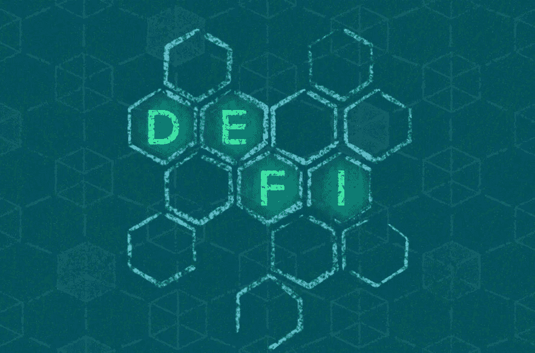

# 挑战

> 原文：<https://medium.com/coinmonks/defi-f1fd9f9f18a0?source=collection_archive---------50----------------------->

我们已经提到了分散的金融体系——DeFi，谈到了交易元宇宙——Metafi。

作为过去几年中加密领域最热门的话题之一，Defi 绝对值得一探究竟。

DeFi 是一家总部位于区块链的全球性金融系统，旨在满足新的互联网迭代-we b-3 的需求。它是基础设施和流程过时、受到严格控制的传统系统的替代方案。它允许你控制和直接使用你的钱。DeFi 取消了银行和其他金融机构因使用其服务而收取的费用。人们将钱存入安全的数字钱包，资金转账只需几分钟。它还提供了进入全球市场的途径，并创造了本地货币或银行解决方案的替代方案。金融机构提供的任何传统服务都有望通过 DeFi 提供。

虽然不是每个人都有能力开立银行账户和使用传统的金融服务，但任何能够访问互联网的人都可以使用 DeFi 产品提供的服务。目前，数百亿美元的加密货币已经通过 DeFi 计划流动，交易数量每天都在增加。

DeFi 市场始终开放，没有中央权力机构限制他们的工作时间，阻止支付或拒绝进入。这种权力下放被认为是 DeFi 的主要优势之一。

为了在没有第三方的情况下提供服务，DeFi 使用加密货币和智能合约，将信任从中介转移到机器算法。

智能合同是一种自动执行的合同，其中的条款和条件通过自动化定义和应用，并在区块链上自动高效地获得批准。智能合约一旦启动，就没有人能够改变:它将永远按照程序运行。智能合同是公开的，因此任何人都可以查看和监控它们。这意味着社区将能够快速检测出受损的合同并做出相应的反应。

DeFi 服务的安全性、隐私性和透明性也基于区块链的基本优势，因为链块中的信息记录不能被任何机构更改或控制。

尽管大多数 DeFi 服务现在都建立在以太坊上，但比特币是真正的 DeFi 先驱，它提供了拥有、控制和发送资产到世界任何地方的能力。比特币对所有人开放，没有人可以改变规则。它的概念确实不同于传统的金融世界，在传统的金融世界里，政府可以印钞票，让你的储蓄贬值，公司可以关闭市场。

以太坊是 DeFi 的理想基础。大多数 DeFi 产品实际上都是由以太坊提供动力的。因此，它们中的许多都可以很容易地进行交互配置。你可以在一个平台上借用代币，并在另一个市场和一个完全不同的程序中交换代币。代币和加密货币被写入以太坊区块链，跟踪交易和所有权的共享账本是以太坊的独特功能之一。

像其他系统一样，DeFi 由不同的部分组成。其基础架构由负责各种流程并保证交易和合同顺利运行的层组成:

1.  沉降层:也叫 0 层。基于以太坊区块链，它是所有 DeFi 事务、编写代码或构建应用程序的基础。这是至关重要的组成部分 DeFi 系统不能没有区块链。
2.  协议层:定义所有 DeFi 事务的规则和标准，它是代码准确运行和完成其任务所必需的特定条件的描述。所有协议都是可互操作的，可以用来创建 DeFi 生态系统中的任何应用程序。
3.  应用层:由分散的应用程序或 dApps 组成，即在前两层的基础上创建的产品，作为 DeFi 生态系统的前端，使消费者能够使用 DeFi 服务。通过 dApps，你可以在一个分散的网络上购买、出售、交易、借贷加密货币。
4.  聚合层:在这一层，第三方供应商通过将现有的分散应用程序聚合在一起，并在一个地方为用户和投资者提供广泛的金融服务，从而创建端到端的解决方案。

DeFi 服务的列表在不断增加，以下是其中一些:

*   世界各地的货币交易。
*   获得稳定的货币
*   贷款
*   存款
*   贸易
*   投资
*   保险

然而，尽管向用户提供了很大的财务自由，但是关于 DeFi 的严重挑战仍然存在。例如，缺乏对消费者的保护。DeFi 没有规章制度。但这意味着如果出现问题，用户往往没有法律保护。DeFi 没有政府报销制度，也没有法律要求 DeFi 服务提供商保留资本。

问题是，所有可能保护用户的规则和限制都不适用于去中心化的概念。因此，前进的道路可能并不明朗，但对 DeFi 投资者来说，监测这一新金融部门监管环境的演变无疑是重要的。

尽管存在各种担忧，而且迄今为止对黑客攻击的抵抗力不足，但 DeFi 将通过消除障碍，让每个人平等地访问金融基础设施，逐步打破传统金融机构的垄断，降低传统金融服务的成本。

> 交易新手？试试[加密交易机器人](/coinmonks/crypto-trading-bot-c2ffce8acb2a)或者[复制交易](/coinmonks/top-10-crypto-copy-trading-platforms-for-beginners-d0c37c7d698c)