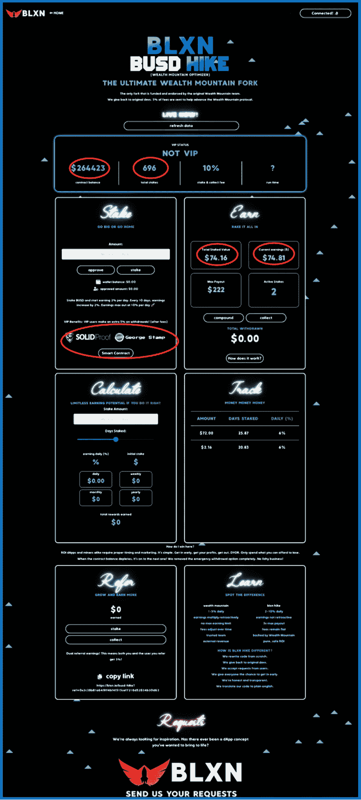
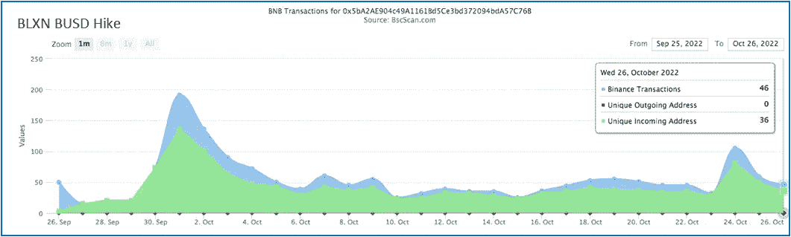
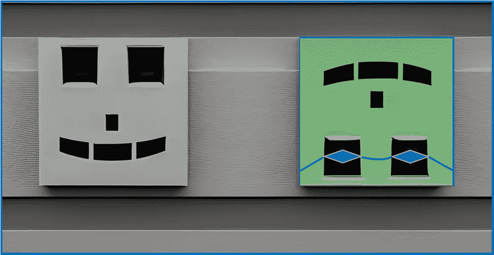
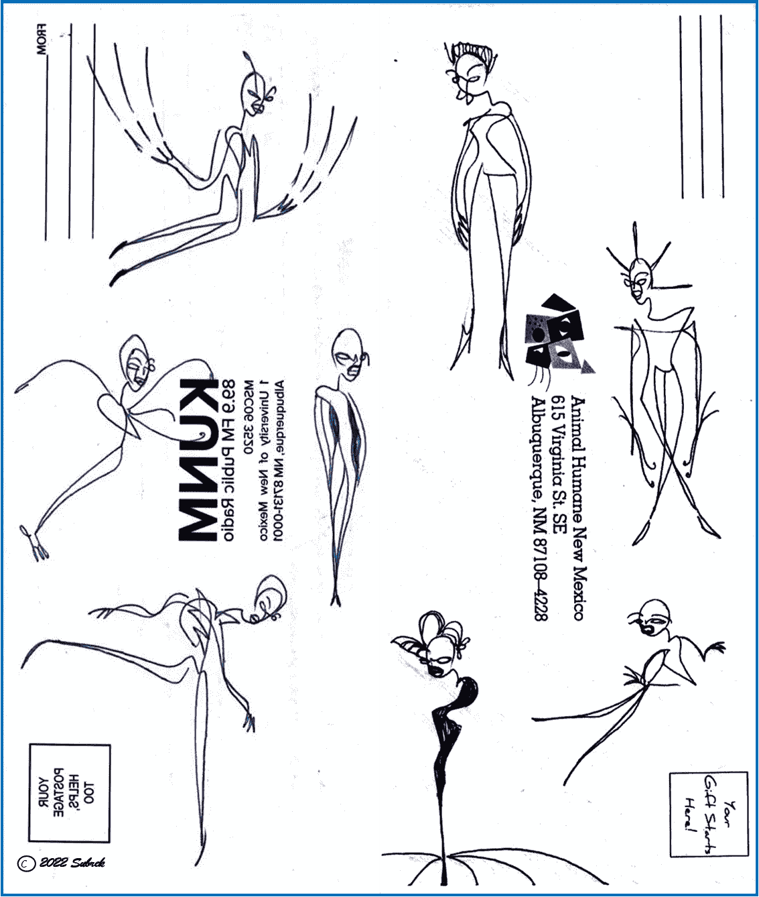

# DeFi 恐惧因素:瞬间全军覆没，或者改天愉快地冲浪…

> 原文：<https://medium.com/coinmonks/defi-fear-factor-cf076f1a577c?source=collection_archive---------8----------------------->

Perhaps we’ve all experienced financial wipe-outs in this space. I’m patient & believe, as Roger Waters sings, “The tide is turning…”

> ***潜入 2 项投资的焦虑因素:BLXN Busd Hike&Furio 投资项目。***

就在今天早上，我已经从一个更新的零钱加密矿工——**BLXN Busd Hike**——&那里收回了我的初始投资，我很欣慰我的钱没有丢失。希望这个项目能让我的投资回报率提高两倍。然后 3x？**肯定不是…**

**正好相反**:

> 我鼓励人们立即停止投资，即使这是一个好项目。更多原因，请见下文…

接下来，每天早上，我检查我的 **Furio 投资**让**兴奋**。6 周后，通过复利，我已经收到了比我买的更多的$毛皮代币，所以不用担心投资回报率。在我的主钱包中，我每天会收到 3 个以上的代币，不到 20 美元/天。我是一个连环杀手，所以我把那 10 美元重新投资到我的账户上；一个月后，浮利欧会给我赚 8 美元(50 美元/天)...

## 恐惧和贪婪

回顾我对这两个项目的反应，我不禁要问:为什么我要登录高风险项目 1 &我最喜欢的投资项目 2；然后我剩下的网上投资，排名不分先后？…

也许吧？过去一个月里，每当我登录 **BLXN Busd Hike** 时，我都很焦虑，期待它会在一夜之间崩溃或消失(不过我并不担心它会起皱——见下文)。你可能知道，这些加密矿工有不可预知的有限生命期。

因此，每天早上我都为金融悲剧没有在我睡觉时发生而感到宽慰(T21 );当我看到钱放在那里时，我放松了。我很高兴我的钱给我带来了更多的钱；然而，下一次我登录时它可能不存在的不确定性一直萦绕在我的脑海中。

我意识到我首先进入了高风险网站，因为我更喜欢直面那种恐惧。

同时， [**浮利欧投资**](https://app.furio.io?ref=0xDd00AD7742a7e3244cA26053707F39Eec9d68900) 项目对我来说有点**刺激**。对于浮利欧来说，当我每天早上检查时，我并不担心它会不在那里——它不会起皱或一夜之间消失。我发现自己在快速计算，用我新增加的余额乘以 2.5%，然后考虑明天的预期收益。

所以我早上的第二站是对我每晚的 ***浮利欧投资*** *收益微笑。从那些钱包里数利润感觉* ***贪婪*** *，其实不然——累死累活走到这一步有它的好处，&一点点个人满足感就是其中之一。*

在这两个项目中，第一个项目无疑是高风险的，而第二个项目被投资者认为是低风险的。我非常尊重这两个 DeFi 项目。原因如下:

关于 **BLXN Busd 徒步。**他们的仪表盘告诉所有人:

> “我在这里怎么赢？矿工同样需要合适的时机。很简单。早点进去，拿到你的利润，然后离开。DYOR。只花你能承受的损失。当合同余额耗尽时，它将进入下一个合同！”

实际上，这是令人耳目一新的诚实。我从未见过任何一个游戏协议告诉玩家成功的关键是在游戏启动后立即投资，然后在游戏崩溃前获得一些利润。

在他们的仪表板上，所有人都可以看到。 ***我们清楚地知道玩这个游戏是一场赌博。也许这就是它真正起飞的原因，即使是在横盘行情中。***

(注意:要想玩任何赚钱的能力，你还需要在协议发布之前，进入圈子，访问这些 dApps 的营销网站。两个最受欢迎的 dApp 指数是 [Moonarch](https://moonarch.app/miners) ，有最新的项目列表；DappRadar 列出了所有人，甚至包括几个月前死去的人。)

The **BLXN Busd Hike** dashboard: visually overwrought — definitely. However, it does not lie to you: you can make money from these games **only if your timing is precise, your free time is constant, & you enjoy staring at little triangles that float up the screen…**

**BLXN Busd Hike** 由经验丰富的 [Georgestamp.xyz](https://georgestamp.xyz/) 审核——上图红色大圆圈。我看过关于这家公司的&。阅读审计报告< <请务必阅读审计报告！> >会告诉你这个项目是否受到挑战——georgestamp . XYZ 为我们清楚地拼写出来；所以，非常好的是 [GS.xyz](https://georgestamp.xyz/) 在车上。

从上面的仪表板来看:到目前为止，该项目已经有超过 696 个参与者&总价值超过 25 万美元。

我投资了一小笔 74.16 美元，税后。随着回报率每 10 天增加一次，我现在回到了 74.81 美元，或全部投资回报率。咻！很高兴我没想到会赔钱。潜在的，如果这个协议再持续一个月，我可以拿出最高 222 美元，见上面的挣框。不幸的是，这个项目不会持续那么久…

下面的图表显示了对这个项目的热情:独特的新地址，或每天新的投资者，用绿色显示。它没有慢下来。它会…

Some good early waves, but thinking it’s getting close to low tide…BLXN Busd Hike is a fork from the highly successful but now defunct Wealth Mountain.

## 原因如下:

不可避免的崩溃时机是不可预测的。当第一批投资者的大部分在几天后开始收集时，留在协议中会突然变得危险。许多人一下子奖励自己会冲击锁定的总价值&它会下降。其他人看到这种情况，也会恐慌和退缩。从上面看，结局可能会像几十个玩家疯狂敲击键盘，所有人都睁大眼睛看着 TVL 跌到接近于零。

> 如果当这一切发生的时候，你没有坐在电脑前，你将会错过。游戏很快就会结束。大多数人几天内都不会知道…

有趣的是:刚刚发现这个 dApp 的加密投资者，可能还没有学会如何对他们的零花钱保持警惕。可能他们没有看过关于如何正确玩游戏的文章。他们可能会偶然发现 BLXN Busd Hike，看到灯光和浮动三角形和加密美元标志，并把钱投入其中。[到那时，它已经死了](/coinmonks/its-already-dead-please-stop-investing-in-it-79643e274cdb)。看着吧…

值得重复的是:“*当合同余额耗尽时，它会进入下一个…* ”

***谨记:为了长期的成功，像 BLXN Busd Hike 这样的高风险游戏需要新的贡献者投入到项目中。考虑:如果没有新的投资者，合同中的 TVL 最终将下降到零，&剩余的投资者将得不到支付。问题不是会不会崩盘，而是在你拿回初始投资之前会不会崩盘？现在投资为时已晚，请小心…***

如果 BLXN 项目像预期的那样继续，我可能会在一周多一点的时间里，在获得 2 倍的投资回报之前套现。然而，我正在观察，以防我需要尽快采取行动。

**注:**对于这个项目，玩家最多能赚到 3 倍的 ROI。然后[洛根的运行效果](/coinmonks/furios-satisfying-logan-s-run-feature-ca0a4baea1b1)开始生效&玩家在平台上的钱包被终止。他们总是可以再投资。然而，这个项目不会持续那么久。

如果/当我下一次有赌博的心情时，我当然期待 BLXN 团队即将到来的项目。 ***立即潜入，快速获利，在崩盘前跳出来……***

## 同时…

不是所有的冲浪都是在混乱的水域。

**我的** [**Furio 投资**](https://app.furio.io?ref=0xDd00AD7742a7e3244cA26053707F39Eec9d68900) 别给我制造焦虑；正好相反。我期待着每天早上看到我的 4 个钱包中的数字，包括我的[主钱包&好友钱包](/coinmonks/i-usually-play-by-the-rules-however-fdaf77d191b2)。随着你越来越多地进入这个领域，一个以上的钱包将成为一种明显的投资策略…

> **有趣的抗焦虑事实** : FurVault 的参与者从 7 月份开始就一直在投资这个项目，&从那以后，几个月以来，加入的人数每周都以超过 10%的速度增长。这是投资者的 10 倍，每周复利-显然，许多人对这个项目着迷…

At the end of the day, it’s time to appreciate the ultimate fruits of the days activities. Making investments shouldn’t create anxiety — smart, comfortable investing should feel like riding the top of that wave…

## 关于 Furio:

[**Furio Investments**](https://app.furio.io?ref=0xDd00AD7742a7e3244cA26053707F39Eec9d68900)刚满 4 个月的年轻人&是最新的长期 DeFi 投资之一。

它收集了来自滴滴社区的所有最好的想法&要么包括它们，要么对它们进行改进。它不是从任何东西分叉而来的——**Furio**是从头开始编写的，因此开发人员能够编写一些对典型的每日投资回报模型的可靠增强，提高可持续性&创造合同寿命，例如**可变奖励** & **反倾销机制，等等(白皮书******是无价的)**。**

> **直到今天，他们还在不断更新和改进协议。我最近购买了 fur bot——一个产量农业聚合器——这是该项目如何扩展的一个例子。寻找即将出现的其他平台使用案例…**

## **Furio Furvault :**

**Furvault 是一种低风险、高回报的合约，其运作方式类似于高收益存单。**

**当投资者第一次存款时，前 28 天的日收益率仅为 1.75%。**

**这算是一个开端:28 天的日复利最终将把日回报率提高到 2.5%，让我加入了获得最高回报率的投资者俱乐部。然而，如果我不能等那么长时间收回我的一些初始投资，我就不会获得更高的收益率。这是基于激励的；我喜欢这样。**

**参与者可以通过三种方式增加收入:定期存款、每日奖励以及团队推荐。**

**这个社区发生了太多的事情(见网站上的 Furbot，Furpool & FurSwap)，我的期望是投资更多即将到来的，而不是更少。我已经在这里写了关于**浮利欧**的文章:**

** [## 发现浮利欧的基本原理

### 值得滴竞争对手…

medium.com](/@jebalukas/discovering-furios-fundamentals-6724b1728a7c) 

还有这里:

 [## 浮利欧令人满意的“洛根的运行”功能

### 即使在一个完美的世界里，你也不能永远停留…

medium.com](/coinmonks/furios-satisfying-logan-s-run-feature-ca0a4baea1b1) 

> *< <* [*FURIO 白皮书—读我*](https://furio.io/whitepaper) *！>>*

谢谢你和我一起参加这次谈话。我正在记录我多年来参与 [**富里奥投资**](https://app.furio.io?ref=0xDd00AD7742a7e3244cA26053707F39Eec9d68900) 项目的历程。很高兴有你跟随冒险…

## 投资 Furio

参与者可以从平台的[交换页面](https://app.furio.io?ref=0xDd00AD7742a7e3244cA26053707F39Eec9d68900)购买$FUR。请注意，您必须使用现有团队成员的推荐伙伴链接。

***很高兴成为你的哥们……***

我的 Furio 好友地址是: [https://app.furio.io？ref = 0x 024 ee 915 C2 BF 9d 12 f 98 b 750119051 a 752 e 18 CAA 0](https://app.furio.io?ref=0xDd00AD7742a7e3244cA26053707F39Eec9d68900)

有时候我的好友地址比较好用:[0x DD 00 ad 7742 a7e 3244 ca 26053707 f 39 EEC 9d 68900](https://app.furio.io?ref=0xDd00AD7742a7e3244cA26053707F39Eec9d68900)

***注:*** *当我成功地从一个 DeFi 协议中赚了钱——不一定是我的全部投资回报，只是还没有——我会写下我的经历。如果你喜欢信息&决定投资它，那是我的目标&我很激动。投资这个项目也有助于它的可持续性。*

*通过推荐链接投资这个项目将为我提供一点补偿，&是让我知道这些对话是有益的一个极好的方式。我很荣幸如果你使用我的推荐链接。*

***还要注意，我没有提供 BLXN Busd Hike 的链接。***

**谢谢你走到这一步。**我希望你能在这篇关于我们生活的疯狂密码世界的评论文章中找到一些有价值的东西。我不是理财顾问，所以请不要考虑这个理财建议；我只是喜欢研究&投资加密…

*如果你喜欢这次谈话，*👉 ***跟着*******拍手👏*******合用*** 👐*它！***

**我鼓励朋友只玩你不需要的东西。又是 Thx。**

****

## **无耻的插头**

**我的朋友在任何东西上画画——信封、收据&任何有表面的东西。我称之为他的账本系列。下面的例子…**

****

**Animal Humane New Mexico…**

> **交易新手？尝试[加密交易机器人](/coinmonks/crypto-trading-bot-c2ffce8acb2a)或[复制交易](/coinmonks/top-10-crypto-copy-trading-platforms-for-beginners-d0c37c7d698c)****