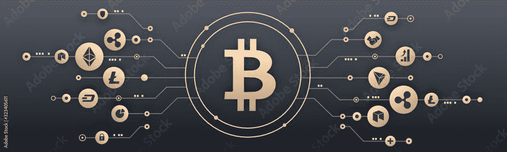

# 什么是第一层区块链？

> 原文：<https://medium.com/coinmonks/defi-for-10-year-olds-what-is-a-layer-1-blockchain-cec892431281?source=collection_archive---------13----------------------->

> 第 1 层区块链被归类为基础网络及其底层基础设施，如比特币或以太坊。第一层区块链的一个突出特点是，不需要使用另一个网络，它们就可以验证和完成交易。

第一层区块链可以比作新建筑的地基。它们构成了整个区块链网络运行和扩展的基础设施。

***如果你还没有，请点击“关注”按钮，订阅电子邮件通知。***

对于任何技术创新来说，区块链生态系统已经发展并继续快速增长。每天都有新的想法、应用和概念因该部门的扩张而出现。

差不多十年前，只有几十种加密货币；今天，有各种加密货币和区块链网络。然而，由于网络的可扩展性，区块链网络的扩展和利用受到严重限制。这就是第 1 层和第 2 层区块链技术发挥作用的地方。

如果你还不明白什么是区块链以及它是如何工作的，你可以点击[这个链接，查看我关于这项技术的文章](/coinmonks/blockchain-for-10-year-olds-c2728b94e00e)来了解它是如何工作的。

# 什么是第一层区块链？

实质上，第 1 层区块链解决方案是一组用来增强底层协议结构的解决方案。因为它们在自己的区块链上执行和完成交易，所以它们被称为第 1 层。此外，它们通常有一个用于支付交易成本的本机令牌。

一个基础区块链也被称为第一层网络，例子包括[比特币(BTC)](https://bitcoin.org/) 、[以太坊(ETH)](https://ethereum.org/en/) 、[币安智能链(BSC)](https://academy.binance.com/en/articles/how-to-get-started-with-binance-smart-chain-bsc) 、[索拉纳](https://solana.com/)。它们都被称为第 1 层协议，因为它们是各自生态系统中的主要网络。

共识协议和分片是两种最流行的第 1 层解决方案。

# 第 1 层区块链解决方案的类型

第 1 层区块链协议至少必须提供分散性、保密性和可扩展性。通过各种方法，第一层区块链网络可以确保提高可扩展性。下面是第 1 层区块链的两个实例，它们采用的可伸缩性策略不同。

**共识协议** —管理区块链和存储所有交易记录的区块链节点或计算机可靠地达成此协议的标准化方法称为共识协议。

[工作证明(PoW)](https://www.investopedia.com/terms/p/proof-work.asp) 是一个缓慢且资源密集型的共识过程，被许多典型的第一层区块链网络使用，如比特币(BTC)和以太坊(ETH)。虽然工作证明通过加密促进了分散的共识和安全性，但它有很大的规模限制。

[利益证明](https://www.investopedia.com/terms/p/proof-stake-pos.asp)也可能被第一层区块链技术公司用作其共识方法。股权证明有助于根据区块链网络上的股权和分散共识来认证大宗交易。股权证明提供了更快的交易时间，但缺乏安全性。因此，需要新的第一层区块链改进来解决可扩展性问题，同时保持安全性。

**分片—** 分片是第 1 层区块链的另一个突出特性，尽管在区块链领域它还是一个相对较新的策略。这是一种有用的技术，可以与区块链的分布式分类帐技术一起使用，主要用于数据库分区。提高事务性能的一个有效的第 1 层扩展选项是分片。

它需要将网络分割成许多不同的数据库块，有时称为碎片。网络及其节点的分离有助于提高事务处理速度，同时也有助于有效的任务分配。对于第 1 层区块链，每个碎片将负责监督网络活动的特定部分。因此，每个碎片都有唯一的事务、块和节点。

# 最后的想法

[可扩展性](https://www.wipro.com/blogs/hitarshi-buch/improving-performance-and-scalability-of-blockchain-networks/#:~:text=Scalability%20of%20blockchain%20networks%20is,of%20nodes%20in%20the%20network.)将是第 1 层区块链解决方案最明显的优势。为了提高可扩展性，第 1 层区块链解决方案需要修改基本协议。因此，第 1 层区块链解决方案支持区块链技术的基本价值主张。

> 如果您有任何其他问题，请在 Twitter([@ lanre _ aderemi](http://twitter.com/lanre_aderemi))上留言或直接给我发消息。我会尽快回复你。
> 
> 我欣赏你的阅读。当我发表下一篇文章时，请确保你注册了电子邮件简讯，成为第一个知道的人。

不要忘了点击关注按钮来阅读更多像这样的故事；-)

> **交易新手？试试** [**密码交易机器人**](/coinmonks/crypto-trading-bot-c2ffce8acb2a) **或** [**复制交易**](/coinmonks/top-10-crypto-copy-trading-platforms-for-beginners-d0c37c7d698c)