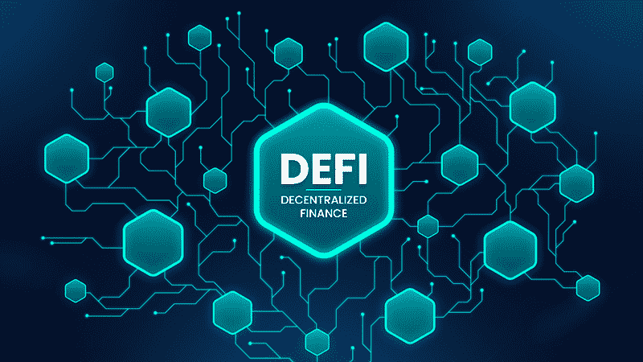
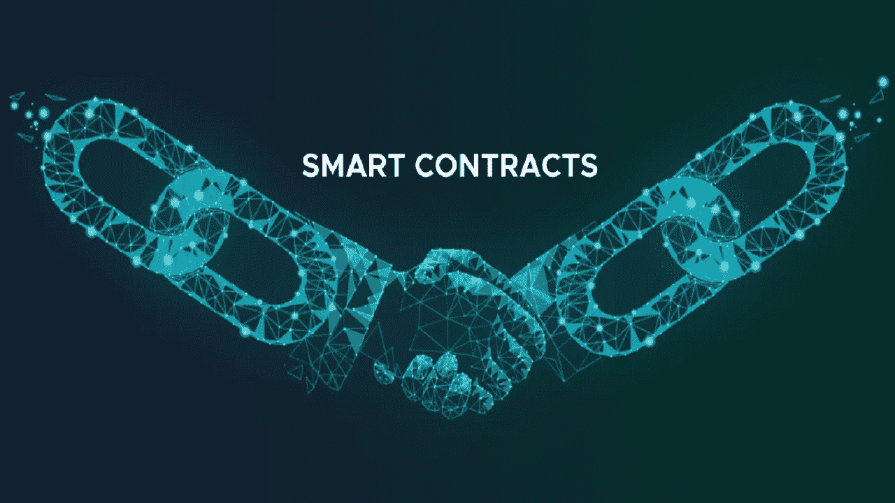
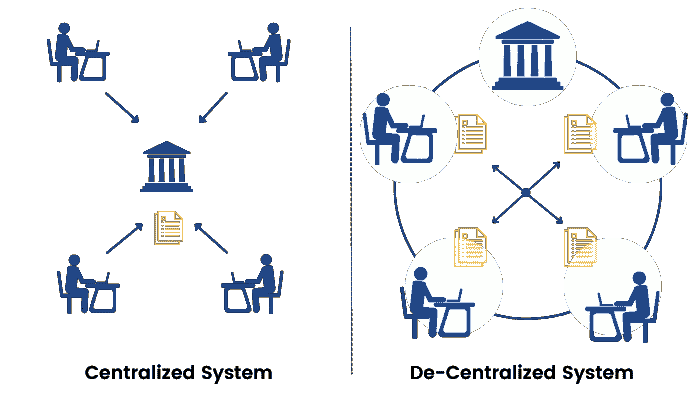

# 10 岁儿童的 DeFi 什么是分散金融(DeFi ),它是如何工作的？

> 原文：<https://medium.com/coinmonks/defi-for-10-year-olds-what-is-decentralized-finance-and-how-does-it-work-2e7575a9668f?source=collection_archive---------2----------------------->

***DeFi，术语“去中心化金融”的首字母缩写，是一个总括术语，用于描述点对点金融技术和服务。这些工具和服务建立在安全的分布式账本上，可与比特币等加密货币使用的账本相媲美。***

正如我们所知，分散金融(DeFi)正在改变金融部门的叙事。DeFi 在过去 3 年内大幅增长，2021 年将出现大规模爆炸。这种增长导致所有 DeFi 平台的[TVL](https://www.cnbctv18.com/cryptocurrency/explained--total-value-locked-what-is-it-and-why-does-it-matter-13743222.htm#:~:text=Total%20value%20locked%20(TVL)%20is,%2C%20liquidity%20pools%2C%20or%20lending.)达到[2530 亿美元](https://defillama.com/)，这是由于大量采用了 DeFi 平台提供的服务。

区块链和加密货币的世界经历了巨大的转变，分散金融(DeFi)改变了我们参与金融工具的方式。现在让我们进一步探索 DeFi，了解更多关于它的信息，因为它正以各种独特和创新的方式被利用。

# 什么是 DeFi(去中心化金融)？

DeFi(去中心化金融)可以被看作是对现有传统银行和金融实践的一种全新视角或升级。它是一种正在发展的技术，使用[区块链技术](/coinmonks/blockchain-for-10-year-olds-c2728b94e00e)使用户能够避开中间人或第三方(银行和其他金融机构)，直接与对方进行金融交易。

DeFi 为传统金融服务提供了可靠的替代品，每天都有新产品和交易出现。

DeFi 部门逐渐受到更多人的欢迎，因为它提供传统银行和中央金融机构提供的大部分服务，甚至更多独特的服务和产品。

# DeFi(去中心化金融)是如何运作的？

DeFi 的工作原理是让用户能够利用加密货币和[区块链技术](/coinmonks/blockchain-for-10-year-olds-c2728b94e00e)来完成传统银行提供的大部分交易。这些交易包括贷款、借款、赚取利息、交易资产、购买保险等等。

在传统的金融系统中，银行、证券交易所或其他金融实体等中介(中间人)通常需要转移或接收资金。为了使每一笔交易都可以接受，参与交易的各方需要相信中介会公平、诚实地行事。

区块链技术在 DeFi 中扮演了这些中介的角色。在 DeFi 上，人们通过智能合约直接交易，而不是通过银行和股票交易所。这些智能合约负责创造市场、达成交易，并保证整个过程透明可靠。

通过加密货币钱包、智能设备和互联网连接，每个人都可以访问 DeFi 试图建立的包容性、去中心化、不受审查、透明和开源的金融系统。

# 什么是智能合约？

智能合约是建立在区块链技术基础上的计算机程序，在满足某些预先定义的标准时自动执行。典型地，智能合同自动执行协议，使得所涉及的各方可以确信这种协议的结果，而不需要任何中介或不必要的延迟。

简而言之，智能合同是一种完全数字化的合同，完全由计算机程序员用计算机代码创建，并存储在区块链上。它包含合同的所有细节，包括合同适用的当事人、执行的最后期限、协议签署的日期等等。

> 交易新手？试试[密码交易机器人](/coinmonks/crypto-trading-bot-c2ffce8acb2a)或者[复制交易](/coinmonks/top-10-crypto-copy-trading-platforms-for-beginners-d0c37c7d698c)

# 分散金融与集中金融

集中融资的一个主要特点是，作为投资者，与 DeFi 不同，在 DeFi 中，你的所有资产都由你控制，你将对你的资产的所有控制权交给银行和其他金融实体。

在集中融资中，您的资金由组织和机构控制，这些组织和机构的主要目标是利用您的资金为自己创造额外收入。但是通过使用 DeFi，您的资金被保存在您的钱包中，并使用私人密钥进行保护，该密钥授予您对此类资金的独占访问权限。

由中央机构进行的这种最终控制的整体性维持了一个显著的风险和控制水平，这种风险和控制在中心累积起来，并可能将整个系统置于危险之中。过去，我们观察到银行家和机构对市场风险管理不当。一个悲惨的例子是 2008 年的金融危机。

集中式系统的另一个重要特征是获取金融工具的难度和时间。一个人要获得贷款或任何其他金融工具可能需要几天时间和大量的文书工作。但有了 DeFi，通过消除第三方和使用智能合同，这一过程变得更加容易。

# 分散金融的未来

分散金融目前正在发展，仍处于初级阶段。有史以来第一次，任何人都可以通过 DeFi 来影响世界金融体系的走向。如果一个人可以使用智能设备和互联网连接，他们也可以在全球任何地方参与 DeFi 并使用其服务。

DeFi 部门越来越赶上已建立的金融系统，尽管事实上关于分散金融的法律等问题仍未解决。预计法律将随着时间的推移而发展，从而降低基础设施相关问题、黑客和欺诈的可能性。

通过提供快速、安全、随时可用、分散且容易获得的服务，DeFi 将能够保持其目前的成功水平和广泛采用。

> 如果您还有任何疑问，请在 Twitter (@lanre_aderemi)上发表评论或直接给我发消息。我会尽快回复你。
> 
> 感谢您的阅读！鼓掌也将非常感谢，不要忘记订阅电子邮件通讯，当我发表我的下一篇文章时，第一个知道。

不要忘记点击“关注”按钮，打开电子邮件通知，以获取更多像这样的故事；-)

> 加入 Coinmonks [电报频道](https://t.me/coincodecap)和 [Youtube 频道](https://www.youtube.com/c/coinmonks/videos)了解加密交易和投资

# 另外，阅读

*   [Bookmap 点评](https://coincodecap.com/bookmap-review-2021-best-trading-software) | [美国 5 大最佳加密交易所](https://coincodecap.com/crypto-exchange-usa)
*   [加密交易机器人](/coinmonks/crypto-trading-bot-c2ffce8acb2a) | [硬币门评论](https://coincodecap.com/coingate-review)
*   最佳加密[硬件钱包](/coinmonks/hardware-wallets-dfa1211730c6) | [Bitbns 评论](/coinmonks/bitbns-review-38256a07e161)
*   [新加坡十大最佳加密交易所](https://coincodecap.com/crypto-exchange-in-singapore) | [购买 AXS](https://coincodecap.com/buy-axs-token)
*   [红狗赌场评论](https://coincodecap.com/red-dog-casino-review) | [Swyftx 评论](https://coincodecap.com/swyftx-review)
*   [投资印度的最佳密码](https://coincodecap.com/best-crypto-to-invest-in-india-in-2021)|[WazirX P2P](https://coincodecap.com/wazirx-p2p)|[Hi Dollar Review](https://coincodecap.com/hi-dollar-review)