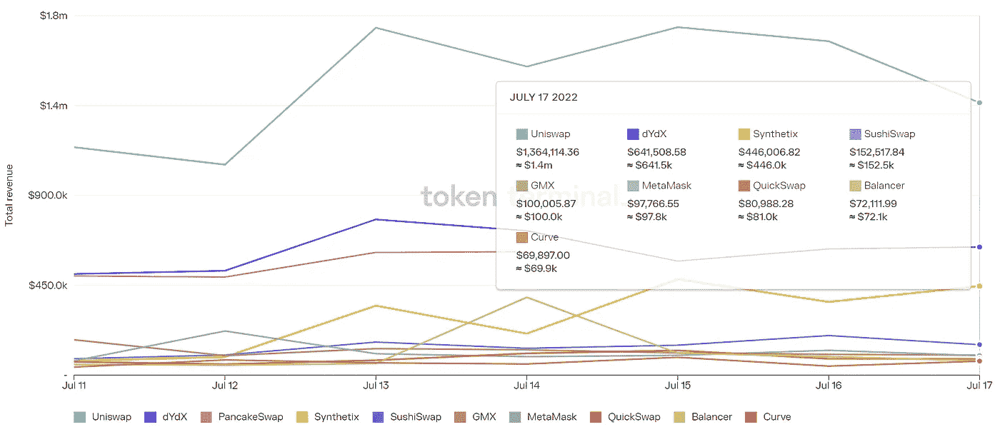

# DeFi Insight | 14 个心智模型:帮助你成为更好的加密投资者

> 原文：<https://medium.com/coinmonks/defi-insight-14-mental-models-help-you-become-a-better-crypto-investor-30aa64ddaa54?source=collection_archive---------19----------------------->

2022 年 7 月 18 日

*今日 DeFi 数据&由 DeFi Insight 为您带来的新闻*

> *什么是心智模式？*
> 
> *心智模型是帮助我们更好地理解世界的概念。*
> 
> *你的思维受限于你自己的经验和偏见——心智模型是从整个领域获得智慧的一种方式。*
> 
> *理解它们会帮助你思考得更清楚。*“@*[*来源*](https://twitter.com/thedefiedge/status/1547975041320595456)*

# *最新消息*

## *贷款*

***[索伦德](https://blog.solend.fi/solend-protocol-fees-da2c6b396e8d)协议费***

## ***外汇***

*****、** CZ:作为“纯 Web3 公司”，[币安](https://decrypt.co/105312/cz-as-pure-web3-company-binance-has-no-plans-to-offer-stock-trading)没有提供股票交易的计划***

*****域名纠纷:推特用户向[币安](https://www.bsc.news/post/domain-name-dustup-twitter-user-asked-binance-for-1-8m-company-countered-with-offer-of-6-5k)要价 180 万美元，公司以 65000 美元的价格反击*****

*******[比特币基地](https://cryptoslate.com/248m-stablecoins-flow-out-of-coinbase-as-community-refutes-exchange-liquidity-issues/)2.48 亿美元稳定资金流出，因为机构群体反驳交易所流动性问题*******

## *******交叉链*******

*********[策勒网络](https://twitter.com/CelerNetwork/status/1548880993506959361) : cBridge 跨链交易额突破 95 亿美元*********

## *******第二层*******

*********、**垂直缩放即将来到[宇宙](/chorus-one/vertical-scaling-is-coming-to-the-cosmos-9d10ebbdde46)*******

## *****市场*****

*******、**曾经炙手可热的[隔夜持有比特币的策略](https://www.bloomberg.com/news/articles/2022-07-17/once-hot-strategy-of-holding-bitcoin-overnight-loses-some-luster?utm_medium=social&utm_campaign=socialflow-organic&utm_content=crypto&utm_source=twitter#xj4y7vzkg)失去了一些光彩*****

## *****测试网*****

*******、**新的[格利测试网](/offchainlabs/new-görli-testnet-and-getting-rinkeby-ready-for-nitro-3ff590448053)正在为硝基做准备*****

## *****钱包*****

*******宣布[隋钱包](https://sui.io/resources-sui/introducing-sui-wallet/)*******

## *******采矿*******

*******美国议员称，T2 应该公开能源数据*******

## *******政策与法规*******

*********[巴拉圭](https://cointelegraph.com/news/paraguay-s-crypto-framework-one-step-away-from-becoming-law)的密码框架离成为法律仅一步之遥*********

*******累赘而非威胁:欧盟新法律如何影响稳定的收入*******

*********普京签署法律禁止在[俄罗斯用数字资产支付](https://news.bitcoin.com/putin-signs-law-prohibiting-payments-with-digital-assets-in-russia/)*********

*********SEC 主席[加里·詹斯勒](https://www.cryptopolitan.com/sec-chairman-gary-gensler-outlines-details/)概述了加密法规的细节*********

## *******NFT*******

*******由米格创作的 NFT 香槟以创纪录的 250 万美元售出*******

*******Rarible 的联合创始人说，NFT 有潜力成为媒体公司*******

## *******基金*******

*********[光速创投](https://cryptopotato.com/lightspeed-venture-launches-a-blockchain-focused-team-multicoin-capital-raises-430m/)推出专注于区块链的团队，Multicoin Capital 融资 4.3 亿美元*********

## *******观点*******

*******雪崩公司的吴炯:TradFi 对加密的兴趣“绝对没有减弱”*******

*******澳大利亚中央银行行长比中央银行行长更喜欢私人发行的代币*******

# *******数据和分析*******

## *******锁定的总价值(TVL)*******

*******目前全网 DeFi 总锁定量为 831.3 亿美元，24 小时增长 3.61%。*******

**************

## *******TVL 评出的十大连锁酒店*******

**************

## *******|最新 TVL 十大项目*******

**************

## *******|过去 24 小时内 TVL 增长的前 10 个项目*******

**************

## *******协议收入*******

## *******|累计总收入最高的项目(24H)_ 区块链(L1)*******

**************

## *******|累计总收入最高的项目(24H) _Dapps (L2)*******

**************

## *******|前 10 大交易所的每日收入*******

**************

## *******|十大贷款协议的日收入*******

**************

# *******深潜*******

*********一看** [**DeFi 国库和礼宾司收入**](https://www.theblockresearch.com/a-look-at-defi-treasuries-and-protocol-revenues-155973)*******

***** [## DeFi 国库和协议收入一览

### 2022 年 7 月 14 日，美国东部时间下午 12:54 快速采取 DeFi 协议国债估值全面大幅下跌…

www.theblockresearch.com](https://www.theblockresearch.com/a-look-at-defi-treasuries-and-protocol-revenues-155973) 

**[**现金流协议**](https://mirror.xyz/0x6D2BcfEFb7CFa52c2F7526823aA97f593F3683f4/BnXt4W0w72iKiSRhu13vwriMSWicADIIQSpYsdda8oM) **:深藏硬钱兔子洞****

** [## 现金流协议:深入硬钱兔子洞

### 在这一点上，我相信在加密社区中存在一个公平的共识，即令牌需要从…

镜像. xyz](https://mirror.xyz/0x6D2BcfEFb7CFa52c2F7526823aA97f593F3683f4/BnXt4W0w72iKiSRhu13vwriMSWicADIIQSpYsdda8oM) 

**[**NFT 事件**](https://www.certik.com/resources/blog/77oaazrsx1mewnraJePYQI-premint-nft-incident-analysis) **分析****

** [## PREMINT NFT 事件分析-博客- CertiK 安全排行榜

### 世界标准时间上午 8 点，Premint 在他们的 Twitter 页面上宣布，他们的网站被入侵。他们建议所有用户…

www.certik.com](https://www.certik.com/resources/blog/77oaazrsx1mewnraJePYQI-premint-nft-incident-analysis) 

**[**区块链项目如何在 Crypto 寒冬中生存并茁壮成长**](/huobi-global/how-blockchain-projects-can-survive-and-thrive-despite-crypto-winter-5780af88faa1) **！****

** [## 区块链项目如何在密码寒冬中生存和发展！

### 了解更多关于项目以及它们如何在熊市或牛市中茁壮成长的信息！

medium.com](/huobi-global/how-blockchain-projects-can-survive-and-thrive-despite-crypto-winter-5780af88faa1)** 

# **报告**

****[**雪崩子网**](https://research.thetie.io/subnets-vs-supernets/) **vs .多边形超网** _thetie****

> ****随着 Avalanche 发布子网和 Polygon 发布超网，区块链发射台最近有了一些发展。虽然超网和子网在名称和功能上有许多表面上的相似之处，但它们也有一些关键的区别。在进行比较之前，让我们先检查一下它们所解决的问题。****
> 
> ****子网和超网支持创建应用专用的区块链(应用链)。App-chains 通过降低费用可变性、提高交易速度和定制的网络激励提供更好的用户体验，这是单片区块链无法实现的。如果没有这些平台，对于大多数开发者来说，推出应用链是昂贵的、有风险的，而且知识有限。此外，为了确保安全性，构建者还必须克服适当激励分散验证者参与的挑战。****
> 
> ****Avalanche 的子网和 Polygon 的超网已经出现，通过提取启动专用区块链所需的区块链域知识并提供区块链即服务来解决这些问题。****

******[**EVM——熊市中的锁链**](https://messari.io/article/evm-chains-in-the-bear-market)**_ 梅萨里********

********比特币是** [**而不是**](https://members.delphidigital.io/reports/bitcoin-is-not-an-inflation-hedge) **一种通胀对冲** _delphidigital******

******[**zksyn vs stark ware**](https://tokeninsight.com/en/research/market-analysis/zksync-vs-starkware-what-s-the-difference-between-the-top-two-zk-rollups)**—前两名的 ZK 上篮有什么区别？** _tokeninsight******

******关于:******

****DeFi Insight 是顶级 DeFi 和加密新闻和更新的来源。****

******https://twitter.com/AlphaPro_io 推特:******

********❤RSS:**[**https://medium.com/feed/@alphapro.project**](https://medium.com/feed/@alphapro.project)******

****提供的信息应被视为发展新闻，而不是投资建议。****

> ****加入 Coinmonks [电报频道](https://t.me/coincodecap)和 [Youtube 频道](https://www.youtube.com/c/coinmonks/videos)了解加密交易和投资****

# ****另外，阅读****

*   ****[如何使用 Solidity 在以太坊上创建 DApp？](https://coincodecap.com/create-a-dapp-on-ethereum-using-solidity)****
*   ****[加密交易机器人](/coinmonks/crypto-trading-bot-c2ffce8acb2a) | [OKEx vs 币安](https://coincodecap.com/okex-vs-binance)****
*   ****[币安 vs FTX](https://coincodecap.com/binance-vs-ftx) | [最佳(SOL)索拉纳钱包](https://coincodecap.com/solana-wallets)****
*   ****[如何在 Uniswap 上交换加密？](https://coincodecap.com/swap-crypto-on-uniswap) | [A-Ads 评论](https://coincodecap.com/a-ads-review)****
*   ****[加密货币储蓄账户](/coinmonks/cryptocurrency-savings-accounts-be3bc0feffbf) | [YoBit 审核](/coinmonks/yobit-review-175464162c62)*************