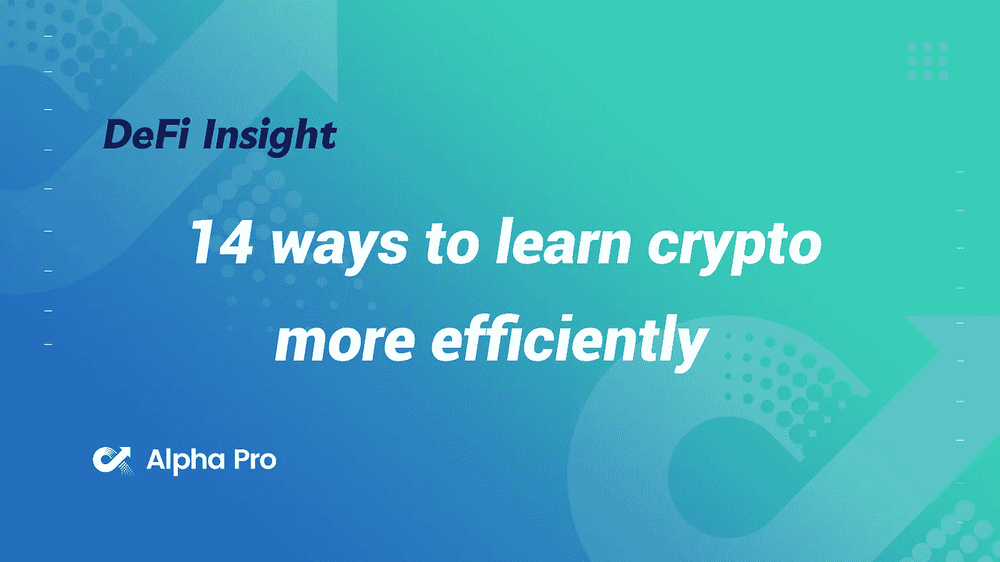
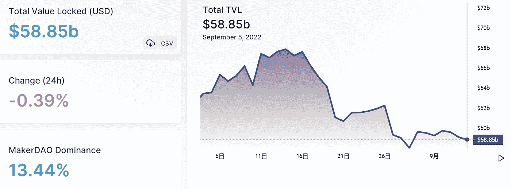
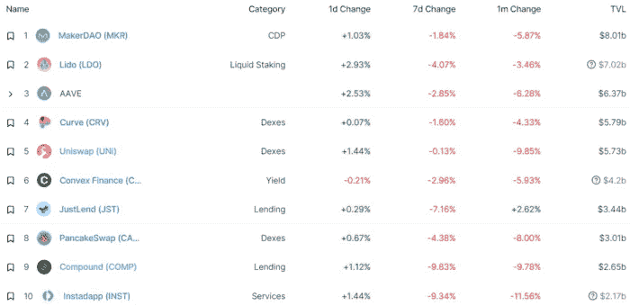
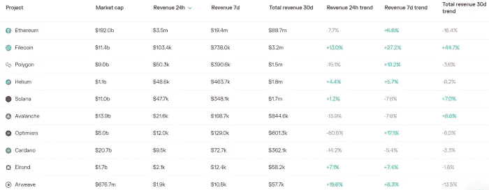
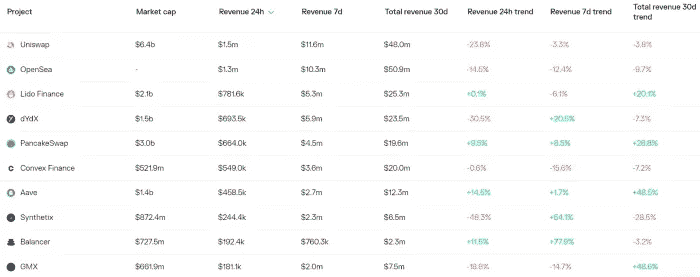

# DeFi Insight | 14 种更有效学习加密的方法

> 原文：<https://medium.com/coinmonks/defi-insight-14-ways-to-learn-crypto-more-efficiently-26df967de097?source=collection_archive---------20----------------------->

2022 年 9 月 5 日

*今日 DeFi 数据&由 DeFi Insight 为您带来的新闻*

> *很容易被 Crypto 淹没。*
> 
> *也许你有工作、孩子和其他责任，这并没有留给你太多的时间。*
> 
> *你怎么能跟上这里 19 岁的人？*
> 
> *你的研究需要有效率。*
> 
> *下面是我最喜欢的一些策略:“ *@* [*来源*](https://twitter.com/thedefiedge/status/1566049764906373121)*

# *最新消息*

## *外汇*

***[MEXC Global](https://thecryptobasic.com/2022/09/05/mexc-global-becomes-first-top-exchange-to-support-terra-luna-classic-burn-initiative-over-25m-lunc-burned-already/)成为第一家支持 Terra LUNA Classic Burn 计划的顶级交易所，已有超过 2500 万 LUNC 被烧毁***

## ***市场***

*****/**[比特币在周末失去势头](https://www.bloomberg.com/news/articles/2022-09-04/bitcoin-loses-momentum-on-weekend-with-support-around-2017-high?srnd=cryptocurrencies-v2#xj4y7vzkg)在 2017 年高点附近有支撑***

## ***商业***

*****2TM 市场比特币的所有者经历[第二轮裁员](https://decrypt.co/108957/owner-of-mercado-bitcoin-2tm-undergoes-second-round-of-layoffs)*****

## *****衍生产品*****

*******永续掉期交易所 [Pika 协议](https://twitter.com/PikaProtocol/status/1566675088946057216)推出流动性激励计划*******

*******MYC Lending 现已上线*******

## *******叉子*******

*********[卡达诺的 Vasil 硬叉](https://forkast.news/headlines/cardanos-vasil-hard-fork-upgrade-sept-22/)升级确认于 9 月 22 日*********

## *******政策与法规*******

*********[英国强制加密交易所](https://www.theguardian.com/technology/2022/sep/04/crypto-exchanges-suspected-sanction-breaches-russia)报告涉嫌违反制裁的行为*********

*******在新的监管框架下，伊朗开始向秘密采矿者发放许可证*******

*********一个[信任的基础](https://www.imf.org/en/Publications/fandd/issues/2022/09/A-foundation-of-trust-Carsten-Frost-Shin)*********

## *******NFT*******

*********LG 为[电视 NFTs](https://www.coindesk.com/business/2022/09/05/lg-picks-lesser-known-hedera-blockchain-for-television-nfts/) 选择了不太知名的 Hedera 区块链*********

*******一个[“拦截器 Bug”](https://twitter.com/y00tsNFT/status/1566529194409897985)延迟了万众期待的 y00tsNFT 的造币*******

*********[NFT 音乐流媒体播放器](https://beincrypto.com/nft-music-streaming-player-first-ever-hits-market/):首次上市*********

## *******基金*******

*******这里有 10 张幻灯片，Web3 初创公司 Reveel 曾用它从币安实验室这样的密码巨头那里筹集了 130 万美元的种子期资金*******

*******风险史密斯筹集了 100 万美元的种子前期资金*******

# *******数据和分析*******

## *******锁定的总价值(TVL)*******

*******目前全网 DeFi 总锁定量为 588.5 亿美元，24 小时下降 0.39%。*******

**************

## *******TVL 评出的十大连锁酒店*******

**************

## *******|最新 TVL 十大项目*******

**************

## *******|过去 24 小时内 TVL 增长的前 10 个项目*******

**************

## *******协议收入*******

## *******|累计总收入最高的项目(24H)_ 区块链(L1)*******

**************

## *******|累计总收入最高的项目(24H) _Dapps (L2)*******

**************

# *******深潜*******

*********[**制造者道**](https://newsletter.banklesshq.com/p/maker-dao-defi-governance?utm_source=%2Finbox&utm_medium=reader2) **的生存危机***********

***** [## 刀客的生存危机

### 这是一生一次的机会。与康赛斯公司的 NFT 特别造币厂进行合并。🥳🎊庆祝合并。造币厂…

newsletter.banklesshq.com](https://newsletter.banklesshq.com/p/maker-dao-defi-governance?utm_source=%2Finbox&utm_medium=reader2) 

**[**web 3 营销案例研究**](https://www.singlegrain.com/web3/web3-marketing-case-study/)**:FTX 如何在短短 36 个月内从一家 700 万美元的公司发展到 320 亿美元的公司****

** [## Web3 营销案例研究:FTX 如何在短短 36 个月内从一家 700 万美元的公司发展到 320 亿美元的公司

### 免费咨询】你是不是花钱打广告却得不到想要的结果？您是否正在寻找更多…

www.singlegrain.com](https://www.singlegrain.com/web3/web3-marketing-case-study/) 

**[**【自由拥有】(F2O)**](https://mirror.xyz/alokvasudev.eth/GFXXAETXDGpICPyOn1X1Zc6x0-R7EPA9tg0surTeCTA) **游戏商业模式****

** [## 游戏的“自由拥有”(F2O)商业模式

### 密码和游戏显然是一对。这两个人从早些时候开始就在房间的另一头互相盯着对方…

镜像. xyz](https://mirror.xyz/alokvasudev.eth/GFXXAETXDGpICPyOn1X1Zc6x0-R7EPA9tg0surTeCTA) 

**[**保护零售资本不受损失**](https://messyproblems.substack.com/p/single-sided-liquidity-provisioning) **—单边流动性的承诺****

** [## 保护零售资本——单边流动性的承诺

### 散户亏钱对 crypto 不利。crypto 构建者的主要目标之一应该是创建…

messyproblems.substack.com](https://messyproblems.substack.com/p/single-sided-liquidity-provisioning)** 

# **报告**

****[**合并时看什么**](https://www.coinbase.com/institutional/research-insights/research/weekly-market-commentary/weekly-market-commentary-september-02-2022)**_ coin base******

> ******随着以太坊的合并还有大约两周，ATM 波动率期限结构显示 ETH 期权的 100 万隐含波动率从今天的约 90%上升到 9 月 23 日的约 108%。******
> 
> ******考虑到失败的可能性，无论多小，我们认为市场参与者选择通过期权来表达自己的观点，以试图限制下行风险是有道理的。
> 第四次比特币减半事件估计发生在 2024 年 3 月，大致距离现在~565 天。提醒一下,“减半”指的是成功的比特币矿工的块奖励减少 50%,这在程序上每 210k 块发生一次。******

********[**相对价值加密**](https://research.thetie.io/relative-value-crypto-investing/) **投资** _thetie********

******[**NFT 游戏平台**](https://members.delphidigital.io/reports/nft-game-platforms-through-the-eyes-of-founders) **:创始人眼中的自己** _delphidigital******

******[**DeFi 治理综述**](https://www.theblockresearch.com/defi-governance-roundup-streamlining-operations-and-recent-controversy-166406) **:精简业务和近期争议** _theblockresearch******

******关于:******

****DeFi Insight 是顶级 DeFi 和加密新闻和更新的来源。****

******https://twitter.com/AlphaPro_io 推特:******

********https://medium.com/feed/@alphapro.project**RSS:******

******提供的信息应被视为发展新闻，而不是投资建议。******

> ******交易新手？尝试[加密交易机器人](/coinmonks/crypto-trading-bot-c2ffce8acb2a)或[复制交易](/coinmonks/top-10-crypto-copy-trading-platforms-for-beginners-d0c37c7d698c)***************