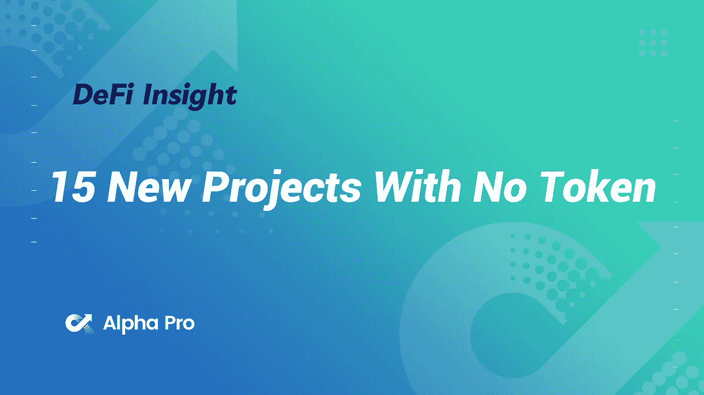
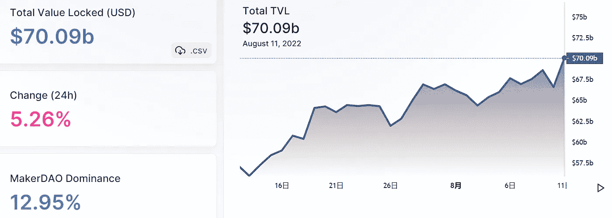
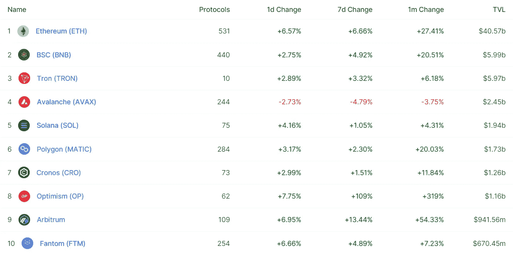
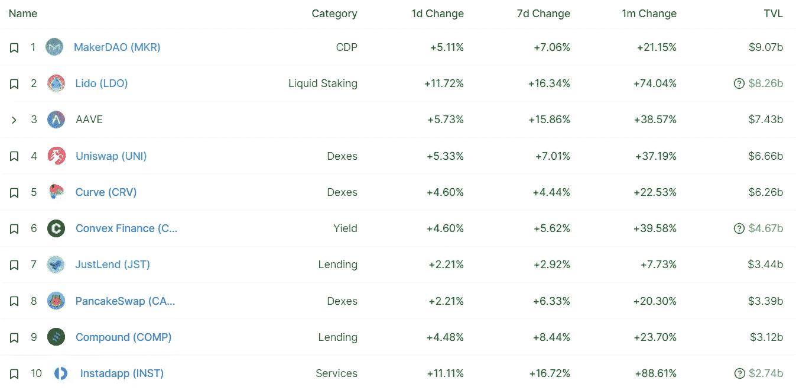
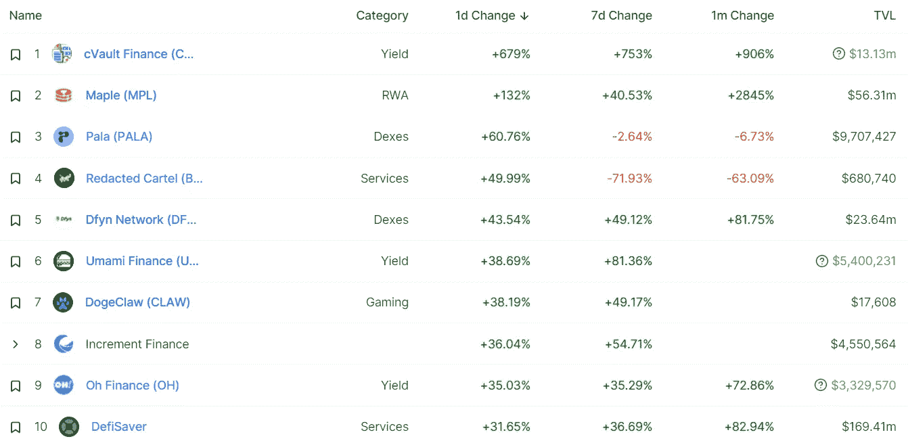
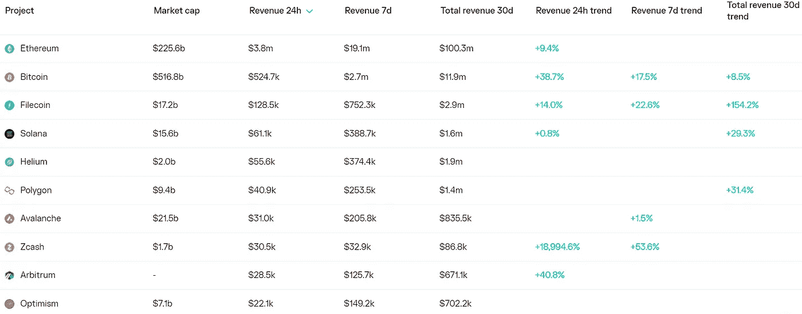
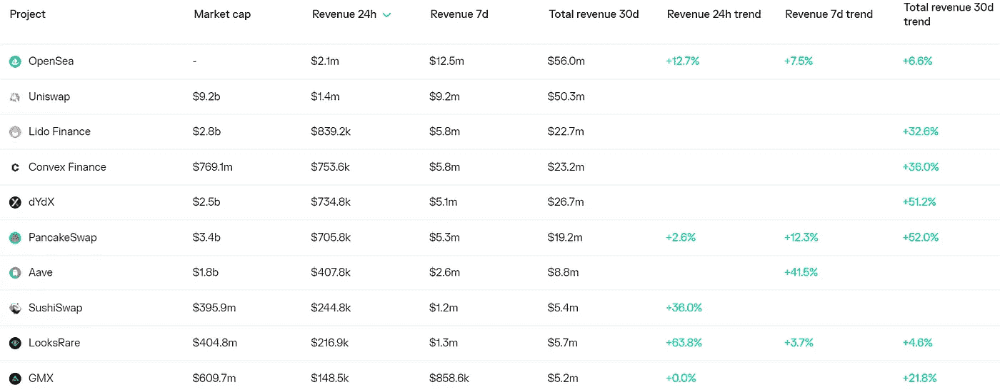
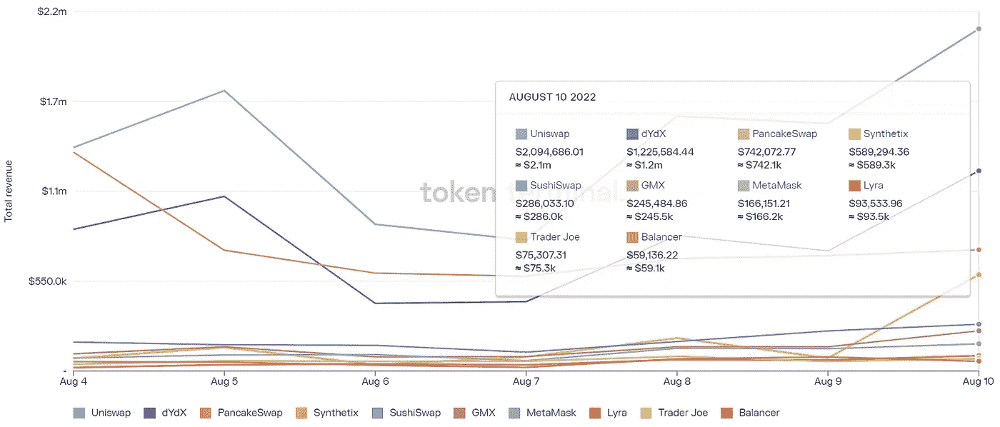
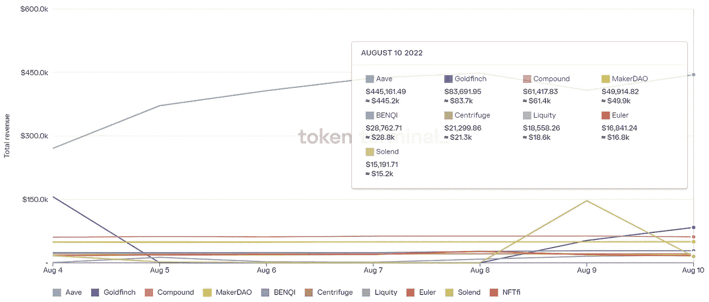

# DeFi Insight |15 个没有令牌的新项目

> 原文：<https://medium.com/coinmonks/defi-insight-15-new-projects-with-no-token-ad100e4565c8?source=collection_archive---------6----------------------->

2022 年 8 月 11 日

*今日 DeFi 数据&由 DeFi Insight 为您带来的新闻*

> *"* 其中一些已经在乐观$OP、Arbitrum $ARB 和 Zksync $ZKS 网络上运行。
> 
> 那么我们直接跳到项目列表……*“@*[*来源*](https://twitter.com/its_airdrop/status/1557339814273630208)

# 最新消息

## 外汇

币安表示，由于通货膨胀，他们赢得了加密客户

## 稳定币

**/**[Pax OS](https://paxos.com/2022/08/10/paxos-partners-with-picpay-to-power-access-to-digital-assets-for-brazilian-consumers/)与 PicPay 合作，为巴西消费者访问数字资产提供动力

## 市场

BabyDoge 在分散的土地上推出第一款 Play to Earn (P2E)游戏

## 第二层

多边形现在是超过 37000 只 DApps 的家

## 测试网

**[Goerli](https://cryptobriefing.com/goerli-testnet-merge-successful/)Testnet 合并成功**

## **支付**

****[bit pay](https://www.finextra.com/pressarticle/93700/bitpay-partners-cardlytics-for-cash-back-rewards)合作伙伴 Cardlytics 进行返现奖励****

****Ripple Labs 考虑收购 Crypto Lender Celsius 的资产****

******[西恩全局](https://www.xion.global/xion-global-is-coming-to-polygon/)即将多边形化******

********[open node](https://bitcoinmagazine.com/business/opennode-launch-cart-launch-bitcoin-payments-for-ecommerce)，推出购物车，为电子商务公司推出比特币支付********

## ******钱包******

******Bitcoin.com 现在支持 100+ ERC-20 代币的存储和兑换******

********[罗宾汉](https://u.today/robinhood-web3-crypto-wallet-waitlist-surpasses-1-million-customers) Web3 加密钱包等候名单超过 100 万客户********

## ******空投******

********[在 GEISAI 2022 发放免费 NFT](https://twitter.com/takashipom/status/1557556261192736768)！********

## ******政策与法规******

******进步的参议员告诉银行监管者取消布莱恩·布鲁克斯时代的加密指南******

********[英国银行分析师](https://news.bitcoin.com/bank-of-england-analysts-see-crypto-having-important-roles-in-the-metaverse-discuss-the-need-for-regulation/)参见《加密在元宇宙扮演重要角色——讨论监管的必要性》********

## ******NFT******

********[百无聊赖的猿游艇俱乐部(BAYC) NFT 销售](https://beincrypto.com/bored-ape-yacht-club-bayc-nft-sales-test-new-higher-low-slipping-more-than-290m/)测试新的高低滑逾 2.9 亿美元********

******杰·鲁加入名人 NFT 的行列******

******随着[隐朋克 NFT 所有者获得商业权利](https://decrypt.co/107184/as-cryptopunks-nft-owners-get-commercial-rights-yuga-hopes-to-secure-their-legacy-as-artwork)，宇迦希望保护他们的“艺术遗产”******

## ******基金******

********[ReadON](https://news.bitcoin.com/readon-completes-2m-seed-round-to-build-a-decentralized-content-distribution-platform/)完成$2M 种子轮，打造去中心化内容分发平台********

# ******数据和分析******

## ******锁定的总价值(TVL)******

******目前全网 DeFi 总锁定量为 700.9 亿美元，24 小时增长 5.26%。******

************

## ******TVL 评出的十大连锁酒店******

************

## ******|最新 TVL 十大项目******

************

## ******|过去 24 小时内 TVL 增长的前 10 个项目******

************

## ******协议收入******

## ******|累计总收入最高的项目(24H)_ 区块链(L1)******

************

## ******|累计总收入最高的项目(24H) _Dapps (L2)******

************

## ******|前 10 大交易所的每日收入******

************

## ******|十大贷款协议的日收入******

************

# ******深潜******

********以太坊**[分水岭 ](https://newsletter.banklesshq.com/p/the-ethereum-watershed?utm_source=%2Finbox&utm_medium=reader2)******

**** [## 以太坊分水岭

### 加入福塔网络🔒亲爱的无银行国家，在本文中，我们将经历合并后的以太坊交易…

newsletter.banklesshq.com](https://newsletter.banklesshq.com/p/the-ethereum-watershed?utm_source=%2Finbox&utm_medium=reader2) 

**[**以太坊区块链隐私**](https://cryptomaton.medium.com/ethereum-blockchain-privacy-can-be-the-next-big-thing-f685c5075a52) **可以是下一件大事****

** [## 以太坊区块链隐私可能是下一件大事

### 做好匿名交易 NFT 的准备，因为以太坊可以将隐私升级到 ERC-721 标准。阅读…

cryptomaton.medium.com](https://cryptomaton.medium.com/ethereum-blockchain-privacy-can-be-the-next-big-thing-f685c5075a52) 

**[**密码支付成为主流**](https://hackernoon.com/crypto-payments-goes-mainstream-catching-the-wave) **:赶潮流****

 **[## 加密支付成为主流:赶上潮流

### 比特币、以太坊、系绳、创、DeFi 代币、稳定币和数百种其他资产的免托管加密钱包…

hackernoon.com](https://hackernoon.com/crypto-payments-goes-mainstream-catching-the-wave)** 

****[**比特币闪电网**](https://blog.coinbase.com/is-the-bitcoin-lightning-network-for-real-26e47029687f) **是真的吗？******

**** [## 比特币闪电网是真的吗？

### 让我们看看闪电网络是如何潜在地扰乱每年 1500 亿美元的支付和汇款行业的。

blog.coinbase.com](https://blog.coinbase.com/is-the-bitcoin-lightning-network-for-real-26e47029687f)**** 

# ****报告****

******[**(不)投保**](https://messari.io/report/un-insuring-defi-holdings-with-ease) **德菲控股轻松**_ 梅萨里******

> ****根据 Bitcoinist 的数据，2021 年只有 2%的 DeFi 控股公司获得了保险。
> DeFi 保险协议面临着可扩展性和成本效益问题的挑战，导致其在该领域的利用率普遍不足。
> Ease 开发了一款可扩展、经济高效且安全的资产保护产品，名为“Uninsurance”，允许用户分担风险和恶意攻击的成本。
> Ease 的农业计划是一项增长和多样化的计划。它将为每个金库中的用户分配一个按比例的 EASE 值，并鼓励用户用较少的资金将资产存入金库。****

******[**月度账本**](https://members.delphidigital.io/reports/monthly-chartbook-crypto-vs-macro-battle-heats-up) **— Crypto vs. Macro 大战白热化** _delphidigital******

******[**区块链模块化**](https://www.theblockresearch.com/a-framework-for-blockchain-modularity-161921) **框架** _theblockresearch******

******[**索拉纳项目收益周报**](https://mirror.xyz/0x9b7e7c5B53081d0C6d09b91F13783D58B772b011/LZtDD3xx3EjPhpJZheLb--Lnq9Cj_H5RKqDYpNqBYWA)**8/11/2022**_ Alpha Pro******

******关于:******

****DeFi Insight 是顶级 DeFi 和加密新闻和更新的来源。****

******https://twitter.com/AlphaPro_io 推特:******

********❤RSS:**[**https://medium.com/feed/@alphapro.project**](https://medium.com/feed/@alphapro.project)******

****提供的信息应被视为发展新闻，而不是投资建议。**********