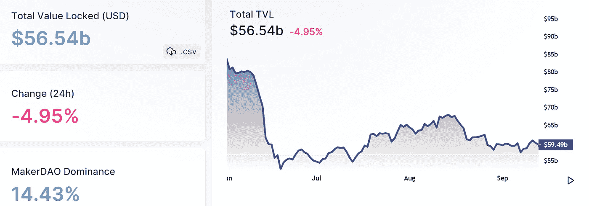
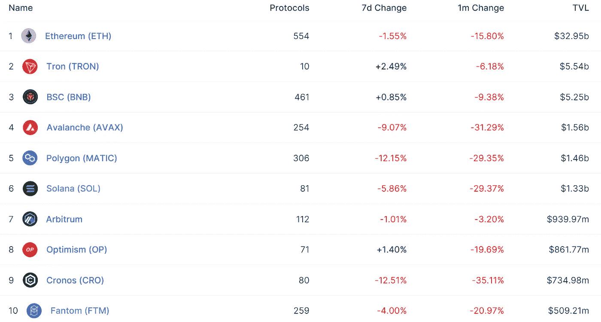
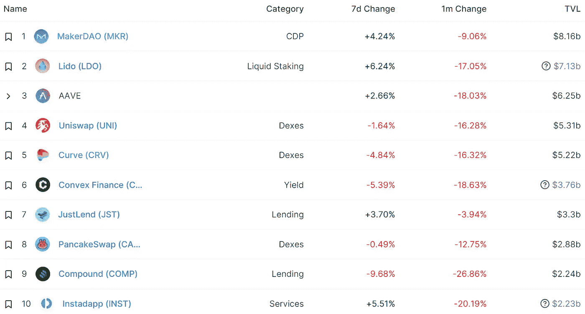
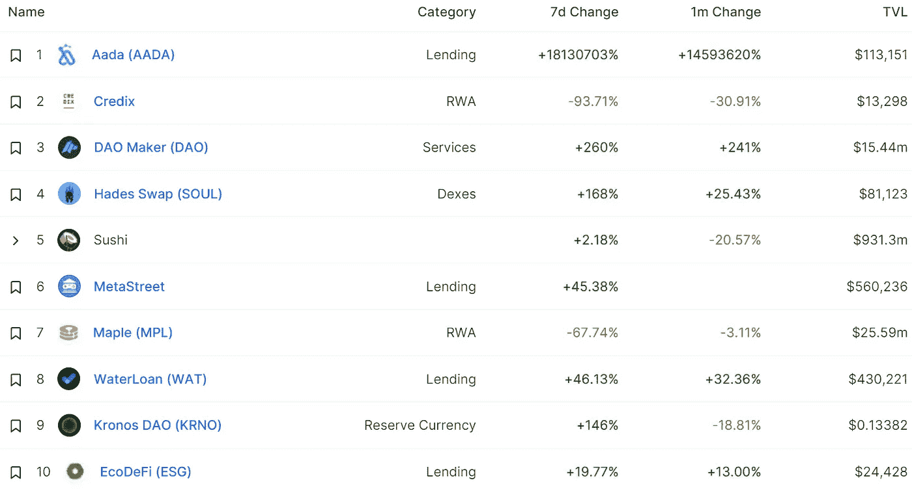
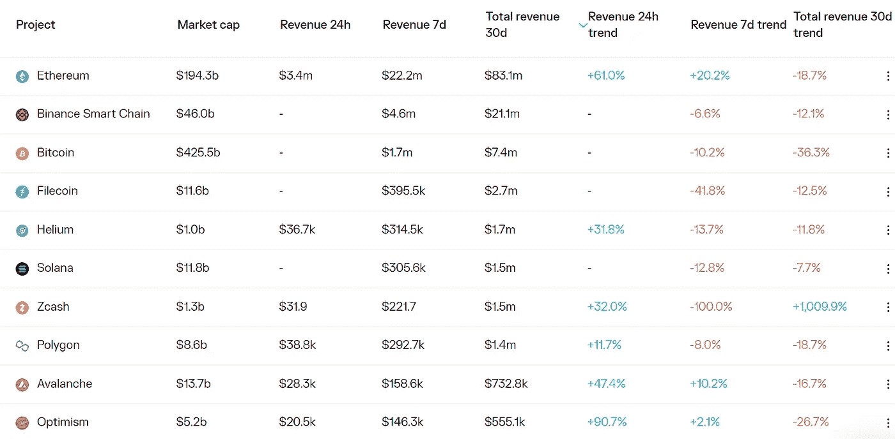
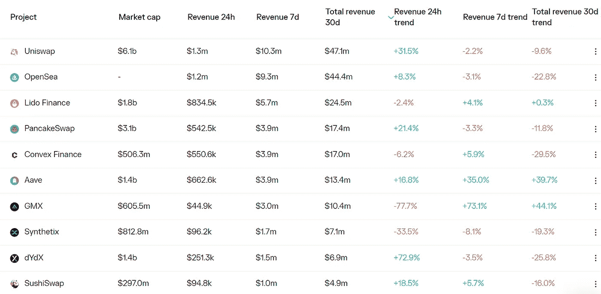

# DeFi Insight |以太坊三明治 MEV 2022 年中期报告

> 原文：<https://medium.com/coinmonks/defi-insight-2022-mid-year-report-of-sandwich-mev-on-ethereum-7be2117bc411?source=collection_archive---------20----------------------->

2022 年 9 月 14 日

*今日 DeFi 数据&由 DeFi Insight 为您带来的新闻*

> *”*为了让情况对公众更加透明，EigenPhi 编制了《闪光男孩的收获，每个人的痛苦:以太坊上三明治 MEV 2022 年中报》。以下是该报告的要点。
> 
> 2022 年前六个月，182246 个三明治导致交易者总共损失了 8770 万美元，这给搜索者带来了 1785 万美元的利润。
> 
> 大多数三明治的投资回报率在 20%到 40%之间。
> 
> 只有 168 个三明治攻击者 EOA，130 个机器人 eoa，212 个 EOA 和机器人的组合被搜索者使用，这打破了搜索者会使用许多 eoa 来伪装身份的神话。
> 
> Uniswap V3 是搜索者已经开发的最重要的协议。
> 
> 与属于攻击者的 168 份 eoa 相比，72351 名受害者 eoa 被夹在中间，损失了 8770 万美元。 *"@* [*来源*](https://eigenphi.substack.com/p/flash-boys-gain-everybodys-pain?utm_source=%2Finbox&utm_medium=reader2)

# 最新消息

## 外汇

华尔街支持的加密交易所 EDX 市场将于 11 月首次亮相

主流交易平台的**[ETH 资金利率](https://www.coinglass.com/funding/ETH)全部转为负值，整体达到 14 个月以来的最低值**

****关于即将到来的[以太坊合并](https://www.binance.com/en/support/announcement/9a4805dffb8741a78f26075762a22a9c?ref=AZTKZ9XS&utm_source=BinanceTwitter&utm_medium=GlobalSocial&utm_campaign=GlobalSocial)的更新****

## ****稳定币****

******,**借贷协议 Nostra 推出 StarkNet-native stable coin[$ UNO](https://mobile.twitter.com/nostrafinance/status/1569674307898585088)****

## ****打桩****

******[丽都](https://etherscan.io/token/0x5a98fcbea516cf06857215779fd812ca3bef1b32?a=0xf73a1260d222f447210581ddf212d915c09a3249)可能已经完成向蜻蜓资本出售 1000 万 LDO******

## ******贷款******

********FTC 加入加密贷款公司 [Celsius 破产案](https://www.coindesk.com/policy/2022/09/13/ftc-moves-to-join-crypto-lender-celsius-bankruptcy-case/)********

## ******提议******

********[uni swap](https://gov.uniswap.org/t/deploy-uniswap-v3-to-zksync/17649)开始投票表决关于将 Uniswap V3 部署到 zkSync 2.0 的提案********

********、** [星门提案](https://snapshot.org/#/stgdao.eth/proposal/0xe6fef4aa9c8e9d162f694ab764b11c06918b9f199aafe43e0d85b12d8271011c):为戴、、sUSD、建立跨链流动性池******

******[制定者](https://twitter.com/MakerDAO/status/1569400518639771648)将 wstETH-B 金库的债务上限提高到 2 亿美元戴******

## ******钱包******

********[**信任钱包**](https://twitter.com/TrustWallet/status/1569631762044657664?s=20)**增加对索拉纳·DApp 的支持**********

## ******支付******

******俄罗斯最早可能在 2023 年开始接受加密货币进行跨境支付******

## ******政策与法规******

******OFAC 发布对龙卷风现金制裁和禁令的回应******

## ******NFT******

********Axie Infinity 开播[起源第一季](https://twitter.com/AxieInfinity/status/1569838928449966080)********

## ******基金******

********web 3 开发者平台 Alchemy 正在为[新风险投资基金](https://www.coindesk.com/business/2022/09/13/web3-developer-platform-alchemy-is-raising-12m-for-new-venture-capital-fund/)筹集 1200 万美元********

# ******数据和分析******

## ******锁定的总价值(TVL)******

******目前全网 DeFi 总锁定量为 565.4 亿美元，24 小时下降 4.95%。******

************

## ******TVL 评出的十大连锁酒店******

************

## ******|最新 TVL 十大项目******

************

## ******|过去 24 小时内 TVL 增长的前 10 个项目******

************

## ******协议收入******

## ******|累计总收入最高的项目(24H)_ 区块链(L1)******

************

## ******|累计总收入最高的项目(24H) _Dapps (L2)******

************

# ******深潜******

********[**中微子的 USDN**](https://cryptorisks.substack.com/p/a-risk-assessment-on-neutrinos-usdn?utm_source=%2Finbox&utm_medium=reader2) **生态系统对 veCRV 持有者和 LP 的风险评估**********

**** [## 中微子 USDN 生态系统对 veCRV 持有者和 LPs 的风险评估

### 中微子美元(USDN)是一种算法稳定的货币，与美元挂钩，由海浪支持。支持机制…

cryptorisks.substack.com](https://cryptorisks.substack.com/p/a-risk-assessment-on-neutrinos-usdn?utm_source=%2Finbox&utm_medium=reader2) 

**如何打赢** [**以太坊粉叉**](https://newsletter.banklesshq.com/p/how-to-win-the-ethereum-pow-fork?utm_source=%2Finbox&utm_medium=reader2)

 [## 如何赢得以太坊 PoW 叉

### 这是一生一次的机会。与康赛斯公司的 NFT 特别铸币厂进行合并。🥳🎊庆祝合并。造币厂…

newsletter.banklesshq.com](https://newsletter.banklesshq.com/p/how-to-win-the-ethereum-pow-fork?utm_source=%2Finbox&utm_medium=reader2) 

**如何创建** [**编辑过的 NFTs**](https://metaversal.banklesshq.com/p/how-to-create-editioned-nfts?utm_source=%2Finbox&utm_medium=reader2)

 [## 如何创建已编辑的 NFT🎴

### 亲爱的无银行国家，假设你想发布一个单一的艺术作品作为编辑 NFTs -一系列纪念…

metaversal.banklesshq.com](https://metaversal.banklesshq.com/p/how-to-create-editioned-nfts?utm_source=%2Finbox&utm_medium=reader2) 

# 报告

**全面看以太坊与** [**的合并**](https://www.theblockresearch.com/a-comprehensive-look-at-ethereum-and-the-merge-part-one-168966)_[The block research](https://www.theblockresearch.com/a-comprehensive-look-at-ethereum-and-the-merge-part-two-169393)

> 以太坊网络距离合并只有几天时间，在经过多年的延迟后，它将最终从工作证明(PoW)过渡到利益证明(PoS)共识。此次升级包括以太坊货币政策的重大变化，预计这将使网络发行比以往任何时候都更接近净通缩。

**、**合并前:分析[以太坊信标链](https://insights.glassnode.com/before-the-merge/) _glassnode

**数字[资产资金流向](https://blog.coinshares.com/volume-97-digital-asset-fund-flows-weekly-report-4fc24773b7b1)周报 _coinshares**

****、**对 [GreenBox 的](https://www.theblockresearch.com/commentary-on-greenboxs-q222-earnings-168691)Q2 2012 年财报 _theblockresearch 的评论**

****缩放比特币:[defi chain](https://www.theblockresearch.com/scaling-bitcoin-defichain-166420)_ the block research****

******8 月区块链[资金重述](https://www.theblockresearch.com/august-blockchain-funding-recap-169221) _theblockresearch******

********关于:********

****DeFi Insight 是顶级 DeFi 和加密新闻和更新的来源。****

******https://twitter.com/AlphaPro_io 推特:******

********❤RSS:**[**https://medium.com/feed/@alphapro.project**](https://medium.com/feed/@alphapro.project)******

****提供的信息应被视为发展新闻，而不是投资建议。****

> ****交易新手？尝试[加密交易机器人](/coinmonks/crypto-trading-bot-c2ffce8acb2a)或[复制交易](/coinmonks/top-10-crypto-copy-trading-platforms-for-beginners-d0c37c7d698c)********