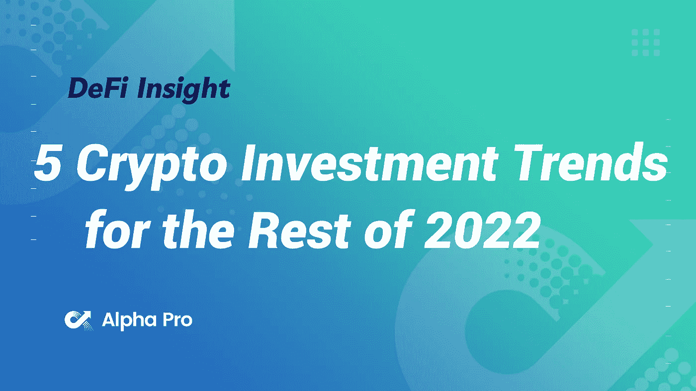
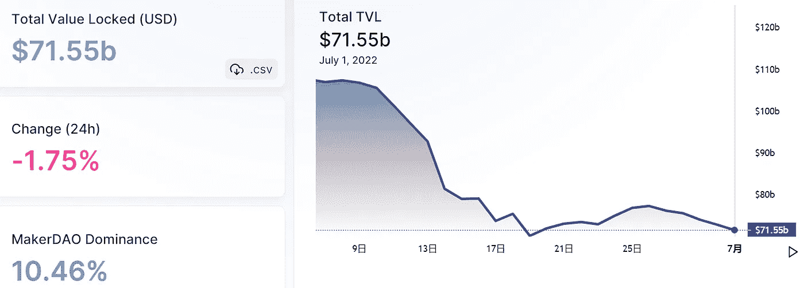
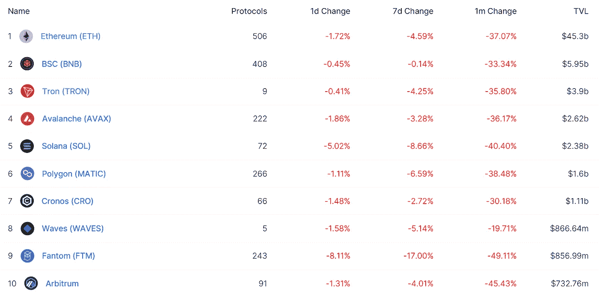
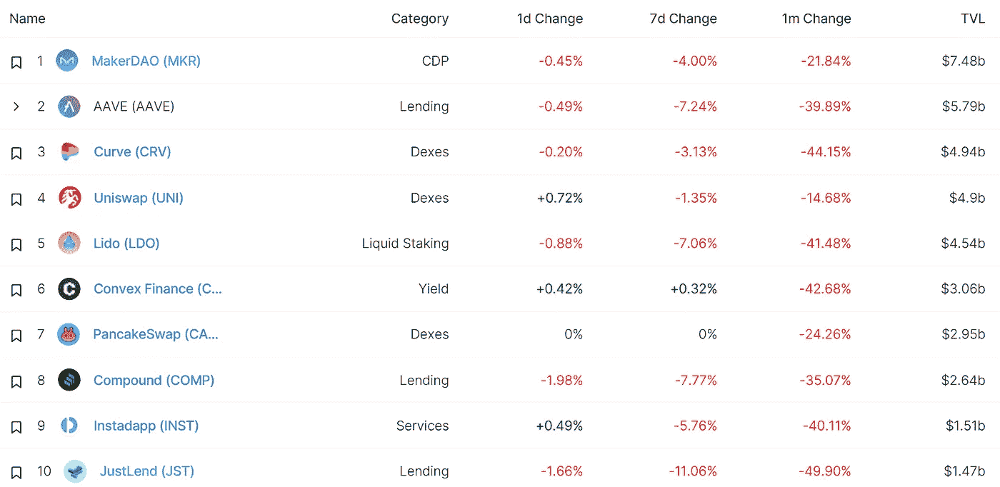
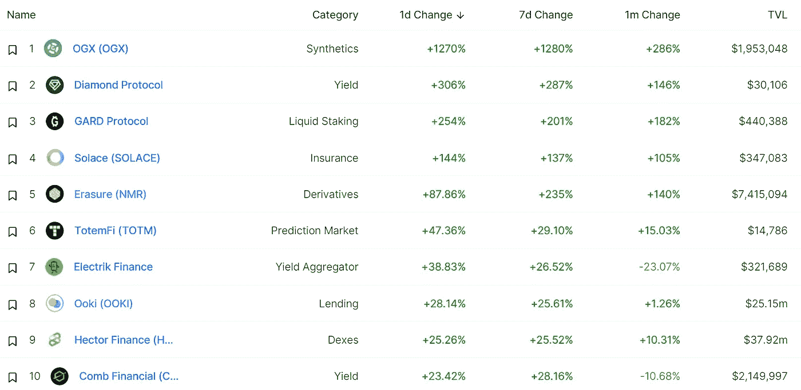
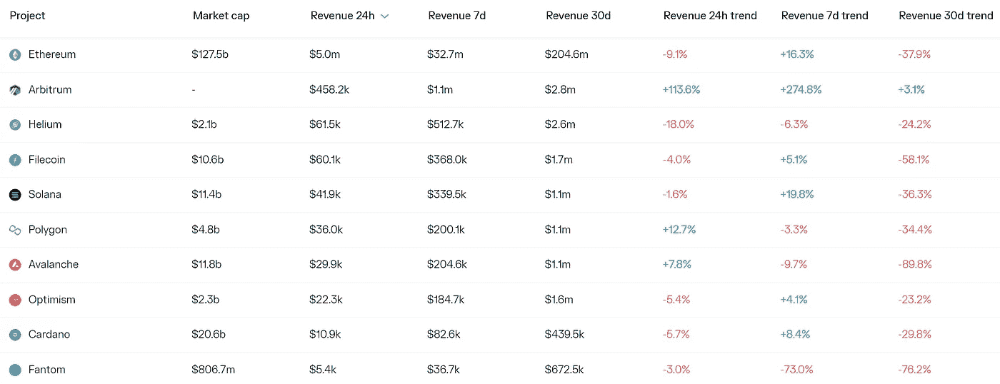
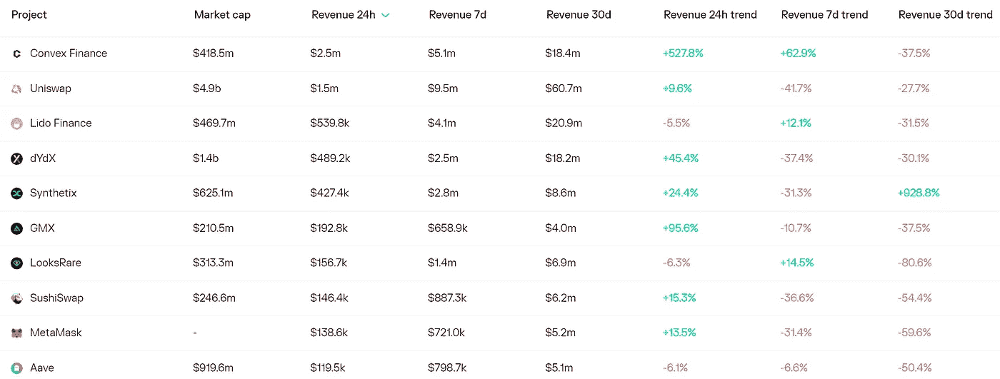
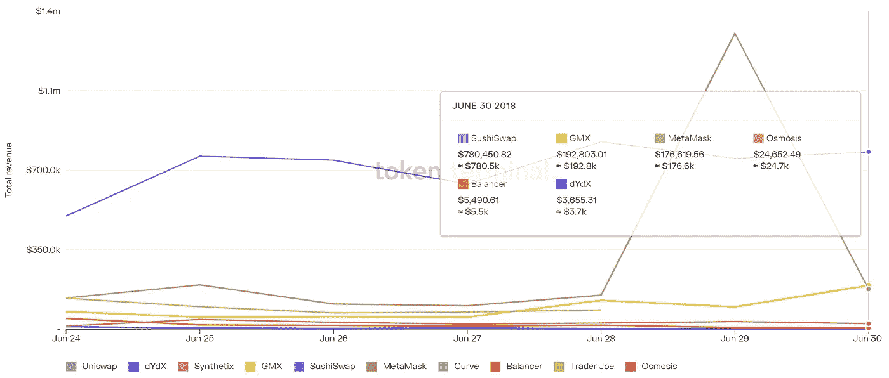
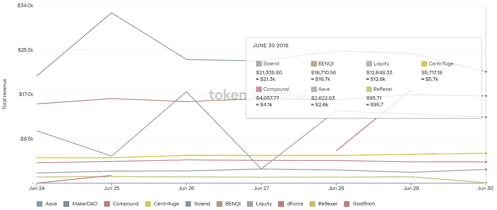

# DeFi Insight | 2022 年剩余时间的 5 大加密投资趋势

> 原文：<https://medium.com/coinmonks/defi-insight-5-crypto-investment-trends-for-the-rest-of-2022-959a0241d0ef?source=collection_archive---------3----------------------->

2022 年 7 月 1 日

*今日 DeFi 数据&由 DeFi Insight 为您带来的新闻*

> *"* 随着价格暴跌、协议内爆、CeFi 实体倒闭，crypto 经历了令人难以置信的混乱开局。
> 
> 不要害怕混乱，不久。
> 
> 无论是在元宇宙还是在 meatspace，都有许多新兴趋势和主题正在形成，以定义 2022 年剩余时间及以后的时间。
> 
> 先赶上他们，这是世代财富的主要机会。让我们深入了解一下，随着下半年的到来，投资者应该记住什么。*“@*[*来源*](https://newsletter.banklesshq.com/p/5-crypto-investment-trends-for-the?utm_source=%2Finbox&utm_medium=reader2)

# 最新消息

## 贷款

正在与 FTX 谈判的加密贷款商 BlockFi 也获得了 Ledn 的报价

**今天跨过[摄氏度](https://blog.celsius.network/across-celsius-today-c71b29513a9b)**

## **外汇**

****[卡比·拉梅](https://beincrypto.com/khaby-lame-of-tiktok-fame-is-now-binance-brand-ambassador/)，抖音名人，现在是币安品牌大使****

****比特币基地计划海外扩张，寻求欧洲牌照****

## ****稳定币****

******宣布 [USN v2.0](/nearprotocol/announcing-usn-v2-0-towards-true-stability-f4dbc6897d1f) :走向真正的稳定******

## ******市场******

******加息有影响吗？比特币交易者了解[美联储如何在推特时代推动市场](https://www.coindesk.com/markets/2022/06/30/do-rate-hikes-matter-bitcoin-traders-learn-how-fed-moves-markets-in-twitter-era/)******

## ******测试网******

********[Sepolia](https://blog.ethereum.org/2022/06/30/sepolia-merge-announcement/)合并公告********

## ******支付******

********[open node](https://www.prnewswire.com/news-releases/opennode-partners-with-lemon-cash-to-enable-lightning-fast-bitcoin-payments-and-payouts-for-its-1m-customers-301579068.html)与 Lemon Cash 合作，为其 100 多万客户实现闪电般的比特币支付和支出********

## ******采矿******

******纽约州环境监管机构否认格林奇发电厂的许可证******

## ******政策与法规******

******欧盟同意 MiCA 法规以打击加密和稳定内容******

## ******NFT******

********/**[阿尔法第一季](https://myneighboralice.medium.com/the-alpha-season-1-is-here-742c6598c2cb)来了！******

******[脸书](https://techcrunch.com/2022/06/30/facebook-testing-nfts-select-creators-us/)开始在美国与精选的创作者一起测试 NFT******

## ******基金******

********【Blockchain.com】配合调查三箭********

****莫娜为元宇宙创作者平台募集 1460 万美元****

******[neo moon](https://www.prnewswire.com/news-releases/neomoon-closes-seed-capital-funding-round-301579042.html)结束种子资本融资轮******

## ******观点******

******吉姆·克莱默说，加密崩溃表明美联储对抗通货膨胀的工作“几乎完成”******

********区块链缺乏有意义的用例，[科技记者](https://cryptoslate.com/blockchain-lacks-meaningful-use-cases-tech-journalists-tell-uk-lawmakers/)告诉英国立法者********

> ******交易新手？试试[加密交易机器人](/coinmonks/crypto-trading-bot-c2ffce8acb2a)或者[复制交易](/coinmonks/top-10-crypto-copy-trading-platforms-for-beginners-d0c37c7d698c)******

# ******数据和分析******

## ******锁定的总价值(TVL)******

******目前全网 DeFi 总锁定量为 715.5 亿美元，24 小时下降 1.75%。******

************

## ******TVL 评出的十大连锁酒店******

************

## ******|最新 TVL 十大项目******

************

## ******|过去 24 小时内 TVL 增长的前 10 个项目******

************

## ******协议收入******

## ******|累计总收入最高的项目(24H)_ 区块链(L1)******

************

## ******|累计总收入最高的项目(24H) _Dapps (L2)******

************

## ******|前 10 大交易所的每日收入******

************

## ******|十大贷款协议的每日收入******

************

# ******深潜******

********对于** [**比特币**](https://bitcoinmagazine.com/markets/bitcoin-sentiment-value-not-same) **，人气和价值不是一回事********

**** [## 对于比特币来说，人气和价值不是一回事

### 这是一篇观点社论，作者是拥有经济学学位的西点军校毕业生米基·科斯。他花了四年时间在…

bitcoinmagazine.com](https://bitcoinmagazine.com/markets/bitcoin-sentiment-value-not-same) 

**编号** [**三个**](https://entrepreneurshandbook.co/number-three-511f334d8fae)

 [## 第三点

### (下面表达的任何观点都是作者的个人观点，不应构成制定……

entrepreneurshandbook.co](https://entrepreneurshandbook.co/number-three-511f334d8fae) 

**[**波尔卡多**](https://www.newsbtc.com/news/polkadot-under-strong-bearish-influence-will-the-nearest-support-level-hold/) **在强大的利空影响下，最近的支撑位会守住吗？****

** [## 强力利空影响下的 Polkadot，最近的支撑位会守住吗？

### 波尔卡多特继续面临下跌趋势，因为大盘的力量仍然很低。在过去的 24 小时里，DOT 失去了接近…

www.newsbtc.com](https://www.newsbtc.com/news/polkadot-under-strong-bearish-influence-will-the-nearest-support-level-hold/) 

**[**从加密生态系统中消除摩擦**](https://www.coindesk.com/webinars/removing-friction-from-the-crypto-ecosystem/)**

**** [## 消除加密生态系统中的摩擦

### 在加密生态系统中有很多摩擦。无论是上/下坡道、支付、安全还是…

www.coindesk.com](https://www.coindesk.com/webinars/removing-friction-from-the-crypto-ecosystem/)**** 

# ****报告****

******[**合并后以太坊**_ thetie](https://research.thetie.io/centralization-risks-for-ethereum/)**集中化风险********

> ****合并将给以太坊的前沿带来新的集中化问题，有三个障碍构成了潜在的问题。虽然可以解决，但如果不加控制，以下领域失控的中央集权有可能控制区块链并使其脱轨:****
> 
> ****共识层客户多元化
> 执行层客户多元化
> 赌注池& CEX 赌注优势****

******[**BNB 链**](https://messari.io/article/bnb-chain-the-evolving-juggernaut) **:进化中的巨人**_ 梅萨里******

******[**层层发行 37**](https://www.theblockresearch.com/layer-by-layer-issue-37-harmony-bnb-chain-and-polkadot-155282) **:和声、BNB 链、波尔卡多** _theblockresearch******

******[**波动**](https://members.delphidigital.io/reports/its-all-just-volatility) _delphidigital******

******关于:******

****DeFi Insight 是顶级 DeFi 和加密新闻和更新的来源。****

******https://twitter.com/AlphaPro_io 推特:******

********❤RSS:**[**https://medium.com/feed/@alphapro.project**](https://medium.com/feed/@alphapro.project)******

****提供的信息应被视为发展新闻，而不是投资建议。**********