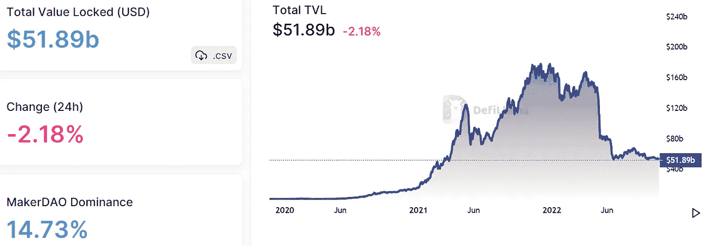
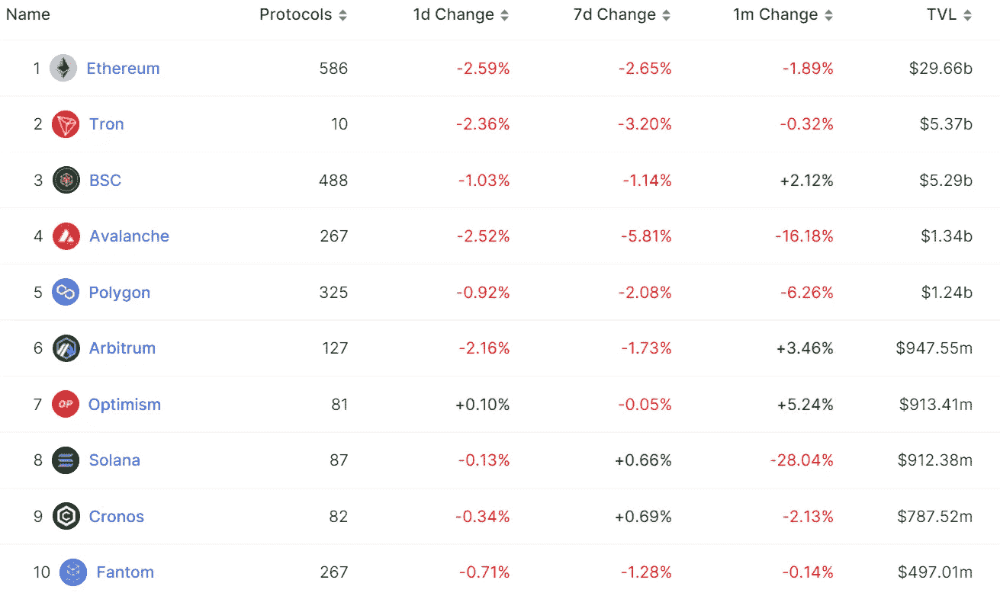
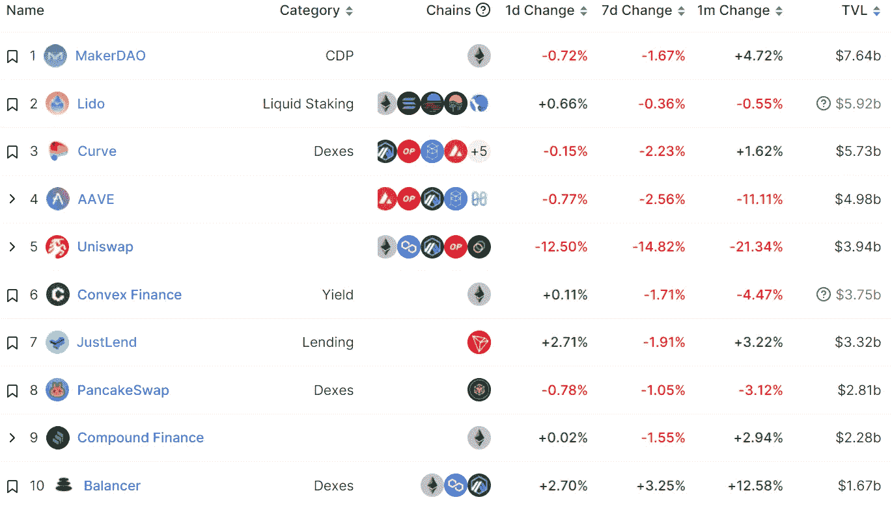
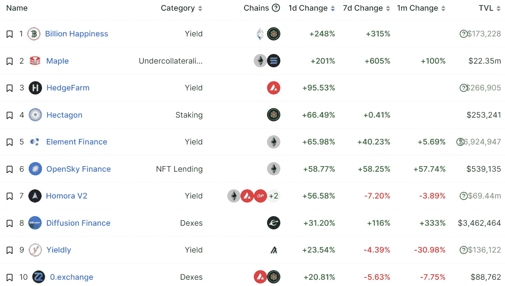
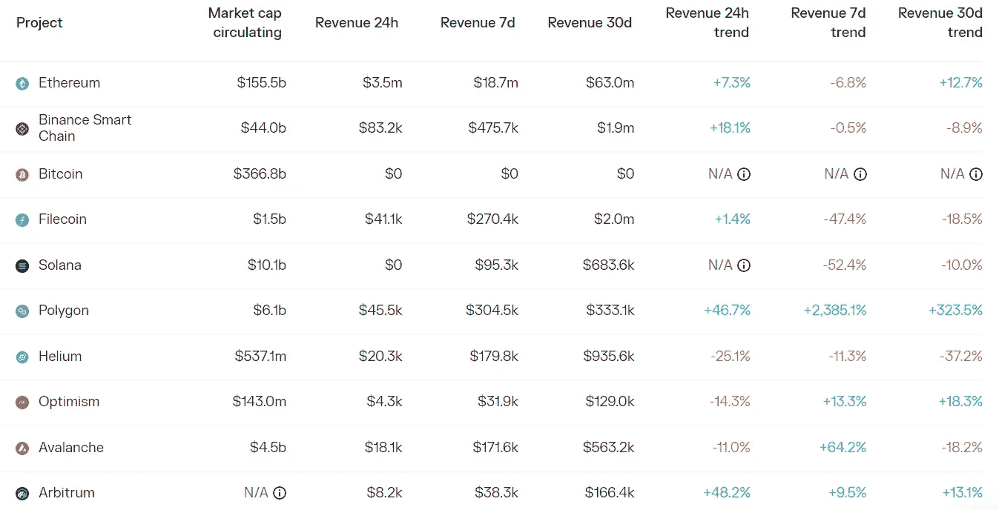
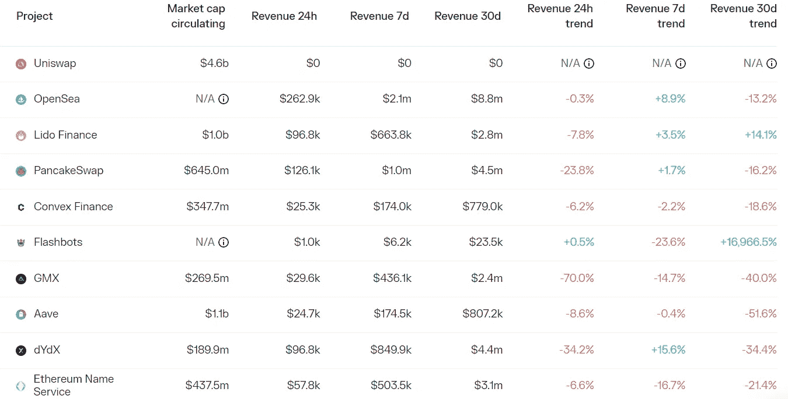

# DeFi Insight |来自机构投资者的 5 大市场洞察

> 原文：<https://medium.com/coinmonks/defi-insight-5-market-insights-from-institutional-investors-cfa424f30f5c?source=collection_archive---------18----------------------->

2022 年 10 月 21 日

*今日 DeFi 数据&由 DeFi Insight 为您带来的新闻*

> *"* 这里有一个有趣的假设:如果没有 Terra、三箭资本(Three Arrows Capital)和这么多加密银行的垮台，加密技术会是什么样的状态？
> 
> 显然…这样会好很多。
> 
> 不幸的是，伤害已经造成了。
> 
> 我们现在想知道这个行业能多快复苏？
> 
> 2022 年第三季度的影响会是什么样的？
> 
> Bitwise 是一家机构加密资产管理公司，发布季度加密报告，捕捉不同加密领域的主要趋势。
> 
> 今天的时事通讯是这篇报道的摘要。
> 
> 尽管第二季度形势严峻，但好消息比你想象的要多。*“@*[*来源*](https://newsletter.banklesshq.com/p/5-market-insights-from-institutional?utm_source=%2Finbox&utm_medium=reader2)

# 最新消息

## 指数/交易所/AMM

**[芒果道](https://app.realms.today/dao/DPiH3H3c7t47BMxqTxLsuPQpEC6Kne8GA9VXbxpnZxFE/proposal/2NGgwYnh5rV4igUwr4sBaeRCTzkyyJ64habEaPraRWZx)计划用 4200 万 USDC 赔偿用户损失**

****[寿司屋](https://forum.sushi.com/t/meiji-governance-rework/11283)提议建造明治道，取代寿司道进行连锁治理****

******关于将 [PCS 的](https://pancakeswap.finance/voting/proposal/0x29913ec3d379014a6137fdfe62c1cf27f7b2c1edff7c6a802d4300251d06d34c?chainId=56)部署到 Aptos 链的提案******

## ******贷款******

******标有 Justin sun 的地址从 Aave 协议中提取了约 5000 万美元的 BUSD，并将约 7000 万美元的 BUSD 转给了 Paxos 财政部******

********Prime Trust 纠纷解决，费用审查员任命在[摄氏听证会](https://www.theblock.co/post/178828/prime-trust-dispute-settled-fee-examiner-appointed-at-celsius-hearing)********

## ******|令牌******

********资产上市流程— [比特币基地](https://twitter.com/CoinbaseExch/status/1583200663823036417)********

******一枚隋币很快就等于十亿了******

********FTX 美国禁止[代币](https://u.today/ftx-us-bans-tokens-that-may-be-defined-as-securities-from-listing-details)被定义为上市证券********

********超 2000 万 [AXS](https://token.unlocks.app/axie-infinity) 下周解锁，占总供应量近 8%********

## ******稳定币******

******FDIC 负责人呼吁将稳定资本限制在许可的区块链******

********增加进入 [USDC](https://www.coinbase.com/blog/increasing-access-to-usdc-internationally-commission-free-trading) 的国际渠道:通过非美元货币进行免佣金交易********

******11 月 3 日，巴西全国 24000 多台自动取款机上可以使用**系绳 [USDT](https://tether.to/en/tether-usdt-available-in-over-24000-atms-across-brazil-on-3-november/)********

## ******空投******

********[ChaChaSwap](https://twitter.com/chachaswap/status/1583073003415359488?s=46&t=o8aEWVbO76sOT_kvn6K7DA)公测下周上线，交易奖励空投上线********

## ******钱包******

********[Exodus](https://www.globenewswire.com/news-release/2022/10/19/2537821/0/en/Exodus-Announces-Polygon-Support-in-Web3-Wallet.html)宣布在 Web3 钱包中支持多边形********

## ******基金******

******隐形加密对冲基金 Edge Capital 为 [DeFi Bets](https://www.coindesk.com/business/2022/10/20/stealthy-crypto-hedge-fund-edge-capital-raises-668m-for-defi-bets/) 募集 6680 万美元******

## ******政策与法规******

********[CFTC](https://www.cftc.gov/PressRoom/PressReleases/8613-22)发布年度执法结果********

******英国中央银行家说，金融永远不能完全分权******

# ******数据和分析******

## ******锁定的总价值(TVL)******

******目前全网 DeFi 总锁定量为 518.9 亿美元，24 小时下降 2.18%。******

************

## ******TVL 评出的十大连锁酒店******

************

## ******|最新 TVL 十大项目******

************

## ******|过去 24 小时内 TVL 增长的前 10 个项目******

************

## ******协议收入******

## ******|累计总收入最高的项目(24H)_ 区块链(L1)******

************

## ******|累计总收入最高的项目(24H) _Dapps (L2)******

************

# ******深潜******

********[**数字**](https://defieducation.substack.com/p/digital-asset-industry-standards?utm_source=%2Finbox&utm_medium=reader2) **行业标准**********

**** [## 数字资产行业标准

### 正如我们在今年初夏的一篇文章中所说，律师们正在赶来。我们开始每周报道法规更新…

defieducation.substack.com](https://defieducation.substack.com/p/digital-asset-industry-standards?utm_source=%2Finbox&utm_medium=reader2)**** 

# ****报告****

******[**Aptos，Sui & Canto**](https://tokeninsight.com/en/research/reports/beyond-aptos-sui-canto-an-in-depth-guide-to-the-emerging-alt-l1s) **|新兴 Alt-L1s 的深度指南** _tokeninsight******

> ****第 1 层区块链项目一直吸引着加密领域最多的关注和资金。排名前 20 位的第 1 层区块链总共代表了当今整个加密市场的 75.4%。****
> 
> ****成为一个可识别的第一层保证了一个人进入十亿美元的估值俱乐部。由于天花板很高，新的解决方案不断挑战着现有的解决方案。另一波第一层区块链项目最近筹集了大量资金，特别是 Aptos 和 Sui。****
> 
> ****许多人已经对 Aptos 和 Sui 进行了详细的比较。我们希望在一个完整的框架中评估更多新的第 1 层。例如，Fuel Labs 筹集了 8000 万美元，在 Celestia 的基础上构建了一个模块化的执行层。****
> 
> ****我们涵盖 Aptos、Sui、Linera、Shardeum、Quai、Sei、Canto 和 Fuel，其中详细探讨了他们的技术、团队、资金、令牌组学(如果有)、开发进度和生态系统。****

******[**GMX 的**](https://members.delphidigital.io/reports/gmxs-success-spawns-competition-but-can-they-keep-up)**成功催生竞争，但他们能跟上吗？**_ 德尔福数码**********

********一看** [**分散保险**](https://www.theblockresearch.com/a-look-at-decentralized-insurance-178722) _theblockresearch******

******进化渴望** [**词汇学:**](https://messari.io/report/evolving-yearn-tokenomics?referrer=all-research) **从价值捕获到价值创造** _messari****

******[**的状态 meta plex**](https://messari.io/report/state-of-metaplex-q3-2022?referrer=all-research)**Q3 2022**_ messari******

******状态** [**和谐**](https://messari.io/report/state-of-harmony-q3-2022?referrer=all-research)**Q3 2022**_ messari****

******状态**[**frik tion**](https://messari.io/report/state-of-friktion-q3-2022?referrer=all-research)Q3 2022_ messari****

******关于:******

****DeFi Insight 是顶级 DeFi 和加密新闻和更新的来源。****

******https://twitter.com/AlphaPro_io 推特:******

********❤RSS:**[**https://medium.com/feed/@alphapro.project**](https://medium.com/feed/@alphapro.project)******

****提供的信息应被视为发展新闻，而不是投资建议。****

> ****交易新手？试试[加密交易机器人](/coinmonks/crypto-trading-bot-c2ffce8acb2a)或[复制交易](/coinmonks/top-10-crypto-copy-trading-platforms-for-beginners-d0c37c7d698c)****