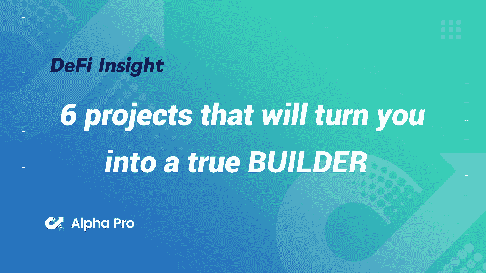
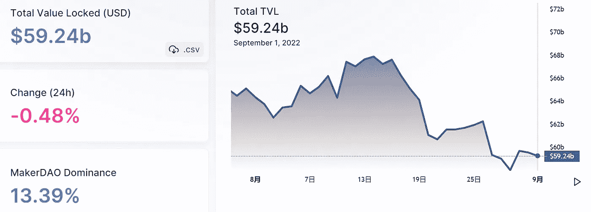
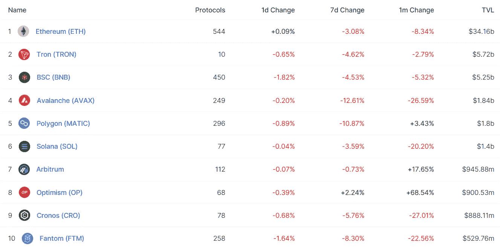
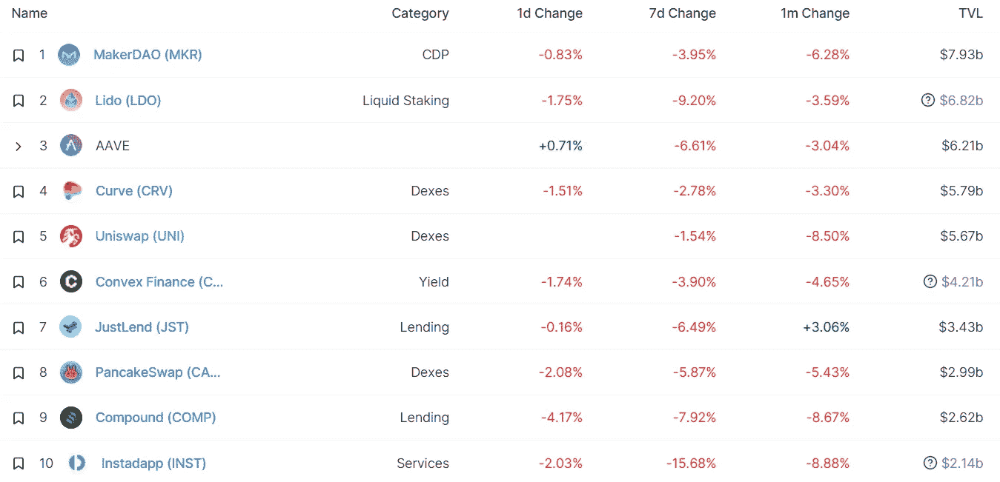
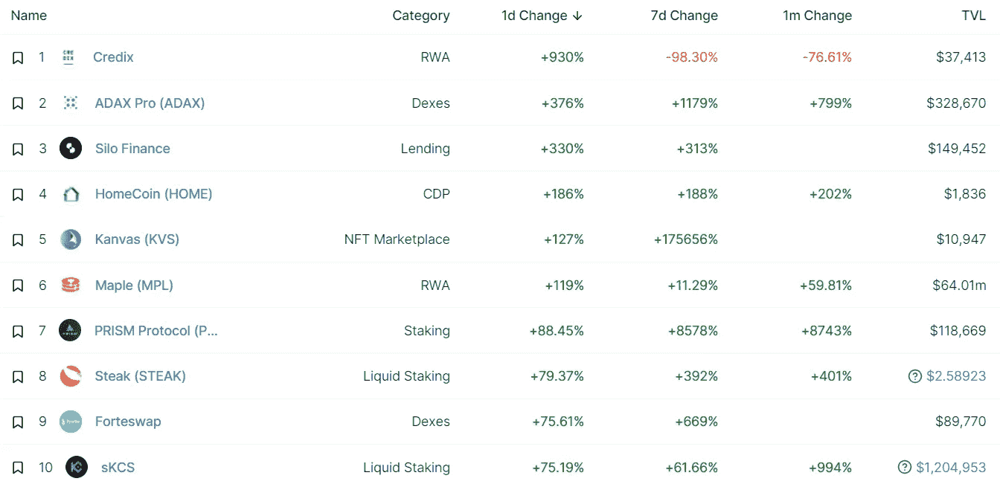
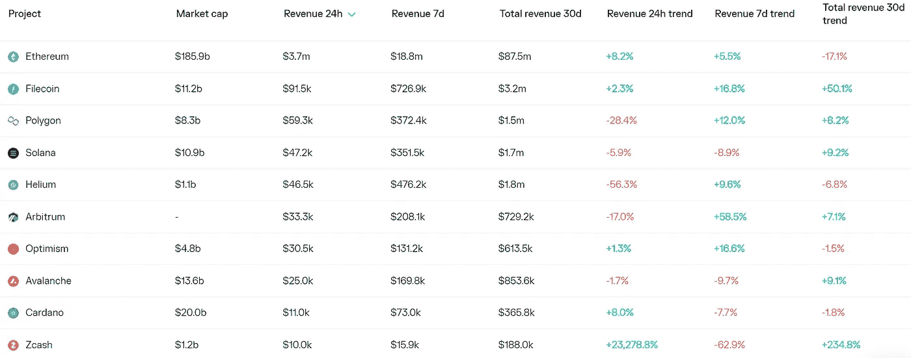
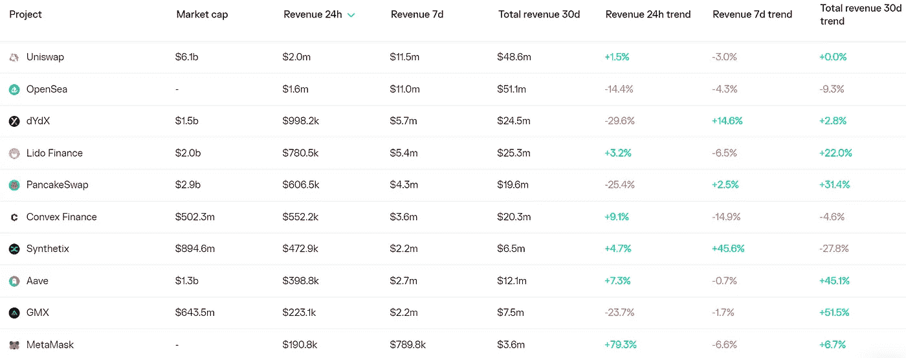

# DeFi Insight | 6 个项目，让你成为真正的建设者

> 原文：<https://medium.com/coinmonks/defi-insight-6-projects-that-will-turn-you-into-a-true-builder-237e266f3016?source=collection_archive---------9----------------------->

2022 年 9 月 1 日

*今日 DeFi 数据&由 DeFi Insight 为您带来的新闻*

> *"* 如果你在熊市中建仓，你将能够随心所欲地印钞
> 
> 可悲的是，大多数人并没有真正在建设，他们只是在浪费时间 *"@* [*来源*](https://twitter.com/NFT_GOD/status/1564979629672341509?s=20)

# 最新消息

## 外汇

**介绍[白羊座市场](/@AriesMarkets/introducing-aries-markets-c0f4052471db)**

## **第二层**

****[硝基](https://twitter.com/arbitrum/status/1565030915348303873)迁移完成****

******[罗宾汉](https://blog.polygon.technology/robinhood-launches-deposits-and-withdrawals-for-matic-on-the-polygon-network/)在多边形网络上为 MATIC 发起存取款******

## ******链条******

********[近&游戏](/nearprotocol/near-gaming-the-future-of-gaming-on-web3-565d7f757663):web 3 游戏的未来********

## ******|令牌******

********[1，000，000 美元 USN 激励计划](https://twitter.com/DcntrlBank/status/1564996206325108736)支持$NEAR 和$AURORA 分散融资的增长。********

## ******钱包******

********、**硬件钱包 [Trezor](https://cointelegraph.com/news/hardware-wallet-trezor-enables-direct-crypto-purchases-with-moonpay) 支持使用 MoonPay 直接购买密码******

****LG 电子推出基于 Hedera 的加密钱包****

## ****资产管理****

******[巴比伦金融](https://cryptoslate.com/defi-protocol-babylon-finance-to-shut-down-on-nov-15-blamed-rari-fei-hack/)因未能从 Rari/FEI 黑客事件中恢复，将于 11 月 15 日关闭******

## ******政策与法规******

********[加州加密监管法案](https://www.bloomberg.com/news/articles/2022-08-31/california-crypto-oversight-bill-moves-closer-to-becoming-law?srnd=cryptocurrencies-v2)接近成为法律********

********[FASB 加密会计评论](https://www.coindesk.com/policy/2022/08/31/fasb-crypto-accounting-review-wont-include-nfts-certain-stablecoins-report/)不包括非金融交易，某些稳定账户:报告********

## ******NFT******

******已经在魔法伊甸园购买了**[德古德#270](https://twitter.com/NFTSaleBot/status/1565209965865816064)********

********[合并后 OpenSea](https://beincrypto.com/opensea-will-only-support-ethereum-proof-of-stake-after-merge/) 将只支持以太坊股权证明********

********[百无聊赖游艇俱乐部最大的知识产权持有者](https://www.globenewswire.com/news-release/2022/08/31/2507732/0/en/Biggest-IP-Holders-of-Bored-Ape-Yacht-Club-To-Launch-NFT-Collection-with-Altava-Group.html)与 Altava 集团合作推出 NFT 系列。********

********同意在以太坊主网上发布第一批[绿色 NFT](https://consensys.net/blog/news/consensys-to-launch-one-of-the-first-green-nfts-on-ethereum-mainnet/?utm_source=feedly&utm_medium=rss&utm_campaign=consensys-to-launch-one-of-the-first-green-nfts-on-ethereum-mainnet)之一********

## ******基金******

******SG 以加密技术为中心的网络安全公司在 Pi Ventures 领投的一轮融资中获得 170 万美元******

# ******数据和分析******

## ******锁定的总价值(TVL)******

******目前全网 DeFi 总锁定量为 592.4 亿美元，24 小时下降 0.48%。******

************

## ******TVL 评出的十大连锁酒店******

************

## ******|最新 TVL 十大项目******

************

## ******|过去 24 小时内 TVL 增长的前 10 个项目******

************

## ******协议收入******

## ******|累计总收入最高的项目(24H)_ 区块链(L1)******

************

## ******|累计总收入最高的项目(24H) _Dapps (L2)******

************

# ******深潜******

********[**分散身份革命**](https://newsletter.banklesshq.com/p/the-decentralized-identity-revolution?utm_source=%2Finbox&utm_medium=reader2)********

**** [## 分散的身份革命

### 亲爱的无银行国家，今天，我们有了数字身份的第一个脚印。的…

newsletter.banklesshq.com](https://newsletter.banklesshq.com/p/the-decentralized-identity-revolution?utm_source=%2Finbox&utm_medium=reader2) 

**如何** [**成为区块链安全工程师**](https://blog.blockmagnates.com/how-to-become-a-blockchain-security-engineer-2159d888ad84)

 [## 如何成为区块链安全工程师

### 一个向导

blog.blockmagnates.com](https://blog.blockmagnates.com/how-to-become-a-blockchain-security-engineer-2159d888ad84) 

**[**NFT 市场的 5 大关键洞察**](https://twitter.com/0xKofi/status/1564639079454674944)**

******随着比特币价格涨势的打破，** [**永续期货市场能告诉我们什么？**](https://bitcoinmagazine.com/markets/bitcoin-price-and-perpetual-futures-market)****

**** [## 随着比特币价格涨势的打破，永续期货市场能告诉我们什么？

### 以下节选自比特币杂志 Pro 的最近一期，比特币杂志的高级市场时事通讯…

bitcoinmagazine.com](https://bitcoinmagazine.com/markets/bitcoin-price-and-perpetual-futures-market)**** 

# ****报告****

******[**剥离图层**](https://crypto.com/research/new-layer-1-layer-2-blockchain-solutions/) **:介绍新的第一层和第二层区块链景观** _crypto******

> ****新一代第 1 层正在出现，其创新解决了区块链的三难问题。这些新的第一层，如 Cronos、Avalanche、Aptos 和 Sui，集成了多种解决方案，以提高可扩展性，同时保持高级别的安全性和去中心化:
> Cronos:其创新包括 EVM 兼容性、Cosmos 集成、互操作性和权威证明(PoA)。Avalanche:它实现了新颖的无领导一致性协议，引入了子网，并使用 DAG 来组织事务。Aptos:Aptos 的主要新颖部分包括它的一致性算法(AptosBFT)、并行执行框架(Block-STM)和 Move 编程语言。
> Sui:Aptos 和 Sui 有一些相似之处，但 Sui 采用了额外的创造性思想，如简单和复杂事务的拆分、双重共识机制、Sui Move 等。****

******绘制出**[**multi coin Capital**](https://www.theblockresearch.com/mapping-out-multicoin-capitals-portfolio-3-166804)**的投资组合** _theblockresearch****

******[**数字资产管理评论**](https://data.cryptocompare.com/reports/digital-asset-management-review-august-2022)**—2022 年 8 月** _cryptocompare******

******月度** [**市场总结**](https://arcane.no/research/monthly-market-wrap-up-august-2022)**:2022 年 8 月**_ 神秘****

******[**索拉纳项目收益周报**](https://mirror.xyz/0x9b7e7c5B53081d0C6d09b91F13783D58B772b011/5A2pMCL4kEbmF2D4z7Jf87rcX_vM5o_c9q_uUpgk5qk)**2022 年 9 月 1 日** _Alpha Pro******

******关于:******

****DeFi Insight 是顶级 DeFi 和加密新闻和更新的来源。****

******https://twitter.com/AlphaPro_io 推特:******

********❤RSS:**[**https://medium.com/feed/@alphapro.project**](https://medium.com/feed/@alphapro.project)******

****提供的信息应被视为发展新闻，而不是投资建议。****

> ****交易新手？尝试[加密交易机器人](/coinmonks/crypto-trading-bot-c2ffce8acb2a)或[复制交易](/coinmonks/top-10-crypto-copy-trading-platforms-for-beginners-d0c37c7d698c)********