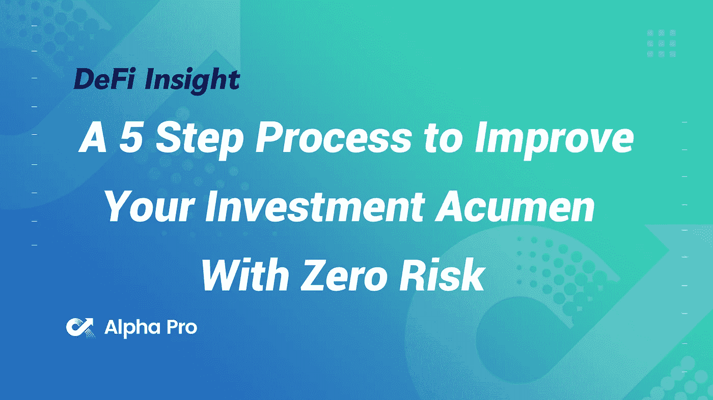
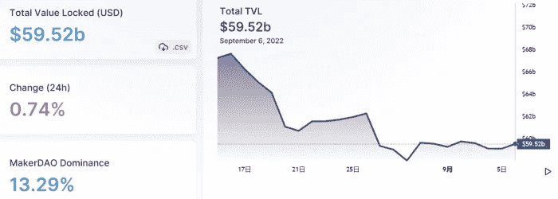
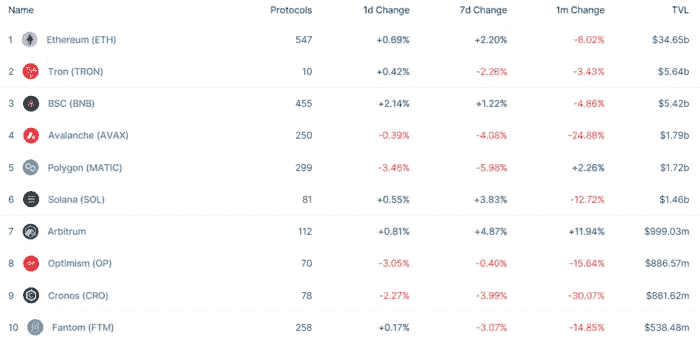
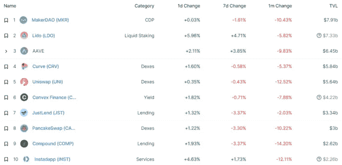
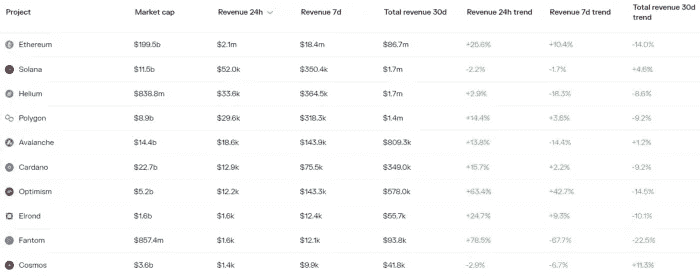
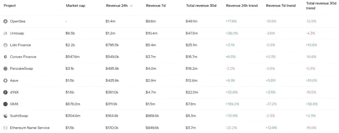

# DeFi Insight |零风险提高投资敏锐度的 5 个步骤

> 原文：<https://medium.com/coinmonks/defi-insight-a-5-step-process-to-improve-your-investment-acumen-with-zero-risk-c90b81d49e83?source=collection_archive---------22----------------------->

2022 年 9 月 7 日

*今日 DeFi 数据&由 DeFi Insight 为您带来的新闻*

> *在 2022 年，许多在 2021 年获得收益的人知道投资/交易不是那么容易的。你投资方法中的短期主义是通往贫困的捷径。投资是一场马拉松，而不是短跑。*
> 
> *你如何学习和向谁学习将决定你长期技能的质量(唯一真正重要的时间范围)。*
> 
> *问题是你不知道你不知道什么。*“@*[*来源*](https://defieducation.substack.com/p/a-5-step-process-to-improve-your?utm_source=%2Finbox&utm_medium=reader2)*

# *最新消息*

## *贷款*

***[AAVE](https://beincrypto.com/aave-stops-loaning-eth-ahead-of-merge/)在合并前停止借出 ETH***

## ***外汇***

*****,**密码交换[库币](https://www.coindesk.com/business/2022/09/06/crypto-exchange-kucoin-highlights-flaws-in-defi-platform-acalas-post-exploit-proposal/)凸显 DeFi 平台 Acala 的后利用提案中的缺陷***

## ***|选项***

*****[Lyra Finance](https://twitter.com/lyrafinance/status/1567301778613628930)与 HopProtocol 合作，作为我们“交易合并”竞赛的官方桥梁*****

## *****稳定币*****

*****Frax Finance 推出自己的借贷市场 Fraxlend*****

## *****第二层*****

*******/**ZK sync 2.0 Mainnet Alpha 项目注册现已开放*****

*******[Param Labs 整合了不可变 X](https://immutablex.medium.com/param-labs-integrates-immutable-x-to-power-the-upcoming-kiraverse-with-gasless-and-carbon-neutral-de474185855e) 为即将到来的无汽油和碳中性 NFT 铸造和交易提供动力*******

## *******市场*******

*********[在 Mt. Gox 崩盘](https://www.bloomberg.com/news/articles/2022-09-07/investor-who-made-1-700-on-mt-gox-crash-circles-crypto-again?srnd=cryptocurrencies-v2#xj4y7vzkg)中赚了 1700%的投资者又开始转密码圈了*********

*********[巴西税务局](https://news.bitcoin.com/brazilian-tax-authority-registers-record-number-of-cryptocurrency-statements/)记录加密货币报表数量*********

## *******提议*******

*********米普克比特币基地 [USDC 机构奖励](https://forum.makerdao.com/t/mipxx-coinbase-usdc-institutional-rewards/17703)*********

## *******|令牌*******

*********[咕](https://www.paradigm.xyz/2022/09/goo#mechanism)(逐步所有权优化)*********

## *******鲸鱼*******

*********,**柴犬折价买入，[顶鲸多笔交易捞取 6566.4 亿柴犬](https://thecryptobasic.com/2022/09/07/shiba-inu-discount-bought-top-whale-scoops-up-656-64-billion-shib-in-multiple-transactions-details/):详情*******

## *****政策与法规*****

*******[俄罗斯](https://news.bitcoin.com/russia-cant-do-without-cross-border-crypto-payments-consensus-reached/)离不开跨境加密支付，达成共识*******

*******宾夕法尼亚州和华盛顿州成为美国第一个对非关税壁垒征税的州*******

## *******NFT*******

*********[大卫·鲍依以太坊 NFTs](https://decrypt.co/109121/david-bowie-on-the-blockchain-ethereum-nfts-trigger-backlash) 引发推特反弹*********

## *******基金*******

*******燃料实验室为模块化执行层筹集了 8000 万美元，宣传其卓越的速度*******

*******Smobler 工作室筹集了 120 万美元的种子资金，以创建一个永久的元宇宙*******

*********[Credix](/credix/credix-raises-11-25m-series-a-to-scale-real-world-asset-defi-platform-85a5edf64c31)筹集 1125 万美元 A 轮融资，以扩大现实世界资产定义平台的规模*********

## *******观点*******

*******以太坊的合并:分析表明[在吸引新用户方面收效甚微](https://cryptoslate.com/ethereums-merge-analytics-suggest-it-is-doing-little-to-attract-new-users/)*******

# *******数据和分析*******

## *******锁定的总价值(TVL)*******

*******目前全网 DeFi 总锁定量为 595.2 亿美元，24 小时增长 0.74%。*******

**************

## *******TVL 评出的十大连锁酒店*******

**************

## *******|最新 TVL 十大项目*******

**************

## *******|过去 24 小时内 TVL 增长的前 10 个项目*******

**************

## *******协议收入*******

## *******|累计总收入最高的项目(24H)_ 区块链(L1)*******

**************

## *******|累计总收入最高的项目(24H) _Dapps (L2)*******

**************

# *******深潜*******

*********比特币挖矿如何** [**改造能源行业**](https://arcane.no/research/how-bitcoin-mining-can-transform-the-energy-industry-summary) **:概要*********

***** [## 比特币采矿如何改变能源行业:摘要

### 我们的研究报告发现，比特币矿工是独特的灵活能源消费者，允许他们作为能源…

神秘，不](https://arcane.no/research/how-bitcoin-mining-can-transform-the-energy-industry-summary) 

**如何** [**私自使用 DeFi**](https://newsletter.banklesshq.com/p/how-to-use-defi-privately?utm_source=%2Finbox&utm_medium=reader2)

 [## 如何私下使用 defi

### 这是一生一次的机会。用康赛斯的特别 NFT 来纪念合并。🥳 🎊亲爱的无银行国家，我们应该…

newsletter.banklesshq.com](https://newsletter.banklesshq.com/p/how-to-use-defi-privately?utm_source=%2Finbox&utm_medium=reader2) 

**本案为** [**平行加工链**](/alliancedao/the-case-for-parallel-processing-chains-90bac38a6ba4)

 [## 并行处理链的情况

### 在审视区块链技术的发展时，我们可以发现新 L1 的一个强大趋势，即专注于…

medium.com](/alliancedao/the-case-for-parallel-processing-chains-90bac38a6ba4) 

**智能合约开发—** [**移动 vs .生锈**](/@kklas/smart-contract-development-move-vs-rust-4d8f84754a8f)

 [## 智能合同开发—移动与生锈

### 深入研究 Move，一种用于智能合约开发的新颖编程语言，以及它与

medium.com](/@kklas/smart-contract-development-move-vs-rust-4d8f84754a8f) 

# 报告

**[**Delta Neutral**](https://coinshares.com/research/deltaneutral)**加密应用** _coinshares**

> **在当前的市场环境下，delta 中性策略在加密投资者中越来越受欢迎。**
> 
> **我们最新的报告分析了此类策略的各种使用案例，以及希望采用这些策略的交易者的潜在收益和风险。**

****[**天琴座**](https://members.delphidigital.io/reports/lyra-a-next-generation-options-amm) **:下一代选项 AMM**_ 德尔福数码****

******/**[**索拉纳如何赢得残局**](https://messari.io/report/how-solana-wins-the-endgame-vs-modular-chains) **vs 模块化链条**_ 梅萨里****

******《不可阻挡的域名》公司情报** _theblockresearch****

******关于:******

****DeFi Insight 是顶级 DeFi 和加密新闻和更新的来源。****

******https://twitter.com/AlphaPro_io 推特:******

********❤RSS:**[**https://medium.com/feed/@alphapro.project**](https://medium.com/feed/@alphapro.project)******

****提供的信息应被视为发展新闻，而不是投资建议。****

> ****交易新手？尝试[加密交易机器人](/coinmonks/crypto-trading-bot-c2ffce8acb2a)或[复制交易](/coinmonks/top-10-crypto-copy-trading-platforms-for-beginners-d0c37c7d698c)*********