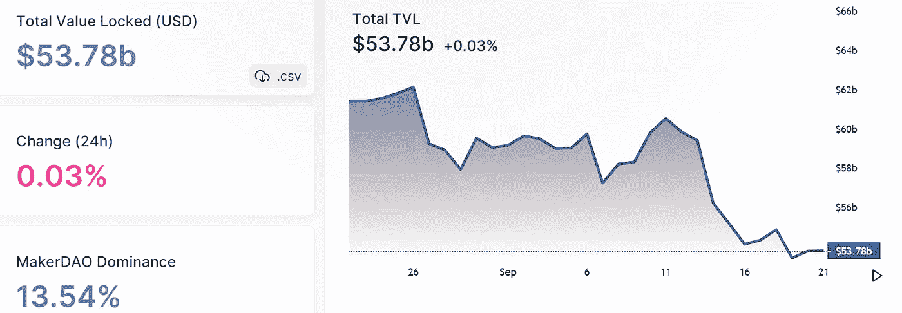
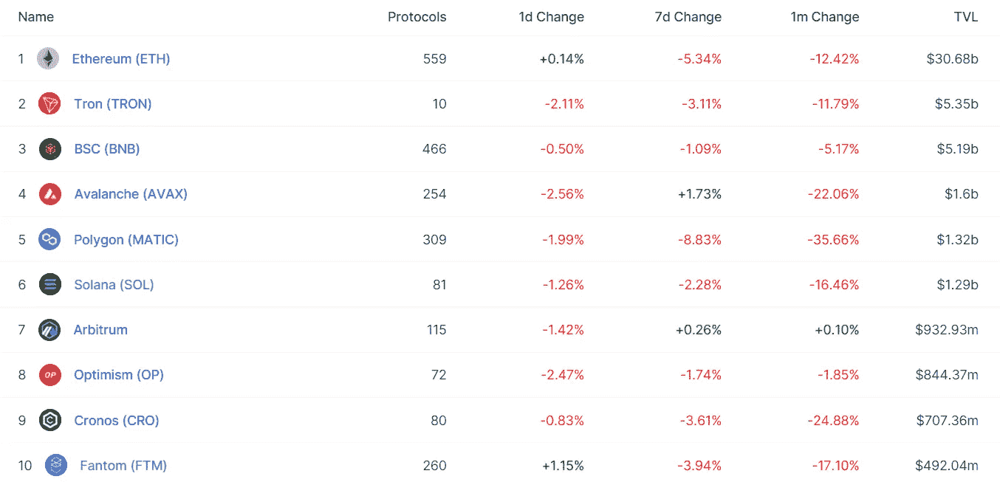
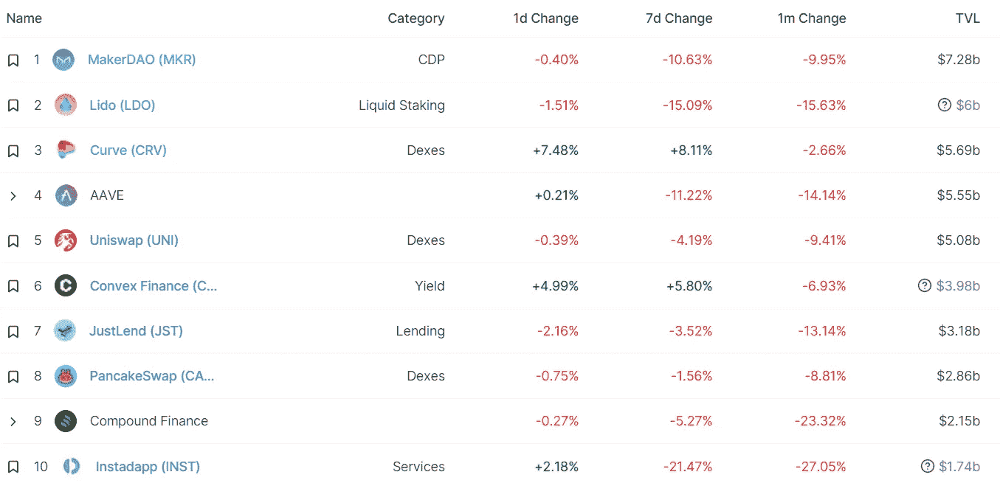
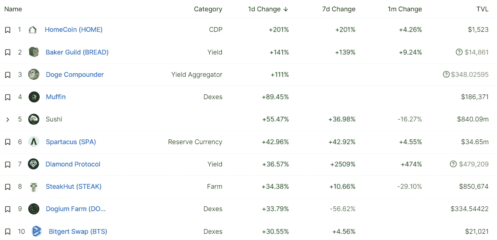
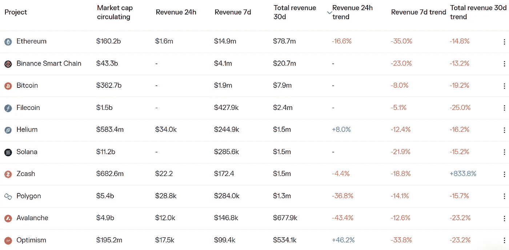
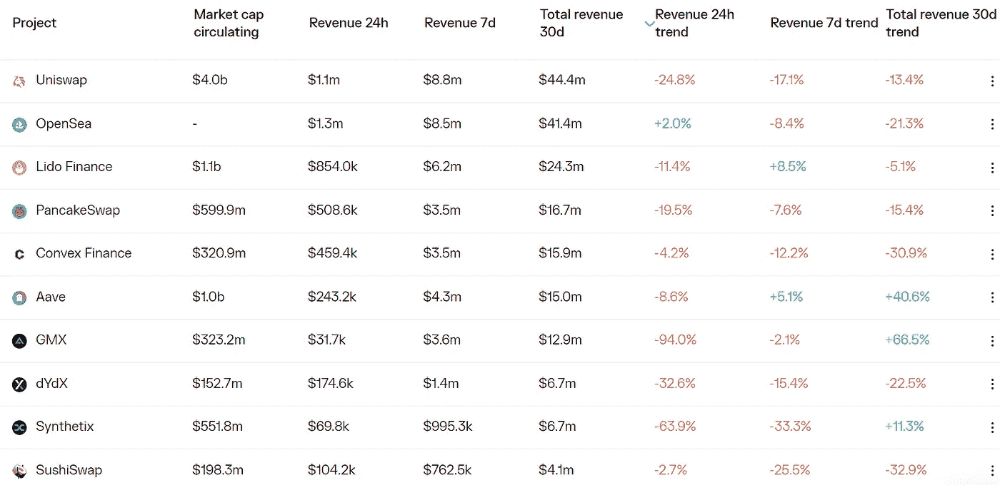

# ETH 验证器初学者指南

> 原文：<https://medium.com/coinmonks/defi-insight-a-beginners-guide-to-eth-validators-e748772efc30?source=collection_archive---------29----------------------->

2022 年 9 月 21 日

*今日 DeFi 数据&由 DeFi Insight 为您带来的新闻*

> *"* 合并大大降低了普通人参与保护以太坊的门槛。
> 
> 你不需要在硬件和能源成本上花费数千(或数百万)美元，你需要的只是一台笔记本电脑和一些以太网。
> 
> 虽然液体堆叠协议为那些不符合 32 ETH 阈值的用户提供了一个更容易获得的解决方案，但运行您自己的验证器有助于保持网络的去中心化和审查阻力。*“@*[*来源*](https://newsletter.banklesshq.com/p/a-beginners-guide-to-eth-validators?utm_source=%2Finbox&utm_medium=reader2)

# 最新消息

## 第一层

**[Aptos Mainnet](https://discord.com/channels/945856774056083548/946142976814497853/1021936407100522536)计划于 9 月 23 日至 12 月 22 日发布**

****、** Aptos:增加 [AIT3 奖励 50%](https://aptoslabs.medium.com/the-journey-from-ait3-to-longevity-testnet-6d888885a7d0) ，成功上线寿命测试网**

## **第二层**

**仲裁者宣布 400 ETH bug 赏金**

**现在所有 Infura 用户都可以使用 StarkNet 了**

## **指数/交易所/AMM**

**被黑的加密做市商有 2 亿美元的未偿债务**

**币安和 FTX 为破产的贷款人航海家出价最高**

## **CDP**

****、**、[马克尔道](https://www.theblock.co/post/171316/makerdao-governance-votes-yes-to-adding-gnosisdao-token-as-collateral-for-dai)治理投票通过增加灵知道令牌作为戴的抵押品**

## **贷款**

****[破冰金融](https://www.maple.finance/news/maple%20icebreaker%20mining%20pool%20launch/)为比特币采矿和数字基础设施提供商推出贷款池****

## ****桥梁****

******[Nomad](https://twitter.com/nomadxyz_/status/1572395838978297856?s=20)发布跨链桥重启更新，已帮助用户追回部分资产******

## ******稳定币******

******USDC 现在正在打篮球******

********USDC 发行上[雪崩](https://usdc.cool/)链跌破 10 亿美元，比 ATH 下跌超过 30%********

## ******政策与法规******

******众议院的稳定硬币法案将对类似地球的硬币实施两年禁令******

## ******道******

********BNB 链、区块链安全公司启动[复仇者道](https://www.coindesk.com/business/2022/09/20/bnb-chain-blockchain-security-firms-start-avengerdao-to-protect-users/)保护用户********

********通过:[道提案呼吁](https://twitter.com/CantoPublic/status/1571659144847044609?s=20&t=XiWhvenZvTrXCH9OkBMlDg)减排约 54%&流动性开采奖励********

## ******NFT******

********魔法伊甸园推出 ETH 聚合器[魔法伊甸园](https://twitter.com/MagicEden/status/1572269456088244224?s=20)，支持使用 ETH 购买以太坊 NFT 系列********

******OpenSea 将很快支持 arbitrum******

## ******基金******

******香港大亨支持的公司正在筹集 5 亿美元投资于加密、私募股权基金******

********hig lobe，Inc .筹集[1400 万美元](https://www.theblockbeats.info/flash/105070)用于消除全球员工的国际资金转账费用********

# ******数据和分析******

## ******锁定的总价值(TVL)******

******目前全网 DeFi 总锁定量为 537.8 亿美元，24 小时增长 0.03%。******

************

## ******TVL 评出的十大连锁酒店******

************

## ******|最新 TVL 十大项目******

************

## ******|过去 24 小时内 TVL 增长的前 10 个项目******

************

## ******协议收入******

## ******|累计总收入最高的项目(24H)_ 区块链(L1)******

************

## ******|累计总收入最高的项目(24H) _Dapps (L2)******

************

# ******深潜******

********[**合并**](https://insights.glassnode.com/the-week-onchain-week-38-2022/) **:工程壮举**********

**** [## 合并:工程的壮举

### 本周见证了区块链工业中最令人印象深刻的工程壮举之一的成功部署…

insights.glassnode.com](https://insights.glassnode.com/the-week-onchain-week-38-2022/) 

**[**银行诈骗**](https://defieducation.substack.com/p/200-billion-in-bank-scams?utm_source=%2Finbox&utm_medium=reader2)2000 亿美元**

** [## 2000 亿美元的银行诈骗

### 欢迎头像！最近，我们与一位喜欢关注加密空间但有一些严厉批评的朋友交谈。无…

defieducation.substack.com](https://defieducation.substack.com/p/200-billion-in-bank-scams?utm_source=%2Finbox&utm_medium=reader2) 

**[**历史 NFTs**](https://metaversal.banklesshq.com/p/historical-nfts?utm_source=%2Finbox&utm_medium=reader2) 简介**

** [## 历史 NFTs📅

### 亲爱的无银行国家，上周我们探索了 NFT 生态系统的一个新类别，写 NFT。当然，所有的…

metaversal.banklesshq.com](https://metaversal.banklesshq.com/p/historical-nfts?utm_source=%2Finbox&utm_medium=reader2) 

**我们所知道的** [**向往即将到来的$yCRV**](https://curve.substack.com/p/sept-20-2022-why-ycrv?utm_source=%2Finbox&utm_medium=reader2)

 [## 2022 年 9 月 20 日:为什么是$yCRV 🧶🐰

### 上周，我们检查了包装$CRV 战争-但正如经常发生在 DeFi，一切都已经…

curve.substack.com](https://curve.substack.com/p/sept-20-2022-why-ycrv?utm_source=%2Finbox&utm_medium=reader2) 

# 报告

**、**蜡:最活跃的[游戏链](https://www.theblockresearch.com/wax-the-most-active-gaming-chain-170267) _theblockresearch

> “根据我们的报告，加密游戏的状态，WAX 是最受欢迎的连锁店，每天有 300 万个活跃地址，这在很大程度上要归功于外星人世界和农民世界。
> WAX 是一个 EOS fork 链，要求用户在使用该链之前了解网络、CPU 和 RAM 之间的区别。
> WAX 上排名前 5 的游戏都是点击器游戏。点击器游戏通常包括点击带有简单图形的屏幕，这使得它们比其他类型的游戏更容易制作。
> 这篇研究文章将讨论 WAX 生态系统，包括其底层技术、令牌模型和游戏生态系统。”

**分析阿拉米达研究公司偿还给[航海家数码](https://www.theblockresearch.com/analysis-of-alameda-researchs-200mm-loan-repayment-to-voyager-digital-171396) _theblockresearch 的 2 亿美元贷款**

****状态[比特币 Q3](https://messari.io/report/state-of-bitcoin-q3-2022) 2022 _messari****

******[以太坊 Q3](https://messari.io/report/state-of-ethereum-q3-2022) 2022 _messari 状态******

********总结 [NFT 版税争论](https://www.theblockresearch.com/summing-up-the-nft-royalties-debate-170776) _theblockresearch********

********,**新的 Dapps 报告:[GameStop market place](https://dappradar.com/blog/new-dapps-report-gamestop-marketplace)_ dappradar******

******关于:******

****DeFi Insight 是顶级 DeFi 和加密新闻和更新的来源。****

******https://twitter.com/AlphaPro_io**❤[t27】](https://twitter.com/AlphaPro_io)****

******❤RSS:**[**https://medium.com/feed/@alphapro.project**](https://medium.com/feed/@alphapro.project)****

****提供的信息应被视为发展新闻，而不是投资建议。****

> ****加入 Coinmonks [电报频道](https://t.me/coincodecap)和 [Youtube 频道](https://www.youtube.com/c/coinmonks/videos)了解加密交易和投资****

# ****另外，阅读****

*   ****[折 App 回顾](https://coincodecap.com/fold-app-review) | [库币交易机器人](/coinmonks/kucoin-trading-bot-automate-your-trades-8cf0ca2138e0)****
*   ****[如何匿名购买比特币](https://coincodecap.com/buy-bitcoin-anonymously) | [比特币现金钱包](https://coincodecap.com/bitcoin-cash-wallets)****
*   ****[币安 vs FTX](https://coincodecap.com/binance-vs-ftx) | [最佳(SOL)索拉纳钱包](https://coincodecap.com/solana-wallets)****
*   ****[比诺莫评论](https://coincodecap.com/binomo-review) | [斯多葛派 vs 3Commas vs TradeSanta](https://coincodecap.com/stoic-vs-3commas-vs-tradesanta)****
*   ****【Capital.com】|[港加密借贷平台](https://coincodecap.com/crypto-lending-hong-kong)************