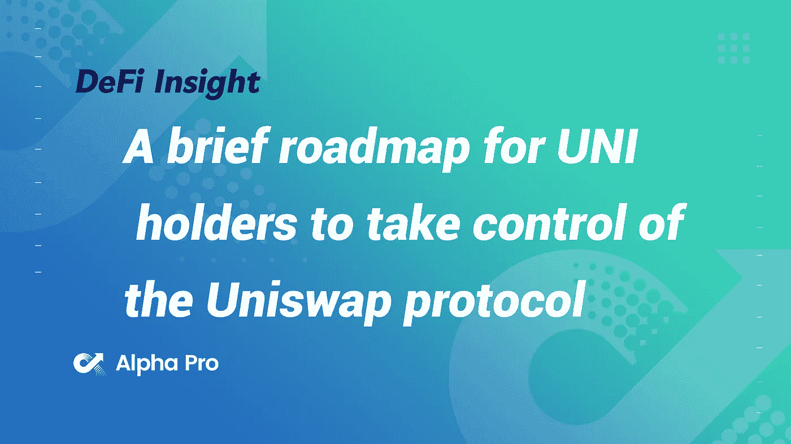
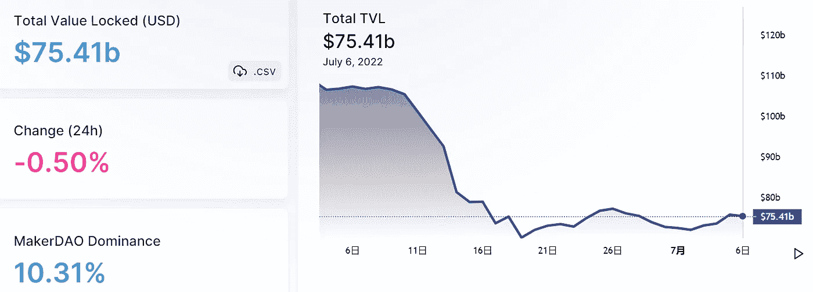
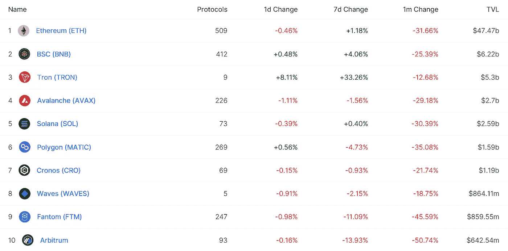
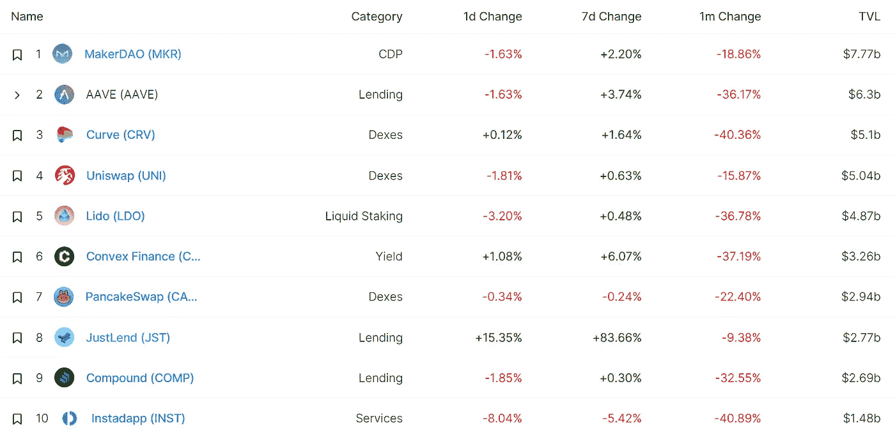
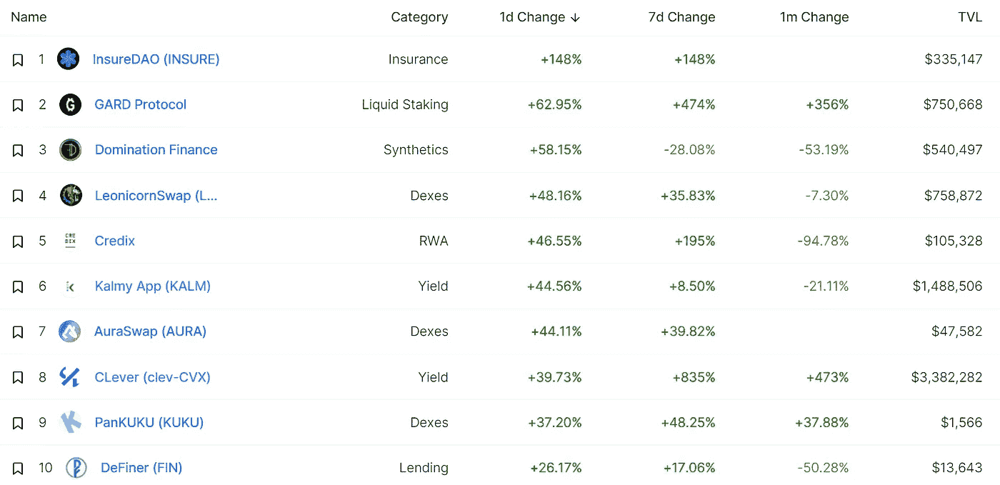
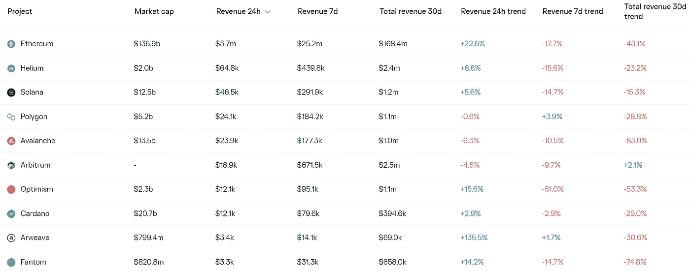
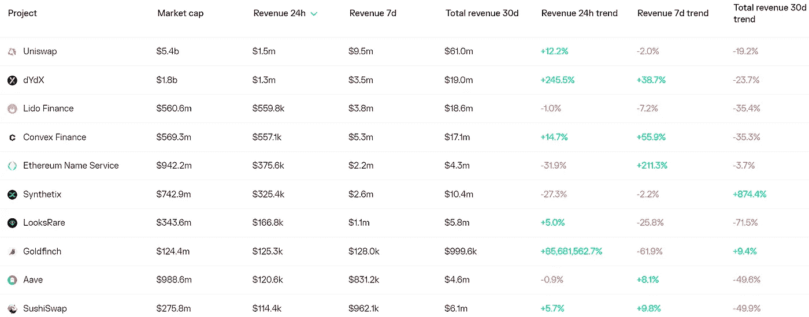
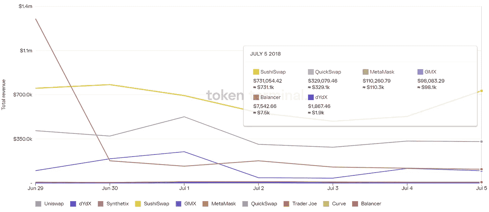
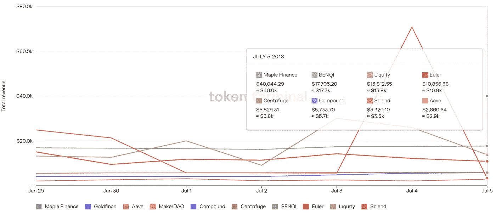

# DeFi Insight | UNI 持有者控制 Uniswap 协议的简要路线图

> 原文：<https://medium.com/coinmonks/defi-insight-a-brief-roadmap-for-uni-holders-to-take-control-of-the-uniswap-protocol-3fd6f6a12e11?source=collection_archive---------27----------------------->

2022 年 7 月 6 日

*今日 DeFi 数据&由 DeFi Insight 为您带来的新闻*

> *"* Uniswap 是领先的分散式交易所，过去一年在以太坊上的市场份额在 65-75%之间波动，在乐观和 Polygon 上也取得了成功。
> 
> 该协议是最有可能成为“世界秩序册”的候选协议，也是最重要的 DeFi 基础设施组件。
> 
> 不利的一面是，对于 Uniswap 最近取得的进展有相当多的负面看法。UNI token 的经济性被认为很差，因为缺乏价值捕捉，Uniswap 实验室的活动(如其风险部门)不一定会为令牌持有者带来价值。*“@*[*来源*](https://mhonkasalo.substack.com/p/a-brief-roadmap-for-uni-holders-to)

# 最新消息

## 贷款

区块链数据显示，**[摄氏度](https://www.coindesk.com/markets/2022/07/05/celsius-repays-183m-on-defi-exchange-maker-gets-back-collateral-blockchain-data-shows/)向 DeFi Exchange Maker 偿还 1.83 亿美元，拿回抵押品**

**Nexo 公司正在谈判收购 Vauld 公司**

## **外汇**

**向不活跃的账户收取费用**

## **稳定币**

**Circle 的欧元稳定币将只在美国境内交易——至少目前如此**

## **市场**

**在 60%的抛售后，恐惧和贪婪指标有所改善**

## **经纪人**

****[航海家数码](https://cryptonews.com/news/voyager-digital-files-for-bankruptcy.htm)文件为第 11 章，旨在‘为所有利益相关者实现价值最大化’****

## ****合成纤维****

******,**Mainnet 链升级:智能合约现已在 [Injective](https://blog.injective.com/mainnet-chain-upgrade-smart-contracts-are-now-live-on-injective/) 上线****

## ****第二层****

******无事生非？为什么 [Polygon](https://decrypt.co/104464/much-ado-about-nothing-why-polygon-is-making-a-web3-push-into-mobile) 要将 Web3 推向移动******

## ******|令牌******

********[柴犬](https://shytoshikusama.medium.com/shib-army-we-march-on-498bdfb79cff)推出 Layer2 区块链柴犬馆，稳定币$SHI 和奖励代币$TREAT********

## ******采矿******

********区块链矿工 [HIVE](https://blockworks.co/blockchain-miner-hive-receives-letter-of-deficiency-from-nasdaq/) 收到纳斯达克的缺额函********

## ******政策与法规******

********[新加坡](https://beincrypto.com/singapore-mas-ahead-in-limiting-crypto-marketing-but-tighter-curbs-expected/):“中国在限制秘密营销方面走在了前面”，但预计会有更严格的限制********

********[津巴布韦](https://www.newsbtc.com/all/zimbabwe-will-issue-gold-coins-to-control-inflation-why-dont-they-use-btc/)将发行金币控制通货膨胀。他们为什么不用 BTC？********

******美国各州在熊市中重新考虑秘密纳税******

## ******NFT******

******以太坊名称服务注册在一周内激增 216%******

********Ripple 对原生 [NFT](https://u.today/ripple-conducts-testing-of-native-nft-functionality) 功能进行测试********

## ******观点******

******最糟糕的是:美国消费者新闻与商业频道的吉姆·克莱姆说加密“没有真正的价值”******

********[【华尔街之狼】](https://forkast.news/headlines/wolf-of-wall-street-bitcoin-profitable-years/?utm_source=blockworks-research)称比特币投资将在三到五年内盈利********

> ******交易新手？试试[加密交易机器人](/coinmonks/crypto-trading-bot-c2ffce8acb2a)或者[复制交易](/coinmonks/top-10-crypto-copy-trading-platforms-for-beginners-d0c37c7d698c)******

# ******数据和分析******

## ******锁定的总价值(TVL)******

******目前全网 DeFi 总锁定量为 754.1 亿美元，24 小时下降 0.5%。******

************

## ******TVL 评出的十大连锁酒店******

************

## ******|最新 TVL 十大项目******

************

## ******|过去 24 小时内 TVL 增长的前 10 个项目******

************

## ******协议收入******

## ******|累计总收入最高的项目(24H)_ 区块链(L1)******

************

## ******|累计总收入最高的项目(24H) _Dapps (L2)******

************

## ******|前 10 大交易所的每日收入******

************

## ******|十大贷款协议的每日收入******

************

# ******深潜******

********如何** [**值 NFT 基本面**](https://newsletter.banklesshq.com/p/how-to-approach-nft-fundamentals?utm_source=%2Finbox&utm_medium=reader2)******

**** [## 如何评价 NFT 基本面

### 亲爱的无银行国家，新的一个月，新的一年的一半。是时候看看你的投资组合并进行评估了。就像…

newsletter.banklesshq.com](https://newsletter.banklesshq.com/p/how-to-approach-nft-fundamentals?utm_source=%2Finbox&utm_medium=reader2) 

**一场** [**具有里程碑意义的 NFT 诉讼**](https://www.forbes.com/sites/haileylennon/2022/07/05/a-landmark-nft-lawsuit-seeks-to-determine-how-creators-owners-and-investors-can-protect-their-intellectual-property-and-monetize-assets-moving-forward/?utm_source=blockworks-research&sh=483a139461ec) **寻求确定创作者、所有者和投资者如何保护他们的知识产权并使资产货币化**

 [## 一个具有里程碑意义的 NFT 诉讼试图确定创作者、所有者和投资者如何保护他们的…

### 宇迦实验室，受欢迎的无聊猿游艇俱乐部(“BAYC”)的不可替代的令牌(NFT)收集的创造者，已经起诉了一个…

www.forbes.com](https://www.forbes.com/sites/haileylennon/2022/07/05/a-landmark-nft-lawsuit-seeks-to-determine-how-creators-owners-and-investors-can-protect-their-intellectual-property-and-monetize-assets-moving-forward/?utm_source=blockworks-research&sh=483a139461ec) 

**20–21 周期:课程**

 [## 20-21 周期:课程

### 做了一个月，但现在我和我所有的朋友都死了。一个简短的帖子，在下一个周期中再次访问。我抱着…

镜像. xyz](https://mirror.xyz/0xC93E43c5a02fc3801f03f40993B96b028D9a8BCa/BPQQy7L7RYkRPbB7YnM4ITfYp94hb1D-zXHyh7RDeso) 

# 报告

**[**阿尔法领航员**](https://crypto.com/research/alpha-navigator-june-2022/) **:探寻阿尔法【2022 年 6 月】** _glassnode**

> **2022 年上半年，所有主要资产类别都出现下跌，只有大宗商品例外，上涨了 28.2%。股市大幅回调，而金价持平于-1.4%。美国国债也未能幸免，由于收益率上升，下跌了 22.4%。BTC 和瑞士联邦理工学院表现最差，分别下跌 57.3%和 70.4%。**

****[**【NFT】每周回顾**](https://tokeninsight.com/en/research/market-analysis/nft-weekly-recap-july-week1)**—7 月第一周** _tokeninsight****

******绘制出** [**稳定的核心**](https://www.theblockresearch.com/mapping-out-the-stablecoin-ecosystem-154425) **生态系统**_ 区块研究****

******[**空投**](https://members.delphidigital.io/reports/airdrops-eth-farms-optimism-liquidity-virtual-land-staking) **、ETH 农场、乐观流动性&虚拟土地跑马圈地** _delphidigital******

******[**Aave 协议**](/@alphapro.project/aave-protocol-liquidation-retrospective-june-2022-9c19dd792338) **清算回顾:2022 年 6 月** _ AlphaPro******

******关于:******

****DeFi Insight 是顶级 DeFi 和加密新闻和更新的来源。****

******https://twitter.com/AlphaPro_io 推特:******

********❤RSS:**[**https://medium.com/feed/@alphapro.project**](https://medium.com/feed/@alphapro.project)******

****提供的信息应被视为发展新闻，而不是投资建议。********