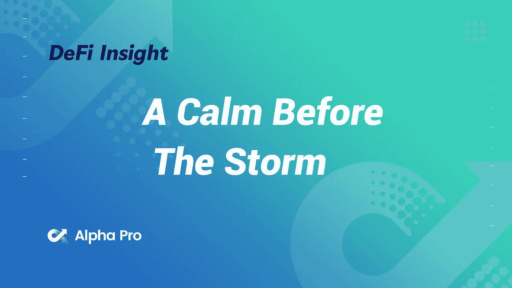
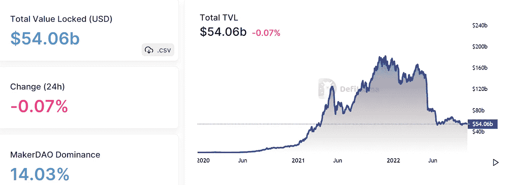
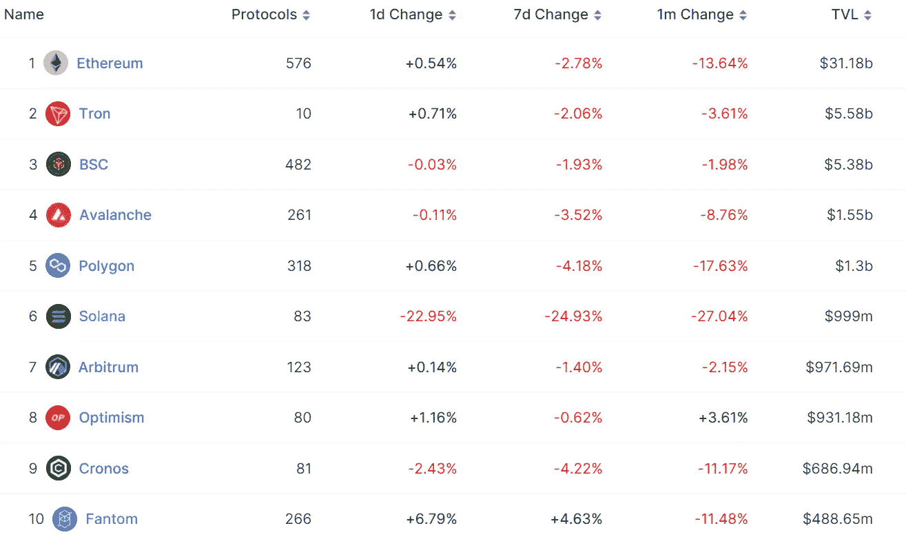
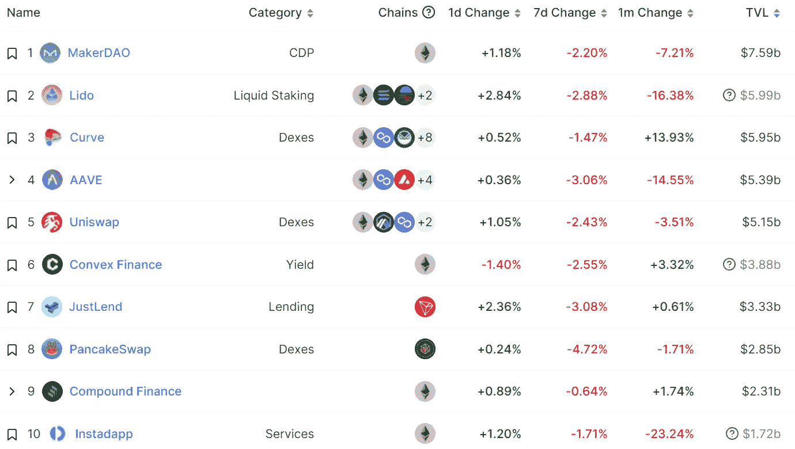
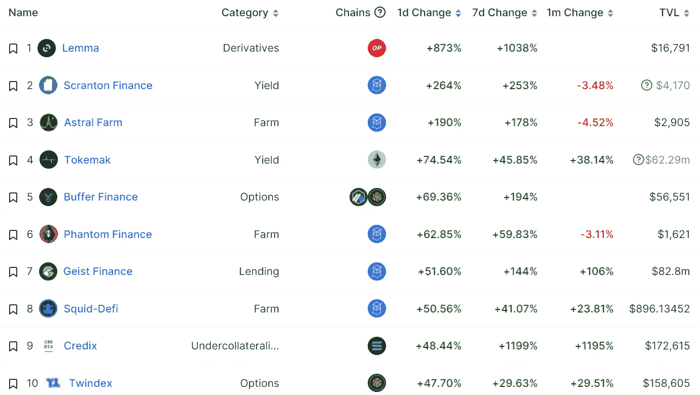
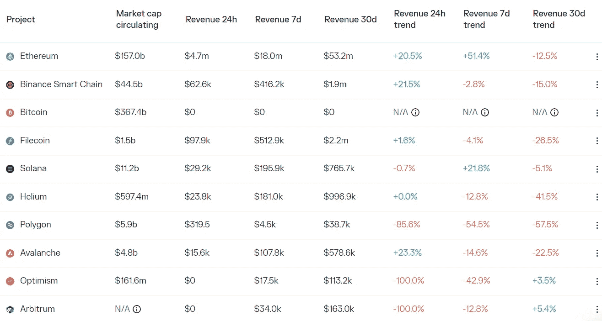
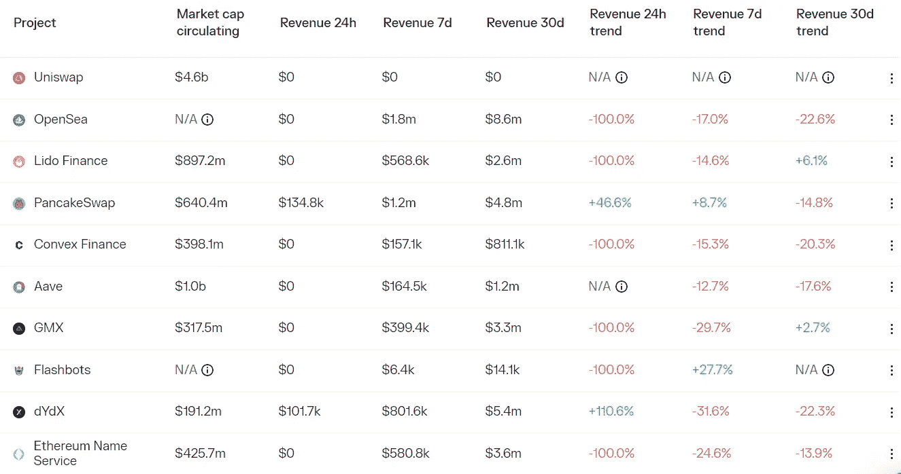

# 暴风雨前的平静

> 原文：<https://medium.com/coinmonks/defi-insight-a-calm-before-the-storm-64f6480c2bd3?source=collection_archive---------14----------------------->

2022 年 10 月 12 日

*今日 DeFi 数据&由 DeFi Insight 为您带来的新闻*

> *"* 在高度波动的传统市场背景下，比特币价格最近表现出显著的相对强势。几个宏观指标表明，比特币投资者正在建立一个可能是熊市的底部，与之前的周期低点有许多相似之处。
> 
> 网络盈利能力还没有达到与过去周期相同的严重财务困难水平，但是对丢失和长期滞留硬币的调整可以解释这种差异的合理部分。
> 
> 在许多方面，许多连锁指标、市场结构和投资者行为模式都是教科书熊市底部的要点。缺少的一个主要部分是持续时间，历史表明，在完全恢复之前，可能还有几个月的时间。*“@*[*来源*](https://insights.glassnode.com/the-week-onchain-week-41-2022/)

# 最新消息

## 链条

**[BNB](https://cointelegraph.com/news/bnb-smart-chain-to-hard-fork-following-100m-exploit)智能链在 1 亿美元漏洞利用之后走向硬分叉**

## **指数/交易所/AMM**

****,**索拉纳 DeFi 平台芒果亏损超过1 亿美元**

****[芒果](https://app.realms.today/dao/DPiH3H3c7t47BMxqTxLsuPQpEC6Kne8GA9VXbxpnZxFE/proposal/3WZ5DpZXDvNAK4JwPS1HDPzSinEJUGpBC4XXx9vPtnVS)黑客提议:用国库 7000 万美元偿还坏账，如果批准的话返还部分代币****

## ****贷款****

****山姆·班克曼对 FTX 是否会出价进行回避****

## ****打桩****

******Sky Mavis 下注超过 1100 万 [AXS 代币](https://www.theblock.co/post/176222/sky-mavis-to-stake-over-11-million-axs-tokens)******

## ******支付******

********[River Financial](https://www.coindesk.com/tech/2022/10/11/river-financial-announces-payment-gateway-for-bitcoins-multi-asset-upgrade/)为比特币的多资产升级提供支付网关********

## ******钱包******

********Google now 显示以太坊[钱包余额](https://www.theblock.co/post/176153/google-now-showing-ethereum-wallet-balances)********

## ******政策与法规******

********美国财政部对交易平台 [Bittrex](https://home.treasury.gov/system/files/126/20221011_bittrex.pdf) 采取两项执法行动，罚款 2400 万美元和 2900 万美元********

******CFTC 主持人:不要指望加密技术会成为监管的“免费通行证”******

## ******NFT******

********[BAYC 创始人](https://www.theblock.co/post/176301/bayc-creator-yuga-labs-faces-sec-probe-bloomberg?utm_source=twitter&utm_medium=social)宇迦实验室面临 SEC 调查********

********,**OpenSea 于[雪崩日](https://techcrunch.com/2022/10/11/opensea-launches-nft-marketplace-on-avalanche/)推出 NFT 市场******

******NFT 市场 [Quix](https://twitter.com/qx_app/status/1579926590821085185) 推出乐观 NFT 桥，允许用户在乐观的基础上交易以太坊 NFT******

## ******观点******

********[孙正义](https://www.coindesk.com/business/2022/10/11/justin-sun-optimistic-about-cryptos-return-to-china-addresses-huobi-acquisition/)【看好】Crypto 回归中国，地址火币收购********

# ******数据和分析******

## ******锁定的总价值(TVL)******

******目前全网 DeFi 总锁定量为 540.6 亿美元，24 小时下降 0.07%。******

************

## ******TVL 评出的十大连锁酒店******

************

## ******|最新 TVL 十大项目******

************

## ******|过去 24 小时内 TVL 增长的前 10 个项目******

************

## ******协议收入******

## ******|累计总收入最高的项目(24H)_ 区块链(L1)******

************

## ******|累计总收入最高的项目(24H) _Dapps (L2)******

************

# ******深潜******

********[**的状态 DeFi Perp 交流**](https://defining.substack.com/p/the-state-of-defi-perp-exchanges?utm_source=%2Finbox&utm_medium=reader2)********

**** [## DeFi Perp 交换的状态

### 第二层已经成为 DeFi perp 协议的主要平台。该领域的发展和创新已经…

defining.substack.com](https://defining.substack.com/p/the-state-of-defi-perp-exchanges?utm_source=%2Finbox&utm_medium=reader2) 

**[**宇宙**](https://newsletter.banklesshq.com/p/how-to-get-started-on-cosmos?utm_source=%2Finbox&utm_medium=reader2) 如何上手**

** [## 如何开始使用 Cosmos

### 我们已经为无银行高级会员更新了空投指南！探索数十个机会，赢取下一个大…

newsletter.banklesshq.com](https://newsletter.banklesshq.com/p/how-to-get-started-on-cosmos?utm_source=%2Finbox&utm_medium=reader2) 

**[**可停财务**](https://newsletter.banklesshq.com/p/stoppable-finance-lite?utm_source=%2Finbox&utm_medium=reader2)**

** [## 可停止融资

### 在 Galxe 活动中探索和赢取🌌亲爱的无银行国家，索拉纳在 9 月 21 日又遭遇了一次网络中断…

newsletter.banklesshq.com](https://newsletter.banklesshq.com/p/stoppable-finance-lite?utm_source=%2Finbox&utm_medium=reader2)** 

# **报告**

****Defi spot light**[**Q3 2022**](https://coinshares.com/research/defi-spotlight-q3-2022)_ coin shares**

> **在这份报告中，我们着眼于 DeFi 内整个加密行业的收入演变。以下是报告要点，便于浏览本期 DeFi 聚焦。**
> 
> **第三季度锁定的总价值(TVL)基本持平，增长 3%至 630 亿美元。**
> 
> **DeFi 第三季度的收入为 2 亿美元，环比下降 44%。**
> 
> **正如我们在《Q1 报告》中预测的那样，第 2 层协议正在加速衍生产品交易所的发展。**

****[**状态雪崩**](https://messari.io/report/state-of-avalanche-q3-2022)**Q3 2022**_ 梅萨里****

******[**稳定链**](https://messari.io/report/stablecoin-dominance-on-chain-s) **支配链** _messari******

******2012 年第三季度区块链风险投资** [**资助**](https://www.theblockresearch.com/q322-blockchain-venture-funding-and-ma-recap-176212) **和 M &一次重述** _theblockresearch****

******分析** [**公开密码公司的股东**](https://www.theblockresearch.com/analyzing-shareholders-of-public-crypto-firms-175985)**_ the block research******

********关于:********

****DeFi Insight 是顶级 DeFi 和加密新闻和更新的来源。****

******https://twitter.com/AlphaPro_io 推特:******

********https://medium.com/feed/@alphapro.project**RSS:******

******提供的信息应被视为发展新闻，而不是投资建议。******

> ******交易新手？尝试[加密交易机器人](/coinmonks/crypto-trading-bot-c2ffce8acb2a)或[复制交易](/coinmonks/top-10-crypto-copy-trading-platforms-for-beginners-d0c37c7d698c)************