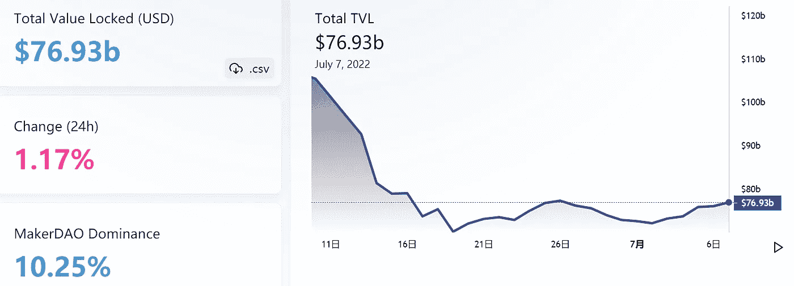
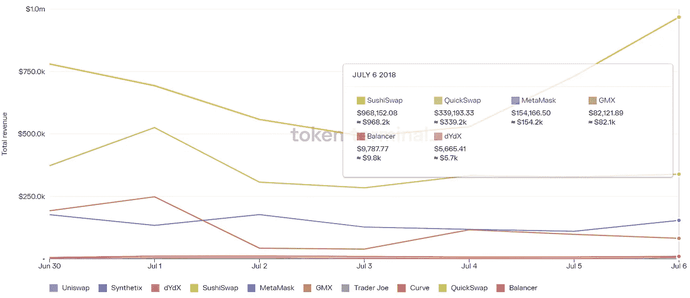

# DeFi Insight |评估第 1 层的框架

> 原文：<https://medium.com/coinmonks/defi-insight-a-framework-for-evaluating-layer-1s-d5c9104b70c8?source=collection_archive---------17----------------------->

2022 年 7 月 7 日

*今日 DeFi 数据&由 DeFi Insight 为您带来的新闻*

> *你怎么能评价这些该死的东西？合适的框架是什么？在评估第 1 层环境时，投资者应该寻找哪些关键指标和基本面？*
> 
> *第 1 层—特别是智能合同网络—有大量可能导致增长的变量。*
> 
> *但是我们可以寻找哪些可以量化的因素呢？*。”@* [*来源*](https://newsletter.banklesshq.com/p/a-framework-for-evaluating-layer)*

# *最新消息*

## *贷款*

***[摄氏度](https://blockworks.co/celsius-reorganizes-board-of-directors-amid-liquidity-issues/)因流动性问题重组董事会***

*****/**[open leverage](https://twitter.com/OpenLeverage/status/1544872693434302466)的$OLE Airdrop 可在世界协调时今天上午 10 点领取***

*****[block fi](https://cryptoslate.com/blockfi-confirms-it-holds-50-of-client-funds-in-short-term-positions-with-10-in-collateral/)确认其持有 50%的短期头寸客户资金，10%为抵押品*****

## *****外汇*****

*****FTX 的衍生品交易面临来自华尔街的抵制*****

*****加密交易所取消收取“不活动费”的计划*****

*****萨姆·班克曼-弗里德的阿拉米达研究公司欠破产的航海家公司 3 . 77 亿美元*****

## *****稳定币*****

*******、**我们如何[将风险最小化](https://www.circle.com/blog/usdc-trust-transparency-minimizing-risk)*****

## *****|合并*****

*******[以太坊测试网合并](https://cointelegraph.com/news/sepolia-testnet-merge-mostly-successful-hiccups-will-not-delay-the-merge)大部分成功——“打嗝不会延迟合并。”*******

## *******保险*******

*******MCB 称，联邦存款保险公司的保险不能保护航海家免于破产*******

## *******支付*******

*********埃隆·马斯克的[无聊公司](https://edition.cnn.com/2022/07/06/business/boring-company-dogecoin-vegas/index.html)会让你花钱和 Dogecoin 一起兜风*********

## *******采矿*******

*********/**[马拉松数字](https://bitcoinmagazine.com/business/will-marathon-digital-join-other-miners-in-selling-bitcoin-ceo-weighs-in)会加入其他矿工卖比特币的行列吗？首席执行官参与进来*******

*******[Argo 区块链](https://www.proactiveinvestors.com/companies/news/986855/argo-blockchain-steps-up-bitcoin-mining-output-hires-derivatives-trader-986855.html)加大比特币开采产量，雇佣衍生品交易员*******

## *******政策与法规*******

*******英国将于 8 月出台稳定资本的立法*******

## *******NFT*******

*********[魔法伊甸园](https://www.prnewswire.com/news-releases/magic-eden-partners-with-tomorrowland-to-revolutionize-festival-experience-301581618.html)与明日世界合作革新节日体验*********

*******巴勒猿俱乐部的创始人 NFT 可能会被判入狱 40 年*******

## *******基金*******

*******专注于游戏的 [Konvoy Ventures](https://www.pymnts.com/blockchain/2022/gaming-focused-konvoy-ventures-raises-150m-with-eye-on-blockchain/) 着眼于区块链融资 1.5 亿美元*******

*******昂多金融公司通过公开发售代币筹集了 1000 万美元*******

*******社交基础设施初创公司[intross](https://www.forbes.com/sites/frederickdaso/2022/07/06/social-infrastructure-startup-intros-raises-13m-to-automate-community-member-introductions/?sh=21f960cf5668)筹集了 130 万美元来实现社区成员介绍的自动化*******

*********早期法德风投 [XAnge](https://sifted.eu/articles/xange-vc-220m-fund-early-stage/) 融资€2.2 亿*********

> *******交易新手？试试[密码交易机器人](/coinmonks/crypto-trading-bot-c2ffce8acb2a)或[复制交易](/coinmonks/top-10-crypto-copy-trading-platforms-for-beginners-d0c37c7d698c)*******

# *******数据和分析*******

## *******锁定的总价值(TVL)*******

*******目前全网 DeFi 总锁定量为 769.3 亿美元，24 小时增长 1.17%。*******

**************

## *******TVL 评出的十大连锁酒店*******

**************

## *******|最新 TVL 十大项目*******

**************

## *******|过去 24 小时内 TVL 增长的前 10 个项目*******

**************

## *******协议收入*******

## *******|累计总收入最高的项目(24H)_ 区块链(L1)*******

**************

## *******|累计总收入最高的项目(24H) _Dapps (L2)*******

**************

## *******|前 10 大交易所的每日收入*******

**************

## *******|十大贷款协议的每日收入*******

**************

# *******深潜*******

*********市场脉搏:**[**ETH 2.0**](https://insights.glassnode.com/market-pulse-eth-stakers-underwater/)**赌注下在水下*********

***** [## 市场脉搏:ETH 2.0 赌注下在水下

### 以太坊 2.0 升级是数字资产行业最受期待和关注的事件之一。然而…

insights.glassnode.com](https://insights.glassnode.com/market-pulse-eth-stakers-underwater/) 

**[**NFTs 崩溃，**](https://tokeninsight.com/en/research/market-analysis/nfts-crashed-now-what) **现在什么情况？****

** [## TokenInsight _ 区块链评级 _ 区块链投资研究 _ 加密货币评级

### 作为一家数据和技术驱动的区块链技术公司，TokenInsight 提供专业的区块链数据、评级…

tokeninsight.com](https://tokeninsight.com/en/research/market-analysis/nfts-crashed-now-what) 

**一个** [**假工作机会**](https://www.theblock.co/post/156038/how-a-fake-job-offer-took-down-the-worlds-most-popular-crypto-game) **如何搞垮世界上最流行的密码游戏**

 [## 一份虚假的工作邀请如何搞垮世界上最流行的密码游戏

### 一名工程师对加入一家后来证明是虚构的公司的兴趣导致了 3 月份 5.4 亿美元的 Axie Infinity…

www.theblock.co](https://www.theblock.co/post/156038/how-a-fake-job-offer-took-down-the-worlds-most-popular-crypto-game) 

# 报告

**[**索拉纳**](https://coinshares.com/research/solana-asset-highlight-1) **资产亮点** _coinshares**

> **Solana 的目标是成为一个单一的、抵制审查的网络，以最大限度地增加能够扰乱信息流、完全复制所有信息并尽快将每条信息传播给任何地方的任何人的独立团体的数量。**
> 
> **这份报告简化和澄清了索拉纳是什么和它做什么；索拉纳试图解决的问题及其推出以来的发展；它的优势和劣势，机会和威胁。此外，它还涵盖了协议背后的人员、协议中的核心组件和网络参与者。**

****[**Crypto 熊市回顾**](https://messari.io/article/crypto-bear-market-retrospective-lessons-learned-and-projects-built) **:吸取的教训和建立的项目** _messari****

******比特币的现状**[**ASIC**](https://www.theblockresearch.com/current-state-bitcoin-asic-marketplace-155013)**market place**_ The block research****

******[**ENS**](https://members.delphidigital.io/reports/ens-ninas-super-cool-world-degods)**、妮娜的超酷世界& DeGods** _delphidigital******

******[**索拉纳**](https://mirror.xyz/0x9b7e7c5B53081d0C6d09b91F13783D58B772b011/9DbFGo2Xp7WPRyx0J9MMDrTEePpFnEArr5vBLcvM5UI) **项目收入周报 2022 年 7 月 7 日** _AlphaPro******

******关于:******

****DeFi Insight 是顶级 DeFi 和加密新闻和更新的来源。****

******https://twitter.com/AlphaPro_io 推特:******

********❤RSS:**[**https://medium.com/feed/@alphapro.project**](https://medium.com/feed/@alphapro.project)******

****提供的信息应被视为发展新闻，而不是投资建议。***********