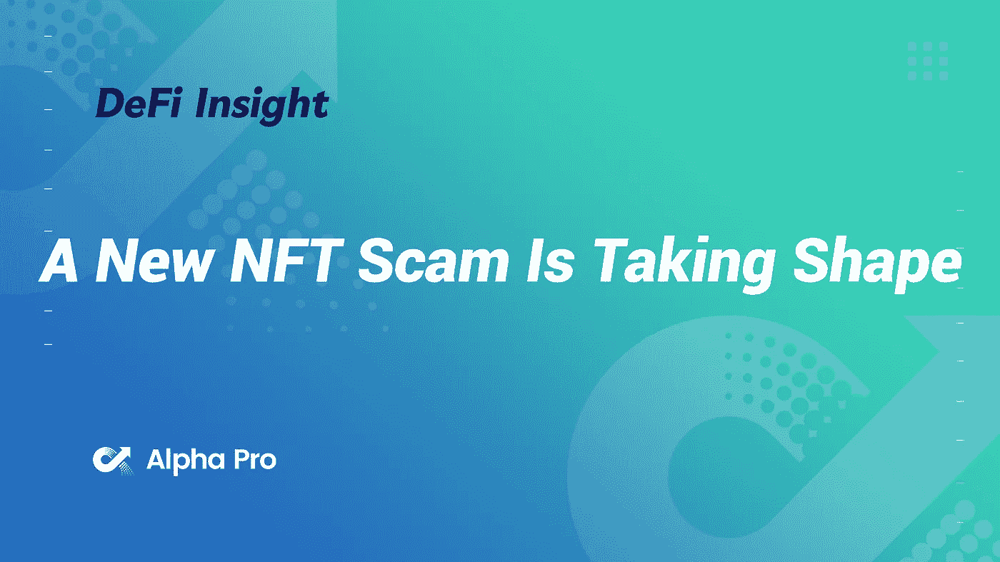

# 一个新的 NFT 骗局正在成形

> 原文：<https://medium.com/coinmonks/defi-insight-a-new-nft-scam-is-taking-shape-158cee450fc8?source=collection_archive---------8----------------------->

2022 年 7 月 8 日

*今日 DeFi 数据&由 DeFi Insight 为您带来的新闻*

> *"* 德根元是 NFT 空间的当前趋势，团队将像免费的造币厂一样启动项目，并提供很少或没有路线图。这种趋势是由 goblintownwtf 这样的项目推广开来的。这种价值支撑在熊市中很好，因为铸币没有财务风险。
> 
> 骗子们利用了这一点。相反，他们现在正在创造 FOMO 诱导免费的“德根”薄荷项目，欺骗你让他们访问你的钱包转移你的 NFT。*“@*[*来源*](https://twitter.com/Montana_Wong/status/1545081928017031168)

# 最新消息

## 贷款

**[摄氏度](https://cryptobriefing.com/celsius-faces-lawsuit-from-former-partner-keyfi/)面临前合伙人 KeyFi 的诉讼**

## **外汇**

****[Bit2Me](https://www.coindesk.com/business/2022/07/07/spanish-crypto-exchange-bit2me-to-double-headcount-make-three-acquisitions/)要加倍人手，进行三次收购****

******[罗宾汉](https://mobile.twitter.com/RobinhoodApp/status/1545062191874834433)启用密码资产的存取******

## ******稳定币******

******必须推出名为 [GHO](https://cointelegraph.com/news/aave-to-launch-overcollateralized-stablecoin-called-gho) 的超额抵押稳定币******

## ******经纪人******

********[航海家数码有限公司](https://www.prnewswire.com/news-releases/voyager-digital-ltd-provides-update-on-listing-of-its-shares-301582755.html)提供其股票上市的最新情况********

## ******第二层******

******闪电网 6 月日均容量创历史新高******

## ******支付******

********[密码支付处理器](https://www.cryptoglobe.com/latest/2022/07/crypto-payments-processor-considers-shib-burning-mechanism-adds-babydoge-support/?utm_source=blockworks-research)考虑$SHIB 烧录机制，增加$BABYDOGE 支持********

## ******甲骨文******

********宇宙基地 [Umee](https://blockworks.co/cosmos-based-umee-lines-up-first-ibc-price-oracle/) 排第一 IBC 价格甲骨文********

## ******采矿******

********[比特币矿业公司](https://decrypt.co/104674/bitcoin-mining-company-compass-cuts-staff-by-15)指南针裁员 15%********

********/**[KyberSwap](https://www.altcoinbuzz.io/defi/kyberswap-makes-liquidity-mining-easier/)让流动性挖掘更容易******

## ****政策与法规****

****美国敦促日本削减在俄罗斯的加密货币业务****

## ****NFT****

******Affyn 的[“零代”NFTs](https://coinquora.com/affyns-generation-zero-nfts-become-2-polygon-collections-on-opensea/) 成为 Opensea 上的#2 多边形集合******

******在最寒冷的冬天，NFTs 和游戏依然完好无损******

******介绍我们新的工程副总裁马尔科·伊斯坎德******

> ******交易新手？尝试[加密交易机器人](/coinmonks/crypto-trading-bot-c2ffce8acb2a)或[复制交易](/coinmonks/top-10-crypto-copy-trading-platforms-for-beginners-d0c37c7d698c)******

## ******基金******

********[隐道](https://www.theblock.co/post/156379/hidden-road-announces-50-million-series-a-round-led-by-castle-island-ventures)宣布 5000 万美元 A 轮由城堡岛创投领投********

********[metag 3 ncy](https://www.einnews.com/pr_news/580238156/metag3ncy-raises-4-million-to-become-major-name-in-nft-and-web3-project-management)融资 400 万美元成为 NFT 和 Web3 项目管理的大牌********

## ******观点******

******T42 国会议员想要成立一个基金来帮助苦苦挣扎的加密投资者******

********密码需要各国一致的监管，[美国财政部称](https://www.bloomberg.com/news/articles/2022-07-07/crypto-needs-consistent-regulation-across-nations-treasury-says?srnd=cryptocurrencies-v2#xj4y7vzkg)********

********[菲律宾](https://forkast.news/headlines/philippines-think-tank-ban-on-binance/?utm_source=blockworks-research)智库呼吁禁止币安********

******俄罗斯银行提议在莫斯科证券交易所建立加密交易平台******

# ******数据和分析******

## ******锁定的总价值(TVL)******

******目前全网 DeFi 总锁定量为 782.7 亿美元，24 小时增长 1.31%。******

************

## ******TVL 评出的十大连锁酒店******

************

## ******|最新 TVL 十大项目******

************

## ******|过去 24 小时内 TVL 增长的前 10 个项目******

************

## ******协议收入******

## ******|累计总收入最高的项目(24H)_ 区块链(L1)******

************

## ******|累计总收入最高的项目(24H) _Dapps (L2)******

************

## ******|前 10 大交易所的每日收入******

************

## ******|十大贷款协议的每日收入******

************

# ******深潜******

********一个拟议中的** [**比特币价格新框架**](https://bitcoinmagazine.com/business/a-proposed-new-framework-for-the-bitcoin-price)******

****** [## 提议的比特币价格新框架

### 这是药物经济学、流行病学、药物政策和经济学博士维什瓦斯·加尔格的观点社论

bitcoinmagazine.com](https://bitcoinmagazine.com/business/a-proposed-new-framework-for-the-bitcoin-price) 

**[**以太坊报道**](https://newsletter.banklesshq.com/p/state-of-ethereum-report-q2-2022) **— Q2，2022 年****

** [## 以太坊报告- Q2，2022 年

### 亲爱的无银行的国家，不确定的时代，不久！这些天你到处都能看到它。恰当地说，Q2 2022 年奥运会是一次真正的…

newsletter.banklesshq.com](https://newsletter.banklesshq.com/p/state-of-ethereum-report-q2-2022) 

**[**最佳买入时机**](https://www.biznews.com/sponsored/2022/07/08/cryptocurrency-best-buying-opportunity) **在底部****

** [## 加密货币:最佳买入时机在底部

### 由 Jonty Sacks*古老的格言，“这不是关于时间的市场，而是关于时间的市场”，已被证明是正确的…

www.biznews.com](https://www.biznews.com/sponsored/2022/07/08/cryptocurrency-best-buying-opportunity)** 

# **报告**

****[**Crypto 冬血染夏**](https://members.delphidigital.io/reports/crypto-winter-bleeds-into-summer-monthly-chartbook) **—月度图表** _delphidigital****

> ****月度图表是我们关注的加密和市场的有趣图表和趋势的集合。本月的主题是:****
> 
> ****宏观前景——市场底部和宏观逆风****
> 
> ****加密市场评论——市场结构和连锁观察****
> 
> ****L1s、L2s 和 DeFi 分析****
> 
> ****NFTs 和游戏行业细分****

******[**DeFi 用户**](https://messari.io/article/defi-users-ethereum-lending) **:以太坊借贷** _messari******

******[**逐层发行 38**](https://www.theblockresearch.com/layer-by-layer-issue-38-cosmos-near-and-solana-156459) **:宇宙、近日点和索拉纳** _theblockresearch******

******[**Dapp 行业**](https://dappradar.com/blog/dapp-industry-report-q2-nfts-and-web3-games-keep-enduring-market-conditions-as-shockwaves-from-the-terra-collapse-reach-cefi-and-vcs) **报道 Q2** _dappradar******

******关于:******

****DeFi Insight 是顶级 DeFi 和加密新闻和更新的来源。****

******https://twitter.com/AlphaPro_io 推特:******

********❤RSS:**[**https://medium.com/feed/@alphapro.project**](https://medium.com/feed/@alphapro.project)******

****提供的信息应被视为发展新闻，而不是投资建议。************