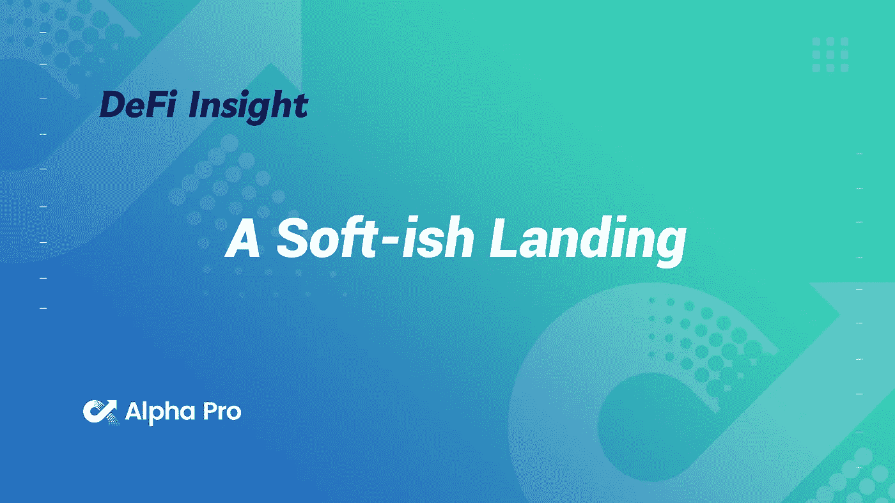
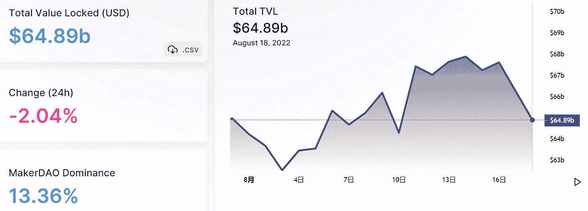
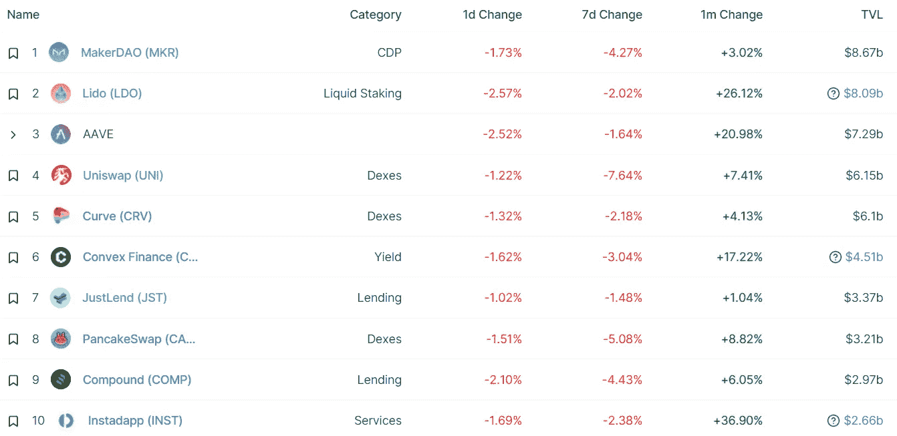
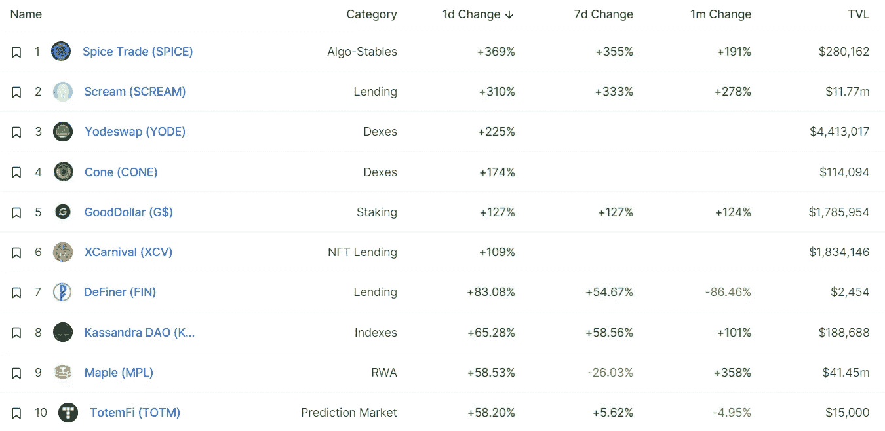
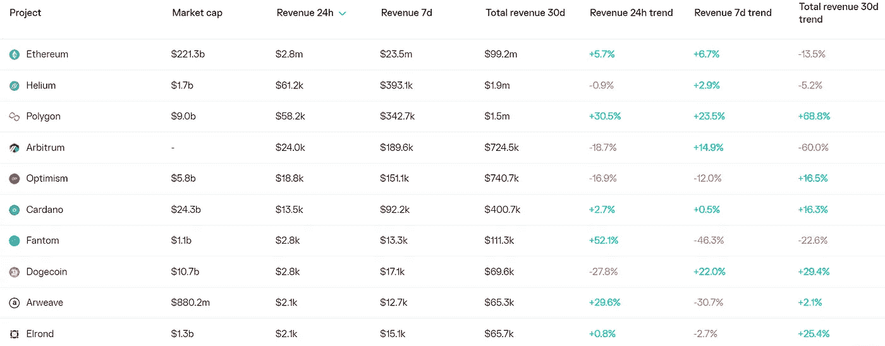
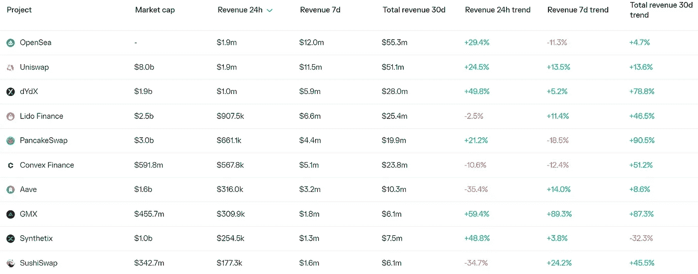
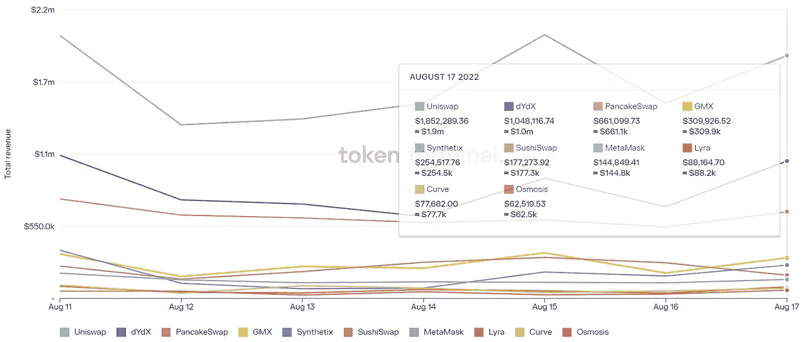
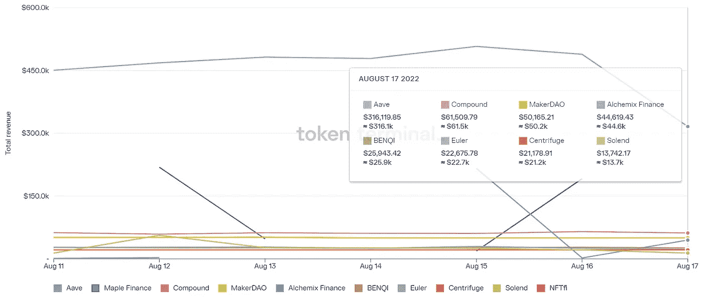

# DeFi Insight |软着陆

> 原文：<https://medium.com/coinmonks/defi-insight-a-soft-ish-landing-87a837c0fc9b?source=collection_archive---------15----------------------->

2022 年 8 月 18 日

*今日 DeFi 数据&由 DeFi Insight 为您带来的新闻*

> *"* 在过去的一周里，我们看到传统市场对经济中通胀放缓的第一个迹象做出了积极反应，加密也继续跟进。
> 我目前对未来几周的观点是，机构已经吸收了专业机构最糟糕的抛售，因此现在我们将看到一些机构被砍掉，因为其他机构在合并前得到了定位。我认为我们不太可能很快看到新低，但对冲 BTC 是最好的做空方式，因为它缺乏叙事性，相对于市场其他股票普遍疲软。*“@*[*来源*](https://blknoiz06.substack.com/p/a-soft-ish-landing)

# 最新消息

## 贷款

索拉纳最大的违约贷款人正倾向于“未经许可”的贷款市场

## 外汇

比特币基地首席执行官:如果受到监管机构的威胁，我们会关闭以太坊赌博

**[霍比](https://beincrypto.com/huobi-halts-derivative-trading-in-new-zealand/)停止在纽西兰的衍生品交易**

## **交叉链**

**复苏之路**

## **桥梁**

****[Celer Network](https://www.bsc.news/post/celer-network-shuts-down-multi-chain-bridge-over-dns-exploit)关闭 DNS 漏洞利用的多链桥****

## ****第二层****

******、** Catheon Gaming 和 [Polygon](https://www.businesswire.com/news/home/20220817005765/en) 宣布首选区块链游戏合作伙伴****

## ****投资组合****

****一个秘密的冬季国王想要重振这个行业****

## ****链条****

****Sky Mavis '[Ronin](https://www.theblock.co/post/164182/sky-mavis-ronin-sidechain-expands-to-17-validators-to-boost-security?utm_source=cryptopanic&utm_medium=rss)side chain 扩展到 17 个验证器以提高安全性****

## ****空投****

******我们首个 10，000 NFTs 的[免费空投将于 9 月 2 日进行](https://mobile.twitter.com/meta_hollywood/status/1560038897144446976)******

## ******| MERGE******

********[合并 Mainnet](https://twitter.com/TimBeiko/status/1559970287256449024?s=20&t=N0Y8rAsgj8cHnfkLxEd6Eg) 准备情况检查表全部签出********

## ******| MINING******

********俄罗斯比特币挖矿公司去年用“1.25 千兆瓦”为钻机供电，是 2020 年的两倍——报告********

## ****| POLICY&REGULATION****

******加密货币**安大略省加密货币交易所对购买替代币设定[3 万加元的年度限额](https://cointelegraph.com/news/ontario-crypto-exchanges-impose-30k-annual-limit-on-altcoin-buys)****

## ****| NFT****

******[ENS 覆盖了 200 万个被创造出来的域名](https://cryptoslate.com/ens-reaches-2-million-names-created-top-holder-owns-35k-domains/)——顶级域名持有者拥有 35k 个域名******

********会议**推出 [Burn NFTs](https://phantom.app/blog/introducing-burn-nfts)******

## ****| FUND****

******募集**资金[部分更名](https://decrypt.co/107652/fractional-rebrands-raises-20m-expand-collective-nft-ownership)募集 2000 万美元扩大 NFT 集体所有制****

****金融科技公司 FOMO 薪酬筹集 1300 万美元，推动业务增长并勘探 CBDC 项目****

# ****数据与分析****

## ****总值锁定(TVL)****

****目前 DeFi 在整个网络上的总锁定量为 648.9 亿美元，24 小时内下降 2.04%。****

********

## ****| TOP 排名前 10 的连锁店****

********

## ****|最新 TVL 十大项目****

********

## ****|过去 24 小时 TVL 经济增长排名前 10 名的项目****

********

## ****协议收入****

## ****|按累计总收入列出的最重要项目(24H)_ 区块链(L1)****

********

## ****|按累计总收入列出的顶级项目(24H)_ dapp(L2)****

********

## ****|十大交易所的每日收入****

********

## ****|十大贷款协议的每日收入****

********

# ****DEEP DIVE****

******[**屈膝**](https://defining.substack.com/p/bend-the-knee?utm_source=%2Finbox&utm_medium=reader2)******

**** [## 屈膝

### 我们都听过特洛伊木马的故事。特洛伊木马的真正危险在于，它们会让你感到…

defining.substack.com](https://defining.substack.com/p/bend-the-knee?utm_source=%2Finbox&utm_medium=reader2) 

**如何从** [**桥到 doegechin**](https://www.cryptopolitan.com/how-to-bridge-to-dogechain/)**？**

 [## 怎么桥到 Dogechain？隐波利坦

### 将 Dogecoin 连接到 Dogechain 的过程非常简单，只要几个简单的步骤就可以完成，如果…

www.cryptopolitan.com](https://www.cryptopolitan.com/how-to-bridge-to-dogechain/) 

**[**合并**](https://newsletter.banklesshq.com/p/is-the-merge-priced-in?utm_source=%2Finbox&utm_medium=reader2) **定价了吗？****

** [## 合并是否已计入价格？

### 使用代码“无银行”获得特价！亲爱的无银行国家，这是我们合并以来最好的价格报告…

newsletter.banklesshq.com](https://newsletter.banklesshq.com/p/is-the-merge-priced-in?utm_source=%2Finbox&utm_medium=reader2) 

**[**区块链技术**](https://hackernoon.com/how-blockchain-technology-can-improve-devops-practices-in-web3) **如何改善 Web3 中的 DevOps 实践****

** [## 区块链技术如何改善 Web3 | HackerNoon 中的 DevOps 实践

### 信息技术专家，在应用程序设计和体系结构方面有 25 年以上的专业经验。虽然在其…

hackernoon.com](https://hackernoon.com/how-blockchain-technology-can-improve-devops-practices-in-web3)** 

# **报告**

****[**DeFi Yields**](https://coinshares.com/research/defi-yields-101)**101**_ coin shares****

> ****DeFi 收益率与链上活动密切相关，并因区块链、协议和资产类型而异。然而，并不是所有的收益都是一样的，因为有些收益会增加风险。****
> 
> ****分散金融(DeFi)生态系统的平均收益率约为 4.5%。
> 收益主要来自向分散式交易所(dex)和借贷协议提供流动性。
> 收益往往是代币发行和部分协议收入的组合。****

******[**DeFi 治理综述**](https://www.theblockresearch.com/defi-governance-roundup-a-focus-on-protocol-growth-163814) **:关注协议增长** _theblockresearch******

******[**IoTeX**](https://messari.io/report/iotex-connecting-real-world-activity-to-web3)**:将现实世界的活动连接到 Web3** _messari******

******[**DeFi 固定收益**](https://members.delphidigital.io/reports/the-path-forward-for-defi-fixed-income-and-yield-tokens) **和收益令牌** _delphidigital 的前进道路******

******[**Animoca 品牌**](https://tokeninsight.com/en/research/reports/what-can-we-learn-from-animoca-brands-66-investments-in-2022-h1)**【66】2022 年投资 H1** _tokeninsight******

******[**索拉纳项目收益周报**](https://mirror.xyz/0x9b7e7c5B53081d0C6d09b91F13783D58B772b011/tLQBDrhjBA8e2qo28r80c8FQlmJz5XXOnW3AybBaAR0)**8/18/2022**_ Alpha Pro******

******关于:******

****DeFi Insight 是顶级 DeFi 和加密新闻和更新的来源。****

******https://twitter.com/AlphaPro_io 推特:******

********❤RSS:**[**https://medium.com/feed/@alphapro.project**](https://medium.com/feed/@alphapro.project)******

****提供的信息应被视为发展新闻，而不是投资建议。****

> ****交易新手？试试[加密交易机器人](/coinmonks/crypto-trading-bot-c2ffce8acb2a)或[复制交易](/coinmonks/top-10-crypto-copy-trading-platforms-for-beginners-d0c37c7d698c)**********