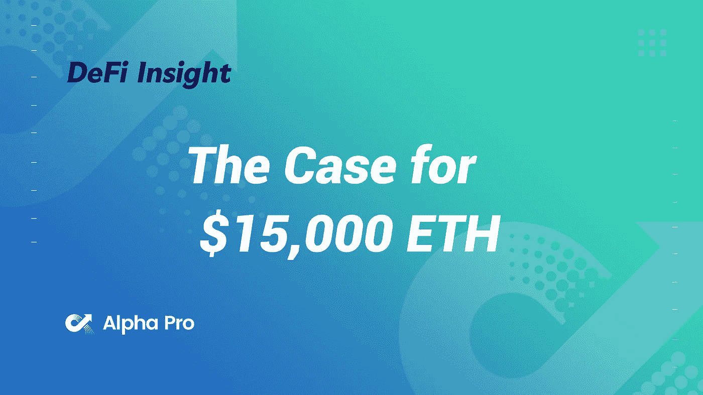
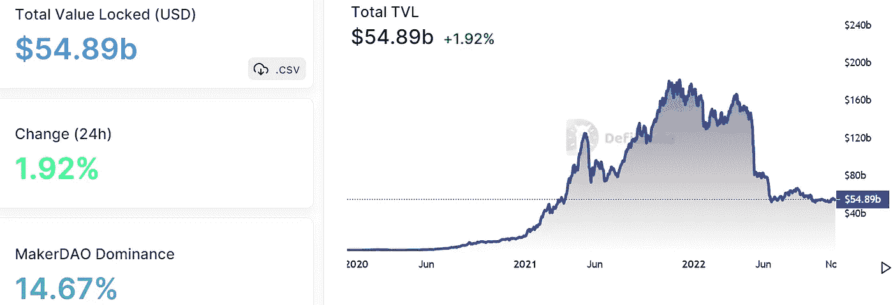
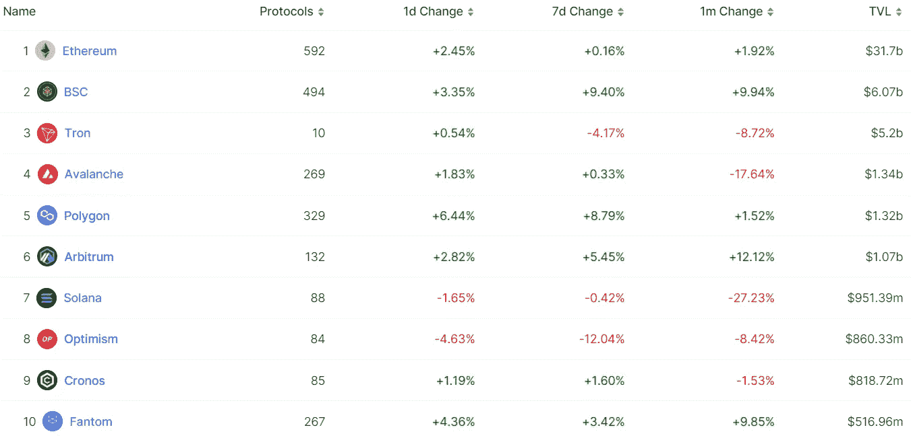
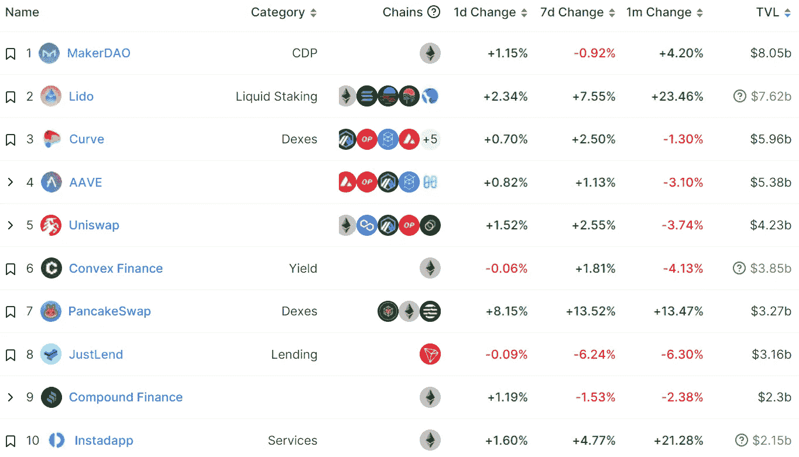
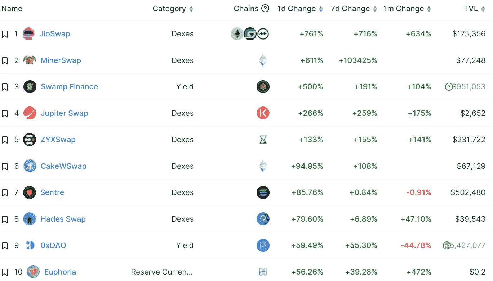
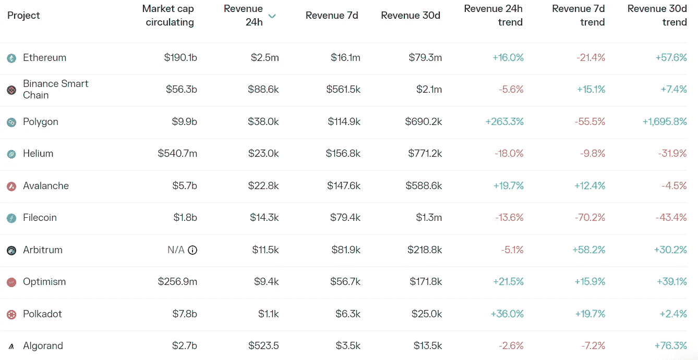
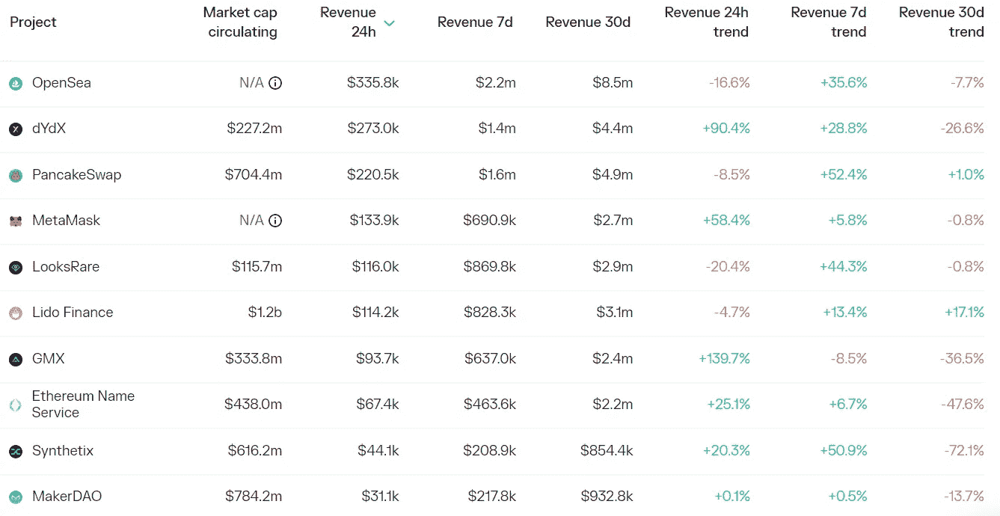

# DeFi Insight |这十年来 ETH 的风险基金估值模型

> 原文：<https://medium.com/coinmonks/defi-insight-a-venture-funds-valuation-model-for-eth-this-decade-c0328d4d22ff?source=collection_archive---------24----------------------->

2022 年 11 月 4 日

*今日 DeFi 数据&由 DeFi Insight 为您带来的新闻*

> *随着熊市继续打压加密投资组合，投资者试图更清楚地了解他们到底在赌什么。*
> 
> *众所周知，有很多理由押注以太坊，但量化其现在和未来的价值并不总是那么简单。*
> 
> *这就是我们今天想要做的。*
> 
> *我们联系了投资公司 Archetype 的人来分析他们对以太坊估值的详细模型，并深入展示了该模型对网络发展方向的最保守和最乐观的看法。*“@*[*来源*](https://newsletter.banklesshq.com/p/the-case-for-15000-eth?utm_source=%2Finbox&utm_medium=reader2)*

# *最新消息*

## *第一层*

***、**多链与 [Aptos Mainnet](https://multichainorg.medium.com/multichain-integrates-with-aptos-mainnet-for-cross-chain-interoperability-637cdf653d3a) 集成*

***介绍[穗](https://sui.io/resources-sui/introducing-sui-payment-transaction-types/)支付交易类型***

## ***第二层***

*****、**德尔福数码:自 Nitro 网络升级以来，Arbitrum 的周交易笔数已占[以太坊交易总数的 62%](https://members.delphidigital.io/reports/arbitrum-activity-accelerates-after-the-nitro-upgrade?utm_campaign=Delphi%20Daily&utm_medium=email&_hsmi=232144614&_hsenc=p2ANqtz--LGURJ-CGaB1NEozwzZarcrJ7o4CQ32PdJMTWGG8aJjiXnysmw0oe6cnL7qUwsR9SkU7kar3RmW0fmzGLJyO)***

## ***指数/交易所/AMM***

*****[**PancakeSwap**](https://twitter.com/PancakeSwap/status/1588078819805732864?s=20)**已经在 Aptos 上启动了交换功能*******

*********第三季度净收入 5.76 亿美元，环比下降 28%，净亏损约 5.45 亿美元— [比特币基地](https://s27.q4cdn.com/397450999/files/doc_financials/2022/q3/Q32022-Shareholder-Letter.pdf)*********

## *******稳定币*******

*********支付处理器[剥离](https://www.coindesk.com/business/2022/11/03/stripe-payments-processor-dabbling-in-crypto-cuts-1000-jobs-bloomberg/)裁员 1000 余人*********

*********[圈子](https://www.coindesk.com/business/2022/11/03/circle-begins-putting-reserves-into-new-blackrock-fund/)开始将储备投入新的贝莱德基金*********

## *******桥梁*******

*********[AirDAO](https://www.theblock.co/post/182643/airdao-launches-ethereum-cross-chain-bridge-for-its-layer-1-network?utm_source=twitter&utm_medium=social)为其第一层网络推出以太坊跨链桥*********

## *******衍生产品*******

*********,**一个拿 [dYdX 刀的](https://dydx.foundation/blog/a-take-on-the-dydx-daos-near-future)近期*******

## *****钱包*****

*****马斯克领导下的 Twitter 产品路线图*****

## *****|令牌*****

*******/**[面具](https://mobile.twitter.com/lookonchain/status/1588085982284242944)团队在过去的 7 天里已经向币安等交易平台转移了 250 万张面具*****

*****在$GALA 攻击事件中，**smart money[套利](https://twitter.com/lookonchain/status/1588412290663321601)近 650 万美元，甚至超过攻击者的利润*******

## *******NFT*******

*******北海巨妖的 NFT 市场进入测试阶段*******

*******BAYC 的所有者宇迦实验室:元宇宙 NFT 开放标准“很快”就会到来*******

*********web 3 开发平台[炼金术](https://twitter.com/AlchemyPlatform/status/1588201140092444672?s=20&t=EzQrrjUJLL-O3ARn6JB5EQ)推出 NFT 白名单平台留兰香*********

## *******政策与法规*******

*********、**加拿大宣布[加密、稳定币](https://www.coindesk.com/policy/2022/11/03/canada-announces-crypto-stablecoin-consultation-in-new-budget-statement/)磋商新预算报表*******

## *****基金*****

*******、**独家: [FTX 风险投资](https://fortune.com/2022/11/03/exclusive-ftx-ventures-bets-on-web3-social-media-with-investment-in-aaves-lens-protocol/)押注 Web3 社交媒体，投资 Aave 的 Lens 协议*****

# *****数据和分析*****

## *****锁定的总价值(TVL)*****

*****目前全网 DeFi 总锁定量为 548.9 亿美元，24 小时增长 1.92%。*****

**********

## *****TVL 评出的十大连锁酒店*****

**********

## *****|最新 TVL 十大项目*****

**********

## *****|过去 24 小时内 TVL 增长的前 10 个项目*****

**********

## *****协议收入*****

## *****|累计总收入最高的项目(24H)_ 区块链(L1)*****

**********

## *****|累计总收入最高的项目(24H) _Dapps (L2)*****

**********

# *****深潜*****

*******[**模块化区块链**的市场机遇](https://doseofdefi.substack.com/p/the-market-opportunity-of-modular?utm_source=%2Finbox&utm_medium=reader2)*******

***** [## 模块化区块链的市场机遇

### 随着合并的完成，以太坊的长期可伸缩性路线图已经确定。有了这个，它就有了…

doseofdefi.substack.com](https://doseofdefi.substack.com/p/the-market-opportunity-of-modular?utm_source=%2Finbox&utm_medium=reader2) 

**规模化、模块化与问题** [**区块链**](https://theknower.substack.com/p/scaling-modularity-and-the-question?utm_source=%2Finbox&utm_medium=reader2) **长寿**

 [## 规模化、模块化和区块链长寿问题

### 声明:这些都不是财务建议，我没有经济动机去写这些，我也不…

theknower.substack.com](https://theknower.substack.com/p/scaling-modularity-and-the-question?utm_source=%2Finbox&utm_medium=reader2) 

**insta gram 增加** [**NFT 工具包**](https://metaversal.banklesshq.com/p/instagram-adds-nft-toolkit?utm_source=%2Finbox&utm_medium=reader2)

 [## Instagram 增加了 NFT 工具包📱

### 亲爱的无银行国家，没多久这种猜测就被证实了，正如本周马克·扎克伯格的元…

metaversal.banklesshq.com](https://metaversal.banklesshq.com/p/instagram-adds-nft-toolkit?utm_source=%2Finbox&utm_medium=reader2) 

# 报告

**[**USDD**](https://messari.io/report/state-of-usdd-q3-2022?referrer=all-research)**Q3 2022**_ 梅萨里**

> **在 Q2 迅速采用后，第三季度供应增长停滞，仅增长 0.2%，至 7.25 亿辆。然而，持有人民币的钱包数量增加了近 5 倍。稳定的欧元仍然受到非本国货币 BTC、USDC 和 USDT 的支持，在季度末抵押率为 1.9。在 6 月份 UST 崩溃和稳定的货币脱钩之后，USDD 保持了严格的联系汇率制度，并利用 USDT、USDC、TUSD 和 USDJ 推出了联系汇率稳定模块。**

****搜索**[**Alpha**](https://www.theblockresearch.com/searching-for-alpha-0xsplits-and-forward-protocol-182696)**:0x splits 和 Forward 协议** _theblockresearch**

****火箭池:液体** [**打桩**](https://messari.io/report/rocket-pool-liquid-staking-lifts-off?referrer=all-research) **升空**_ 梅萨里**

****转向可选** [**NFT 版税**](https://messari.io/report/nft-marketplace-royalties?referrer=all-research) _messari**

****状态**[**Aave**](https://messari.io/report/state-of-aave-q3-2022?referrer=all-research)**Q3 2022**_ 梅萨里**

****关于:****

**DeFi Insight 是顶级 DeFi 和加密新闻和更新的来源。**

****https://twitter.com/AlphaPro_io 推特:****

******❤RSS:**[**https://medium.com/feed/@alphapro.project**](https://medium.com/feed/@alphapro.project)****

****提供的信息应被视为发展新闻，而不是投资建议。****

> ****交易新手？尝试[加密交易机器人](/coinmonks/crypto-trading-bot-c2ffce8acb2a)或[复制交易](/coinmonks/top-10-crypto-copy-trading-platforms-for-beginners-d0c37c7d698c)*********