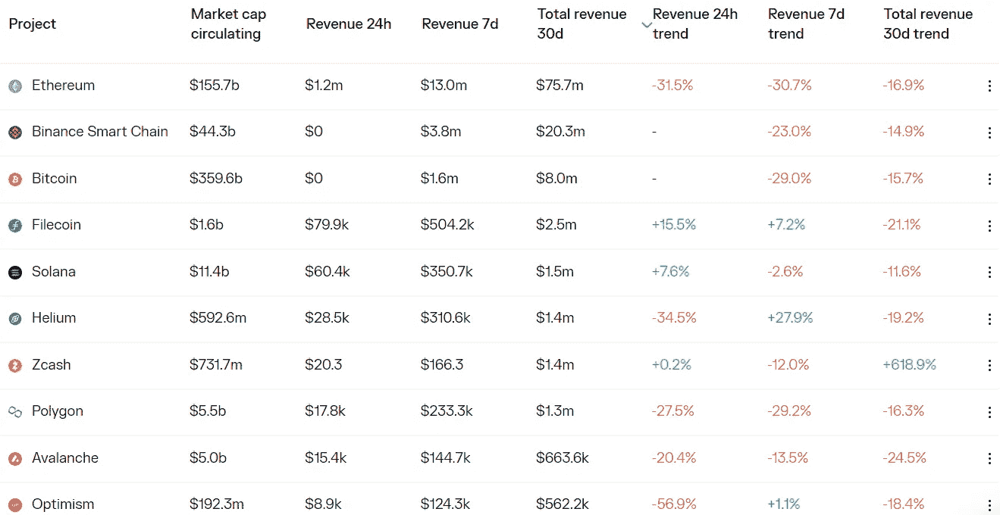

# DeFi Insight | Aave:加密集团

> 原文：<https://medium.com/coinmonks/defi-insight-aave-the-crypto-conglomerate-828589430449?source=collection_archive---------16----------------------->

2022 年 9 月 26 日

*今日 DeFi 数据&由 DeFi Insight 为您带来的新闻*

> *"* 总价值超过 56 亿美元的 Aave 是 DeFi 最具统治地位的公司之一。它的野心远远超出了借贷，稳定的信贷和社交媒体成为它的目标。*“@*[*来源*](https://www.readthegeneralist.com/briefing/aave)

# 最新消息

## 指数/交易所/AMM

Uniswap 如何瞄准比特币基地和币安

## 稳定币

波尔卡多特上的**、**系绳发射 [$USDT](https://mobile.twitter.com/Tether_to/status/1573297148325658626)

## 贷款

**租借协议[火星协议](https://twitter.com/mars_protocol/status/1574043926562209792)发布 v2 白皮书**

**温特穆特成为 Ribbon Lend 的首批借款人之一**

## **位置**

****、**维塔利·布特林“非常有希望”的狗转向[赌注证据](https://decrypt.co/110417/ethereum-vitalik-buterin-very-hopeful-dogecoin-moves-proof-stake)**

## **提议**

****,**[ApeCoinDAO](https://snapshot.org/#/apecoin.eth/proposal/0x5d449bda195b43f274da4281785f3bc8b1223c4fc0a762192704b4b69887ca14)社区开始就关于整合 APE 和 NiftyKit 的提案 AIP-88 进行投票**

****/**Synapse 的社区支持在 [Canto](https://snapshot.org/#/synapseprotocol.eth/proposal/0x84945db62be1e2c5f2435e120dbf9b66197f84a8f7645b6c0baa28b230265d97) 上部署的提议**

## **政策与法规**

****[莫斯科交易所](https://cointelegraph.com/news/moscow-exchange-drafting-bill-on-digital-financial-assets-and-securities-trading-report)起草数字金融资产和证券交易法案****

******国际刑警组织发布红色通缉令通缉 Terraform 创始人[跆拳道](https://techcrunch.com/2022/09/25/do-kwon-interpol/?tpcc=tcplustwitter&guccounter=1&guce_referrer=aHR0cHM6Ly93d3cudGhlYmxvY2tiZWF0cy5pbmZvLw&guce_referrer_sig=AQAAAFYynzSxkOOnJmqEpcS0rQo578yxBIO2C7hvrHa5EL9b0g00PxH3BfI8YADECy3QMbrnFbATeu8V4eW41_Wt6QDDe13xc1LUXLgOy06QGaWPNBDPvqgCId55-Lh7m4I6oj_01OMi2JmIpTXiB7W8YF-Z9zzLo2rW_DhxgxlI5o1L)******

## ******NFT******

********’[《权力的游戏》](https://variety.com/shop/game-of-thrones-funko-digital-pop-collection-1235381613/)携 Funko Digital Pop NFT 系列进入元宇宙********

********,**苹果的应用商店政策如何挤压 [NFT 初创公司](https://www.theinformation.com/articles/how-apples-app-store-policies-squeeze-nft-startups)******

****索拉纳创始人说，NFTs 将催生下一个漫威或迪士尼****

******、** NFT 和游戏发射台 Arcnes 在附近与[整合](https://mobile.twitter.com/arcnes_com/status/1573341671663828992)****

# ****数据和分析****

## ****锁定的总价值(TVL)****

****目前全网 DeFi 总锁定量为 542.2 亿美元，24 小时下降 0.65%。****

********

## ****TVL 评出的十大连锁酒店****

********

## ****|最新 TVL 十大项目****

********

## ****|过去 24 小时内 TVL 增长的前 10 个项目****

********

## ****协议收入****

## ****|累计总收入最高的项目(24H)_ 区块链(L1)****

********

## ****|累计总收入最高的项目(24H) _Dapps (L2)****

********

# ****深潜****

******杀戮法案:** [**的未来**](https://easonwu.substack.com/p/the-kill-bill-what-the-future-holds?sd=pf)****

**** [## 杀戮法案:稳定的未来

### Crypto 对试图控制我们的数字资产的监管法案并不陌生。今天…

easonwu.substack.com](https://easonwu.substack.com/p/the-kill-bill-what-the-future-holds?sd=pf) 

**可逆交易可以减轻** [**密码窃取**](https://cointelegraph.com/news/reversible-transactions-could-mitigate-crypto-theft-researchers)

 [## 研究人员称，可逆交易可以减少密码盗窃

### 斯坦福大学的研究人员提出了以太坊上“可逆交易”的原型，认为它…

cointelegraph.com](https://cointelegraph.com/news/reversible-transactions-could-mitigate-crypto-theft-researchers) 

**密码宠儿** [**氦气**](https://www.forbes.com/sites/sarahemerson/2022/09/23/helium-crypto-tokens-peoples-network/?sh=2790d66a7316) **许诺了一个‘人民网’相反，其高管变得富有。**

 [## 加密宠儿氦承诺一个“人民网络。”相反，其高管变得富有。

### 即使是对 crypto 持怀疑态度的人，Dulce Davis 也很难忽视氦的推销。由投资者支持…

www.forbes.com](https://www.forbes.com/sites/sarahemerson/2022/09/23/helium-crypto-tokens-peoples-network/?sh=2790d66a7316) 

# 报告

**[**比率财务**](https://messari.io/report/ratio-finance-collateralized-debt-positions-on-solana)**:Solana**_ messari 的担保债务头寸**

> **“比率金融创造了抵押债务头寸(CDP ),根据加权投资组合风险管理策略，通过算法调整准备金比率。
> 用户通过在 Ratio 金库中存放 LP 代币来创建 CDP 头寸，这将允许他们铸造 USDr，Ratio 的稳定币。这个系统允许用户仍然从他们的 LP 头寸中获得收益，从而产生负利率贷款。
> Ratio Finance 将继续利用 Solana DeFi 生态系统内的合作伙伴关系和整合，以保持自今年早些时候推出以来的初步增长。
> Ratio Finance 正在开发第四季度的钉住美元稳定性模块，这将有助于将美元兑人民币汇率固定在 1 美元附近。”**

****关于:****

**DeFi Insight 是顶级 DeFi 和加密新闻和更新的来源。**

****https://twitter.com/AlphaPro_io 推特:****

******https://medium.com/feed/@alphapro.project RSS:******

******提供的信息应被视为发展新闻，而不是投资建议。******

> ******交易新手？尝试[加密交易机器人](/coinmonks/crypto-trading-bot-c2ffce8acb2a)或[复制交易](/coinmonks/top-10-crypto-copy-trading-platforms-for-beginners-d0c37c7d698c)**********