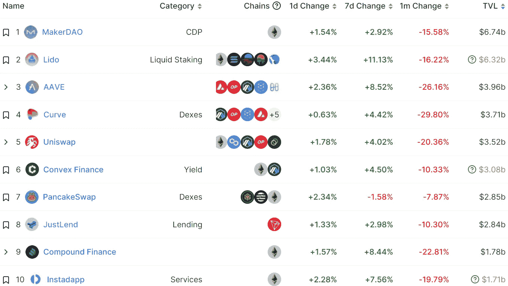

# DeFi Insight |以太坊液态打桩景观的在线观察

> 原文：<https://medium.com/coinmonks/defi-insight-an-on-chain-look-at-ethereums-liquid-staking-landscape-77535571b75e?source=collection_archive---------16----------------------->

2022 年 12 月 5 日

*今日 DeFi 数据&由 DeFi Insight 为您带来的新闻*

> *"* 从分散的选项(如 Lido 和 Rocket Pool)到集中的选项(如比特币基地)，很明显对灵动以太坊定位解决方案的需求很大，新进入者可能会继续进入该领域。自向 PoS 过渡以来，ETH 的参与量一直在增加，并且没有减缓的迹象。
> 
> 虽然大部分液体支撑的 ETH 尚未进入更广泛的 DeFi 空间，但在 DeFi 中部署百分比更高的协议似乎有更强的护城河。例如，Lido 在 DeFi 中的广泛可用性和实用性增加了对使用 Lido 感兴趣的用户数量，这增加了想要支持 stETH 的 DeFi 协议的数量，最终创建了一个正反馈循环。
> 
> 此外，虽然丽都目前是市场领导者，并大大领先于其竞争对手，但比特币基地产品的快速增长表明，普通用户仍然信任传统实体，并满足于简单地赚取赌注的 ETH 收益率，而不是将其用作抵押品或作为更复杂的收益率策略的一部分。cbETH 在 DeFi 合同中的低利用率可能反映了比特币基地产品的用户基础:较少加密和不积极参与链上活动。
> 
> 像比特币基地这样的平台的安全性和便利性会让它取代丽都成为最常用的以太坊定位解决方案吗？随着时间的推移，一个更复杂的产品和衍生品生态系统会使分散的 LSD 选项更受欢迎吗？随着 LSD 空间的成熟，crypto 开始接受并围绕第一个流行的链上收益来源进行构建，这些是值得持续监控的一些问题。*“@*[*来源*](https://www.nansen.ai/research/an-on-chain-look-at-ethereums-liquid-staking-landscape)

# 最新消息

## 德克斯/CEX/AMM

**[unis WAP 的](https://gov.uniswap.org/t/fee-switch-pilot-update-vote/19514)关于费用切换提案的在线投票将在 14 天后上线**

****[比特币基地](https://www.coinbase.com/blog/increasing-transparency-for-new-asset-listings-on-coinbase)在上市路线图中增加了魔法($MAGIC)、火箭池($RPL)和阿拉贡($ANT)****

******分散式交易所快船在 [Arbitrum](https://mobile.twitter.com/Clipper_DEX/status/1598773299190067200) 上线******

********‘最糟糕的情况’:本地密码交易所 [Swyftx](https://www.watoday.com.au/business/companies/worst-case-scenario-local-crypto-exchange-swyftx-lays-off-40-percent-of-staff-20221205-p5c3mu.html) 裁员 40%********

## ******贷款/CDP******

********[Maker](https://twitter.com/MakerDAO/status/1599040550384148485)Governance 批准@GnosisDAO 的 GNO 治理令牌作为 MakerProtocol 中的抵押品********

********[成因](https://www.coindesk.com/business/2022/12/04/genesis-creditor-groups-loans-amount-to-18b-and-counting-sources/)债权人团体的贷款总额达 18 亿美元，且仍在统计中:来源********

## ******稳定币******

********/**[Helio 协议](https://twitter.com/Helio_Money/status/1599415021947084800)开始回购并燃烧$干草以恢复 Peg******

## ****空投****

****9 月 30 日前，Juno 将向与 Arbitrum 互动的美国用户发放 JCOIN 空投****

## ****钱包****

******[币安](https://twitter.com/binance/status/1599615005070360577?s=20&t=7bFoBKLmU2XfP5BxAIs2Kw)将于 2022 年 12 月 6 日 07:00am UTC 对 BNB 信标链(BEP2)进行钱包维护。******

## ******GAMEFI******

********/**[灯塔](https://dune.com/treasuredao/the-beacon)拥有超过 18000 名单人玩家和超过 30000 名创始人******

## ****ENS****

****2022 年 11 月 ENS 统计数据****

## ****鲸鱼****

******、**鲸鱼最近在堆积[$链接](https://twitter.com/lookonchain/status/1599652662839951362)****

## ****观点****

******[【下一代】](https://www.forbes.com/sites/billybambrough/2022/12/04/the-next-generation-blackrock-ceo-reveals-8-trillion-funds-huge-crypto-prediction-after-bitcoin-and-ethereum-price-crash/?sh=50b258966d2f) —比特币和以太坊价格暴跌后，贝莱德 CEO 透露 8 万亿美元基金巨额加密预测******

******梅萨里创始人: [DCG](https://twitter.com/twobitidiot/status/1599404828387463168) 市值可能已经减半******

## ******基金******

******新加坡的航空碳交易市场希望在 B 轮融资中筹集 5000 万美元******

## ******政策与法规******

******民主党高层表示，FTX 应该让国会中的密码支持者感到不安******

## ******锁定的总价值(TVL)******

******目前全网 DeFi 总锁定量为 428.2 亿美元，24 小时增长 1.91%。******

************

## ******TVL 评出的十大连锁酒店******

************

## ******|最新 TVL 十大项目******

************

## ******|过去 24 小时内 TVL 增长的前 10 个项目******

************

## ******协议收入******

## ******|累计总收入最高的项目(24H)_ 区块链******

************

## ******|按累计总收入排名靠前的项目(24H) _Dapps******

************

# ******深潜******

********品牌将** [**保存加密**](https://www.coindesk.com/layer2/2022/12/02/brands-will-save-crypto-be-careful-what-you-wish-for/) **？小心你的愿望********

**** [## 品牌会省 Crypto？小心你的愿望

### 迈克尔·j·凯西是 CoinDesk 的首席内容官。11 月 14 日，随着来自 FTX 的快速蔓延…

www.coindesk.com](https://www.coindesk.com/layer2/2022/12/02/brands-will-save-crypto-be-careful-what-you-wish-for/) 

**维塔利克·布特林谈加密蓝调:** [**关注技术**](https://cointelegraph.com/news/vitalik-buterin-on-the-crypto-blues-focus-on-the-tech-not-the-price) **，而不是价格**

 [## 维塔利克·布特林谈加密蓝调:关注技术，而不是价格

### 以太坊的联合创始人 Vitalik Buterin 分享了一些明智的建议，供感觉到加密熊的忧郁的交易者参考…

cointelegraph.com](https://cointelegraph.com/news/vitalik-buterin-on-the-crypto-blues-focus-on-the-tech-not-the-price) 

# 报告

**总督注:** [**任礼宾**](https://messari.io/report/governor-note-ren-protocol-running-out-of-runway?referrer=all-research) **跑出跑道 _** 梅萨里

*   Ren Protocol 的国库中只有 160，000 美元，在 2022 年第四季度之后将无法补偿 Ren Labs 团队。对于 Ren Labs 来说，找到解决方案的时间很紧迫。
*   MakerDAO 和 Ren 资产持有者必须在 Ren 1.0 正式关闭之前烧掉并桥接回他们的原生资产。
*   Ren 实验室在 Ren 协议的知识产权方面缺乏法律透明度，这引起了 Ren 社区的关注。重组任道的治理框架可能会带来新的法律挑战。

**【DeFi 101:**[**stable coins&CBDCs**](https://research.thetie.io/defi-101-stablecoins-and-cbdcs/)**_**thetie

**在链** [**永久互换**](https://www.theblockresearch.com/on-chain-perpetual-swaps-trends-in-2022-and-post-ftx-191473)**2022 年趋势及后 FTX _** 区块研究

**快速洞察:分析** [**Ankr 的**](https://www.theblockresearch.com/rapid-insights-analyzing-ankrs-liquid-staking-protocol-infinite-mint-exploit-191899) **Liquid-Staking 协议无限薄荷漏洞利用****_**the block research

**关于:**

DeFi Insight 是顶级 DeFi 和加密新闻和更新的来源。

**https://twitter.com/AlphaPro_io 推特:**

****❤RSS:**[**https://medium.com/feed/@alphapro.project**](https://medium.com/feed/@alphapro.project)**

**提供的信息应被视为发展新闻，而不是投资建议。**

> **交易新手？试试[加密交易机器人](/coinmonks/crypto-trading-bot-c2ffce8acb2a)或[复制交易](/coinmonks/top-10-crypto-copy-trading-platforms-for-beginners-d0c37c7d698c)******