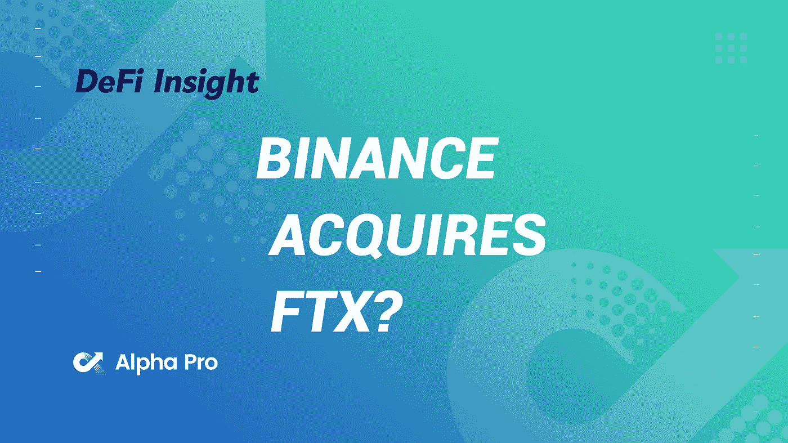
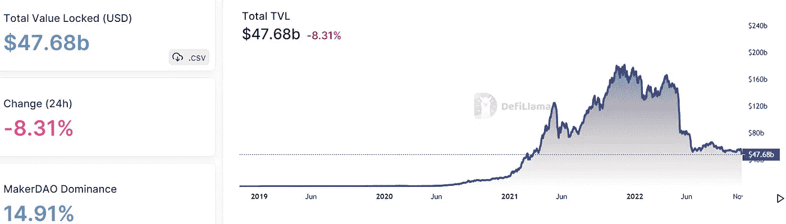
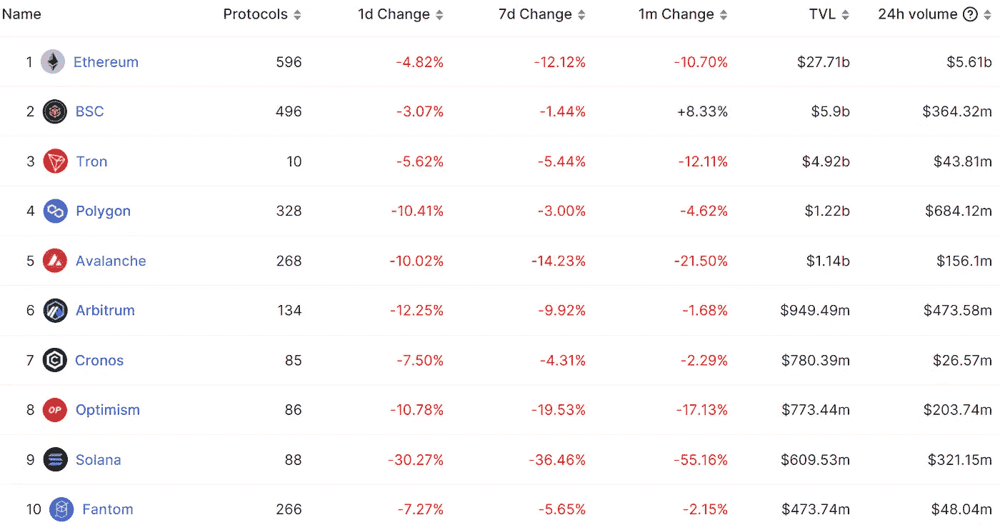
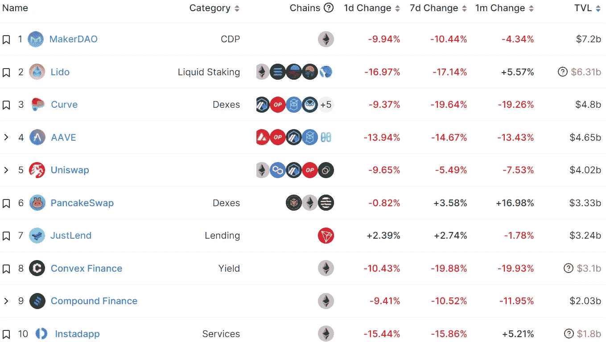
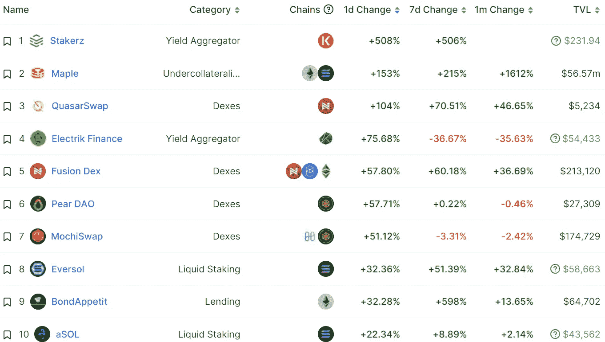
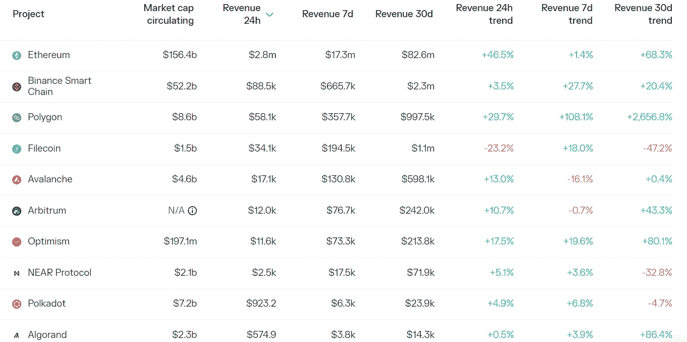
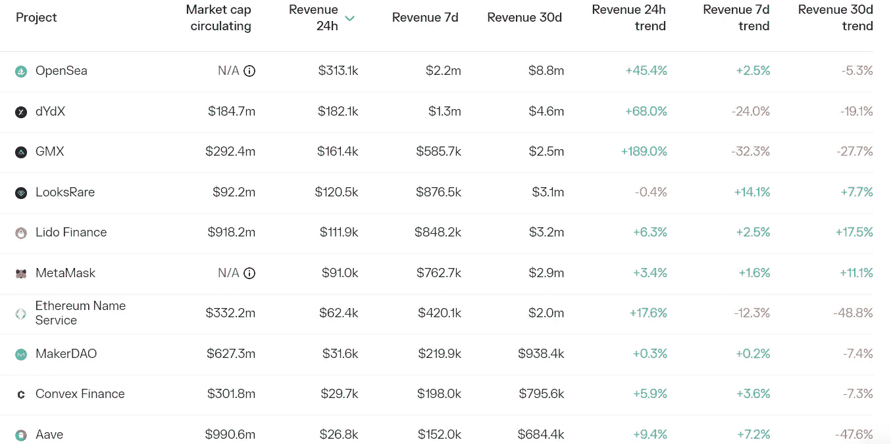

# 加密巨头之战结束:币安收购 FTX

> 原文：<https://medium.com/coinmonks/defi-insight-battle-of-crypto-titans-ends-binance-to-acquire-ftx-be6647fc26ed?source=collection_archive---------42----------------------->

2022 年 11 月 9 日

*今日 DeFi 数据&由 DeFi Insight 为您带来的新闻*

> *"* 今天，币安同意收购 FTX，这一交易甚至震惊了最资深的加密助手。
> 
> 这对集中式密码交换的行业和信任意味着什么？*“@*[*来源*](https://www.coindesk.com/layer2/2022/11/08/the-story-of-sam-bankman-frieds-backroom-deal-with-binances-cz/)

# 最新消息

## | crypto 刚刚到底发生了什么？

**全力[收购 FTX](https://twitter.com/cz_binance/status/1590013613586411520) — CZ**

**FTX 与币安就一项战略投资交易——SBF 达成了一项协议**

**银行家弗里德就币安交易缺乏沟通向 FTX 投资者道歉**

****FTX 是密码圈里的[雷曼](https://twitter.com/CryptoHayes/status/1590076719184039936?s=20&t=Il_FQmXf2prsQzT8Jxchxw)，目前的市场还没有见底——亚瑟·海斯****

****币安即将开始储量论证，保证完全透明— CZ****

******火币环球将再次准备 [Merkle tree](https://mobile.twitter.com/justinsuntron/status/1590177338578579456) 储备证明——孙正义******

********[**OKX**](https://twitter.com/okx/status/1590082969355816961)**计划在未来 30 天内发布其 Merkle tree 保留证明**********

********因大量新用户注册导致的网络延迟现已恢复正常— [比特币基地](https://twitter.com/CoinbaseSupport/status/1590084622175830016)********

********、** FTX 事件将导致行业监管趋严— [比特币基地 CEO](https://twitter.com/brian_armstrong/status/1590089092381147136)******

******FTX 事件提醒加密公司不要使用投机代币作为资产负债表[基础资产](https://twitter.com/jerallaire/status/1590112483532210179)******

******系绳公司首席技术官表示，系绳公司在 FTX 或阿拉米达没有任何风险敞口******

********,**所有产品功能正常，公司是独立于 FTX 的商业实体— [BlockFi](https://twitter.com/FounderFlori/status/1590030306978848768)******

******阿拉米达研究公司在 TrueFi 和 Clearpool 上有[1278 万美元的贷款](https://twitter.com/PeckShieldAlert/status/1590177527645245441)******

********,**CZ:币安从未用 [$BNB](https://twitter.com/cz_binance/status/1590103159506341888?s=20&t=Vgs9i39tOwbMEm-2Y1fbYA) 作抵押******

******班克曼-弗里德的优先权[FTX 卖给币安后，加密法案“死亡”](https://www.theblock.co/post/184436/bankman-frieds-priority-crypto-bill-dead-after-ftx-sells-to-binance?utm_source=twitter&utm_medium=social)******

******FTX 内爆引起美国监管者的关注******

********FTX、币安交易引来[反垄断关注](https://www.coindesk.com/policy/2022/11/08/ftx-binance-deal-draws-antitrust-concern/)********

# ******数据和分析******

## ******锁定的总价值(TVL)******

******目前全网 DeFi 总锁定量为 476.8 亿美元，24 小时下降 8.31%。******

************

## ******TVL 评出的十大连锁酒店******

************

## ******|最新 TVL 十大项目******

************

## ******|过去 24 小时内 TVL 增长的前 10 个项目******

************

## ******协议收入******

## ******|累计总收入最高的项目(24H)_ 区块链(L1)******

************

## ******|累计总收入最高的项目(24H) _Dapps (L2)******

************

# ******深潜******

********[**NFT 版税**](https://metaversal.banklesshq.com/p/the-future-of-nft-royalties?utm_source=%2Finbox&utm_medium=reader2)********

**** [## NFT 版税的未来🔮

### 亲爱的无银行国家，在过去的几年里，大量的艺术家来到了加密经济。一个主要的拉动…

metaversal.banklesshq.com](https://metaversal.banklesshq.com/p/the-future-of-nft-royalties?utm_source=%2Finbox&utm_medium=reader2)**** 

# ****报告****

******[**雪崩**](https://www.theblockresearch.com/avalanche-feels-impact-of-bear-market-184175) **感受熊市冲击 _** theblockresearch******

*   ****随着对以太坊网络可扩展性的日益担忧，雪崩生态系统在 2021 年迅速崛起。****
*   ****雪崩子网代表了网络的长期战略，用于扩展和最初减少雪崩 C 链上的拥塞，但自 2022 年年中以来，主网络上的活动一直保持平静。****
*   ****最近对 Avalanche 网络的更新放宽了成为子网验证器的资本要求，并支持子网虚拟机之间的基本通信，朝着未来子网的更大扩展功能迈出了一步。****

******层层:** [**宇宙枢纽**](https://www.theblockresearch.com/layer-by-layer-cosmos-hub-weighs-its-future-with-pivotal-cosmos-2-0-vote-underway-183660) **权衡其未来与枢纽宇宙 2.0 投票进行中 _** theblockresearch****

******快速洞察:**[**OpenSea**](https://www.theblockresearch.com/rapid-insights-opensea-retaliates-against-royalty-circumvention-183750)**报复版税规避** _theblockresearch****

******[**的定居者 Canto**](https://messari.io/report/the-settlers-of-canto?referrer=all-research) _messari******

******[**博巴网**](https://messari.io/report/state-of-boba-network-q3-2022?referrer=all-research)**Q3 2022**_ messari******

******总督注:介绍押桩** [**阿托肯斯**](https://messari.io/report/governor-note-balancer-x-aave?referrer=all-research)_ 梅萨里****

******关于:******

****DeFi Insight 是顶级 DeFi 和加密新闻和更新的来源。****

******https://twitter.com/AlphaPro_io**❤[t51】](https://twitter.com/AlphaPro_io)****

******❤RSS:**[**https://medium.com/feed/@alphapro.project**](https://medium.com/feed/@alphapro.project)****

****提供的信息应被视为发展新闻，而不是投资建议。****

> ****交易新手？试试[加密交易机器人](/coinmonks/crypto-trading-bot-c2ffce8acb2a)或者[复制交易](/coinmonks/top-10-crypto-copy-trading-platforms-for-beginners-d0c37c7d698c)****