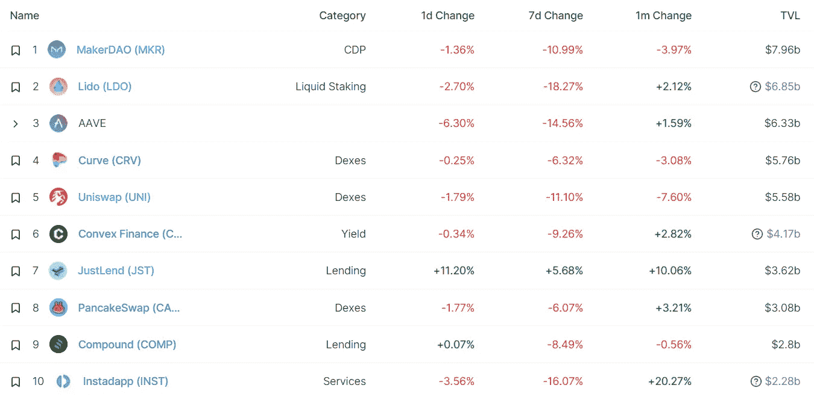

# DeFi Insight |BendDAO，出 ETH？

> 原文：<https://medium.com/coinmonks/defi-insight-benddao-out-of-eth-5f0debe52376?source=collection_archive---------31----------------------->

2022 年 8 月 22 日

*今日 DeFi 数据&由 DeFi Insight 为您带来的新闻*

> *龙在奔道上翻江倒海:*
> 
> *1)他们已经用完了 ETH。合同里只有 12.5 美分。
> 2)这是什么意思？那些通过本道借钱给别人去杠杆购买非金融资产的人不能把他们的钱取出来。大约借出了 15，000 埃特。*
> 
> **……”@*[*来源*](https://twitter.com/punk9059/status/1561485091917877250?s=20&t=1ywktI5vmD8QkmTM2OkNvg)*

# *最新消息*

## *贷款*

*霍德瑙特报告了 1.93 亿美元的资金缺口，寻求法院保护*

## *外汇*

*泄露的财务数据显示，在加密热潮期间，FTX 的收入增长了 1000%*

## *稳定币*

*[Acala](/acalanetwork/updates-on-the-ausd-incident-22-august-2022-997efec98b35) 表示，2.97 亿澳元的造币厂已经被烧毁*

## *交叉链*

***、**、[层交换](https://twitter.com/layerswap/status/1561297920376426496?s=20)出口匝道处于活动状态*

## *商业*

*隐性熊市正在导致全行业的劳动力减少*

## *测试网*

***欢迎来到 [Aptos 激励测试网 3](/@aptoslabs/welcome-to-aptos-incentivized-testnet-3-9d7ce888205c)***

## ***提议***

***本道的新提议建议调整一些参数以缓解流动性危机***

## ***|警报***

***浪人黑客将偷来的资金从瑞士联邦理工学院转移到 BTC，并使用经批准的混合器***

*****/**web 3[扩展恶意软件](https://twitter.com/wallet_guard/status/1561046182645751810)***

## ***采矿***

*****[世界上最大的以太矿池](https://news.bitcoin.com/worlds-largest-ethereum-mining-pool-to-drop-ether-pow-mining-ethermine-starts-merge-countdown/)开始开采掉落的以太矿，以太矿开始合并倒计时*****

## *****政策与法规*****

*******[澳洲](https://cryptodaily.co.uk/2022/08/australia-to-token-map-its-crypto-industry)以‘代币地图’标示其密码产业*******

*********屏蔽“慢走”现金 App 探针，[消费者监督机构称](https://www.bloomberg.com/news/articles/2022-08-19/cfpb-alleges-block-is-slow-walking-cash-app-investigation)*********

## *******NFT*******

*********[隐朋克](https://decrypt.co/107911/cryptopunk-ethereum-nfts-floor-price-flips-bored-apes-for-first-time-in-5-months)以太坊 NFTs 底价 5 个月来首次翻转无聊猿*********

*******超级世界是下一个 NFT 品牌，目标是成为下一个迪士尼*******

*******在 NFT 的熊市中，矮胖企鹅收藏增长了 400%*******

## *******基金*******

*********/**密码，在那里[堕落者寻求新的开始](https://techcrunch.com/2022/08/21/crypto-chain-reaction-adam-neumann-flow-flowcarbon-startup-newsletter/)*******

*****元宇宙代理公司[指数游戏](https://sandboxgame.medium.com/index-game-looks-to-boost-metaverse-experiences-with-a-us-1-7-million-investment-from-the-sandbox-61c8f35f2d1c)从沙盒中筹集了 170 万美元*****

# *****数据和分析*****

## *****锁定的总价值(TVL)*****

*****目前全网 DeFi 总锁定量为 603.8 亿美元，24 小时下降 0.51%。*****

**********

## *****TVL 评出的十大连锁酒店*****

**********

## *****|最新 TVL 十大项目*****

**********

## *****|过去 24 小时内 TVL 增长的前 10 个项目*****

**********

## *****协议收入*****

## *****|累计总收入最高的项目(24H)_ 区块链(L1)*****

**********

## *****|累计总收入最高的项目(24H) _Dapps (L2)*****

**********

## *****|前 10 大交易所的每日收入*****

**********

## *****|十大贷款协议的日收入*****

**********

# *****深潜*****

*******以太坊的审查抵抗** [**是否在**](https://newsletter.banklesshq.com/p/crypto-censorship-ethereum-tornado-cash?utm_source=%2Finbox&utm_medium=reader2) **的攻击下？*******

***** [## 以太坊审查阻力受到威胁了吗？

### 无银行高级会员可获得八月版无银行代币评级的全部权限。这个月，我们将对……

newsletter.banklesshq.com](https://newsletter.banklesshq.com/p/crypto-censorship-ethereum-tornado-cash?utm_source=%2Finbox&utm_medium=reader2) 

**[**dm3**](/corpus-ventures/dm3-decentralized-messaging-for-web3-8d66f6e77b53)**—web 3 的分散式消息传递****

** [## dm3—web 3 的分散式消息传递

### dm3 .聊天

medium.com](/corpus-ventures/dm3-decentralized-messaging-for-web3-8d66f6e77b53) 

**[**密码游戏**](/collab-currency/crypto-gaming-a-most-practical-thesis-ec4f55f53408) **:一篇最实用的论文****

** [## 密码游戏:一个最实用的论题

### 作者:阿拉德

medium.com](/collab-currency/crypto-gaming-a-most-practical-thesis-ec4f55f53408)** 

# **报告**

****[**揭开 DeFi 基本面**](https://research.binance.com/static/pdf/decentralized-exchanges-report.pdf) **:分散交流**_ 币安****

> ****代币发行对 DEXes 的增长和运营至关重要，因为它们有助于激励流动性提供者向平台提供流动性。然而，具有最小效用的本机令牌往往会看到令牌的价值被侵蚀。一些指标，如 PancakeSwap，Curve，Balancer 和 Trader Joe，已经增加了他们的令牌的效用和/或引入了锁定机制，以减少佣兵的销售压力。****
> 
> ****我们在这份报告中分析了六个指数的财务数据——unis WAP、PancakeSwap、Curve、Balancer、Trader Joe 和 Serum。在考虑与流动性开采激励相关的象征性排放后，没有一个指数是盈利的。在其他条件不变的情况下，如果 Uniswap 的费用转换提案获得通过，它最有可能实现盈利。虽然亏损并不罕见，而且类似于早期创业公司亏本经营以促进增长的剧本，但 DEXes 应该考虑采取措施，最大限度地减少现金消耗，实现运营利润。****

******[**AAA GameFi**](https://research.thetie.io/how-big-could-nft-gaming-become-tam-analysis/)**:NFT 的博彩能有多大？** _thetie******

******[**什么是细分的 NFT**](https://content-hub-static.crypto.com/wp-content/uploads/2022/08/220420_What-Are-Fractionalised-NFTs_davidet4135.pdf)**？**_ 加密******

******[**一阵疾风**](https://members.delphidigital.io/reports/a-blast-from-the-past) **从过去** _delphidigital******

******H1 2022**[**web 3 安全**](https://beosin.com/resources/Beosin_H1_2022_Web3_Security_Report.pdf)研究 _beosin****

******关于:******

****DeFi Insight 是顶级 DeFi 和加密新闻和更新的来源。****

******https://twitter.com/AlphaPro_io 推特:******

********❤RSS:**[**https://medium.com/feed/@alphapro.project**](https://medium.com/feed/@alphapro.project)******

****提供的信息应被视为发展新闻，而不是投资建议。****

> ****交易新手？试试[加密交易机器人](/coinmonks/crypto-trading-bot-c2ffce8acb2a)或[复制交易](/coinmonks/top-10-crypto-copy-trading-platforms-for-beginners-d0c37c7d698c)***********