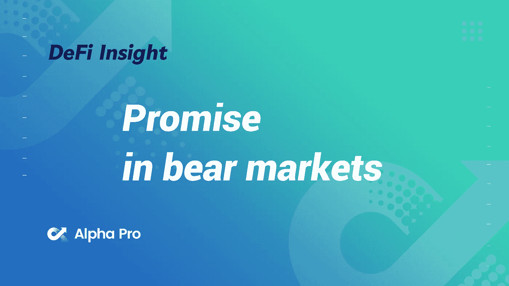
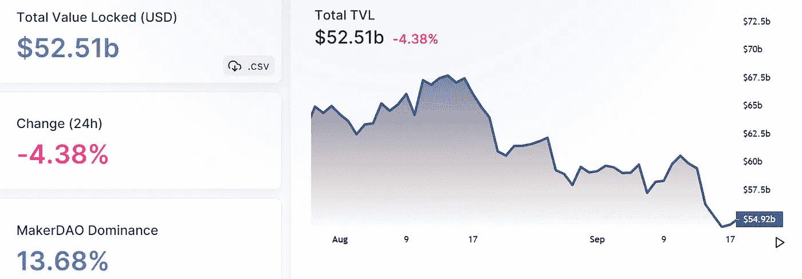
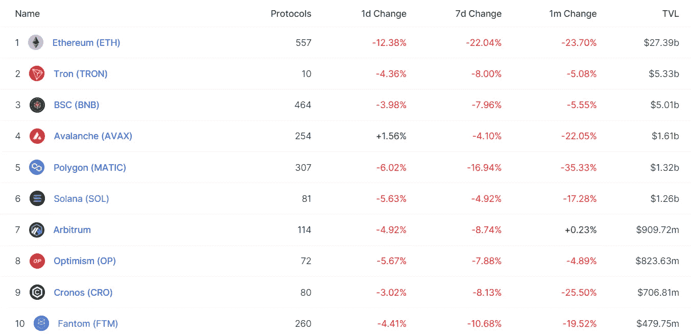
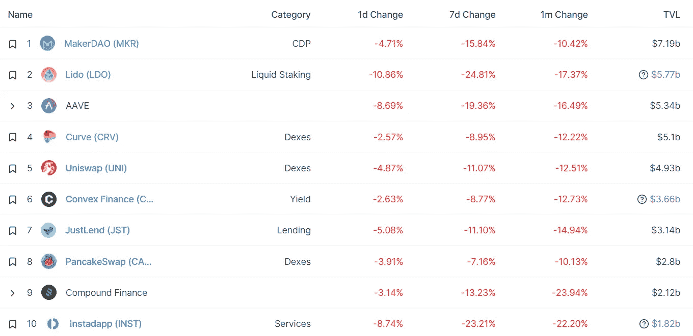
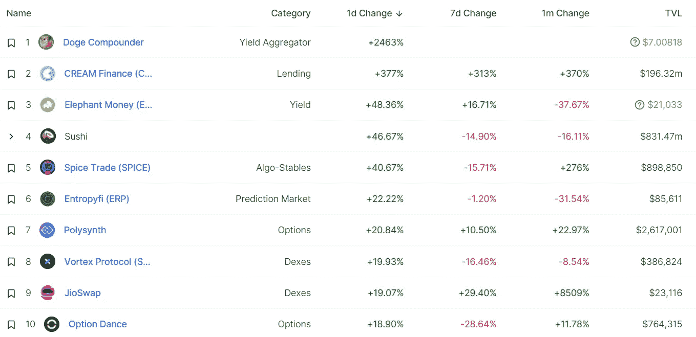
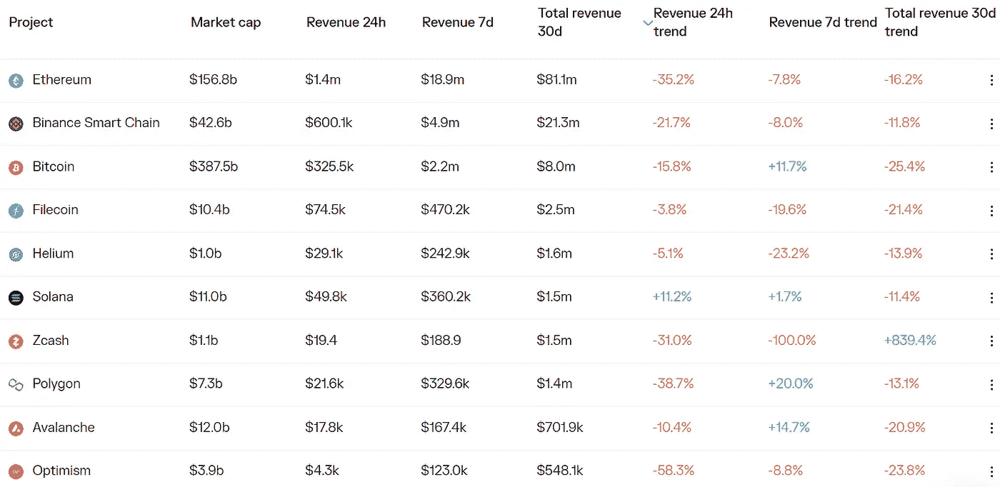
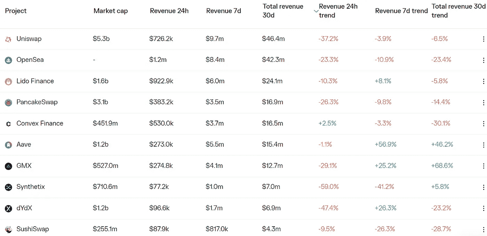

# DeFi Insight |币安身家 75 亿美元的女人在熊市中看到了很多希望

> 原文：<https://medium.com/coinmonks/defi-insight-binances-us-7-5-billion-woman-sees-plenty-of-promise-in-bear-markets-f629f1c531d8?source=collection_archive---------16----------------------->

2022 年 9 月 19 日

*今日 DeFi 数据&由 DeFi Insight 为您带来的新闻*

> *"*2017 年与赵昌鹏一起帮助创立了加密货币交易所的女子何怡现在负责该公司的风险投资部门，她认为低迷的市场和严峻的经济形势正是确定有前途的投资项目的时候。
> 
> 在上个月被任命为实验室孵化器和投资部门负责人的何在接受 Forkast 采访时表示，她对运营有着雄心勃勃的计划，该公司为全球最大的加密货币交易所管理着 200 多个项目中 75 亿美元的资产。
> 
> 35 岁的何说，她正在寻找能给行业带来长期利益的早期项目，并在当前的熊市条件下看到了机会，但拒绝透露具体细节。她补充说，过滤掉那些抓住时尚赚快钱的“山寨”项目是至关重要的。她说，这样的项目缺乏可靠的商业模式，不会持久。
> 
> 币安实验室上个月表示，自 2018 年成立以来，它已经取得了 2，100%的回报率，并投资了包括游戏赚取游戏 Axie Infinity、第二层区块链多边形、元宇宙游戏沙盒和移动赚取应用程序 STEPN。*“@*[*来源*](https://forkast.news/binances-sees-plenty-of-promise-in-bear-markets/)

# 最新消息

## |链条

**[Aptos](https://immunefi.com/bounty/aptos/)在 Immunefi 平台推出 bug 赏金计划，最高奖励 100 万美元**

****[以太坊](https://l2beat.com/scaling/tvl/)第二层总锁定量跌至 47.5 亿美元，7 日下跌 13.09%****

******/**什么样的[层 3s](https://vitalik.ca/general/2022/09/17/layer_3.html) 有意义？****

## ****外汇/指数****

****FTX 首席执行官萨姆·班克曼·弗里德说公司仍有 10 亿美元现金可用于收购****

******、**交叉链 DEX 链节与[悬挂链节](/@ChainHopDEX/chainhop-x-sushi-a-step-forward-in-inter-chain-liquidity-cbd5e3f74d6b)整合****

## ****CDP****

****一个有着 330 万美元债务的马克尔道金库面临着 1284.684 美元的清算****

## ****稳定币****

******币安在雪崩&多边形网络上完成 [BUSD](https://www.binance.com/en/support/announcement/ce1d8dd1a87d4ad597bf3248f8890ab8) 的整合，开通存取款******

## ******打桩******

******利多的总禁售量跌破 60 亿美元，24 小时内下降了 10.56%******

## ******|令牌******

********/**[Metaplex](https://www.metaplex.com/)即将空投治理令牌 MPLX******

******,**拉美开发银行[美洲开发银行](https://www.ledgerinsights.com/idb-tokenized-bonds-blockchain/)如何用象征性债券撼动资本市场****

******[DefiLlama](https://twitter.com/DefiLlama/status/1571215984060399616)推出代币价格 API，旨在为更多间接交易的代币定价等。******

## ******政策与法规******

********澳大利亚参议员起草法案，旨在[稳定货币，规范数字元](https://cointelegraph.com/news/australian-senator-drafts-bill-aimed-at-stablecoin-digital-yuan-regulation)********

## ******观点******

********、**机构仍在[、](https://www.coindesk.com/business/2022/09/18/institutions-are-still-wait-and-see-with-ethereum/)与以太坊‘观望’******

# ****数据和分析****

## ****锁定的总价值(TVL)****

****目前全网 DeFi 总锁定量为 525.1 亿美元，24 小时下降 4.38%。****

********

## ****TVL 评出的十大连锁酒店****

********

## ****|最新 TVL 十大项目****

********

## ****|过去 24 小时内 TVL 增长的前 10 个项目****

********

## ****协议收入****

## ****|累计总收入最高的项目(24H)_ 区块链(L1)****

********

## ****|累计总收入最高的项目(24H) _Dapps (L2)****

********

# ****深潜****

******[**原始套利**](https://primitivernd.substack.com/p/primitive-arbitrage) **:在 RMM-01 常函数做市商上探索套利********

**** [## 原始套利

### 在这篇文章中，我们涵盖了常数功能做市商(CFMMs)的定价能力，并应用一般…

primitivernd.substack.com](https://primitivernd.substack.com/p/primitive-arbitrage) 

**智慧榜:**

** [## 智慧清单:山姆·班克曼-弗里德|多面手

### 很少有公司像 FTX 一样发展迅速。在三年多一点的时间里，萨姆·班克曼-弗里德的公司从一个…

www.readthegeneralist.com](https://www.readthegeneralist.com/briefing/sam-bankman-fried) 

**【深潜:** [**Sudoswap**](https://defieducation.substack.com/p/deep-dive-sudoswap-xmon?utm_source=substack&utm_medium=email)

 [## 深潜:Sudoswap (XMON)

### 第 5 级-声波 Autist

defieducation.substack.com](https://defieducation.substack.com/p/deep-dive-sudoswap-xmon?utm_source=substack&utm_medium=email) 

# 报告

**[**乐观**](https://messari.io/report/state-of-optimism-governance) **治国**_ 梅萨里**

> **乐观象征之家通过治理基金向乐观网络的可持续增长项目发放了 4200 万欧元。**
> 
> **超过 60%的资金分配给了流动性激励计划，这极大地增加了网络上锁定的总价值(TVL ),但尚未导致交易和定序收入的显著增加。**
> 
> **乐观主义者将通过引入治理委员会、调整法定人数要求以及进一步完善基金的目的来发展第二季的治理基金流程，以针对第 1 层应用程序的迁移并吸引符合价值的构建者。**

****[**ever scale**](https://messari.io/report/everscale-an-evolving-community-led-l1)**:一个不断发展的、社区主导的 L1** _messari****

******关于:******

****DeFi Insight 是顶级 DeFi 和加密新闻和更新的来源。****

******https://twitter.com/AlphaPro_io**❤****

********❤RSS:**[**https://medium.com/feed/@alphapro.project**](https://medium.com/feed/@alphapro.project)******

****提供的信息应被视为发展新闻，而不是投资建议。****

> ****交易新手？尝试[加密交易机器人](/coinmonks/crypto-trading-bot-c2ffce8acb2a)或[复制交易](/coinmonks/top-10-crypto-copy-trading-platforms-for-beginners-d0c37c7d698c)**********