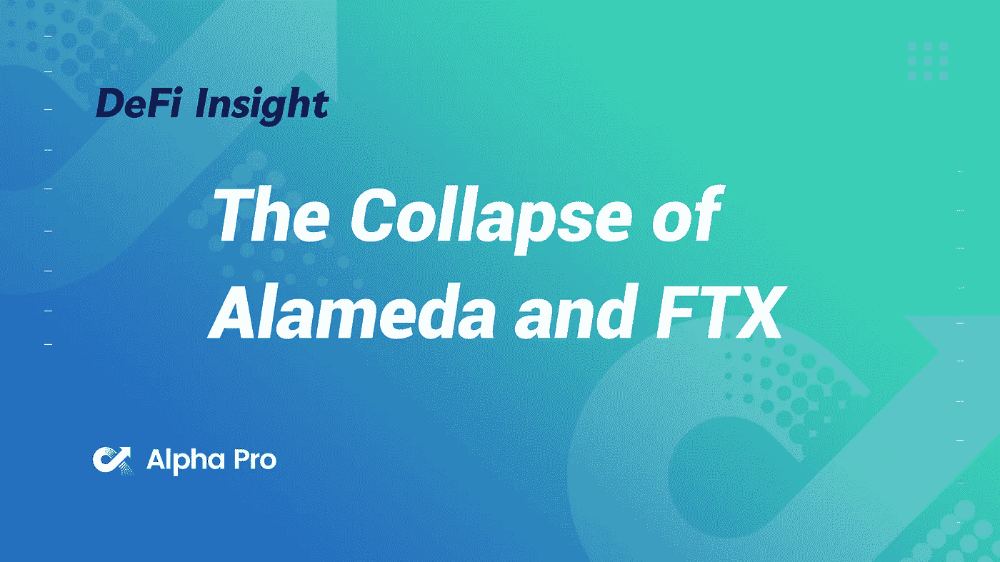
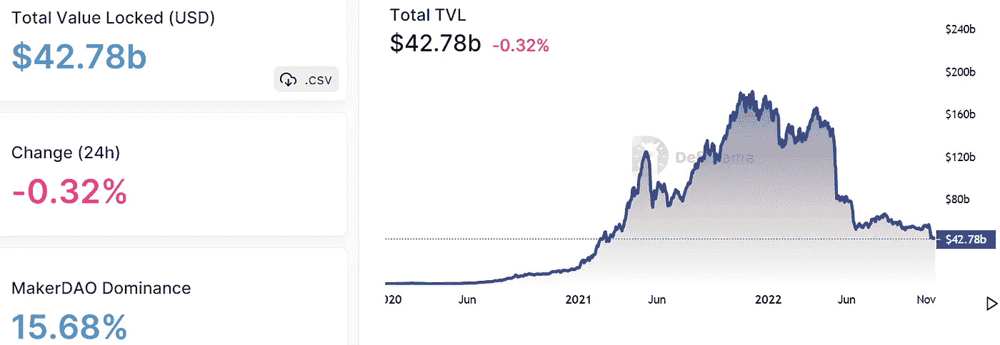
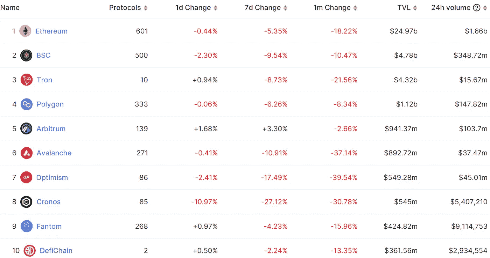
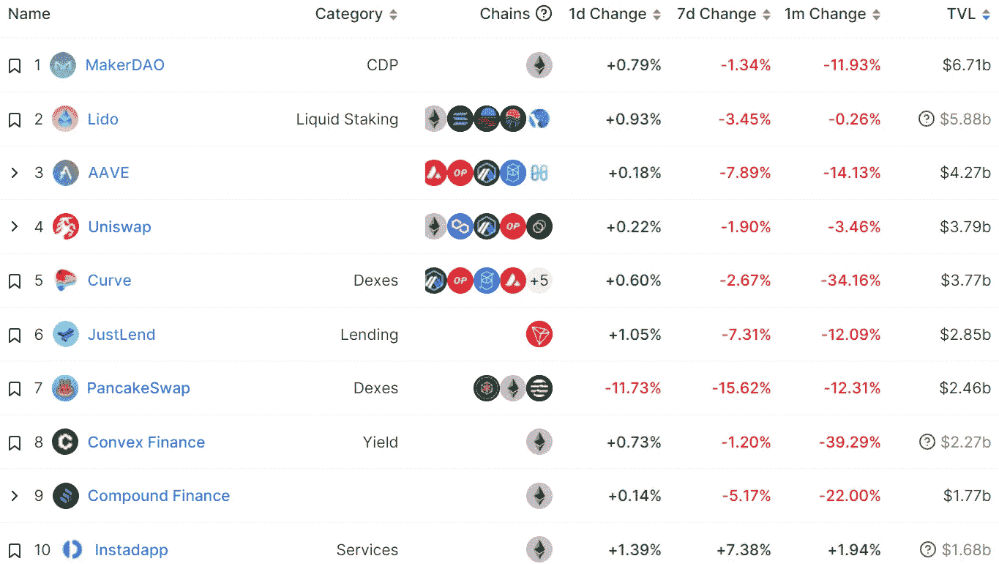
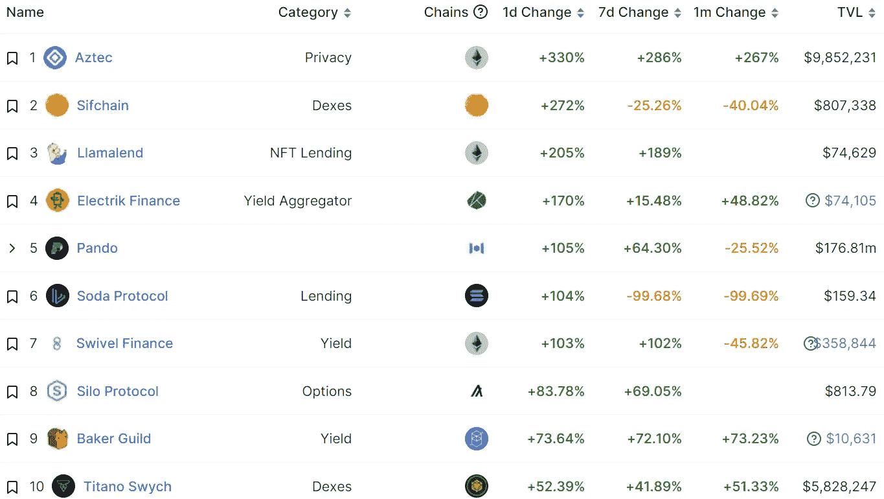
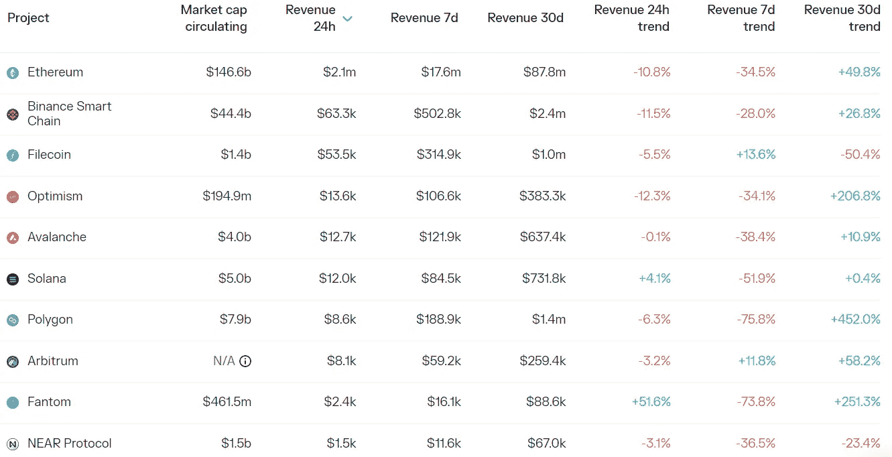
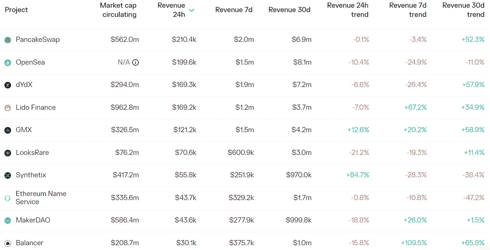

# DeFi Insight |区块链分析:阿拉米达和 FTX 的崩溃

> 原文：<https://medium.com/coinmonks/defi-insight-blockchain-analysis-the-collapse-of-alameda-and-ftx-841f20e645c7?source=collection_archive---------21----------------------->

2022 年 11 月 18 日

*今日 DeFi 数据&由 DeFi Insight 为您带来的新闻*

> *它始于 CoinDesk 报道“在其 80 亿美元的负债中有更多的 FTX 代币:2.92 亿美元的“锁定 FTT”(负债主要是 74 亿美元的贷款。)."*
> 
> *接下来，Alameda Research 的首席执行官 Caroline Ellison 提出以每股 22 美元的价格收购币安的 FTX 代币(FTT)。随之而来的无疑是 crypto 最疯狂的事件之一——FTX 和阿拉米达的崩溃。*
> 
> *那么这是怎么发生的呢？TerraUSD 的脱钩、Luna 的失败、3AC 的破产是否都导致了 FTX 和阿拉米达的失宠？*
> 
> *还是一直以来对风险的管理不善和对客户资金的滥用？*
> 
> *南森利用连锁数据对 FTX 和阿拉米达倒下的多米诺骨牌进行了深度分析。在可能的情况下，我们希望给出一个有链上证据支持的客观描述。我们的研究不包括潜在的链外事件。这项研究利用南森的标签启发法来跟踪相关实体的已知钱包，并验证他们在链上的行动，以了解 FTX-阿拉米达崩溃期间实际发生的事情。*“@*[*来源*](https://www.nansen.ai/research/blockchain-analysis-the-collapse-of-alameda-and-ftx)*

# *最新消息*

## *德克斯/CEX/AMM*

*加密公司 Multicoin 预计，FTX 疫情将在未来几周内摧毁许多交易公司*

*FTX 的新老板揭露班克曼-弗里德留下的混乱*

*FTX 告诉法庭，萨姆·班克曼-弗里德被巴哈马政府命令在破产后黑掉 FTX*

***、**罗宾汉:不借贷或利用加密，无债务和 60 亿美元现金*

*贷款人 Genesis 寻求 10 亿美元的紧急贷款*

***[币安首席执行官](https://www.cnbc.com/2022/11/17/binance-ceo-slams-samuel-bankman-frieds-erratic-behavior.html)抨击山姆·班克曼-弗里德的行为，矛头直指努里埃尔·鲁比尼***

*****币安首席执行官:工业复兴基金已经被谈及大约[【2B】](https://twitter.com/jacqmelinek/status/1593247728028782592?s=20&t=kMxvAF6Ty8QbP-DE2WmCwA)*****

*******/**[uni swap 实验室](https://uniswap.org/blog/permit2-and-universal-router):介绍 Permit2 &通用路由器*****

*******[跳转密码](https://twitter.com/jump_/status/1593305465869459456)澄清:未平仓，仍在积极投资交易*******

## *******第一层*******

*********[隋测试网](https://sui.io/resources-sui/sui-testnet-wave-1-goes-live/)第一波上线*********

## *******稳定币*******

*********为什么 [USDT](https://tether.to/en/why-usdt-issuances-ensures-no-risks-from-ftx-alameda/) 发行保证没有来自 FTX _ 阿拉米达的风险*********

*******索拉纳的 USDC 正在按预期运行，发行或赎回 USDC 不存在任何问题*******

## *******贷款/CDP*******

*******Nexo 向 BlockFi 提出了一笔 8 . 5 亿美元的交易，有可能收购它*******

## *******桥梁*******

*********第二层交叉卷桥[轨道飞行器金融](https://twitter.com/Orbiter_Finance/status/1593152114674774016?s=20&t=lRGhr2PA8hD_-XcU4G_9rg)增加了对卷轴测试网的支持*********

## *******钱包*******

*******哥伦比亚的加密平台筹集了 500 万美元的种子资金*******

*********[MetaMask](https://twitter.com/MetaMask/status/1593288173005570049)宣布推出 meta mask 投资组合 dApp 中由 NFTBank 支持的 NFT 价格估算*********

## *******|令牌*******

*********[跨协议](https://twitter.com/AcrossProtocol/status/1593393562636337152)将于 11 月 28 日发放令牌 ACX*********

*********[变速箱](https://twitter.com/GearboxProtocol/status/1593268499941507078?s=20&t=PHDTDCfnP0gObdSJsE9DQg)几天后会发布推出 token 的提案，预计 12 月初可以转让 token*********

## *******NFT*******

*********索拉纳的生态 NFT 平台 [Metaplex](https://twitter.com/meta_hess/status/1593326647280812032?s=20&t=BkSB8M3-nLUJJkxtYbrGGQ) 宣布裁员，强调 FTX 崩盘对其财务状况没有直接影响*********

*********[hya kki](https://www.coinspeaker.com/hyakki-nft-utility-and-marketing-platform-raise-2-million-seed-round/)NFT 公用事业和营销平台筹集 200 万美元种子轮资金*********

## *******基金*******

*********电报获得 1000 万美元[吨](https://cryptopotato.com/telegram-to-receive-10m-for-ton-blockchain-effort/)区块链成果*********

## *******锁定的总价值(TVL)*******

*******目前全网 DeFi 总锁定量为 427.8 亿美元，24 小时下降 0.32%。*******

**************

## *******TVL 评出的十大连锁酒店*******

**************

## *******|最新 TVL 十大项目*******

**************

## *******|过去 24 小时内 TVL 增长的前 10 个项目*******

**************

## *******协议收入*******

## *******|累计总收入最高的项目(24H)_ 区块链(L1)*******

**************

## *******|累计总收入最高的项目(24H) _Dapps (L2)*******

**************

# *******深潜*******

*********评估 FTX 危机对** [**Dapp 行业**](https://dappradar.com/blog/assessing-the-impact-of-ftx-meltdown-in-the-dapp-industry) 的影响*******

***** [## 评估 FTX 危机对 Dapp 行业的影响

### FTX 交易所及其所有附属实体的意外崩溃给整个世界带来了冲击波

dappradar.com](https://dappradar.com/blog/assessing-the-impact-of-ftx-meltdown-in-the-dapp-industry) 

**这可能是** [**加密底部**](https://substack.com/inbox/post/85191884) 的 5 个原因

 [## 这可能是加密底部的 5 个原因

### 亲爱的无银行国家，2022 年是残酷的一年，Terra、3AC 和 FTX 等昔日巨头纷纷倒闭…

substack.com](https://substack.com/inbox/post/85191884) ** [## 具有聚会协议的多人密码🎉

### 亲爱的无银行国家，PartyDAO 是一个建立“多人加密”工具的集体，帮助人们组队…

metaversal.banklesshq.com](https://metaversal.banklesshq.com/p/multiplayer-crypto-with-party-protocol?utm_source=%2Finbox&utm_medium=reader2) 

**[**破产概念**](https://defieducation.substack.com/p/5-bankruptcy-concepts-you-need-to?utm_source=%2Finbox&utm_medium=reader2) **你需要知道的****

** [## 你需要知道的 5 个破产概念

### FTX 已经申请破产。据传 BlockFi 即将申请破产。航海家申请破产…

defieducation.substack.com](https://defieducation.substack.com/p/5-bankruptcy-concepts-you-need-to?utm_source=%2Finbox&utm_medium=reader2) 

**[**欠抵押贷款终极指南**](https://newsletter.banklesshq.com/p/ultimate-guide-to-undercollateralized?utm_source=%2Finbox&utm_medium=reader2) **定义****

** [## DeFi 中抵押不足贷款的最终指南

### 与往常一样，每个人都可以使用第一个令牌，但您需要升级到无银行高级版才能访问…

newsletter.banklesshq.com](https://newsletter.banklesshq.com/p/ultimate-guide-to-undercollateralized?utm_source=%2Finbox&utm_medium=reader2)** 

# **报告**

****权力下放状态** [**运动会**](https://messari.io/report/state-of-decentral-games-q3?referrer=all-research) **Q3 2022 _** 梅萨里**

*   **ICE token 通胀在第三季度继续加速，供应量环比增长 62%。**
*   **第三季度来自可穿戴设备的收入总计 746，000 美元，而可穿戴交互环比下降 45%。**
*   **该平台在本季度平均每天有 4118 名活跃用户。**
*   **9 月 28 日，DG 发布了 ICE Poker Flex，这是一款将 ICE Poker 引入网络浏览器、平板电脑和智能手机的移动应用。**
*   **DG 推出了 ICE Poker Sit-n-Go (SNG)锦标赛模式，提供不同于普通 ICE 挑战赛奖励的更高奖金，与 ICE token 的奖金相当。**
*   **V2 授权是对授权系统的一个重大改变，它将激励转移到玩家所有权上，旨在开发一个可持续的游戏经济。**

****[**flash bots**](https://www.theblockresearch.com/flashbots-company-intelligence-186580)**公司情报** _theblockresearch****

******[**阿尔法**](https://www.theblockresearch.com/searching-for-alpha-nifty-apes-and-double-protocol-187458) **:俏皮猿和双协议** _theblockresearch******

******剖析** [**FTX 黑客**](https://messari.io/report/analyzing-the-ftx-hack?referrer=all-research) **_** 梅萨里****

******关于:******

****DeFi Insight 是顶级 DeFi 和加密新闻和更新的来源。****

******https://twitter.com/AlphaPro_io 推特:******

********❤RSS:**[**https://medium.com/feed/@alphapro.project**](https://medium.com/feed/@alphapro.project)******

****提供的信息应被视为发展新闻，而不是投资建议。****

> ****交易新手？尝试[加密交易机器人](/coinmonks/crypto-trading-bot-c2ffce8acb2a)或[复制交易](/coinmonks/top-10-crypto-copy-trading-platforms-for-beginners-d0c37c7d698c)*************