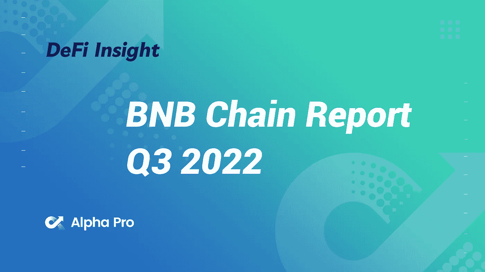
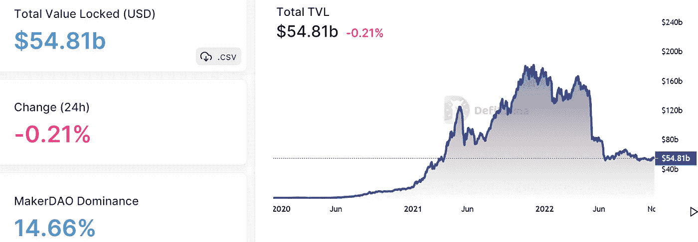
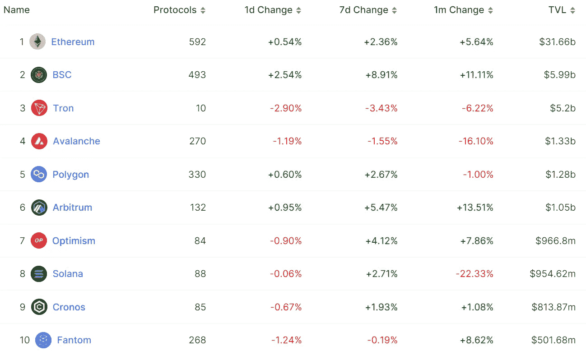
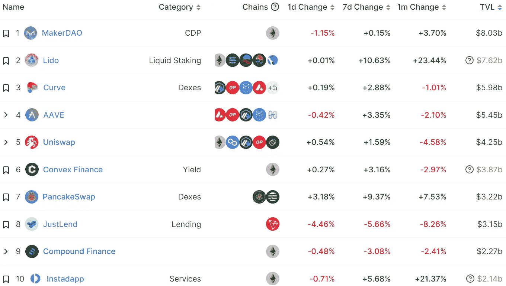
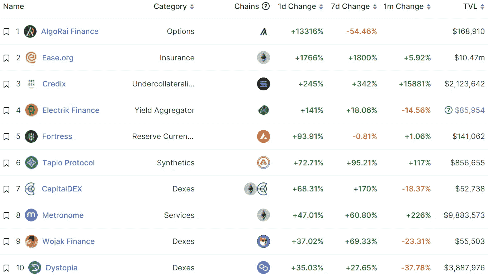
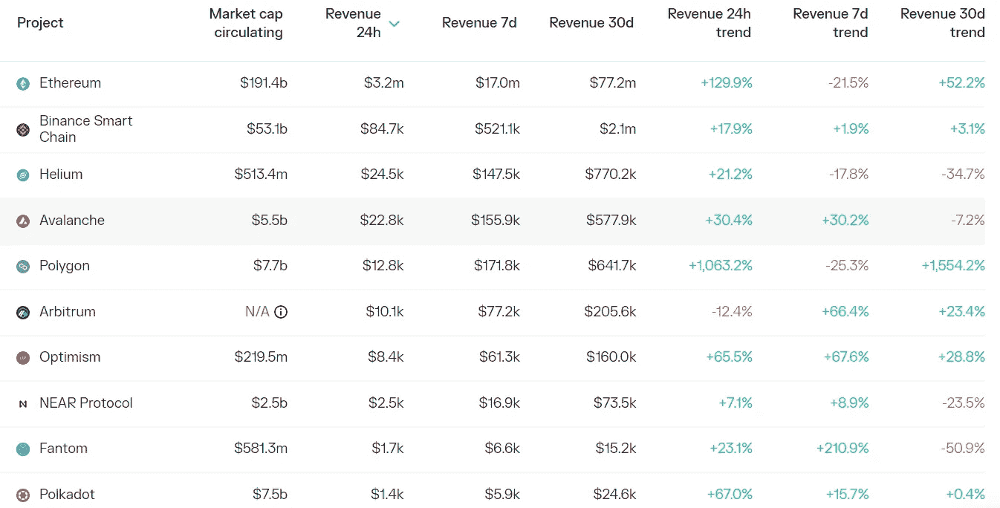

# DeFi Insight | BNB 连锁报告 2022 年第三季度

> 原文：<https://medium.com/coinmonks/defi-insight-bnb-chain-report-q3-2022-274d254cb035?source=collection_archive---------24----------------------->

2022 年 11 月 2 日

*今日 DeFi 数据&由 DeFi Insight 为您带来的新闻*

> *"* 在经历了长达一年的抵御市场熊市的斗争后，部分加密生态系统在 2022 年第三季度开始显示出复苏的迹象。BNB 连锁的第三季度报告证实，加密交易量和分散金融(DeFi)显著增长，但不可伪造的令牌(NFT)交易有所下降。*“@*[*来源*](https://dappradar.com/blog/bnb-chain-report-q3-2022)

# 最新消息

## 第二层

**[**ZkSync**](https://twitter.com/zksync/status/1587507606108614656)**将 Java、Go 和 Python 编程语言集成到其 SDK 中****

## ****指数/交易所/AMM****

******币安密码交易所将 Twitter 用作 Web 3 [“沙箱”，](https://www.coindesk.com/business/2022/11/01/crypto-exchange-binance-to-use-twitter-as-web-3-sandbox-help-musk-fend-off-bots-exec/?utm_medium=referral&utm_source=rss&utm_campaign=headlines)帮助马斯克抵御机器人:Exec******

******首席执行官离职后，T21 加密交易所裁员 30%:独家报道******

******加密交易所交易量创 23 个月新低******

## ******贷款/CDP******

********RGP-28:丝带[出借](https://snapshot.org/#/rbn.eth/proposal/0x59c2eadd43066ab808ebd69a566d8dbfd31ae6e444a020010dfcec373bc10fa8)第二借款人队列********

******数字货币集团任命墨菲为总裁，裁员 10%******

## ******稳定币******

********MIM 发行人 Abracadabra 发起针对 [UST 崩盘](https://snapshot.org/#/abracadabrabymerlinthemagician.eth/proposal/0x15e24bdd8c051e990e91d668a0834cda206438faa26a427f36a55fe76991dfb7)引发的坏账偿还计划的投票********

## ******|令牌******

********雅达利扩展到 Web3 —揭示区块链项目[雅达利 X](https://blockster.com/atari-expands-to-web3-reveals-blockchain-project-atari-x)********

## ******空投******

********Aptos 生态钱包庞迪姆宣布庞迪米地 [NFT](https://twitter.com/PontemNetwork/status/1587624271861481473) 白名单地址********

********Cosmos staking protocol Stride 将于 11 月 22 日向三类用户发放 [STRD](https://twitter.com/stride_zone/status/1587554430228070400) 空投********

## ******NFT******

******创始人对新 NFT 市场的好主意:强制版税******

********最贵 [NFT 收藏品](https://www.guinnessworldrecords.com/world-records/696268-most-expensive-nft-collectible)********

## ******政策与法规******

******印度财政部长称，加密法规是印度担任 G20 轮值主席国期间的 8 项优先计划之一******

******香港想再次成为一个加密中心******

## ******基金******

******风险投资公司 CoinFund 寻求筹集 2 . 5 亿美元种子基金******

********野村子公司以[2 亿美元的估值](https://www.theblock.co/post/181701/nomura-laser-digital-invests-orderly-network-token-round)投资有序网络的令牌轮********

********比特币基地风险投资公司参与 NiftyApes 的[420 万美元](https://www.theblock.co/post/179068/coinbase-ventures-participates-in-4-2-million-funding-round-for-niftyapes)融资轮********

# ******数据和分析******

## ******锁定的总价值(TVL)******

******目前全网 DeFi 总锁定量为 548.1 亿美元，24 小时下降 0.21%。******

************

## ******TVL 评出的十大连锁酒店******

************

## ******|最新 TVL 十大项目******

************

## ******|过去 24 小时内 TVL 增长的前 10 个项目******

************

## ******协议收入******

## ******|累计总收入最高的项目(24H)_ 区块链(L1)******

************

## ******|累计总收入最高的项目(24H) _Dapps (L2)******

************

# ******深潜******

********5 个必备** [**密码分析**](https://newsletter.banklesshq.com/p/5-must-have-crypto-analytics-tools?utm_source=%2Finbox&utm_medium=reader2) **工具********

**** [## 5 个必备的加密分析工具

### 这是我们推出的一个社区资源，旨在帮助你以极快的速度提升你的开放式金融技能，你可以…

newsletter.banklesshq.com](https://newsletter.banklesshq.com/p/5-must-have-crypto-analytics-tools?utm_source=%2Finbox&utm_medium=reader2) 

**[**最重要的辩论**](https://newsletter.banklesshq.com/p/the-most-important-debate-in-crypto?utm_source=%2Finbox&utm_medium=reader2)**

** [## 加密领域最重要的争论

### 📲使用推送协议从加密应用程序获取推送通知，Web3 的通信层打开 Web3 通知…

newsletter.banklesshq.com](https://newsletter.banklesshq.com/p/the-most-important-debate-in-crypto?utm_source=%2Finbox&utm_medium=reader2)** 

# **报告**

****[**多边形状态**](https://messari.io/report/state-of-polygon-q3-2022?referrer=all-research)**Q3 2022**_ 梅萨里****

> ****Polygon 投入了 10 亿美元，并筹集了 4.5 亿美元用于多项 ZK 规模的工作。该策略允许独立团队尝试不同的扩展方法，同时促进紧密的协作和信息共享。
> 总的来说，第三季度全网活动增加，活跃地址创下 600 万的历史新高，新地址季度环比增长 180%，唯一地址总数超过 1.7 亿，总交易量超过 20 亿。不同行业的结果喜忧参半:DeFi 季度环比下降，游戏业务同比大幅增长，NFTs 活跃钱包创下历史新高。Polygon 继续其积极的业务发展战略，宣布与 Acentrik、迪士尼加速器、Reddit、Robinhood、星巴克和 Worldpay 建立新的合作伙伴关系。****

******数字** [**资产**](https://www.theblockresearch.com/digital-asset-macro-environment-q322-update-181244) **宏观环境| Q3'22 更新** _theblockresearch****

******快速洞察:最新** [**稳定关注**](https://www.theblockresearch.com/rapid-insights-latest-stablecoin-developments-181429) **发展**_ 区块研究****

******十月按数字:一看** [**加密交易量**](https://www.theblockresearch.com/october-by-the-numbers-2-181588) **、未平仓利息和矿工收入** _theblockresearch****

******·Cosmos Hub 2.0——它能为** [**$ATOM 持有者带来什么？**](https://tokeninsight.com/en/research/analysts-pick/cosmos-hub-2.0-what-could-it-bring-for-atom-holders) _tokeninsight****

******状态** [**BNB 连锁**](https://messari.io/report/state-of-bnb-chain-q3-2022?referrer=all-research)**Q3 2022**_ 梅萨里****

******数字** [**资产**](https://coinshares.com/research/bi-weekly-digest) **双周刊摘要** _coinshares****

******关于:******

****DeFi Insight 是顶级 DeFi 和加密新闻和更新的来源。****

******https://twitter.com/AlphaPro_io******

********https://medium.com/feed/@alphapro.project**[**RSS:**](https://medium.com/feed/@alphapro.project)******

****提供的信息应被视为发展新闻，而不是投资建议。****

> ****交易新手？尝试[加密交易机器人](/coinmonks/crypto-trading-bot-c2ffce8acb2a)或[复制交易](/coinmonks/top-10-crypto-copy-trading-platforms-for-beginners-d0c37c7d698c)********