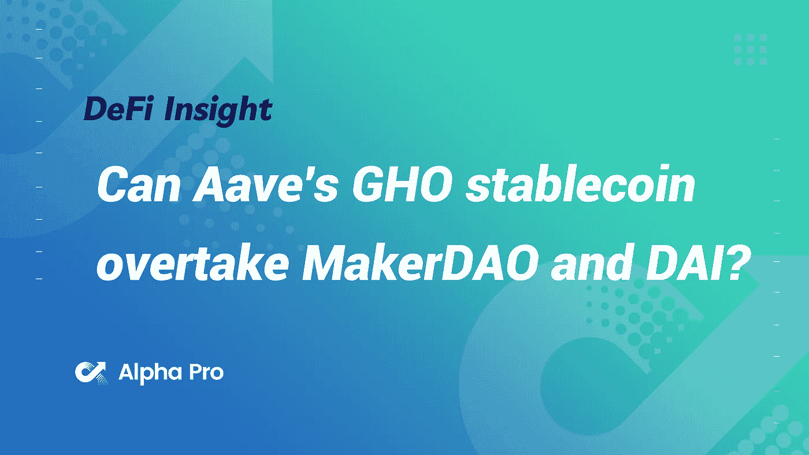
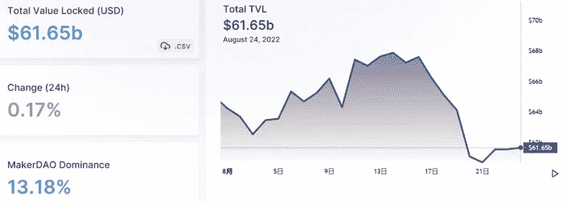
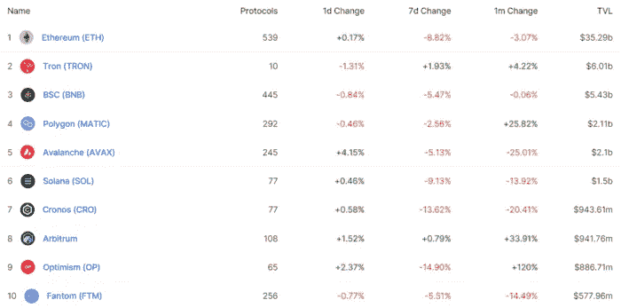
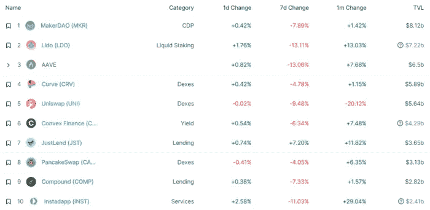
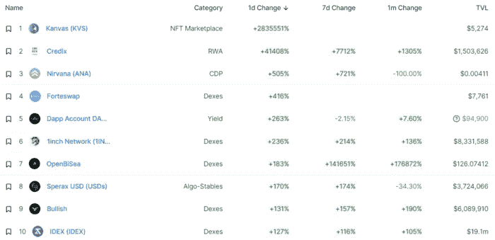
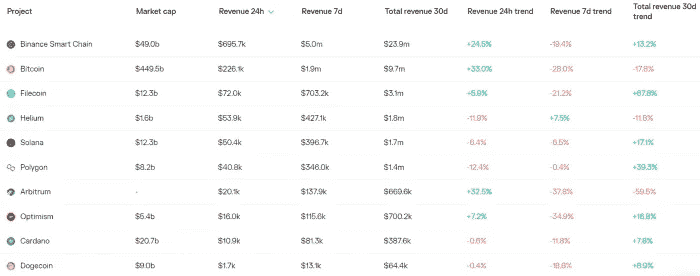
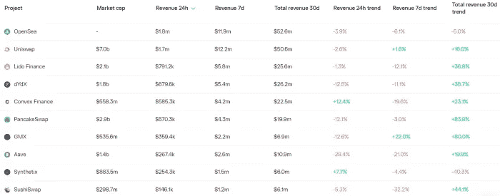
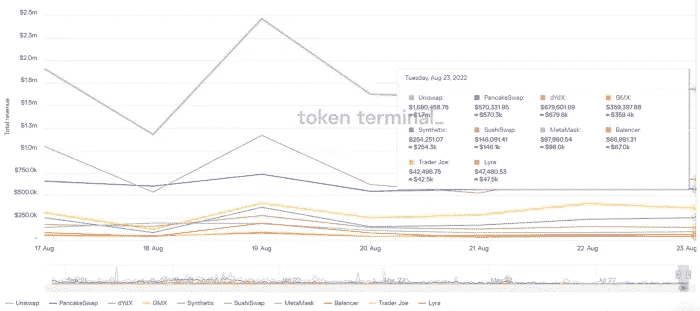
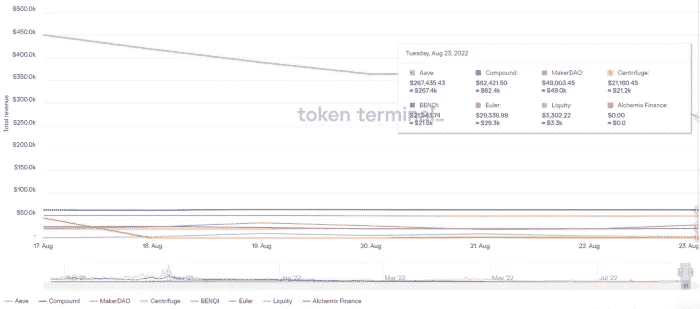

# DeFi Insight | Aave 的 stablecoin 能否超越马克道和戴？

> 原文：<https://medium.com/coinmonks/defi-insight-can-aaves-gho-stablecoin-overtake-makerdao-and-dai-50f272261440?source=collection_archive---------17----------------------->

2022 年 8 月 25 日

*今日 DeFi 数据&由 DeFi Insight 为您带来的新闻*

> *"* 几周前，GHO 稳定币的概念在 Aave 治理论坛上推出，并在 DeFi 引发了一波热潮。事实上，作为协议的下一步，一种分散的、抵押品支持的稳定货币的想法，与美元挂钩，并源于 Aave DAO，是非常有意义的。
> 
> 在这篇文章中，我们将在考虑 Aave DAO 和他的团队如何将它推向市场并将其转化为一种可能与戴一样重要的稳定硬币之前，检查一下所介绍的设计。当然，信息仍然很少，所以文章的第二部分将主要是根据我的 DeFi 经验进行推断。*“@*[*来源*](https://tokenbrice.xyz/aave-gho-stablecoin/#introduction-to-gho-aaves-native-stablecoin)

# 最新消息

## 外汇

东南亚最大的银行 DBS[随着投资者买入 Dip，加密交易量飙升](https://news.bitcoin.com/largest-southeast-asian-bank-dbs-sees-crypto-trading-volumes-soar-as-investors-bought-the-dip/)

## 稳定币

**[系绳](https://tether.to/en/tether-holds-firm-on-decision-not-to-freeze-tornado-cash-addresses-awaits-law-enforcement-instruction/)坚持不冻结 Tornado 现金地址的决定，等待执法指令**

## **|合并**

****[Mainnet 合并](https://blog.ethereum.org/2022/08/24/mainnet-merge-announcement/)公告****

## ****|令牌****

******[大自然的金库](https://thecryptobasic.com/2022/08/25/natures-vault-launches-gold-linked-utility-token-nvlt-in-the-polygon-ecosystem/)在多边形生态系统中推出黄金挂钩的实用令牌 NVLT******

******比特币基地宣布 [cbETH](https://decrypt.co/108180/coinbase-announces-cbeth-wrapped-ethereum-staking-token) 包裹以太坊赌注令牌******

********[安全](https://forum.gnosis-safe.io/t/safe-voting-power-and-circulating-supply/558)表决电源和循环电源********

## ******提议******

********、** eIP 17: [将 stETH 提升至抵押品层](https://forum.euler.finance/t/eip-17-promote-steth-to-collateral-tier/351)******

## ****空投****

******[空投维修](https://twitter.com/DogechainFamily/status/1562687487012548609)公告******

## ******叉子******

********以太坊主网影[叉 12](https://github.com/eth-clients/merge-testnets/tree/main/mainnet-shadow-fork-12) 发生在 8 月 31 日********

## ******采矿******

******Nvidia 首席财务官:不断下降的加密价格和共识机制的变化影响了对其产品的需求******

********/**比特币矿工 [Argo](https://www.theblock.co/post/165528/bitcoin-miner-argo-slashes-hash-rate-growth-estimate-by-42?utm_source=feedly&utm_medium=rss) 将杂凑率增长预期下调 42%******

## ****NFT****

****这些无聊的猿类会在你的口中融化:M&M’s 发布 NFT 风格的糖果****

******可变利率 [GDAs](https://www.paradigm.xyz/2022/08/vrgda)******

********web 3 开发者平台 [Alchemy](https://mobile.twitter.com/arbitrum/status/1562566952710979585) 在 Arbitrum 上发布 NFT API********

## ******基金******

******Haun Ventures 领投 2400 万美元进入 web3 开发者平台 Thirdweb******

********、** Worldcoin 联合创始人离开公司[创办“新经济黑石”](https://techcrunch.com/2022/08/24/worldcoin-co-founder-novendstern-leaves-startup-to-start-new-venture/)******

****以色列风险投资公司 Cyberstarts 筹集了 6000 万美元的种子资金****

## ****观点****

******[维塔利克](https://cointelegraph.com/news/vitalik-people-still-underrate-the-superiority-of-crypto-payments?utm_source=blockworks-research):人们仍然“低估”加密支付的优越性******

# ******数据和分析******

## ******锁定的总价值(TVL)******

******目前全网 DeFi 总锁定量为 616.5 亿美元，24 小时增长 0.17%。******

************

## ******TVL 评出的十大连锁酒店******

************

## ******|最新 TVL 十大项目******

************

## ******|过去 24 小时内 TVL 增长的前 10 个项目******

************

## ******协议收入******

## ******|累计总收入最高的项目(24H)_ 区块链(L1)******

************

## ******|累计总收入最高的项目(24H) _Dapps (L2)******

************

## ******|前 10 大交易所的每日收入******

************

## ******|十大贷款协议的日收入******

************

# ******深潜******

********[**比特币挖矿**](https://bitcoinmagazine.com/business/lessons-from-a-decade-of-bitcoin-mining) 十年的七个教训********

**** [## 我从十年的比特币挖掘中学到的七个教训

### 这是世界上最大的数字资产公司之一创世纪数字资产公司的首席执行官 Marco Streng 的评论文章。

bitcoinmagazine.com](https://bitcoinmagazine.com/business/lessons-from-a-decade-of-bitcoin-mining) 

**[**dNFT**](/blockchain-capital-blog/dnft-metadata-enabled-83214588d1a7)**，元数据启用****

** [## dNFT，启用元数据

### 我们需要更复杂和动态的元数据，让 NFT 在未来开放和分散的金融市场中扮演更重要的角色

medium.com](/blockchain-capital-blog/dnft-metadata-enabled-83214588d1a7) 

**合并** [**是否被过度炒作**](https://newsletter.banklesshq.com/p/is-the-merge-overhyped) **？**

 [## 合并是否言过其实？

### 亲爱的无银行国家，早在四月，我们主持了一场关于 UST 和 Terra 的有争议的辩论。就在这之前…

newsletter.banklesshq.com](https://newsletter.banklesshq.com/p/is-the-merge-overhyped) 

# 报告

**[**DeFi 的 Stablecoins 战斗余波**](https://dappradar.com/blog/defis-stablecoins-battle-fallout-from-terra-tornado-cash-and-the-ethereum-merge) **来自 Terra、龙卷风 Cash、以太坊合并** _dappradar**

> **stablecoins 的市场在过去两年中显著增长，现在是加密生态系统中最重要的组成部分之一。稳定货币依靠不同的方法来维持相对于一种或几种货币或其他资产(包括加密资产)的稳定价值。相比之下，其他人利用算法来保持稳定的值。Stablecoin 市值最高时超过 1600 亿美元，目前为 1428.2 亿美元。**

****[**NFTs**](https://www.elliptic.co/resources/nfts-financial-crime?utm_campaign=NFT%20Report%202022&utm_content=218984818&utm_medium=social&utm_source=twitter&hss_channel=tw-1344645140)**和金融犯罪**_ 椭圆****

******[**Synthetix**](https://members.delphidigital.io/reports/synthetix-paves-an-optimistic-path)**铺就乐观之路** _delphidigital******

******分析** [**老虎环球**](https://www.theblockresearch.com/analysis-of-tiger-globals-13-f-filing-165218) **的 13-F 归档** _theblockresearch****

******[**索拉纳项目收入**](https://mirror.xyz/0x9b7e7c5B53081d0C6d09b91F13783D58B772b011/4az30E_1YAGfmnd2NY3EyWdf2vgIo3uWL4adzcEhsnc) **周报 8/25/2022** _Alpha Pro******

******关于:******

****DeFi Insight 是顶级 DeFi 和加密新闻和更新的来源。****

******https://twitter.com/AlphaPro_io 推特:******

********❤RSS:**[**https://medium.com/feed/@alphapro.project**](https://medium.com/feed/@alphapro.project)******

****提供的信息应被视为发展新闻，而不是投资建议。****

> ****交易新手？试试[加密交易机器人](/coinmonks/crypto-trading-bot-c2ffce8acb2a)或[复制交易](/coinmonks/top-10-crypto-copy-trading-platforms-for-beginners-d0c37c7d698c)**********