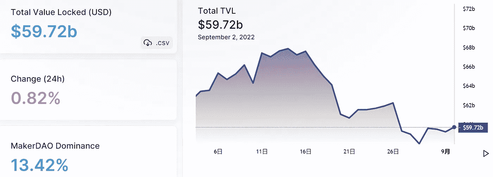
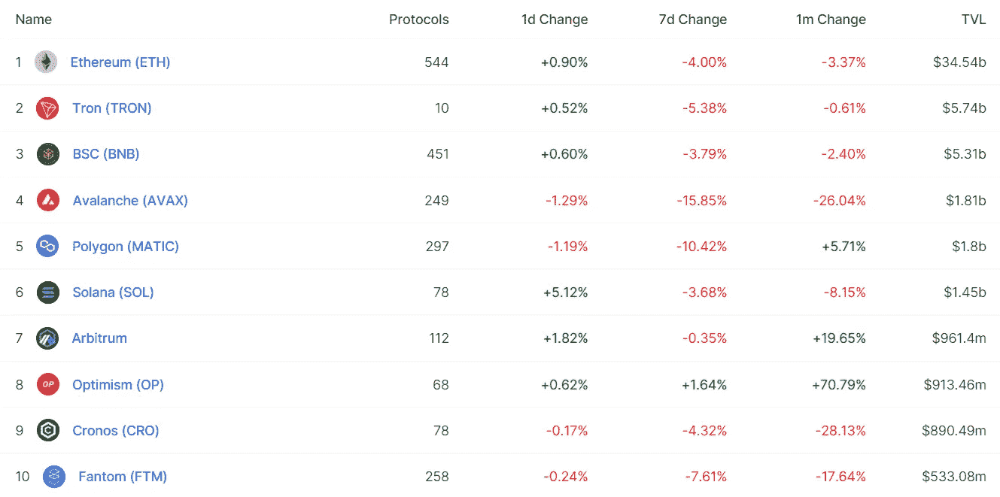
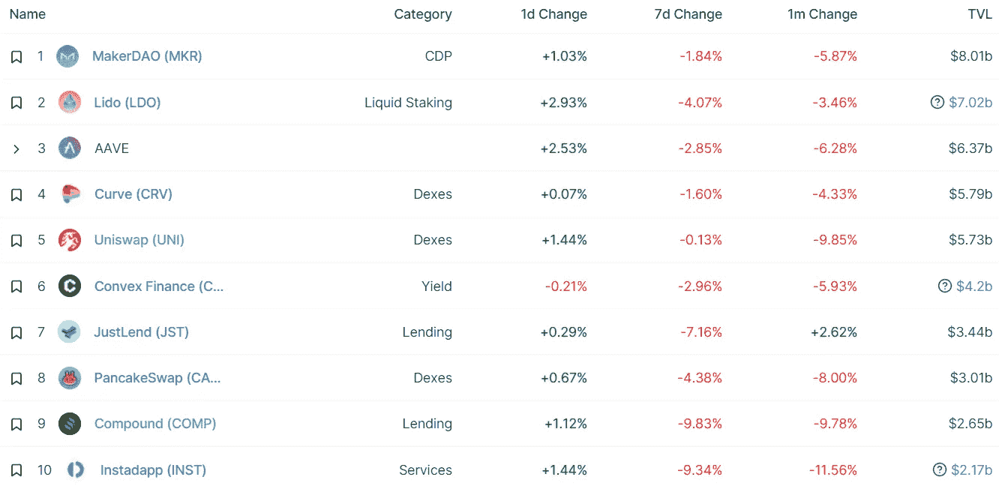
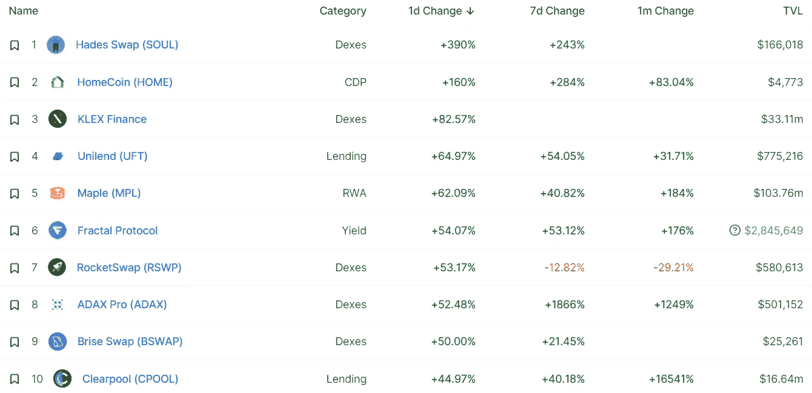
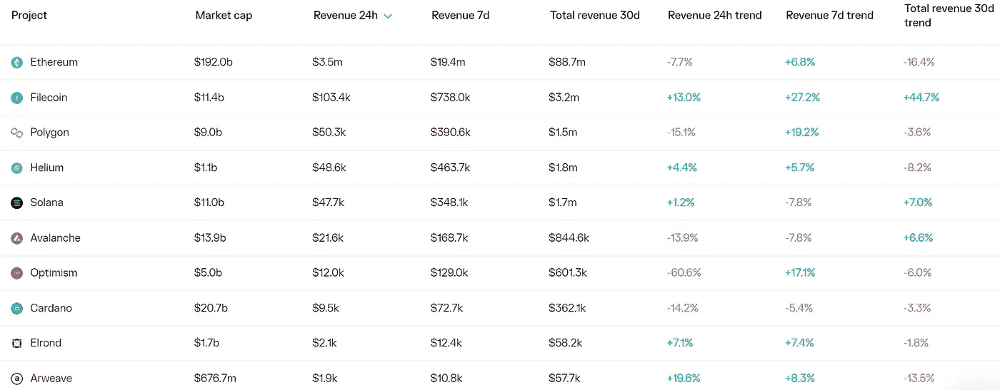
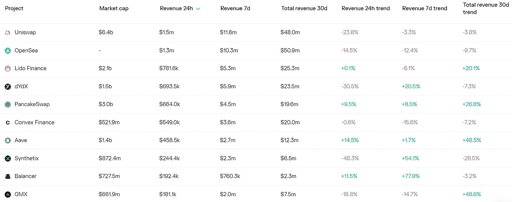

# DeFi Insight |免费游戏能成功吗？

> 原文：<https://medium.com/coinmonks/defi-insight-can-free-to-own-blockchain-games-succeed-890a6f7c99c6?source=collection_archive---------15----------------------->

2022 年 9 月 2 日

*今天的 DeFi 数据&DeFi Insight 带给您的新闻*

> *“*极限突破正在引入一种新的货币化模式，称为“自由拥有”，玩家可以免费铸造创世纪 NFT。随着时间的推移，这些 NFT 预计将获得空投和其他奖励。
> digi daigaku NFT 在不到 30 天前刚推出时是免费的。有资格观看明天快照的持有者将被空投一个名为《血统》的未被看到的 NFT 收藏。
> 自由拥有模式经常被批评为向早期社区成员泄露价值。在免费造币厂之后发现游戏的玩家仍然需要在二级市场上购买 NFT。 *@* [*来源*](https://members.delphidigital.io/reports/can-free-to-own-blockchain-games-succeed)

# 最新消息

## | LENDING

**破产**破产[摄氏度](https://www.bloomberg.com/news/articles/2022-09-01/bankrupt-celsius-seeks-to-return-50-million-of-locked-crypto?srnd=cryptocurrencies-v2#xj4y7vzkg)寻求返还 5000 万美元的锁定密码

**、**、[复方](https://www.thedefiant.io/compound-ceth-frozen) ETH 市场因升级臭虫被冻结

## | EXCHANGE

**多链 DEX [KyberSwap](https://thecryptobasic.com/2022/09/02/multi-chain-dex-kyberswap-loses-265k-in-latest-defi-exploit/) 在最新的 DeFi 开发中损失 26.5 万美元**

****[Orca](https://blockworks.co/orca-is-uniswap-v3-on-solana-with-open-source-code-and-grants/)是 Solana 上的 Uniswap V3，这要归功于开放源代码和 Grants****

## ****| STAKING****

******IMX Staking 的下一次进化******

## ******| TOKEN******

********[SUDO](https://blog.sudoswap.xyz/sudo-distribution.html)分布********

## ******| AIRDROP******

********[脱焊](https://twitter.com/DeHealth_World/status/1565066041415327745)空投********

## ******|鲸******

********[ETH weeks](https://beincrypto.com/eth-whales-move-ethereum-exchanges-awaiting-merge/)将 Ethereum 移至交易所等待合并********

## ******| MINING******

********[Bitfarms](https://www.globenewswire.com/news-release/2022/09/01/2508379/0/en/Bitfarms-Provides-August-2022-Production-and-Mining-Operations-Update.html)提供 2022 年 8 月生产和采矿作业更新********

## ******政策与法规******

********[国会质疑比特币基地](https://news.bitcoin.com/congress-questions-coinbase-ftx-binance-kraken-in-crypto-fraud-crackdown/)、FTX、币安、北海巨妖在打击密码欺诈********

********国际货币基金组织称[新的全球 CBDC 平台可能降低支付成本](https://www.coindesk.com/policy/2022/09/01/new-global-cbdc-platform-could-cut-payment-costs-imf-says/)********

## ******NFT******

******你现在可以从无聊的猿 NFT 那里得到建议了******

********[币安实验室领导 SPACE ID 的种子轮](https://www.binance.com/en/blog/ecosystem/binance-labs-leads-space-ids-seed-round-to-support-the-universal-naming-service-network-3794531649109980025)支持通用命名服务网络********

## ******基金******

********银行平台 [LevelField](https://www.theblock.co/post/167119/banking-platform-levelfield-is-raising-50-million-secures-first-acquisition) 融资 5000 万美元，确保第一笔收购********

# ******数据和分析******

## ******锁定的总价值(TVL)******

******目前全网 DeFi 总锁定量为 597.2 亿美元，24 小时增长 0.82%。******

************

## ******TVL 评出的十大连锁酒店******

************

## ******|最新 TVL 十大项目******

************

## ******|过去 24 小时内 TVL 增长的前 10 个项目******

************

## ******协议收入******

## ******|累计总收入最高的项目(24H)_ 区块链(L1)******

************

## ******|累计总收入最高的项目(24H) _Dapps (L2)******

************

# ******深潜******

********[**NFT 分析**](https://metaversal.banklesshq.com/p/nft-analytics-roundup?utm_source=%2Finbox&utm_medium=reader2) **综述**********

**** [## NFT 分析综述👁️

### 亲爱的无银行国家，NFT 分析空间在短时间内取得了长足的进步。几年前，这个部门没有…

metaversal.banklesshq.com](https://metaversal.banklesshq.com/p/nft-analytics-roundup?utm_source=%2Finbox&utm_medium=reader2) 

**[**比特币挖矿**](https://arcane.no/research/how-bitcoin-mining-can-transform-the-energy-industry-new-report) **如何改造能源行业****

** [## 比特币采矿如何改变能源行业

### 比特币矿工是独特灵活的能源消费者，可以帮助解决我们一些最大的能源问题。学习…

神秘，不](https://arcane.no/research/how-bitcoin-mining-can-transform-the-energy-industry-new-report) 

**[**以太坊 2.0**](/blockchain-biz/will-ethereum-2-0-render-existing-layer-2-solutions-obsolete-143c9f98330c) **是否会使现有的第二层解决方案过时？****

** [## 以太坊 2.0 会使现有的第 2 层解决方案过时吗？

### 如果你在过去一年左右的时间里一直在关注区块链行业，我相信你一定听说过…

medium.com](/blockchain-biz/will-ethereum-2-0-render-existing-layer-2-solutions-obsolete-143c9f98330c) 

**使用** [**MEV-Boost 使用特征层**](https://hackmd.io/@layr/SkBRqvdC5) 保留块提议器代理

 [## 使用特征层 HackMD 的 MEV-Boost

### 使用“”语法来包含此主题。

hackmd.io](https://hackmd.io/@layr/SkBRqvdC5)** 

# **报告**

****[**一看加密交易量**](https://www.theblockresearch.com/august-by-the-numbers-2-166725) **、未平仓利息和矿工收入** _theblockresearch****

> ****调整后的总环比下降 4.2%，至 3980 亿美元。总共有 38386 个以太币被烧毁，相当于 6560 万美元。以太坊上 NFT 市场的月成交量下降了 9.9%，至 6.12 亿美元。
> 集中交易所现货交易量下降 0.4%，至 6303 亿美元。以太坊期货和期权的未平仓合约和交易量都增加了，因为市场正在为即将到来的以太坊合并做准备。****

******浏览 Web3 薪酬:框架报告**_ 框架****

******[**DappRadar 区块链**](https://dappradar.com/blog/dappradar-blockchain-industry-report-august-2022) **行业报告—2022 年 8 月** _dappradar******

******[**克莱滕**](https://messari.io/report/klaytn-the-enterprise-grade-evm) **:企业级 EVM**_ 梅萨里******

******关于:******

****DeFi Insight 是顶级 DeFi 和加密新闻和更新的来源。****

******https://twitter.com/AlphaPro_io**❤[t51】](https://twitter.com/AlphaPro_io)****

******❤RSS:**[**https://medium.com/feed/@alphapro.project**](https://medium.com/feed/@alphapro.project)****

****提供的信息应被视为发展新闻，而不是投资建议。****

> ****交易新手？试试[加密交易机器人](/coinmonks/crypto-trading-bot-c2ffce8acb2a)或者[复制交易](/coinmonks/top-10-crypto-copy-trading-platforms-for-beginners-d0c37c7d698c)**********