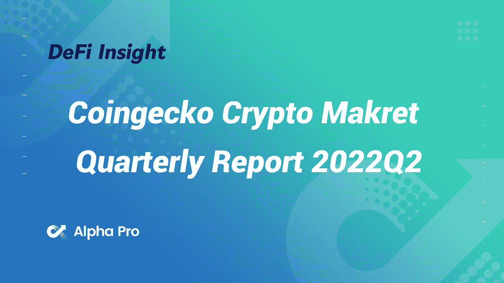
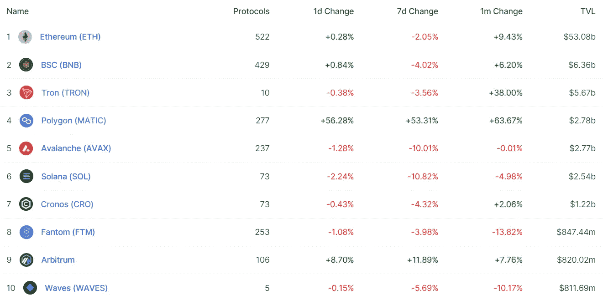
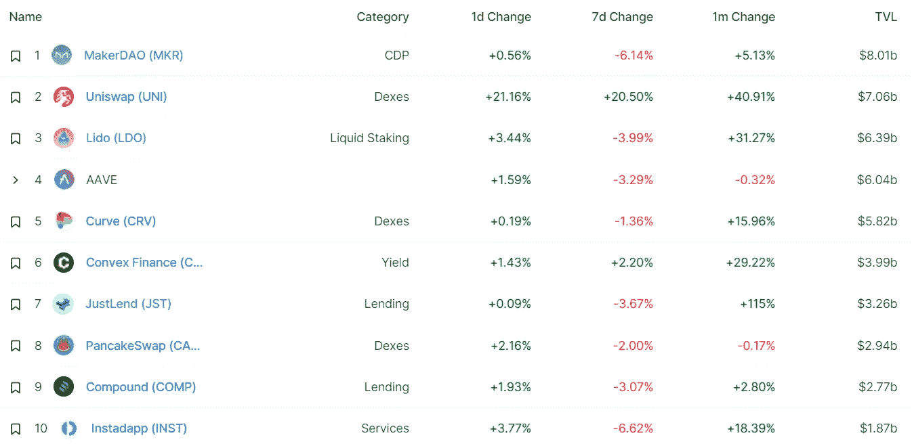
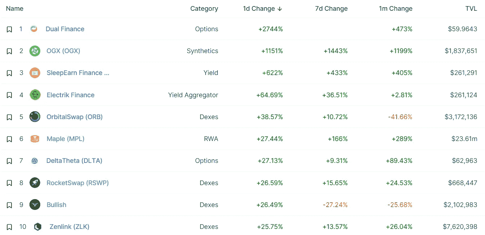
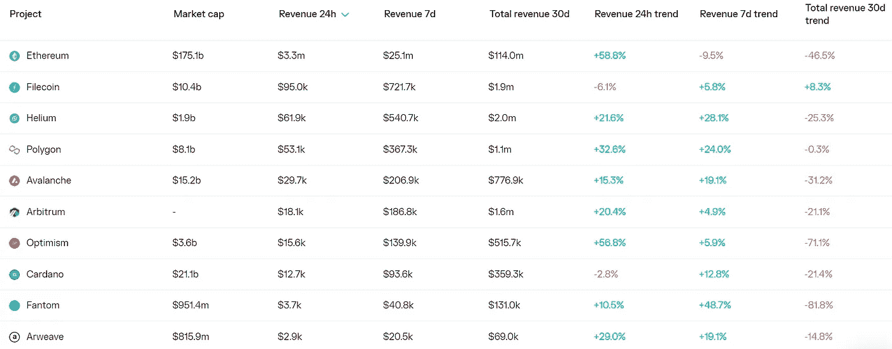
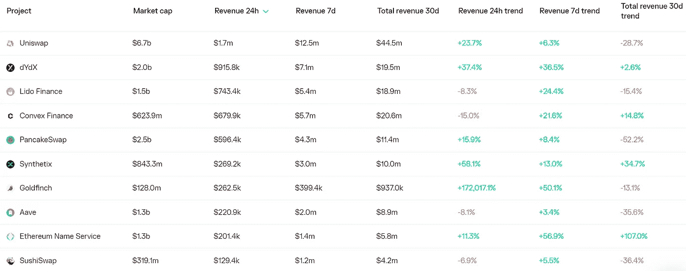
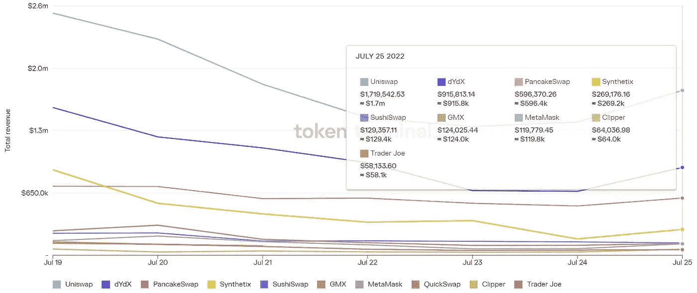
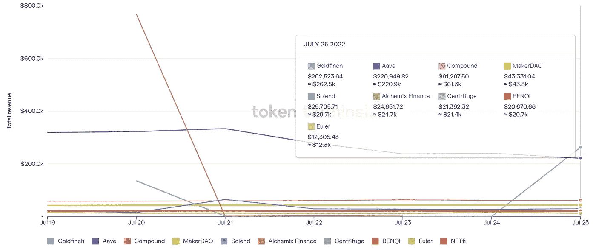

# DeFi Insight | coin gecko Crypto Makret 季度报告 2022Q2

> 原文：<https://medium.com/coinmonks/defi-insight-coingecko-crypto-makret-quarterly-report-2022q2-901787b7ced3?source=collection_archive---------23----------------------->

2022 年 7 月 27 日

*今日 DeFi 数据&由 DeFi Insight 为您带来的新闻*

> *"* 随着时间的推移，2022 年 Q2 奥运会对加密市场来说是多事之秋。总的加密市值目前为 9000 亿美元，环比下降超过 50%，自 2021 年 11 月的峰值以来下降约 70%。与现在相比，Q1 感觉像是暴风雨前的平静。*“@*[*来源*](https://s2.tokeninsight.com/static/research/file/levelPdf/2022_Q2_Quarterly_Report.pdf)

# 最新消息

## 外汇

**[北海巨妖](https://www.coindesk.com/policy/2022/07/26/kraken-under-investigation-for-alleged-sanctions-violations-report/)因涉嫌违反制裁接受调查:报告**

****币安期货将推出[杠杆高达 20 倍的 BUSD 保证金 ETC 永续合约](https://www.binance.com/en/support/announcement/09231ee25f204de98513f9efe1ed9d38)****

## ****稳定币****

******[USDC 会废黜 USDT](https://bitcoinist.com/will-usdc-dethrone-usdt-this-report-says-yes/) 吗？这份报告说是的******

## ******第二层******

******乐观主义为 Crypto 的最新集体提供动力******

## ******|令牌******

******等待安全令牌的投资者现在可以购买[灵知令牌](https://www.coindesk.com/markets/2022/07/26/investors-waiting-for-safe-token-can-buy-gnosis-tokens-for-now/)******

********连锁店将于 7 月 27 日公开发售其 [CHA Token](https://coinquora.com/chains-to-launch-the-public-sale-of-its-cha-token-on-july-27/)********

## ******提议******

********、**报销方案[ [地平线](https://talk.harmony.one/t/reimbursement-proposal-horizon-incident/20665)事件]******

## ****鲸鱼****

****两只 ETH 鲸[购买了 534B 柴犬](https://thecryptobasic.com/2022/07/27/top-eth-whales-gobbles-up-533-99-billion-shiba-inu-shib-worth-5-62-million-in-24-hours/)，作为柴犬重返 100 只最大 ETH 鲸中前 10 名代币购买者****

## ****采矿****

******[核心科学](https://www.businesswire.com/news/home/20220726005505/en/Core-Scientific-Announces-Agreement-to-Host-75MW-of-ASIC-Servers)宣布同意托管 75MW ASIC 服务器******

********[矿业](https://cryptonews.com/news/mining-disrupt-2022-features-rebel-mining-company.htm)扰乱 2022 年功能反叛矿业公司********

## ******政策与法规******

******法国法律的不确定性促使 F1 赛车手移除加密品牌:报道******

******美国参议员提出法案，让低于 50 美元的加密商品免税******

********加密保管人[小牧牛](https://blockworks.co/crypto-custodian-komainu-follows-exchanges-to-dubai/)跟随交易所前往迪拜********

## ******NFT******

********[永恒游戏工作室](https://www.nftgators.com/immutable-games-studio-lays-off-multiple-staff-members-including-senior-game-designer/)解雇多名员工，包括资深游戏设计师********

********[莱杰推出全球最安全的 NFT 市场](https://www.ledger.com/blog/ledger-launches-ledger-market-the-worlds-most-secure-nft-marketplace-mints-our-within-24-hours)【莱杰】市场，24 小时内投入运营********

## ******基金******

********[余波群岛](https://www.bloomberg.com/press-releases/2022-07-26/aftermath-islands-secures-usd-25-million-commitment-from-lda-capital)获得 LDA 资本 2500 万美元的承诺********

********[Atato](https://cryptogainn.com/atato-announces-a-6-million-series-a-raise-led-by-alphalab-capital-and-febe-ventures-for-its-multi-party-computation-institutional-grade-custody-for-any-blockchain-or-token/)宣布获得由 AlphaLab Capital 和 FEBE 风险投资公司牵头的 600 万美元 A 轮融资，用于其任何区块链或令牌的多方计算机构级托管********

# ******数据和分析******

## ******锁定的总价值(TVL)******

******目前全网 DeFi 总锁定量为 841.2 亿美元，24 小时增长 1.74%。******

************

## ******TVL 评出的十大连锁酒店******

************

## ******|最新 TVL 十大项目******

************

## ******|过去 24 小时内 TVL 增长的前 10 个项目******

************

## ******协议收入******

## ******|累计总收入最高的项目(24H)_ 区块链(L1)******

************

## ******|累计总收入最高的项目(24H) _Dapps (L2)******

************

## ******|前 10 大交易所的每日收入******

************

## ******|十大贷款协议的日收入******

************

# ******深潜******

********[**SNX**](https://secretsalsa.substack.com/p/the-case-for-snx-to-go-back-to-aths-b15)**回到阿塞斯**********

**** [## SNX 回到雅典奥运会的理由

### 综合债务模型一直是一把双刃剑:在牛市中，德根斯利用可持续发展债券购买其他…

secretsalsa.substack.com](https://secretsalsa.substack.com/p/the-case-for-snx-to-go-back-to-aths-b15) 

**,**[**DeFi 的未来**](/@Ignas_defi_research/future-of-defi-top-7-trends-based-on-analyzing-25-protocols-6a2a3f1ba167) **:基于对 25 个协议分析的 7 大趋势**

 [## DeFi 的未来:基于 25 个协议分析的 7 大趋势

### 2022 年的隐秘熊市已经骤然而至，如火如荼。然而，大多数 DeFi 令牌的情况甚至更糟…

medium.com](/@Ignas_defi_research/future-of-defi-top-7-trends-based-on-analyzing-25-protocols-6a2a3f1ba167) 

**有效性证明是** [**无效**](https://blog.connext.network/validity-proofs-are-not-effective-for-bridging-blockchains-85b5e3b22a35) **为桥接区块链**

 [## 有效性证明对于桥接区块链是无效的

### 什么是有效性证明，为什么它们不是桥接的合适的独立解决方案

blog.connext.network](https://blog.connext.network/validity-proofs-are-not-effective-for-bridging-blockchains-85b5e3b22a35) 

**[**用灵知安全防御 NFTs**](https://metaversal.banklesshq.com/p/defending-nfts-with-gnosis-safe-)**

**** [## 用 Gnosis Safe 防御 NFTs🔩

### 亲爱的无银行国家，你有想要长期安全储存的 NFT 吗？这方面的一个很好的资源是 Gnosis Safe…

metaversal.banklesshq.com](https://metaversal.banklesshq.com/p/defending-nfts-with-gnosis-safe-) 

**[**用密码叉和空投**制造被动收入](/the-capital/make-passive-income-with-crypto-forks-and-airdrops-19d0aac76aa2)**

**** [## 通过加密分叉和空投获得被动收入

### 你需要知道的一切，使加密叉子和空投被动收入。

medium.com](/the-capital/make-passive-income-with-crypto-forks-and-airdrops-19d0aac76aa2)**** 

# ****报告****

******[**Crypto 熊市**](https://crypto.com/research/crypto-bear-markets/) **—详细分析** _crypto.com******

> ****熊市是加密市场周期的自然组成部分。这份报告深入研究了熊市的细节，分析了熊市的特征、趋势和投资者的机会。****

******[**区块链**](https://www.cbinsights.com/research/report/blockchain-trends-q2-2022/) **Q2'22 报告** _cbinsights******

******[**沙盒的状态**](https://messari.io/article/state-of-the-sandbox-q2-2022)**Q2 2022**_ 梅萨里******

******[**宇宙**](https://coinshares.com/research/cosmos-asset-highlight)资产亮点 _coinshares******

******关于:******

****DeFi Insight 是顶级 DeFi 和加密新闻和更新的来源。****

******https://twitter.com/AlphaPro_io 推特:******

********❤RSS:**[**https://medium.com/feed/@alphapro.project**](https://medium.com/feed/@alphapro.project)******

****提供的信息应被视为发展新闻，而不是投资建议。****

> ****交易新手？试试[加密交易机器人](/coinmonks/crypto-trading-bot-c2ffce8acb2a)或[复制交易](/coinmonks/top-10-crypto-copy-trading-platforms-for-beginners-d0c37c7d698c)************