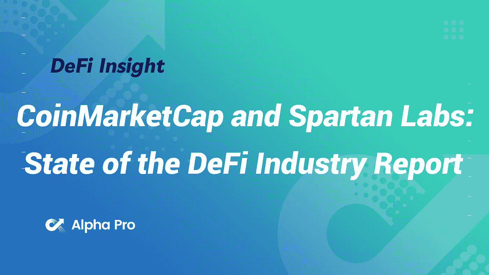
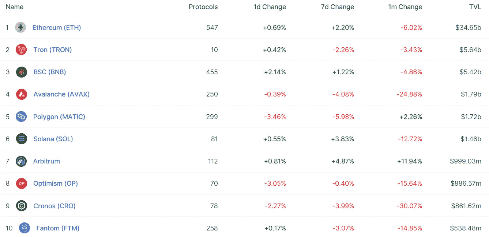
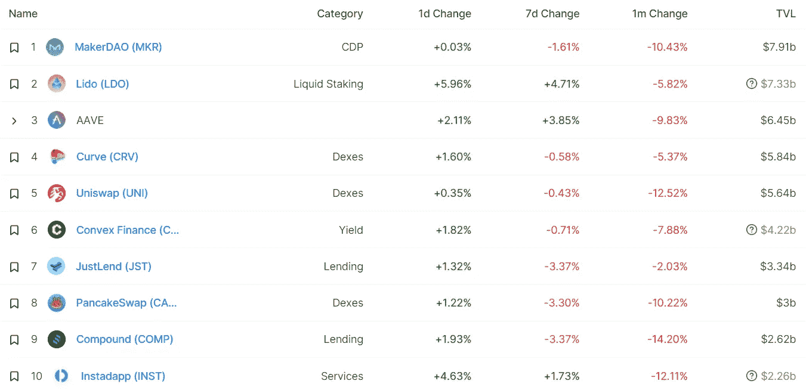
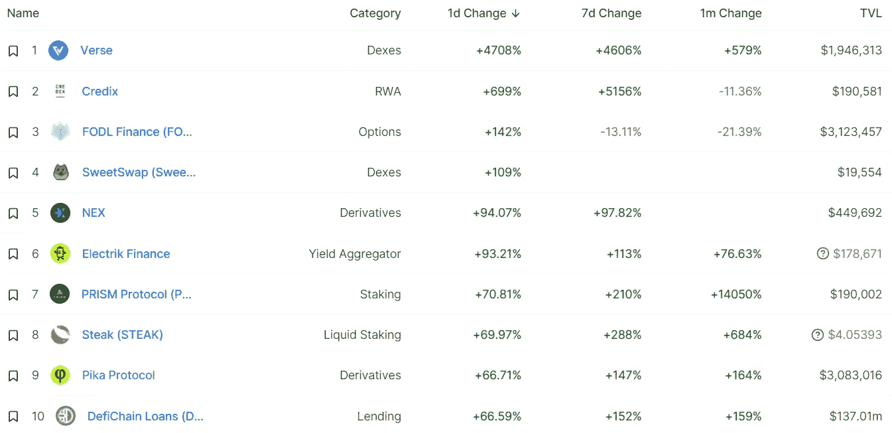
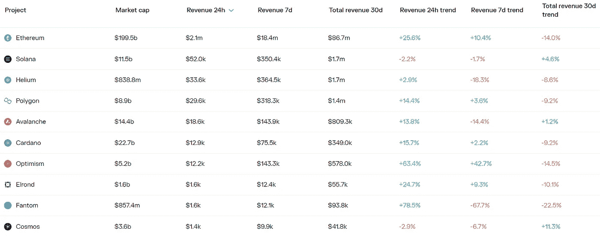
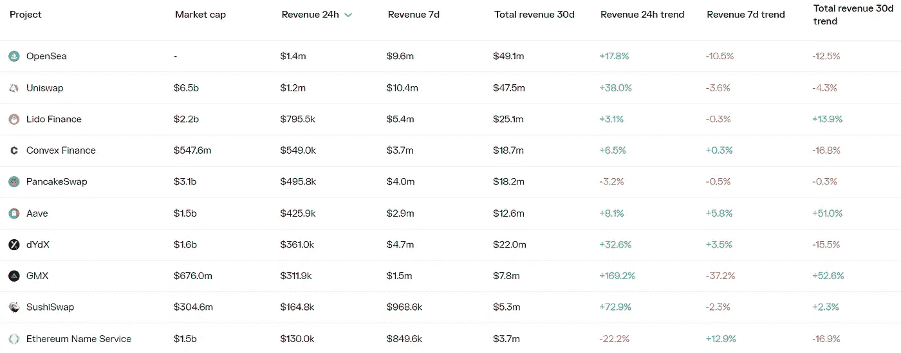

# DeFi Insight | CoinMarketCap 和 Spartan Labs:DeFi 行业状况报告

> 原文：<https://medium.com/coinmonks/defi-insight-coinmarketcap-and-spartan-labs-state-of-the-defi-industry-report-18d9b86a38cf?source=collection_archive---------33----------------------->

2022 年 9 月 6 日

*今日 DeFi 数据&由 DeFi Insight 为您带来的新闻*

> *"* 分散式金融(DeFi)的出现给加密行业带来了风暴。
> 
> 这个故事源于 Reddit 用户 u/vbuterin(现被广泛称为 Vitalik Buterin，以太坊的联合创始人)在 2016 年进行的一项假设性思维实验。他提出了一个想法，以链上自动做市商的方式运行链上分散的交易所，类似于预测市场。这随后导致了建立在区块链技术之上的分散式金融系统的产生。
> 自那以后，DeFi 行业飞速发展，成为一个价值数十亿美元、充满机遇的蓬勃发展的生态系统。在 2021 年 12 月的巅峰时期，DeFi 在多个区块链生态系统和应用中获得了高达 2479.6 亿美元的总价值锁定(TVL)。然而，在所有宏观经济不确定性、地缘政治紧张局势、DeFi 黑客和剥削的增加、总体市场低迷以及最近事件(Terra、3AC、Celsius 的崩溃)导致的日益悲观的前景之后，DeFi 空间受到了巨大打击，TVL 在 2022 年 6 月跌至 674.6 亿美元的低点。这引发了一个问题:迪菲死了吗？*“@*[*来源*](https://coinmarketcap.com/alexandria/article/coinmarketcap-and-spartan-labs-state-of-the-defi-industry-report)

# 最新消息

## 外汇

第三大稳定币发行者币安停止支持更大的竞争对手 USDC

## 打桩

**基于宇宙的液态打桩协议 [Stride](https://twitter.com/stride_zone/status/1566939093963083778) 在 Mainnet 上线**

## **产量**

****宣布[barn bridge v2](/barnbridge/announcing-barnbridge-v2-sustainable-fixed-interest-in-defi-made-easy-fa5983cdcf99):DeFi 的可持续固定利息变得容易****

## ****衍生产品****

******[dYdX](https://mobile.twitter.com/dYdX/status/1566859411498405895)与 BitKeep 钱包达成战略合作伙伴关系******

## ******市场******

******大约两年来，秘密交易者看到了从最紧张的区间逃脱的机会******

## ******|令牌******

********/**如何:加入制刀者上的[汗币](/sweat-economy/how-to-join-the-sweat-token-sale-on-dao-maker-e0b1dfa2e6b)出售******

## ****支付****

******支付公司[明智地](https://finbold.com/payment-firm-wise-rules-out-crypto-remittances-support-citing-high-costs/)以高成本为由排除加密汇款支持******

## ******提议******

********[Aave V3](https://app.aave.com/governance/proposal/?proposalId=98)追溯拨款********

********/**[链间利多](https://research.lido.fi/t/lido-for-the-interchain/2886)******

## ****政策与法规****

****英国新首相利兹·特拉斯对加密货币有什么看法****

******[澳洲](https://cryptoslate.com/australia-creates-special-crypto-police-unit-to-crack-down-on-money-laundering/)成立特种秘密警察部队打击洗钱******

## ******NFT******

********[以太坊域名](https://decrypt.co/109028/ethereum-domain-names-top-nfts-as-most-traded-asset-on-opensea)成为 OpenSea 上交易量最大的资产********

******世界上最昂贵的食谱的作者维卡斯·卡纳发布了 NFTs******

********翼金融推出 [NFT 首付](/@Wing_Finance/wing-finance-launches-nft-down-payment-221909112ef8)********

## ******基金******

******灰尘实验室已经筹集了 700 万美元的战略资金来建立一个$DUST 生态系统******

********[估值 1 亿美元的区块链孵化器](https://cointelegraph.com/news/blockchain-incubator-valued-at-100m-following-ngc-ventures-led-series-a)继 NGC 风投领投 A 轮之后********

## ******观点******

******美国最高检察官表示，Ripple 和 SEC 可能在 2022 年 12 月前达成和解******

# ******数据和分析******

## ******锁定的总价值(TVL)******

******目前全网 DeFi 总锁定量为 595.2 亿美元，24 小时增长 0.74%。******

************

## ******TVL 评出的十大连锁酒店******

************

## ******|最新 TVL 十大项目******

************

## ******|过去 24 小时内 TVL 增长的前 10 个项目******

************

## ******协议收入******

## ******|累计总收入最高的项目(24H)_ 区块链(L1)******

************

## ******|累计总收入最高的项目(24H) _Dapps (L2)******

************

# ******深潜******

********所有关于** [**多边形 zkEVM 和 zkEVM 汇总**](https://mirror.xyz/msfew.eth/JJudP_Kf-IS6VhbF-qU0BUor1Ap6SFEb0TzYOHZ34Rc)******

**** [## 关于多边形 zkEVM 和 zkEVM 汇总的所有信息

### 以太坊未来的道路是为 Rollup 量身定做的，最有前景的解决方案是 zk Rollup，它使用…

镜像. xyz](https://mirror.xyz/msfew.eth/JJudP_Kf-IS6VhbF-qU0BUor1Ap6SFEb0TzYOHZ34Rc) 

**[**web 3 目前存在的问题。**](https://www.youtube.com/watch?v=m918l_2k694) **效用代币可以变成货币吗？为什么 btw 令牌边界&股票模糊****

****[**5 下雷达项目**](https://newsletter.banklesshq.com/p/5-under-the-radar-projects-on-arbitrum-a3d?utm_source=%2Finbox&utm_medium=reader2) **上公断******

**** [## 5 个在 Arbitrum 的雷达项目下

### 🙏赞助商:Circle-参加我们的第一次加密会议 Converge22。代码:无银行这是一生一次…

newsletter.banklesshq.com](https://newsletter.banklesshq.com/p/5-under-the-radar-projects-on-arbitrum-a3d?utm_source=%2Finbox&utm_medium=reader2) 

**如何潜在** [**农场 Arbitrum 空投**](https://stakingbits.medium.com/how-to-potentially-farm-the-arbitrum-airdrop-1744c00e2470)

 [## 如何潜在农场的 Arbitrum 空投

### Arbitrum 是第 2 层生态系统，旨在扩展以太坊。它是为开发者执行未修改的以太坊而设计的…

stakingbits.medium.com](https://stakingbits.medium.com/how-to-potentially-farm-the-arbitrum-airdrop-1744c00e2470) 

# 报告

**[**我们会从一个以太坊的工作证明分叉中得到什么**](https://tokeninsight.com/en/research/market-analysis/what-will-we-get-from-an-ethereum-proof-of-work-fork) **？** _tokeninsight**

> **随着以太坊合并的临近，矿工们对战俘叉的呼声越来越高。什么是以太坊动力叉？我们为什么需要叉子？叉子对我们有什么好处？**

****合拍:** [**夏天 BTC ETP**](https://arcane.no/research/in-tune-with-the-flow-summer-btc-etp-recap) **重述**_ 奥妙**

****[**试炼**](https://insights.glassnode.com/the-week-onchain-week-36-2022/) **用火** _glassnode****

**********合并将如何影响 NFTs** _theblockresearch********

******关于:******

****DeFi Insight 是顶级 DeFi 和加密新闻和更新的来源。****

******https://twitter.com/AlphaPro_io 推特:******

********❤RSS:**[**https://medium.com/feed/@alphapro.project**](https://medium.com/feed/@alphapro.project)******

****提供的信息应被视为发展新闻，而不是投资建议。****

> ****交易新手？尝试[加密交易机器人](/coinmonks/crypto-trading-bot-c2ffce8acb2a)或[复制交易](/coinmonks/top-10-crypto-copy-trading-platforms-for-beginners-d0c37c7d698c)************