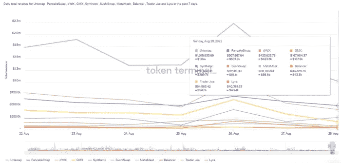

# DeFi Insight |可能激发下一轮牛市的隐秘趋势

> 原文：<https://medium.com/coinmonks/defi-insight-crypto-trends-that-could-inspire-the-next-bull-run-b4ed5e3271a9?source=collection_archive---------12----------------------->

2022 年 8 月 30 日

*今日 DeFi 数据&由 DeFi Insight 为您带来的新闻*

> *“*下一轮大牛市将由目前正在形成的技术和趋势推动。
> 
> 然而，并不是所有的技术或趋势都同样有价值。
> 
> 让我们探索可能激发下一轮牛市的秘密趋势。*“@*[*来源*](https://twitter.com/messaricrypto/status/1562807783749459969?s=21)

# 最新消息

## 外汇

**[OptiFi](/@OptiFi/optifi-program-incident-report-08-29-22-d8fe6d229bad)程序事件报告**

## **第二层**

****,**[博巴网](https://boba.network/engineering-roadmap-2022-2023/):公布我们的工程路线图 2022–2023**

****[米利亚的第二层](/@myriagames/myrias-layer-2-launch-has-arrived-6a3c3da9561f)发射已经到达****

## ****市场****

******加密投资产品交易量[创两年新低](https://blockworks.co/trading-volume-in-crypto-investment-products-hits-2-year-low/)******

## ******空投******

********[OP 令牌](https://pikaprotocol.medium.com/op-token-distribution-for-pika-bb8a0fb6075e)分配给鼠兔********

## ******支付******

********美联储的 [FedNow](https://www.coindesk.com/business/2022/08/29/federal-reserves-fednow-set-for-mid-2023-debut/?utm_medium=referral&utm_source=feedly&utm_campaign=headlines) 实时支付定于 2023 年年中亮相********

******阿根廷省允许数百万人使用稳定的货币纳税******

## ******采矿******

********/**[德州比特币挖矿](https://www.coindesk.com/policy/2022/08/29/the-end-of-the-texas-bitcoin-mining-gold-rush/)淘金热的结束******

## ****政策与法规****

******[伊朗政府](https://www.tasnimnews.com/en/news/2022/08/29/2765709/iranian-admin-enforces-regulations-on-cryptocurrency-trading?ref=tnews)实施加密货币交易法规******

********[法院阻挠](https://www.bloomberg.com/news/articles/2022-08-29/court-stymies-african-bitcoin-adopter-s-gold-for-crypto-offer)非洲比特币采用者的黄金换加密提议********

## ******NFT******

********为什么奢侈品牌[如此看好 NFT](https://www.bloomberg.com/news/articles/2022-08-29/why-are-luxury-brands-so-bullish-on-nfts?srnd=cryptocurrencies-v2#xj4y7vzkg)？********

## ******基金******

******SPiCE VC 现在是安全令牌市场 Web3 Crowdfund on Avalanche 的投资者******

******亚历克西斯·奥哈尼安的七七六目标是 1.776 亿美元的加密令牌基金******

********[极限突破](https://twitter.com/limitbreak/status/1564240941690798081)很兴奋地宣布，我们已经通过两轮融资筹集了 2 亿美元来打造 Web 3 MMO 游戏。********

******淡马锡牵头为 Crypto 地主 Animoca 投资 1 亿美元******

# ******数据和分析******

## ******锁定的总价值(TVL)******

******目前全网 DeFi 总锁定量为 580.9 亿美元，24 小时下降 1.52%。******

************

## ******TVL 评出的十大连锁酒店******

************

## ******|最新 TVL 十大项目******

************

## ******|过去 24 小时内 TVL 增长的前 10 个项目******

************

## ******协议收入******

## ******|累计总收入最高的项目(24H)_ 区块链(L1)******

************

## ******|累计总收入最高的项目(24H) _Dapps (L2)******

************

## ******|前 10 大交易所的每日收入******

************

## ******|十大贷款协议的日收入******

************

# ******深潜******

********[**NFT 域**](https://www.veradiverdict.com/p/nft-domains)********

**** [## NFT 域名

### Unstoppable Domains 是一家 NFT 域名提供商和 web3 身份平台，致力于创建用户拥有的数字…

www.veradiverdict.com](https://www.veradiverdict.com/p/nft-domains) 

**[**重新定义 NFT 推出**](/@spartanlabs/nft-vesting-with-time-locks-b7932b186a6e)**—NFTs 的时间锁定归属****

** [## 重新定义 NFT 发布——非功能性测试的时间锁定授权

### 这篇文章探讨了 NFT 发射设计目前的问题状态，并提供了时间锁归属作为解决方案。

medium.com](/@spartanlabs/nft-vesting-with-time-locks-b7932b186a6e) 

**[**比特币**](https://insights.glassnode.com/the-week-onchain-week-35-2022/) **勉强挂在**上**

** [## 比特币勉强支撑

### 短期疲软继续困扰着众多比特币基本面，价格在最小的过剩中徘徊…

insights.glassnode.com](https://insights.glassnode.com/the-week-onchain-week-35-2022/) 

**“宇宙中心”——上涨的潮水托起了所有的“宇宙船”**** 

# **报告**

****[**桥的一年功勋**](https://messari.io/report/a-year-of-bridge-exploits)_ 梅萨里****

> ****在过去的一年中，超过 30 亿美元从整个 DeFi 生态系统中被盗，其中超过⅔的被盗价值源于桥梁黑客攻击。为了使 DeFi 发展成为一个可信和安全的生态系统，需要减轻该空间内的脆弱性。****

******[**NFT 定价概述**](https://www.theblockresearch.com/an-overview-of-nft-pricing-166049) _theblockresearch******

******[**SushiSwap**](https://members.delphidigital.io/reports/sushiswaps-lingering-troubles)**挥之不去的烦恼** _delphidigital******

******关于:******

****DeFi Insight 是顶级 DeFi 和加密新闻和更新的来源。****

******https://twitter.com/AlphaPro_io******

********https://medium.com/feed/@alphapro.project**[**RSS:**](https://medium.com/feed/@alphapro.project)******

****提供的信息应被视为发展新闻，而不是投资建议。****

> ****交易新手？尝试[加密交易机器人](/coinmonks/crypto-trading-bot-c2ffce8acb2a)或[复制交易](/coinmonks/top-10-crypto-copy-trading-platforms-for-beginners-d0c37c7d698c)**********