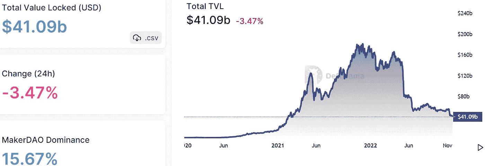
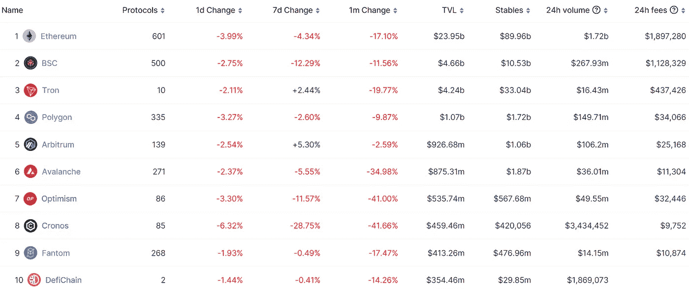
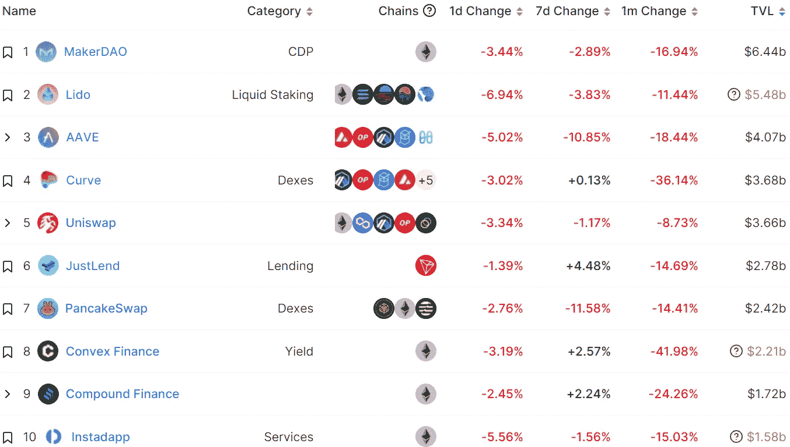
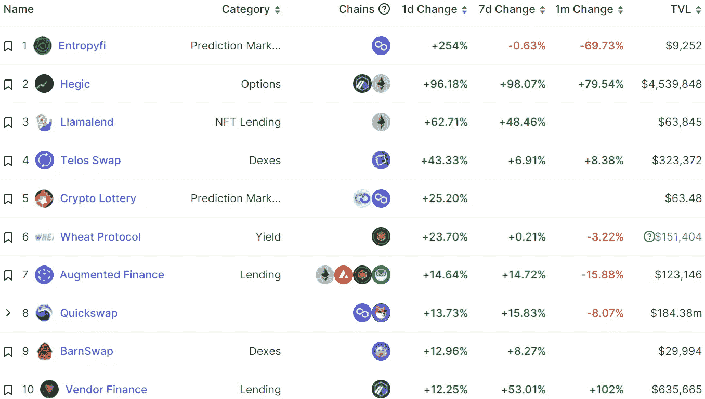
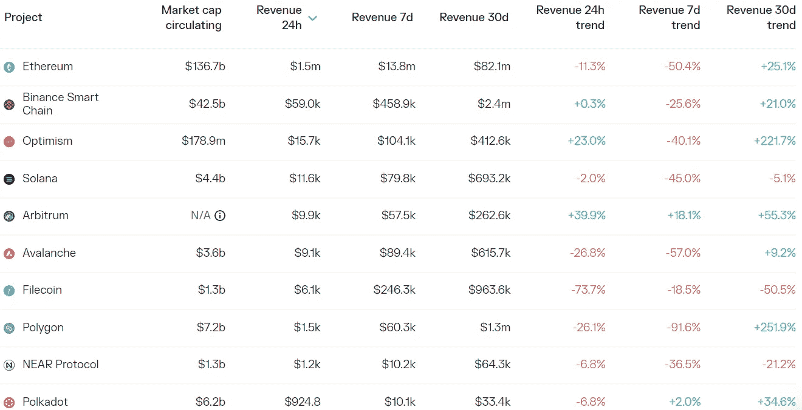
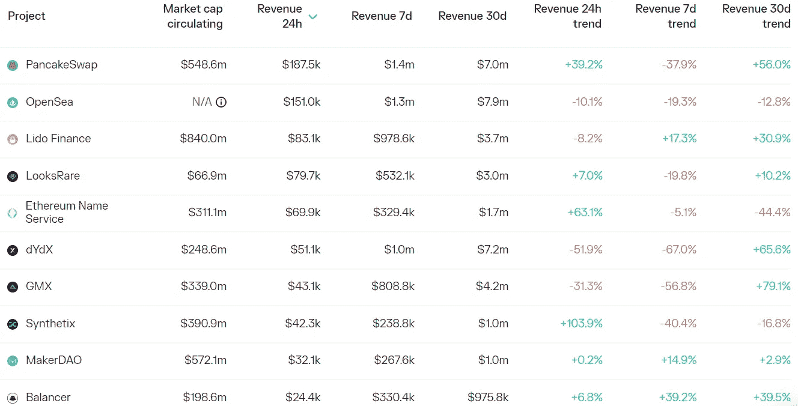

# DeFi Insight | DCG 欠 gensis 11 亿美元？这是怎么回事？

> 原文：<https://medium.com/coinmonks/defi-insight-dcg-owes-gensis-1-1-billion-whats-going-on-a226dacae760?source=collection_archive---------11----------------------->

2022 年 11 月 21 日

*今日 DeFi 数据&由 DeFi Insight 为您带来的新闻*

> *"* 加密交易公司 Genesis 对破产加密公司 FTX 和三箭资本的风险敞口，正在将母公司数字货币集团(DCG)和灰度拉进这场危机。现在，巴里·希尔伯特的《DCG》欠《创世纪》超过 11 亿美元已经曝光。一些人声称 [DCG 事件](https://coingape.com/barry-silberts-dcg-genesis-fallout-could-be-worse-than-ftx-heres-why/)可能会比 FTX 事件产生更多的连锁反应。*“@*[*来源*](https://twitter.com/AP_ArchPublic/status/1594386225200234496)

# 最新消息

## 德克斯/CEX/AMM

密码交易所暂停所有形式的交易

**、** FTX:其他交易所收到[被盗资金](https://twitter.com/FTX_Official/status/1594354846370758657)应尽快返还

**FTX 在 Kroll 上开通债权人信息登记，最大单笔债权金额超过[1100 万美元](https://cases.ra.kroll.com/FTX/Home-ClaimInfo)**

## **贷款/CDP**

**破产的密码放款人对保管计划不严格**

## **|令牌**

****[卡丹诺](https://u.today/cardano-just-introduced-dust-token-heres-what-is-known)刚刚介绍了尘埃令牌，下面是大家所熟知的****

******/**币安缚魂令牌 BAB 总有效铸造量超过 [50 万](https://dune.com/David_C/binance-soulbound-token)****

******、**[zkSync](https://dune.com/kentsmallt/Arbitrum-Optimism-zkSync-Bridge-Stats)桥存储总值超过 18 万 ETH****

## ****测试网****

****LayerZero 已经启动了 Metis 的 Goerli 测试网****

## ****MEV****

******MEV 运营商 [Flashbots](https://github.com/flashbots/builder) 宣布开源“Flashbots Builder”******

## ******政策与法规******

********[**G20**](https://www.whitehouse.gov/briefing-room/statements-releases/2022/11/16/g20-bali-leaders-declaration/)**巴厘领导人宣言**********

********与 Sumiko 共进午餐:[以太坊](https://www.straitstimes.com/singapore/good-ways-and-bad-ways-to-deal-with-crypto-says-ethereum-founder-vitalik-buterin)联合创始人 Vitalik Buterin 谈 FTX 传奇和新加坡加密********

********众议院小组在调查 [FTX 爆炸案](https://www.bloomberg.com/news/articles/2022-11-18/house-panel-seeks-documents-in-investigation-on-ftx-blowup)中寻找文件********

## ******观点******

******亿万富翁马克·库班 T21 取消了像 MetaMask 这样的秘密项目******

******thereum 的联合创始人维塔利克·布特林说《FTX 传奇》为加密提供了经验******

******在 FTX 的惨败之后，乐观的密码产业将会变得更加强大，如果透明度和信任仍然是它的焦点的话******

## ******锁定的总价值(TVL)******

******目前全网 DeFi 总锁定量为 410.9 亿美元，24 小时下降 3.47%。******

************

## ******TVL 评出的十大连锁酒店******

************

## ******|最新 TVL 十大项目******

************

## ******|过去 24 小时内 TVL 增长的前 10 个项目******

************

## ******协议收入******

## ******|累计总收入最高的项目(24H)_ 区块链(L1)******

************

## ******|累计总收入最高的项目(24H) _Dapps (L2)******

************

# ******深潜******

********FTX 传染病** [**下一步**](https://newsletter.banklesshq.com/p/ftx-contagion-blockfi-gemini-genesis?utm_source=%2Finbox&utm_medium=reader2) **会蔓延到哪里？********

**** [## FTX 的传染病下一步会蔓延到哪里？

### 提升你的区块链审计水平👨‍💻亲爱的无银行国家，这里是第三世界最大的加密新闻的摘要…

newsletter.banklesshq.com](https://newsletter.banklesshq.com/p/ftx-contagion-blockfi-gemini-genesis?utm_source=%2Finbox&utm_medium=reader2) 

**[**MEV 的**](https://eigenphi.substack.com/p/highlights-of-our-award-report-mevs?utm_source=%2Finbox&utm_medium=reader2) **对 Uniswap 的影响****

** [## 我们获奖报告的重点:MEV 对 Uniswap 的影响

### 我们的分析报告刚刚在@uniswapgrants 社区分析(UGPCA)的奖金#19 中获得了第一名。请参见…

eigenphi.substack.com](https://eigenphi.substack.com/p/highlights-of-our-award-report-mevs?utm_source=%2Finbox&utm_medium=reader2)** 

# **报告**

****层层叠加:索拉纳生态系统与** [**FTX 落尘**](https://www.theblockresearch.com/layer-by-layer-solana-ecosystem-contends-with-ftx-fallout-188306) _theblockresearch |**

******:FTX 垮台后的后果**_ 梅萨里****

*   ****在这一周系列中，我们将深入探讨第 1 层区块链领域中一些最有趣的数据和发展，从 DeFi 和网桥到网络活动和资金****
*   ****FTX 和阿拉米达的突然崩溃给整个 crypto 带来了冲击波，给包括用户、开发者、投资者等在内的各方带来了巨大的资本损失****
*   ****在 L1s 中，由于 FTX 和阿拉米达的早期投资，以及这两家公司在为生态系统提供广泛的做市和基础设施服务方面的作用，索拉纳生态系统受此次事件影响最严重****
*   ****Solana 现在面临着漫长而不确定的复苏之路，但在最近的危机中稳定的网络性能提供了一线希望，即持续的技术更新可以为用户兴趣和未来的增长奠定基础****

******[**ape coin**](https://messari.io/report/state-of-apecoin-q3-2022?referrer=all-research)**Q3 2022 _**messari******

*   ****令牌持有者的平均数量环比增长 31%，尽管新钱包的总互动量有所下降。****
*   ****由于熊市冷却了整个加密行业的交易活动，日均转账次数和总转账量下降。****
*   ****与上一季度相比，市场估值在第三季度末出现反弹。****
*   ****ApeCoin DAO 通过了几项常识性提案，以及一些关于品牌和市场倡议的大赌注。****
*   ****另一边元宇宙的发展也取得了进展，第一次公开的技术演示在 7 月中旬成功举行。****

******快速洞察:查看** [**主要交易所**](https://www.theblockresearch.com/rapid-insights-looking-into-proof-of-reserves-of-major-exchanges-188063)_ 区块研究的储量证明****

******总督注:** [**dYdX 道**](https://messari.io/report/governor-note-dydx-dao?referrer=all-research) **_** 梅萨里的未来****

******关于:******

****DeFi Insight 是顶级 DeFi 和加密新闻和更新的来源。****

******https://twitter.com/AlphaPro_io 推特:******

********❤RSS:**[**https://medium.com/feed/@alphapro.project**](https://medium.com/feed/@alphapro.project)******

****提供的信息应被视为发展新闻，而不是投资建议。****

> ****交易新手？尝试[加密交易机器人](/coinmonks/crypto-trading-bot-c2ffce8acb2a)或[复制交易](/coinmonks/top-10-crypto-copy-trading-platforms-for-beginners-d0c37c7d698c)********