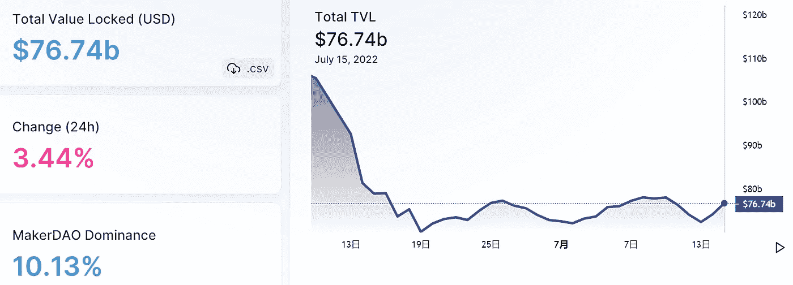
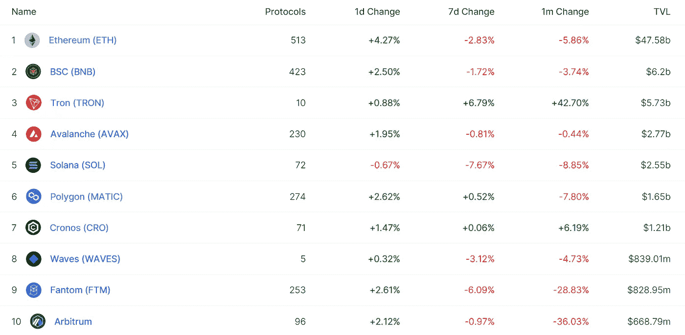
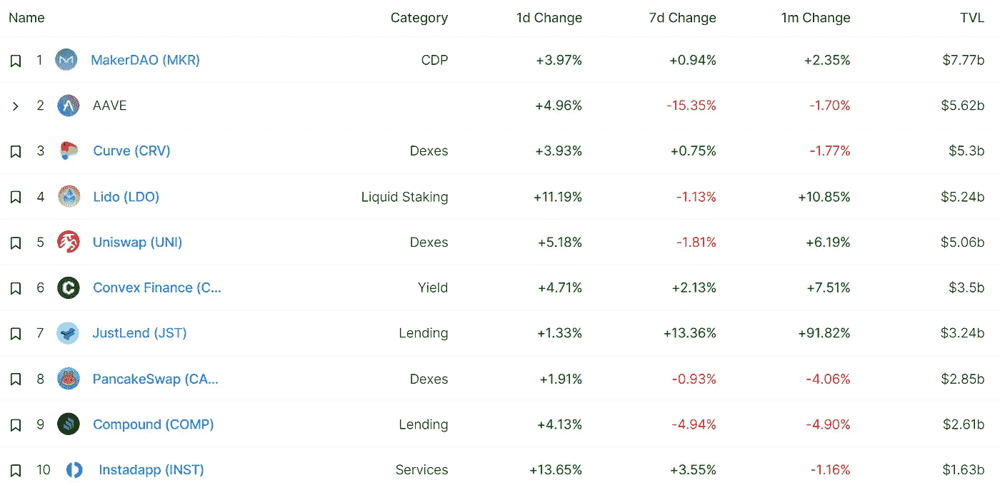
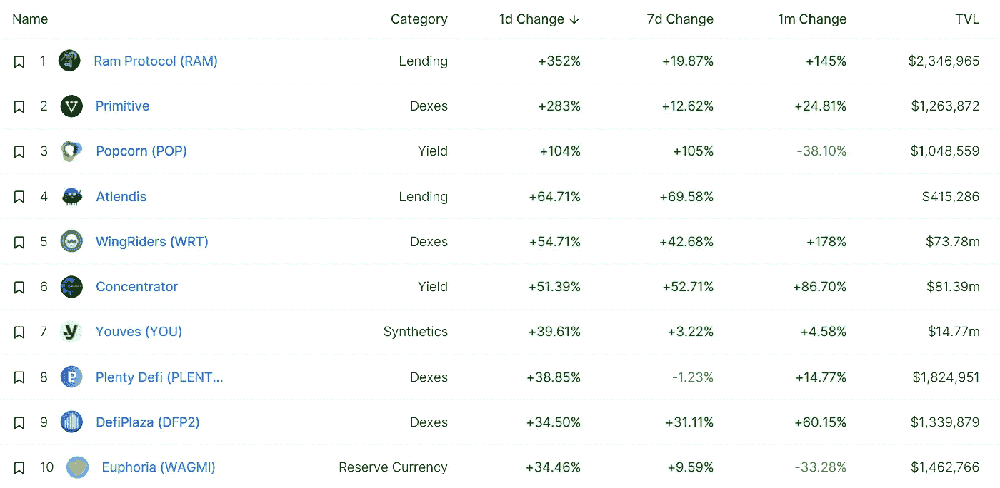
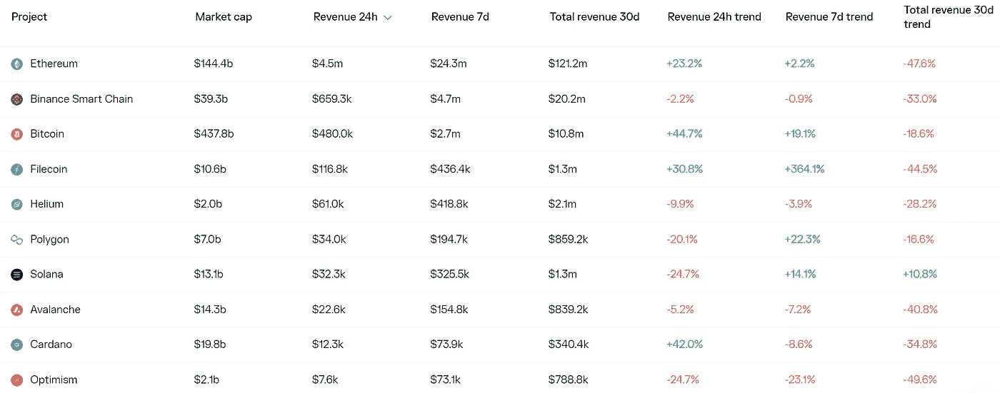
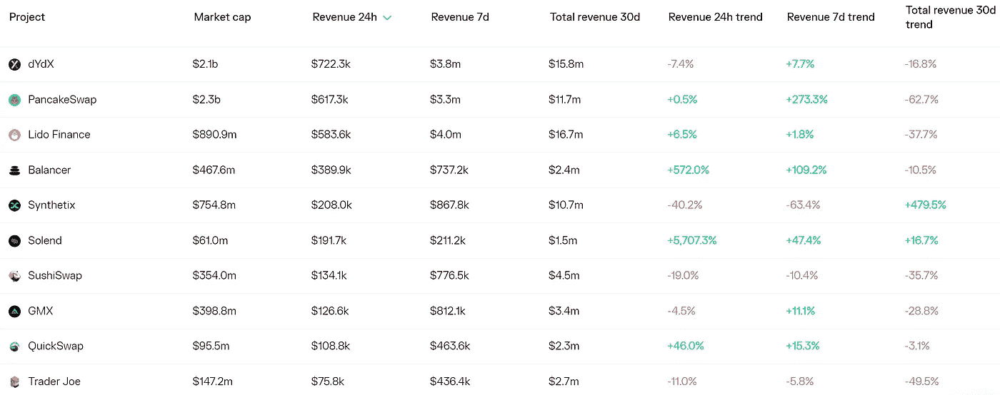
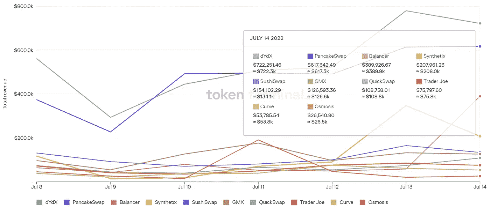
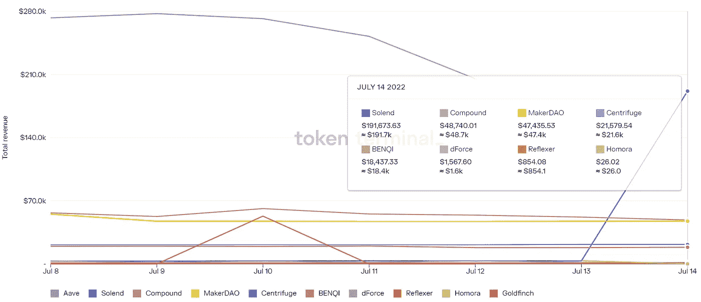

# DeFi Insight | DeFi 永远不会死

> 原文：<https://medium.com/coinmonks/defi-insight-defi-will-never-die-c230f6da9a76?source=collection_archive---------11----------------------->

2022 年 7 月 15 日

*今日 DeFi 数据&由 DeFi Insight 为您带来的新闻*

> *"* 过去的几个月对加密行业来说是动荡不安的。
> 
> 价值数十亿美元的加密银行正在破产。最大的对冲基金正在抛售手中的日元以弥补清算损失。
> 不好看。中央加密机构正在瓦解。
> 
> 但你知道什么没坏吗？DeFi。*“@*[*来源*](https://newsletter.banklesshq.com/p/defi-will-never-die)

# 最新消息

## 外汇

比特币基地的市场份额跌至不到 3%:瑞穗

**/**为 [0x API](https://blog.0x.org/slippage-protection-for-0x-api/) 引入打滑保护

## 稳定币

**提供[更大的透明度](https://www.circle.com/blog/providing-greater-transparency)**

## **交叉链**

****[虫洞](https://wormholecrypto.medium.com/wormhole-guardians-everstake-83afb735cddd)守护者——ever stake****

******/**[互通 Szn](/symbiosis-fi/interoperability-szn-adding-renbtc-12d899dd6a76) :追加 renBTC****

## ****第二层****

******、** DeversiFi 重命名为 [rhino.fi](https://rhino.fi/blog/introducing-rhino-fi-the-first-frictionless-gateway-to-multi-chain-defi/) 并更改为第 2 层网关****

## ****测试网****

******[德克西隆](https://www.prnewswire.com/news-releases/dexilon-launches-testnet-to-power-the-future-of-derivatives-trading-301586958.html)推出 Testnet，为衍生品交易的未来提供动力******

## ******支付******

********[moon pay](https://www.theblock.co/post/157625/moonpay-bolsters-team-with-hires-from-cisco-cash-app-and-coinbase)从思科、Cash App 和比特币基地招聘员工来支持团队********

## ******|令牌******

********巴西最大的私人银行 [Itaú](https://www.coindesk.com/business/2022/07/14/brazils-largest-private-bank-itau-to-launch-tokenization-platform-may-eventually-offer-crypto-trading/) 推出令牌化平台********

## ******叉子******

******以太坊的阴影之叉 9 在合并前上线******

## ******政策与法规******

********[英国](https://www.fca.org.uk/news/speeches/how-uk-will-regulate-future)将如何规范未来********

******Gensler: [SEC](https://www.theblock.co/post/157658/gensler-sec-could-tailor-disclosures-for-crypto-firms) 可以为加密公司量身定制信息披露******

## ******NFT******

********[OpenSea](https://fortune.com/2022/07/14/opensea-nft-marketplace-layoff-crypto-winter/)裁掉 20%的员工，首席执行官引用 crypto winter********

********、**由[魔法伊甸园](https://www.business2community.com/crypto-news/venture-capital-crypto-fund-magic-ventures-opened-by-magic-eden-02522958)开设的风险投资加密基金“魔法创投”******

## ****基金****

******[全息影像](https://venturebeat.com/2022/07/14/hologram-raises-6-5m-for-blockchain-based-avatars-that-you-can-use-in-video-calls/)为你可以在视频通话中使用的区块链头像筹集了 650 万美元******

********[Supermojo](https://www.businesswire.com/news/home/20220714005654/en/Supermojo-Announces-Completion-of-Seed-Round-to-Streamline-NFT-Access?utm_source=dlvr.it&utm_medium=twitter)宣布完成种子轮，简化 NFT 准入********

********Q2 区块链风险投资[下降约 22%](https://www.theblock.co/post/157648/blockchain-venture-funding-declined-in-q2-the-block-research)********

## ******观点******

******Chainalysis 说，熊市是加密业务“转向”的一个机会******

******前 BitMex 首席执行官[表示，比特币可能很快反弹](https://beincrypto.com/doom-loop-bitcoin-could-rally-soon-says-former-bitmex-ceo/)******

> ******交易新手？试试[加密交易机器人](/coinmonks/crypto-trading-bot-c2ffce8acb2a)或[复制交易](/coinmonks/top-10-crypto-copy-trading-platforms-for-beginners-d0c37c7d698c)******

# ******数据和分析******

## ******锁定的总价值(TVL)******

******目前全网 DeFi 总锁定量为 766.4 亿美元，24 小时增长 3.44%。******

************

## ******TVL 评出的十大连锁酒店******

************

## ******|最新 TVL 十大项目******

************

## ******|过去 24 小时内 TVL 增长的前 10 个项目******

************

## ******协议收入******

## ******|累计总收入最高的项目(24H)_ 区块链(L1)******

************

## ******|累计总收入最高的项目(24H) _Dapps (L2)******

************

## ******|前 10 大交易所的每日收入******

************

## ******|十大贷款协议的日收入******

************

# ******深潜******

********[**混音器使用**](https://blog.chainalysis.com/reports/cryptocurrency-mixers/) **在 2022 年达到历史最高水平，国家行为者和网络犯罪分子贡献了巨大的数量**********

**** [## 调音台的使用将在 2022 年达到历史最高水平，国家行为者和网络犯罪分子将对此做出贡献…

### Chainalysis 不保证或担保数据的准确性、完整性、及时性、适用性或有效性

blog.chainalysis.com](https://blog.chainalysis.com/reports/cryptocurrency-mixers/) 

**[**比特币需求的模因论**](https://coinshares.com/research/the-memetic-theory-of-bitcoin-demand)**

** [## 比特币需求的模因论

### 在 CoinShares Research，我们花了很多时间思考如何对比特币进行估值。虽然它，至少在…

coinshares.com](https://coinshares.com/research/the-memetic-theory-of-bitcoin-demand) 

**[**Numba 涨**](/etherscan-blog/numba-go-up-1-5-years-later-ce2a1da68b4a) **… 1.5 年后****

** [## 数字上升…一年半后

### 去年年初，我们绘制了 20 张“数字上涨”图表，强调了 2021 年 1 月令人疯狂的积极投资回报率。它变成了…

medium.com](/etherscan-blog/numba-go-up-1-5-years-later-ce2a1da68b4a) 

**酝酿中的新兴市场** [**债务危机**](https://bitcoinmagazine.com/markets/brewing-emerging-market-debt-crises)

 [## 酝酿中的新兴市场债务危机

### 以下节选自比特币杂志 Pro 的最近一期，比特币杂志的高级市场时事通讯…

bitcoinmagazine.com](https://bitcoinmagazine.com/markets/brewing-emerging-market-debt-crises) 

# 报告

**[**交易所评论**](https://data.cryptocompare.com/reports/exchange-review-june-2022)**—2022 年 6 月** _cryptocompare**

> **现货和衍生品交易量将在 2022 年创下历史新低。所有中央加密交易所的现货交易量下降 27.5%，至 1.41 万亿美元，为 2020 年 12 月以来的最低水平。代表 66.1%市场的衍生品交易量下跌 7.01%，至 2.75 万亿美元，这是自 2021 年 7 月以来的最低衍生品交易量。**

****[**的状态渗透**](https://messari.io/article/state-of-osmosis-q2-2022)**Q2 2022**_ 梅萨里****

******[**逐层发布 39**](https://www.theblockresearch.com/layer-by-layer-issue-39-avalanche-polkadot-and-oasis-157652) **:雪崩、波尔卡多、绿洲** _theblockresearch******

******达普拉达 x BGA** [**运动会报道**](https://dappradar.com/blog/dappradar-x-bga-games-report-q2-2022)**—Q2 2022**_ 达普拉达****

******关于:******

****DeFi Insight 是顶级 DeFi 和加密新闻和更新的来源。****

******https://twitter.com/AlphaPro_io 推特:******

********❤RSS:**[**https://medium.com/feed/@alphapro.project**](https://medium.com/feed/@alphapro.project)******

****提供的信息应被视为发展新闻，而不是投资建议。****

> ****加入 Coinmonks [电报频道](https://t.me/coincodecap)和 [Youtube 频道](https://www.youtube.com/c/coinmonks/videos)了解加密交易和投资****

# ****另外，阅读****

*   ****[TraderWagon 回顾](https://coincodecap.com/traderwagon-review) | [北海巨妖 vs 双子星 vs BitYard](https://coincodecap.com/kraken-vs-gemini-vs-bityard)****
*   ****[如何在 FTX 交易所交易期货](https://coincodecap.com/ftx-futures-trading)****
*   ****[OKEx vs KuCoin](https://coincodecap.com/okex-kucoin) | [摄氏替代品](https://coincodecap.com/celsius-alternatives) | [如何购买 VeChain](https://coincodecap.com/buy-vechain)****
*   ****[ProfitFarmers 点评](https://coincodecap.com/profitfarmers-review) | [如何使用 Cornix Trading Bot](https://coincodecap.com/cornix-trading-bot)****
*   ****[如何匿名购买比特币](https://coincodecap.com/buy-bitcoin-anonymously) | [比特币现金钱包](https://coincodecap.com/bitcoin-cash-wallets)************