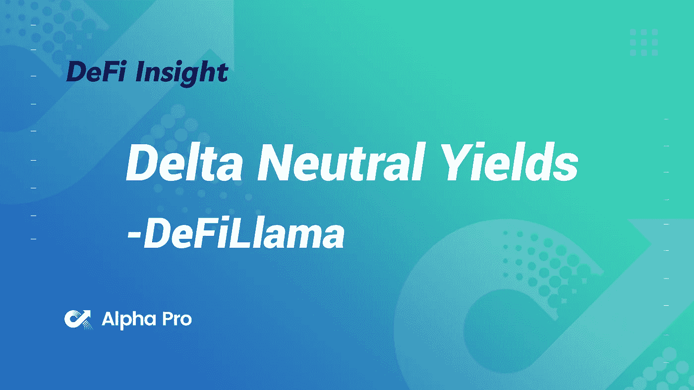
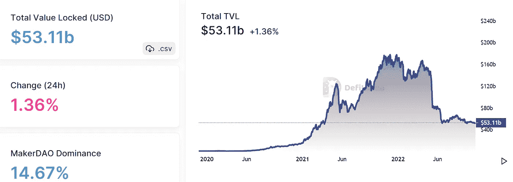
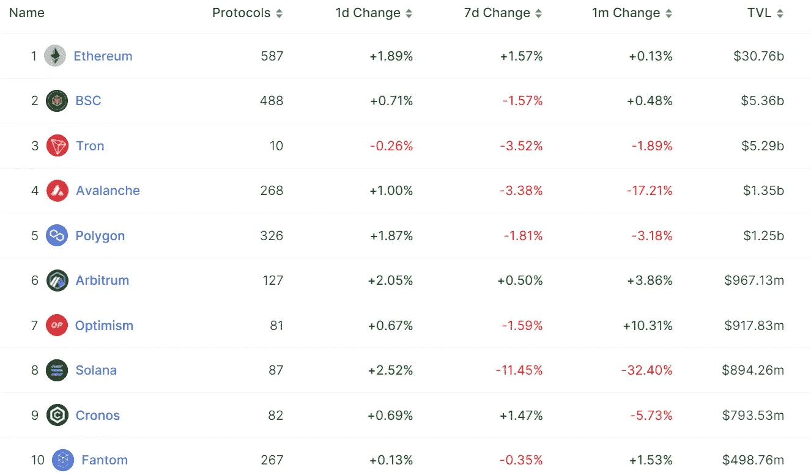
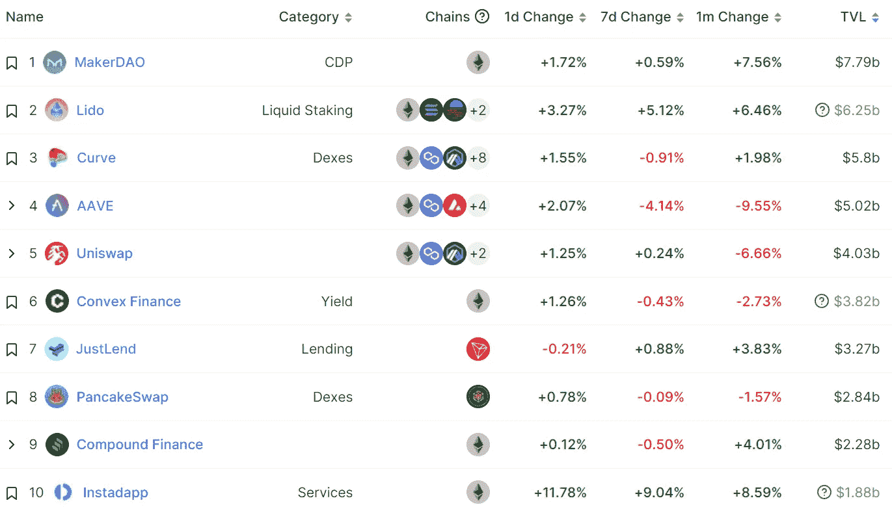
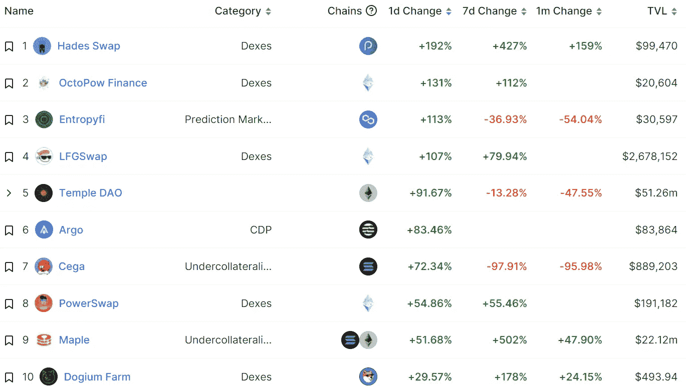
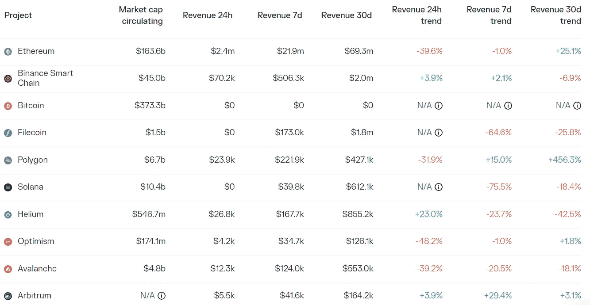
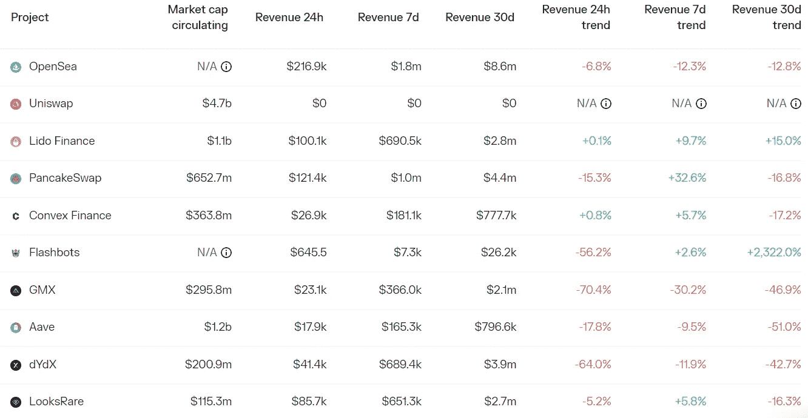

# DeFi Insight | DeFiLlama 推出战略搜索工具，寻找更好的 DeFi 产量农业机会

> 原文：<https://medium.com/coinmonks/defi-insight-defillama-launches-strategy-finder-for-better-defi-yield-farming-opportunities-2c35f7d75778?source=collection_archive---------14----------------------->

2022 年 10 月 24 日

*今日 DeFi 数据&由 DeFi Insight 为您带来的新闻*

> *10 月 23 日，DeFiLlama 发布了一款已经研发数月的产品——Delta Neutral Yields。*
> 
> *该系统利用平台的大型数据库来寻找机会，用户可以借用代币来耕种。有了新的系统，它声称 BTC、瑞士联邦理工学院和 USDC 可以达到 20%以上的收益率。*“@*[*来源*](https://twitter.com/DefiLlama/status/1583894367152263170)*

# *最新消息*

## *链条*

***klay TN[区块奖励减少的治理方案](https://klaytn.medium.com/governance-proposal-for-klaytn-block-reward-reduction-3f28c7175363)***

*****[Aptos](https://explorer.aptoslabs.com/)链上交易额突破 1000 万*****

## *****TVL*****

*****去中心化的金融状态仍然萎靡不振，价值锁定在 Defi 在 6 个月内下滑了 67%*****

## *****指数/交易所/AMM*****

*****币安正在大力投资*****

## *****贷款/CDP*****

*****鸽子、老鹰、凤凰:创客如何利用美国国债收购以太坊，提振戴*****

*******[复利](https://compound.finance/governance/proposals/130)将提高 cCOMP 借款限额，取代 cCOMP 和 cUNI 利率模型*******

*********,**DeFi App[Maple 在加密洗牌后收紧](https://www.bloomberg.com/news/articles/2022-10-21/defi-lending-firm-maple-mpl-tightens-requirements-for-borrowers)借贷标准*******

*****客户为了采矿设备的钱而与投资者争斗*****

*******[一个基于](/flashstake-protocol/️-introducing-flaave-the-flashlending-market-4e92a3c9eaf)的 Flashlend 市场 Flaave 上线*******

## *******稳定币*******

*******币安将 T2 的 USDC 变成了 BUSD 的 T3，开始了第二次稳定的战争。SBF*******

*********币安[稳定币](https://www.theblock.co/post/179199/binances-stablecoin-clocks-in-marketshare-all-time-high-as-supply-tops-20-billion)钟表的市场份额创历史新高，供应量高达 200 亿美元*********

## *******钱包*******

*********/**基于 Aptos 的钱包[崛起](https://mobile.twitter.com/rise_wallet/status/1584242318692913153)上线*******

## *****|警报*****

*******加密平台[高速公路](https://www.theblock.co/post/179290/crypto-platform-freeway-announces-services-halt-token-tumbles?utm_source=twitter&utm_medium=social)宣布服务暂停，令牌掉落*******

*********乐观生态[第二道](https://twitter.com/TheLayer2DAO/status/1583994186982109185)遭到攻击，近 5000 万代币被盗*********

## *******NFT*******

*********Scratch 提供公司的所有权股份，因为它[扩大了关注点](https://www.prnewswire.com/news-releases/scratch-offers-ownership-stake-in-company-as-it-expands-focus-301656503.html)*********

*********、**旗舰手机[的规格被披露](https://www.technicalripon.com/specs-are-revealed-for-the-flagship-specd-saga-phone/)*******

## *****基金*****

*****英国《金融时报》合作伙伴发布了《资本市场技术洞察》*****

## *****政策与法规*****

*****韩国金融服务委员会计划监控虚拟资产超过 7 万美元的用户*****

*****“[美国 CFTC 密码](https://twitter.com/SBF_FTX/status/1584095445185622016)法规草案”的核心目标是规范集中的密码场所——SBF*****

# *****数据和分析*****

## *****锁定的总价值(TVL)*****

*****目前全网 DeFi 总锁定量为 531.1 亿美元，24 小时下降 1.36%。*****

**********

## *****TVL 评出的十大连锁酒店*****

**********

## *****|最新 TVL 十大项目*****

**********

## *****|过去 24 小时内 TVL 增长的前 10 个项目*****

**********

## *****协议收入*****

## *****|累计总收入最高的项目(24H)_ 区块链(L1)*****

**********

## *****|累计总收入最高的项目(24H) _Dapps (L2)*****

**********

# *****深潜*****

*********最佳 NFT 项目的完整指南和概述*********

******* [## 您需要的所有 AVAX NFT 阿尔法

### OpenSea 于 10 月 11 日在 Avalanche c-chain 上上线，从那时起，Avalanche NFTs 仅在地板上增加了 6 倍

thefarmersclub.substack.com](https://thefarmersclub.substack.com/p/all-the-avax-nft-alfa-you-need?utm_source=%2Finbox&utm_medium=reader2) 

**[**ZkSync**](https://twitter.com/autonolas/status/1582662870881345539)**本月登陆 mainnet:你需要知道的*********** 

# *****报告*****

*******[**图的状态**](https://messari.io/report/state-of-the-graph-q3-2022?referrer=all-research)**Q3 2022**_ 梅萨里*******

> *****超过 30，000 个子图从托管服务到图的分散网络(mainnet)的迁移正在进行中。*****
> 
> *****截至第 3 季度，共迁移了 22，496 个 mainnet 子图，同比增长 27%。*****
> 
> *****该图表的生态系统的活跃指数(+32%)、授权(+10%)和策展人(+2%)继续增长。*****
> 
> *****在 2012 年第 3 季度，图表显示来自查询费的 GRT 收入季度环比增长 42%;然而，指数化奖励的收入在 GRT 方面下降了 3%。*****

*******[**快速洞察**](https://www.theblockresearch.com/rapid-insights-looksrare-reward-rebalance-results-in-otherdeed-price-slide-178967) **:查看奖励再平衡结果在其他方面实际价格下滑**_ block research*******

*******关于:*******

*****DeFi Insight 是顶级 DeFi 和加密新闻和更新的来源。*****

*******https://twitter.com/AlphaPro_io*******

*********https://medium.com/feed/@alphapro.project**[**RSS:**](https://medium.com/feed/@alphapro.project)*******

*****提供的信息应被视为发展新闻，而不是投资建议。*****

> *****交易新手？尝试[加密交易机器人](/coinmonks/crypto-trading-bot-c2ffce8acb2a)或[复制交易](/coinmonks/top-10-crypto-copy-trading-platforms-for-beginners-d0c37c7d698c)*****