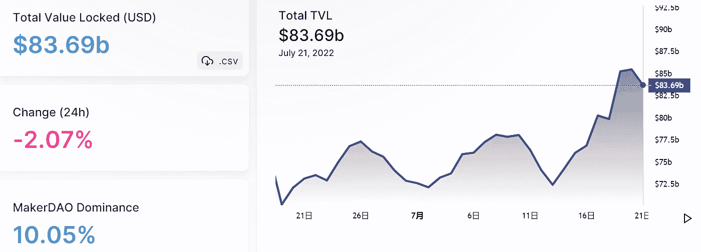
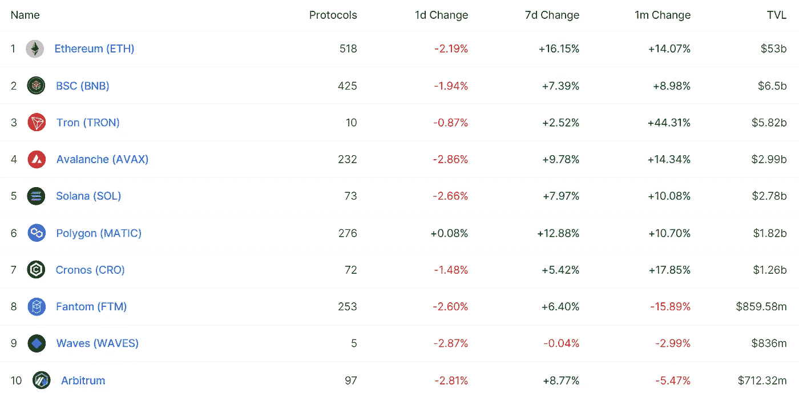
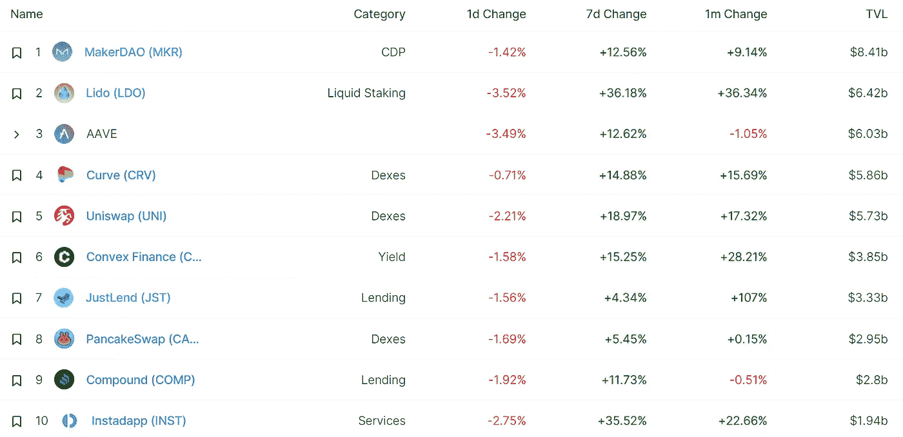
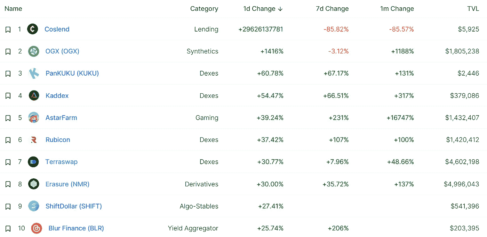
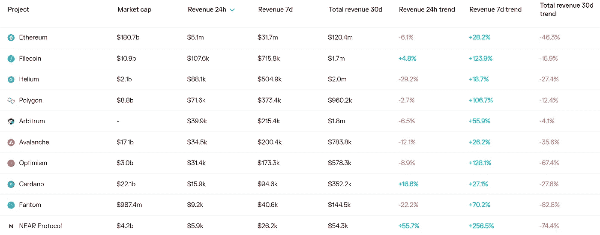
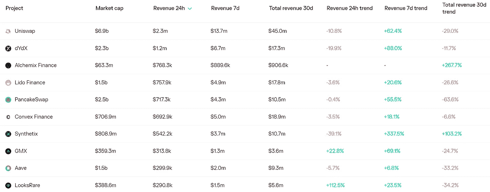
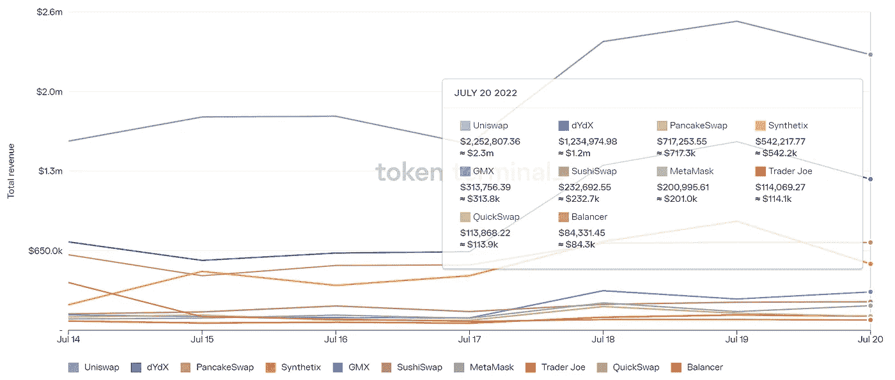
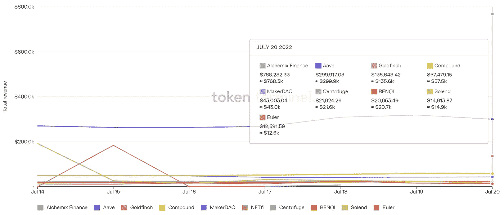

# DeFi Insight |解释 zkEVM

> 原文：<https://medium.com/coinmonks/defi-insight-explaining-the-zkevm-9cae6a4bb96e?source=collection_archive---------22----------------------->

2022 年 7 月 21 日

*今日 DeFi 数据&由 DeFi Insight 为您带来的新闻*

> *-它是什么
> -ZK-rollup 与其他 roll up 类型相比如何
> -ZK-roll up 创作者的竞争格局*
> 
> *而谁真的是第一个*@[*来源*](https://twitter.com/0xfoobar/status/1549779031314284544)**

# **最新消息**

## **贷款**

****密码出借人 [Vauld](https://www.coindesk.com/business/2022/07/20/crypto-lender-vauld-files-for-protection-from-creditors/) 申请保护免受债权人侵害****

## ****外汇****

******[Zipmex](https://techcrunch.com/2022/07/20/zipmex-pauses-withdrawals-until-further-notice/)暂停提款“直至另行通知”******

## ******稳定币******

********[$ USDD](https://twitter.com/justinsuntron/status/1549778350406717441)在 Arbitrum 上直播，并可在 Uniswap 上交易********

********你提出的关于 USDD 的问题已经得到了解答********

## ********市场********

********索拉纳最近的活动[盖过了](https://coinquora.com/solanas-recent-activity-overshadows-both-ethereum-and-binance/)以太坊和币安********

**********,**比特币(BTC)复苏，但是[多久](https://dailycoin.com/bitcoin-btc-recovers-but-for-how-long/)？********

## ******|工具******

********、**CVI 团队推出 Armadillo，一款[减值损失工具](https://www.altcoinbuzz.io/cryptocurrency-news/product-release/the-cvi-team-launches-armadillo-an-impairment-loss-tool/)******

## ******鲸鱼******

********[比特币巨鲸](https://thecryptobasic.com/2022/07/21/bitcoin-whale-transfers-over-132k-btc-to-exchanges-in-the-last-3-days/)最近 3 天向交易所转账超过 13.2 万 BTC********

## ********采矿********

**********[Compass Mining](https://education.compassmining.io/education/compass-mining-announces-75mw-site-expansion-with-compute-north/)宣布用 Compute North 扩建 75MW 的场地**********

## ********政策与法规********

********众议院立法者准备跨党派的[稳定收入法案](https://www.theblock.co/post/158767/house-lawmakers-prep-bipartisan-stablecoin-bill-to-unveil-next-week)将于下周公布********

**********印度不会暂缓征收高额加密税**********

********韩国金融监管机构调查外汇市场的非法秘密交易********

********据报道，日本的加密自律系统正在崩溃********

## ********NFT********

**********[MINECRAFT](https://www.minecraft.net/en-us/article/minecraft-and-nfts)和 NFTS**********

********向 NFT 黑客受害者返还以太坊中的 50 万美元********

## ********基金********

********FrontFanz 在成功完成两轮私募融资 50 万美元后，在 ExMarkets 上宣布 IEO********

## ********观点********

********黑石集团认为联邦基金利率在更长的加息周期中接近 5%********

# ********数据和分析********

## ********锁定的总价值(TVL)********

********目前全网 DeFi 总锁定量为 836.9 亿美元，24 小时下降 2.07%。********

****************

## ********TVL 评出的十大连锁酒店********

****************

## ********|最新 TVL 十大项目********

****************

## ********|过去 24 小时内 TVL 增长的前 10 个项目********

****************

## ********协议收入********

## ********|累计总收入最高的项目(24H)_ 区块链(L1)********

****************

## ********|累计总收入最高的项目(24H) _Dapps (L2)********

****************

## ********|前 10 大交易所的每日收入********

****************

## ********|十大贷款协议的日收入********

****************

# ********深潜********

**********前置** [**重生机会**](https://newsletter.banklesshq.com/p/gitcoin-climate-change-impact-crypto)********

****** [## 抢先把握重生机会🌱

### 解锁神秘空投🔮亲爱的无银行的国家，啊，绿色市场的芬芳。是的，马上。数字上升了，但是…

newsletter.banklesshq.com](https://newsletter.banklesshq.com/p/gitcoin-climate-change-impact-crypto) 

**[**如何在集中交易所破产时防止你的密码被冻结**](https://www.zdnet.com/finance/blockchain/how-to-prevent-your-crypto-from-being-frozen-in-a-centralized-exchange-bankruptcy/)**

**** [## 当一个集中的交易所破产时，如何防止你的密码被冻结

### 在一个已经萎缩的密码市场，硬币持有者很紧张。当他们的资产被冻结，因为他们的…

www.zdnet.com](https://www.zdnet.com/finance/blockchain/how-to-prevent-your-crypto-from-being-frozen-in-a-centralized-exchange-bankruptcy/) 

**难道** [**层 0**](https://twitter.com/bizyugo/status/1549423839053959169) **不是波尔卡多的东西吗？****** 

# ****报告****

******状态**[**dYdX**](https://messari.io/article/state-of-dydx-q2-2022)Q2 2022_ 梅萨里****

> ****dYdX 宣布了一个新的基于 Cosmos SDK 的区块链，名为 dYdX Chain 主权网络是实现协议目标所必需的，即推出一个完全去中心化的 V4
> 交易活动比上一季度下降 37.8%，尽管 dYdX 的表现超过了 crypto 整体市值的下降
> BTC 和 ETH 继续驱动约 85%的总交易量
> 每周交易者的数量因市场波动而有所波动，但平均超过 3，000
> 未平仓合约(USD)下降了 79.7%****

******[**游戏公会**](https://dappradar.com/blog/game-guilds-an-analysis-of-the-industrys-health-and-sustainability) **—行业健康与可持续性分析** _dappradar******

******一探** [**比特币挖矿**](https://www.theblockresearch.com/bitcoin-mining-interest-expenses-indirect-costs-156260) **利息支出和间接成本** _theblockresearch****

**********(密码)游戏** _delphidigital********

******[**索拉纳项目收入**](https://mirror.xyz/0x9b7e7c5B53081d0C6d09b91F13783D58B772b011/DeFaGixHX2BdhK_1rvs6xsm6fvJWDdkae8HY0l_7G2A) **周报 7/21/2022** _Alpha Pro******

******关于:******

****DeFi Insight 是顶级 DeFi 和加密新闻和更新的来源。****

******https://twitter.com/AlphaPro_io 推特:******

********❤RSS:**[**https://medium.com/feed/@alphapro.project**](https://medium.com/feed/@alphapro.project)******

****提供的信息应被视为发展新闻，而不是投资建议。****

> ****交易新手？尝试[加密交易机器人](/coinmonks/crypto-trading-bot-c2ffce8acb2a)或[复制交易](/coinmonks/top-10-crypto-copy-trading-platforms-for-beginners-d0c37c7d698c)**********