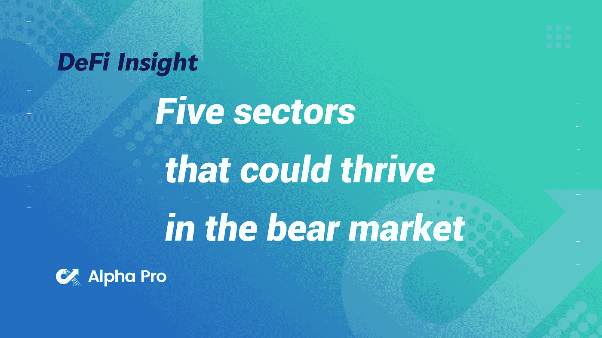
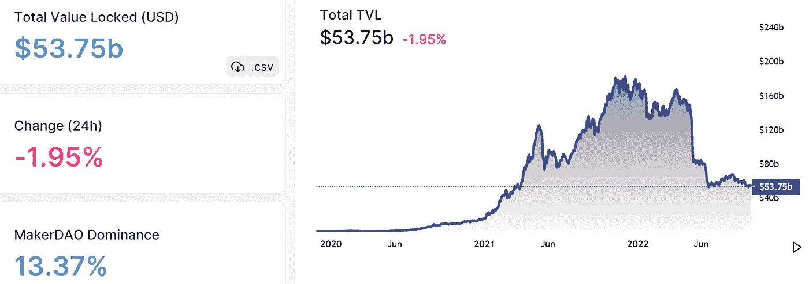
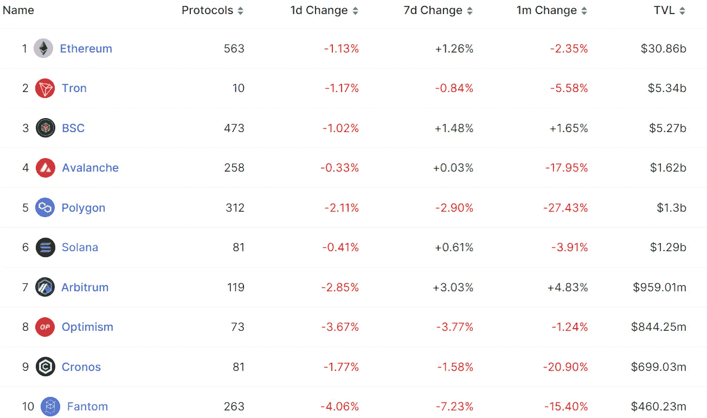
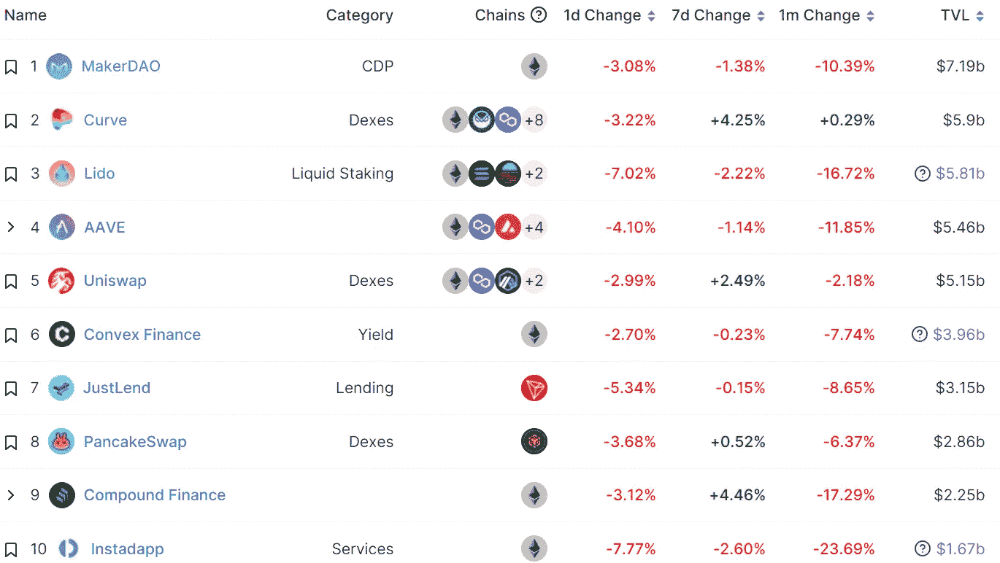
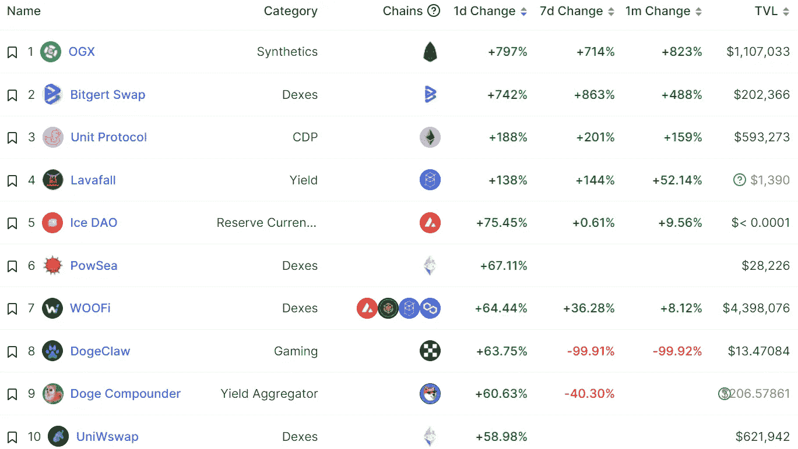
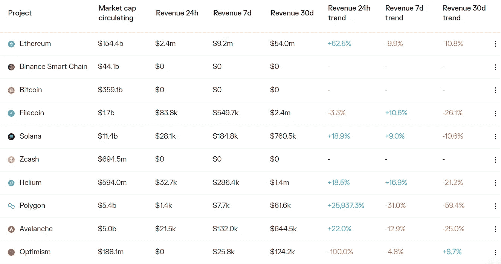
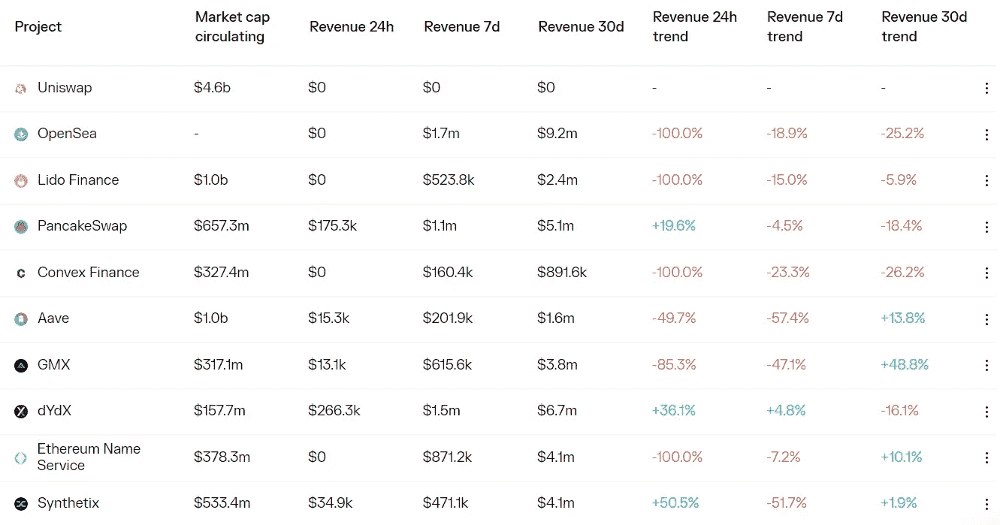

# DeFi Insight |熊市中可能繁荣的五个行业

> 原文：<https://medium.com/coinmonks/defi-insight-five-sectors-that-could-thrive-in-the-bear-market-c452f2df5f1f?source=collection_archive---------10----------------------->

2022 年 9 月 28 日

*今日 DeFi 数据&由 DeFi Insight 为您带来的新闻*

> *市场一片混乱。监管的绞索正在收紧。块空间需求是 2019 年以来的最低水平。加密推特是一座鬼城。现在，今年最大的事件——合并——已经成为过去。*
> 
> *是只有我，还是 crypto 现在感觉没有方向？*
> 
> *我们知道这种感觉不会永远持续下去。任何人都有能力在区块链进行建设和创新，而这一领域的智力资本潜力巨大，这意味着某些应用或技术不可避免地会再次让人们兴奋起来，带回对区块空间的需求，推动下一波用户采用。*
> 
> *问题是…那会是什么？crypto 的下一步是什么？*
> 
> *让我们来看看基础设施和应用程序中一些激动人心的领域，看看可能是什么？*“@*[*来源*](https://newsletter.banklesshq.com/p/5-sectors-to-keep-an-eye-on-lite?utm_source=%2Finbox&utm_medium=reader2)*

# *最新消息*

## *链条*

***克莱腾推出游戏汽油费返还计划，为更广泛的 [Web3 应用铺平道路](https://investingnews.com/klaytn-launches-gaming-gas-fee-rebate-program-paving-the-way-for-wider-web3-adoption/)***

## ***指数/交易所/AMM***

***FTX 加密交易所将其美国总部从芝加哥搬到了迈阿密***

## ***稳定币***

*****锚和催化剂:[中央银行在创新中的](https://www.banque-france.fr/en/intervention/anchors-and-catalysts-central-banks-dual-role-innovation)双重角色*****

*******CBDC[研究项目白皮书](https://www.rba.gov.au/media-releases/2022/mr-22-31.html)*******

## *******贷款*******

*******秘密亿万富翁班克曼-弗里德盯上了对摄氏资产的竞购*******

## *******钱包*******

*********[**隋钱包**](https://sui.io/resources-sui/sui-wallet-updates/)**更新及相关工具***********

*********[meta mask](https://consensys.net/blog/metamask/metamask-launches-beta-portfolio-dapp-for-an-integrative-web3-experience/?utm_source=feedly&utm_medium=rss&utm_campaign=metamask-launches-beta-portfolio-dapp-for-an-integrative-web3-experience)发布 Beta Portfolio Dapp，提供一体化的 Web3 体验*********

## *******发射台*******

*********[Cosmos](https://twitter.com/ignite_com/status/1574883438598844416?s=20&t=4RBUb9qdhmSf1FwTHzFTdA)开发公司 Ignite 宣布正在开发项目发射平台 Ignite Chain*********

## *******政策与法规*******

*********[DeFi](https://cointelegraph.com/news/fed-s-powell-defi-needs-appropriate-regulation-before-expanding-to-retail)在扩展到零售之前需要适当的监管:Powell 主席*********

*******欧盟机构表示，区块链证券交易不需要更多的规则变化*******

*********加州监管机构瞄准 [11 个像“庞氏骗局”一样运作的加密交易平台](https://www.coindesk.com/policy/2022/09/27/california-regulator-targets-11-crypto-trading-desks-operating-like-ponzis/)*********

## *******NFT*******

*********[OpenSea](https://twitter.com/opensea/status/1574799981210476554)增加对以太坊 Layer2 扩展网络乐观的支持*********

## *******基金*******

*******由阿布扎比的 ADQ 支持的 2 亿美元的基金*******

*******OneKey 已经完成了约 2000 万美元的 A 轮融资*******

## *******观点*******

*********[**潘迪拉 CEO**](https://cointelegraph.com/news/pantera-ceo-bullish-on-defi-web3-and-nfts-as-token2049-gets-underway) **看好 DeFi、Web3 和 NFTs 为标志的 2049 正在进行中***********

*******布德林的新书[【利害关系的证明】](https://twitter.com/VitalikButerin/status/1574837986633682949)已经出版*******

# *******数据和分析*******

## *******锁定的总价值(TVL)*******

*******目前全网 DeFi 总锁定量为 537.5 亿美元，24 小时下降 1.95%。*******

**************

## *******TVL 评出的十大连锁酒店*******

**************

## *******|最新 TVL 十大项目*******

**************

## *******|过去 24 小时内 TVL 增长的前 10 个项目*******

**************

## *******协议收入*******

## *******|累计总收入最高的项目(24H)_ 区块链(L1)*******

**************

## *******|累计总收入最高的项目(24H) _Dapps (L2)*******

**************

# *******深潜*******

*********[**乐观**](https://metaversal.banklesshq.com/p/creating-an-nft-drop-on-optimism?utm_source=%2Finbox&utm_medium=reader2) 创造 NFT 下降*********

***** [## 造成 NFT 乐观度下降🎈

### 亲爱的无银行国家，NFT 市场巨头 OpenSea 正在加倍开发第二层(L2)扩展解决方案…

metaversal.banklesshq.com](https://metaversal.banklesshq.com/p/creating-an-nft-drop-on-optimism?utm_source=%2Finbox&utm_medium=reader2) 

**如何借&借** [**NFTs**](https://newsletter.banklesshq.com/p/how-to-lend-and-borrow-nfts?utm_source=%2Finbox&utm_medium=reader2)

 [## 如何借出和借入非金融资产

### 加入膨胀的不和谐社区🌊亲爱的无银行国家，当 NFTs 去年年底接管 crypto 时，几乎没有人…

newsletter.banklesshq.com](https://newsletter.banklesshq.com/p/how-to-lend-and-borrow-nfts?utm_source=%2Finbox&utm_medium=reader2) 

**风险评估:** [**框架治理**](https://cryptorisks.substack.com/p/risk-assessment-frax-governance?utm_source=%2Finbox&utm_medium=reader2)

 [## 风险评估:Frax 治理

### Frax 资产约占 Curve 公司 TVL 的 21.5%，其资产池占 CRV 排放量的 32%。Frax 协议目前是…

cryptorisks.substack.com](https://cryptorisks.substack.com/p/risk-assessment-frax-governance?utm_source=%2Finbox&utm_medium=reader2) 

# 报告

**[**sudos WAP**](https://members.delphidigital.io/reports/sudoswap-where-defi-innovation-meets-nft-markets)**:DeFi 创新在哪里遇上 NFT 市场** _delphidigital**

> **“NFT 交易的中心主要位于高度集中的市场，如 OpenSea，其特点是创作者授权、订单列表和堆积费用。交易的中心是让创造者受益，这导致市场征服了交易者，交易者的体验很差。交易员被迫寻找更便宜的服务，但只能满足于流动性分散的订单。在这种环境下，引入以 AMM 为基地的连锁市场以满足各方需求会有什么影响？**
> 
> **除非你对 NFT 市场完全不熟悉，否则到目前为止，阅读这篇文章应该会让你想到一个项目:Sudoswap。这篇文章将关注 Sudoswap 的牵引力、资本效率和其他重要指标。"**

****[**web 3 游戏:**](https://www.theblockresearch.com/web3-games-the-core-issue-of-in-game-currencies-172947) **游戏内货币的核心问题** _theblockresearch****

******解开最近的** [**ApeCoin 发展**](https://www.theblockresearch.com/unpacking-recent-apecoin-developments-172489) _theblockresearch****

******关于:******

****DeFi Insight 是顶级 DeFi 和加密新闻和更新的来源。****

******https://twitter.com/AlphaPro_io 推特:******

********❤RSS:**[**https://medium.com/feed/@alphapro.project**](https://medium.com/feed/@alphapro.project)******

****提供的信息应被视为发展新闻，而不是投资建议。****

> ****交易新手？尝试[加密交易机器人](/coinmonks/crypto-trading-bot-c2ffce8acb2a)或[复制交易](/coinmonks/top-10-crypto-copy-trading-platforms-for-beginners-d0c37c7d698c)*********