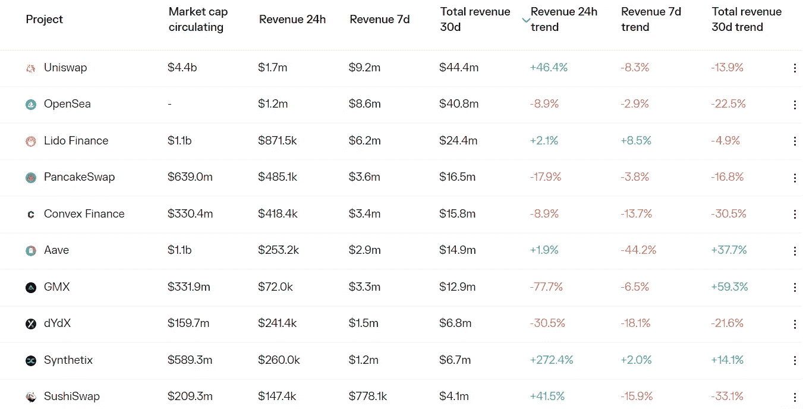

# DeFi Insight |固定利率收益率优于赌注

> 原文：<https://medium.com/coinmonks/defi-insight-fixed-rate-yields-that-outperform-eth-staking-3ae792725867?source=collection_archive---------17----------------------->

2022 年 9 月 22 日

*今日 DeFi 数据&由 DeFi Insight 为您带来的新闻*

> *DeFi 需要固定利率收益率。*
> 
> *在传统金融领域，仅在美国，固定收益就代表了 6.5 万亿美元的市场。有一个巨大的机会，可以在一个全球性的、无许可的、即时支付的轨道上建立这些避险资产。*
> 
> *幸运的是，它们开始出现在以太坊上。*
> 
> *在过去的两年中，我们已经看到了大量不同的方法——从固定利率贷款到利率互换，再到像收益分割令牌这样的定义机制。*
> 
> *有很多东西要打开。*
> 
> *更重要的是，机会在哪里？*
> 
> *你能在 ETH 中锁定一个固定利率，并超过当前的收益率吗？*“@*[*来源*](https://newsletter.banklesshq.com/p/fixed-rate-yields-that-outperform?utm_source=%2Finbox&utm_medium=reader2)*

# *最新消息*

## *指数/交易所/AMM*

***[ZigZag](https://mobile.twitter.com/ZigZagExchange/status/1573020039762034689)计划在 zkSync 2.0 Mainnet 上线后推出 DAO***

## ***稳定币***

***支付巨头 [Stripe](https://u.today/payments-giant-stripe-now-supports-crypto-payouts-for-freelancers-in-usdc) 现在支持$USDC 自由职业者的加密支付***

## ***桥梁***

*****[和谐](https://mobile.twitter.com/harmonyprotocol/status/1573086847533809664)更新地平线桥资产回收计划，提出不再铸造一个亿*****

## *****打桩*****

*******[猿打桩](https://twitter.com/HorizenLabs/status/1572979152713818113)发射日期目前定在 10 月 31 日*******

## *******|索引*******

*********[嵌套金融](https://twitter.com/NestedFi/status/1572982751212584960?s=20&t=Gy0oR46OsZkskTEfvMrFeg)已推出 Arbitrum*********

## *******隐私*******

*********[龙卷风现金的](https://github.com/tornadocash) GitHub 回购已经恢复*********

## *******副链*******

*******Acala 计划分阶段恢复运营*******

## *******政策与法规*******

*********、**打击欺诈和洗钱的新举措，以保护[英国经济](https://www.gov.uk/government/news/new-crackdown-on-fraud-and-money-laundering-to-protect-uk-economy)*******

## *****交叉链*****

*******跨链互操作协议[虫洞](https://mobile.twitter.com/wormholecrypto/status/1572956758183755776)增加对月光的支持*******

## *******钱包*******

*********[Aptos 钱包火星人](https://twitter.com/martian_wallet/status/1573094025082683392?s=20&t=oTlyON0zstN21wtvPcwquQ)发布新版本，包括升级后的气体模型等*********

## *******|开发*******

*********、** Sui 生态系统 API 和节点服务 [Shinami](https://twitter.com/ShinamiCorp/status/1572629221729607683) 构建基础开发人员基础设施*******

## *****观点*****

*****BitMEX 创始人亚瑟·海斯(Arthur Hayes):PoS 将在年底前减少以太坊近 20 亿美元的销售压力*****

## *****NFT*****

*******/**自发布以来，移动挣钱应用程序 [Stepn](https://www.theblock.co/post/172123/users-logged-over-67-million-miles-on-the-move-to-earn-app-stepn-since-launch) 上的用户已登录超过 6700 万英里*****

*******[OpenSea](https://twitter.com/opensea/status/1573067266220236800)支持大部分索拉纳生态系统 NFT 集合的自动索引*******

## *******基金*******

*******加密网络筹集 1300 万美元来支持 Web3 的自主性和互操作性*******

# *******数据和分析*******

## *******锁定的总价值(TVL)*******

*******目前全网 DeFi 总锁定量为 554.7 亿美元，24 小时增长 5.50%。*******

**************

## *******TVL 评出的十大连锁酒店*******

**************

## *******|最新 TVL 十大项目*******

**************

## *******|过去 24 小时内 TVL 增长的前 10 个项目*******

**************

## *******协议收入*******

## *******|累计总收入最高的项目(24H)_ 区块链(L1)*******

**************

## *******|累计总收入最高的项目(24H) _Dapps (L2)*******

**************

# *******深潜*******

*********[**投资**](https://newsletter.banklesshq.com/p/10-psych-hacks-for-investing?utm_source=%2Finbox&utm_medium=reader2) 的 10 个心理技巧*********

***** [## 投资的 10 个心理技巧

### 无银行高级会员可获得无银行代币评级九月版的全部权限。本月，我们将评定…

newsletter.banklesshq.com](https://newsletter.banklesshq.com/p/10-psych-hacks-for-investing?utm_source=%2Finbox&utm_medium=reader2) 

**[**以太坊**](https://mhonkasalo.substack.com/p/how-high-do-we-want-gas-fees-to-be?utm_source=%2Finbox&utm_medium=reader2) **我们希望燃气费多高？****

** [## 我们希望以太坊的汽油费有多高？

### 高汽油费对持有人来说是一把双刃剑:好:高费用意味着一个性感的市盈率，导致更多的股东…

mhonkasalo.substack.com](https://mhonkasalo.substack.com/p/how-high-do-we-want-gas-fees-to-be?utm_source=%2Finbox&utm_medium=reader2) 

**[**流动性**](https://www.egirlcapital.com/writings/141204792) **、资金和银行挤兑****

 **[## 埃吉尔资本

### 编辑描述

www.egirlcapital.com](https://www.egirlcapital.com/writings/141204792)** 

****[**零知识证明**](https://twitter.com/varunshenoy_/status/1571949645085155328) **:非技术 web3 研究人员入门******

******每一个** [**crypto 创始人**](https://twitter.com/dgmason/status/1572269124012724227) **需要了解的 10 件事******** 

# ****报告****

******[**NFT 金融**](https://dappradar.com/blog/nft-financials-falling-in-q3-but-on-chain-metrics-remain-bullish) **在第三季度下跌，但环比指标仍然看涨** _dappradar******

> ****“从金融角度来看，不可替代令牌(NFT)市场已经暴跌，因为从 2021 年 7 月到 2022 年 2 月，围绕化身、虚拟世界、域和其他数字资产的市场扩张产生了 356 亿美元的交易。在伴随着其受欢迎程度迅速上升的最初兴奋之后，随着价格暴跌，一些人开始怀疑这些非金融资产(NFA)的长期可持续性。不幸的是，这种情况的出现是由于一些宏观和微观环境，但主要是由于最近经济不确定性导致的数字资产抛售。”****

******绘制 Y Combinator 的[密码校友](https://www.theblockresearch.com/mapping-out-y-combinator-crypto-alumni-171747)_ 区块研究******

********层层发布 46: [宇宙，索拉纳，以及附近的](https://www.theblockresearch.com/layer-by-layer-issue-46-cosmos-solana-and-near-172277) _theblockresearch********

********评论市场帖子[以太坊合并](https://www.theblockresearch.com/reviewing-markets-post-ethereum-merge-172173) _theblockresearch********

********[汇总状态和 ZK 应用](https://www.theblockresearch.com/state-of-rollups-and-zk-applications-full-video-171962)_ 区块研究********

********关于:********

****DeFi Insight 是顶级 DeFi 和加密新闻和更新的来源。****

******https://twitter.com/AlphaPro_io 推特:******

********❤RSS:**[**https://medium.com/feed/@alphapro.project**](https://medium.com/feed/@alphapro.project)******

****提供的信息应被视为发展新闻，而不是投资建议。****

> ****加入 Coinmonks [电报频道](https://t.me/coincodecap)和 [Youtube 频道](https://www.youtube.com/c/coinmonks/videos)了解加密交易和投资****

# ****另外，阅读****

*   ****[ProfitFarmers 回顾](https://coincodecap.com/profitfarmers-review) | [如何使用 Cornix Trading Bot](https://coincodecap.com/cornix-trading-bot)****
*   ****[西班牙 5 大最佳文案交易平台](https://coincodecap.com/copy-trading-spain)****
*   ****[Pionex 双重投资](https://coincodecap.com/pionex-dual-investment) | [AdvCash 审核](https://coincodecap.com/advcash-review)****
*   ****[面向开发者的 8 个最佳加密货币 API](https://coincodecap.com/best-cryptocurrency-apis)****
*   ****[密码交易机器人](/coinmonks/crypto-trading-bot-c2ffce8acb2a) | [维护审查](https://coincodecap.com/uphold-review)****
*   ****[十大最佳加密货币博客](https://coincodecap.com/best-cryptocurrency-blogs) | [YouHodler 评论](https://coincodecap.com/youhodler-review)*********