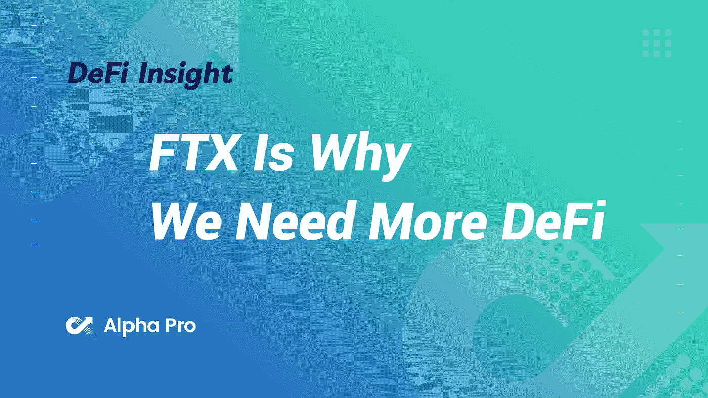
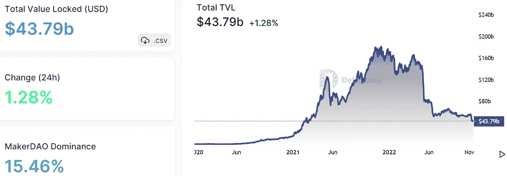
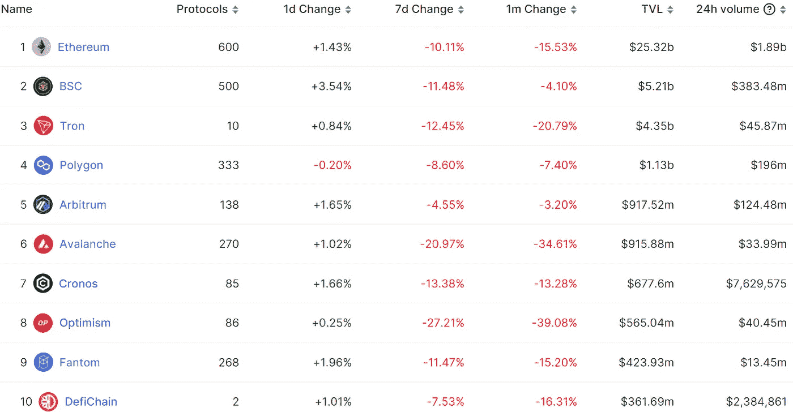
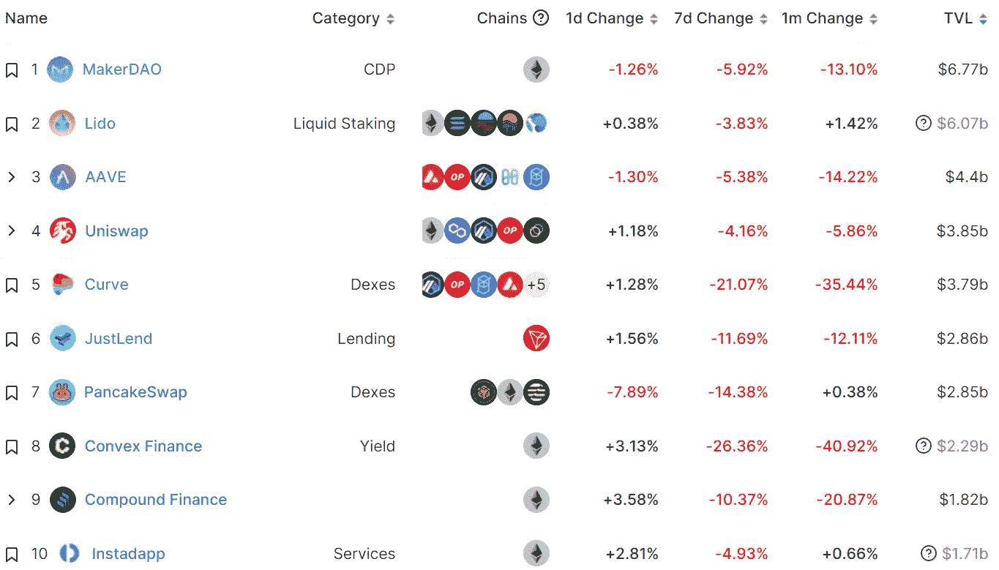
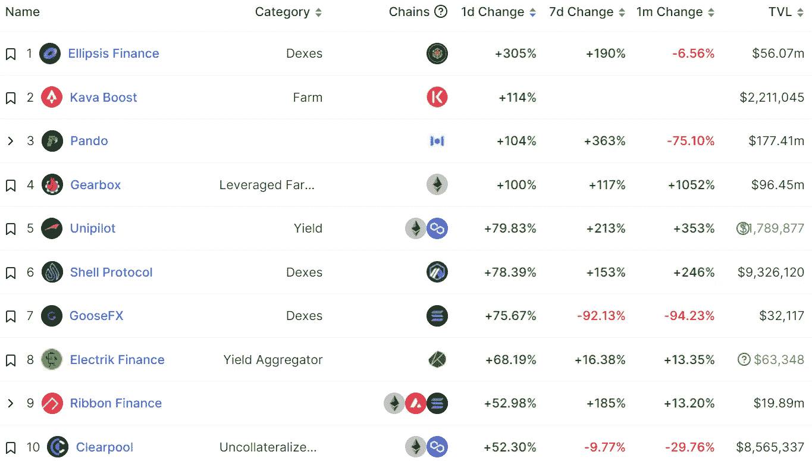
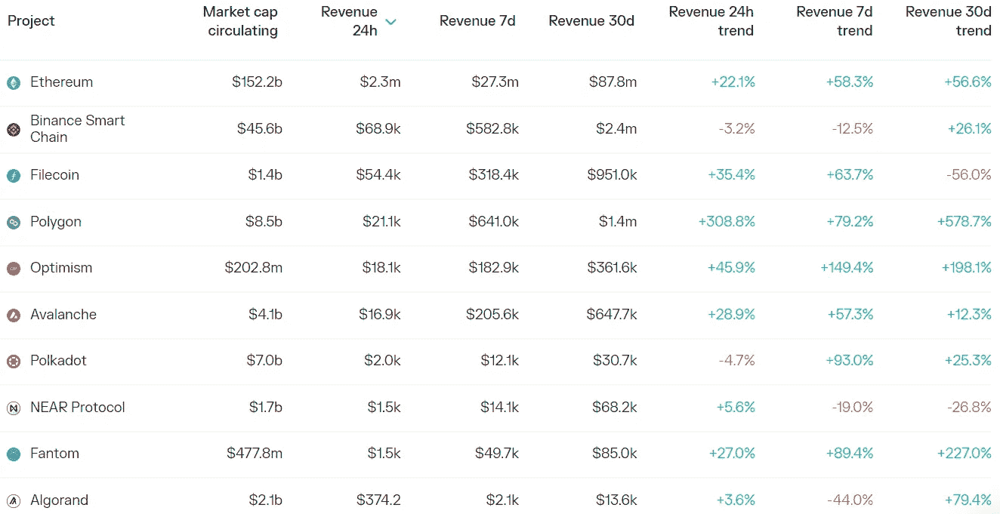
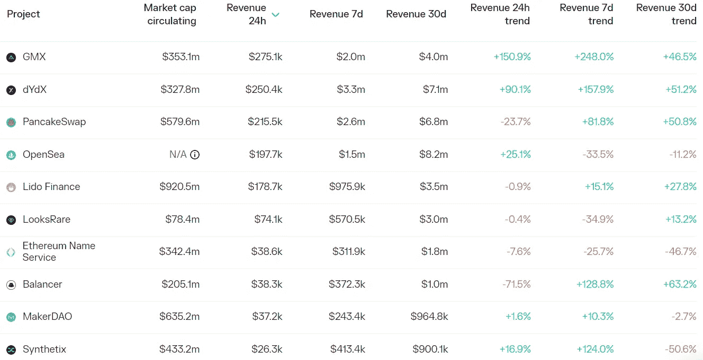

# DeFi Insight | FTX 是我们需要更多 DeFi 的原因，而不是更少

> 原文：<https://medium.com/coinmonks/defi-insight-ftx-is-why-we-need-more-defi-not-less-e1e8297e2a95?source=collection_archive---------19----------------------->

2022 年 11 月 16 日

*今日 DeFi 数据&由 DeFi Insight 为您带来的新闻*

> *FTX 不是不孝*
> 
> *如果说有什么不同的话，那就是 FTX 灾难代表了 DeFi 一直在努力取代的中央集权金融机制的失败。*
> 
> *想想 FTX 灾难的麻烦根源最终来自哪里——FTX 贷出客户存款，而不是将其作为可赎回的 1:1 存款持有。更糟糕的是，他们通过持有不成比例的大量自己的非流动性 FTT 代币作为抵押品，而不是像 stablecoins 这样更安全的资产，过度杠杆化了他们的资产负债表。简而言之，FTX 试图在不该扮演的地方扮演银行的角色，但它扮演得很糟糕。*
> 
> *对于 DeFi 交易所或银行来说，上述两种情况都是不可能的。*“@*[*来源*](https://newsletter.banklesshq.com/p/ftx-is-why-we-need-more-defi-not-bb3?utm_source=%2Finbox&utm_medium=reader2)*

# *最新消息*

## *德克斯/CEX/AMM*

***健康集中交易的六项承诺[集中交易](https://www.binance.com/en/blog/from-cz/six-commitments-for-healthy-centralized-exchanges-2882536671495731236)***

*****据@cryptoquant_com 报道，在过去的一周里，[CEXs](https://twitter.com/chainsawdotcom/status/1592295888650924032)上的加密余额已经跌至 2018 年 11 月以来的最低水平*****

*******、** SBF:阿拉米达资产大于负债， [FTX 美国](https://twitter.com/SBF_FTX/status/1592611893449220097)资产足以覆盖所有用户的还款*****

*****萨姆·班克曼-弗里德面临可能前往美国接受[质询](https://www.bloomberg.com/news/articles/2022-11-15/sam-bankman-fried-facing-possible-trip-to-us-for-questioning#xj4y7vzkg)*****

*****监管者寻求答案，FTX 债权人可能超过 100 万*****

*****议员们被告知，瑞波和币安寻求英国监管许可*****

*******,**22–316 ASIC 先生暂停 FTX 澳洲 [AFS 执照](https://asic.gov.au/about-asic/news-centre/find-a-media-release/2022-releases/22-316mr-asic-suspends-ftx-australia-s-afs-licence/)*****

*******[区块创始人](https://twitter.com/mdudas/status/1592479360006909952):2021 年卖掉公司，在 FTX 崛起期间没有参与业务*******

*******比特币基地首席执行官 Brian Armstrong 出售超过 160 万美元的股票*******

## *******第一层*******

*********/**[Fantom](https://twitter.com/FantomFDN/status/1592235625758851073)基金会将通过 Gitcoin 的新资助协议 Grants Protocol 发起一项资助计划，目前正在接受申请*******

*******/**使用 [Aptos x NPIXEL 的 Web3 游戏](/aptoslabs/web3-gaming-with-aptos-x-npixel-9c8e5d9a454a)*****

## *****稳定币*****

*******圈曝 FTX 曝光，称 [USDC](https://decrypt.co/114717/circle-ftx-exposure-usdc-conversions-binance-projections) 对币安的皈依有损预测*******

## *******贷款/CDP*******

*******加密贷款人以 FTX 事件为由停止提款*******

## *******政策与法规*******

*******据报道，FTX 事件的余波增加了南韩推动加密法规的紧迫性*******

## *******GAMEFI*******

*********、** Crypto KOL ZachXBT:连锁游戏 SolChicks 开发商未披露[、UST 雷霆损失给社区的 2000 万美元资金](https://twitter.com/zachxbt/status/1592627498428567553)*******

## *****钱包*****

*******Crypto Cold wallet in[Ledger](https://decrypt.co/114687/crypto-cold-wallets-in-ledger-trezor-sales-moon-after-ftx-collapse)，Trezor 销售月亮在 FTX 崩溃后*******

## *******NFT*******

*********[LVMH](https://www.lvmh.com/)官网首页展示 RTFKT 与 RIMOWA 合作的海报*********

*********Brevan Howard Digital 联合牵头[480 万美元](https://www.theblock.co/post/187145/brevan-howard-digital-co-leads-4-8-million-round-for-nft-fraud-detection-startup-yakoa)投资 NFT 欺诈检测初创公司 Yakoa*********

*********[宇迦实验室](https://www.businesswire.com/news/home/20221115005630/en/Yuga-Labs-Kicks-Off-First-of-Its-Kind-NFT-Museum-Donation-Initiative-Gifts-CryptoPunk-to-the-Institute-of-Contemporary-Art-Miami)首次启动 NFT 博物馆捐赠计划，将隐朋克音乐捐赠给迈阿密当代艺术学院*********

*******罗纳尔多宣布他的 NFT 系列将于 11 月 18 日在币安独家发售*******

# *******数据和分析*******

## *******锁定的总价值(TVL)*******

*******目前全网 DeFi 总锁定量为 437.9 亿美元，24 小时增长 1.28%。*******

**************

## *******TVL 评出的十大连锁酒店*******

**************

## *******|最新 TVL 十大项目*******

**************

## *******|过去 24 小时内 TVL 增长的前 10 个项目*******

**************

## *******协议收入*******

## *******|累计总收入最高的项目(24H)_ 区块链(L1)*******

**************

## *******|累计总收入最高的项目(24H) _Dapps (L2)*******

**************

# *******深潜*******

*********各队粉丝令牌还是**[**meme coin**](https://tokeninsight.com/en/research/market-analysis/teams-fan-token-or-memecoin-a-guide-to-world-cup-related-coins)**？—世界杯相关硬币指南*********

***** [## 球队的球迷代币还是球迷币？-世界杯相关硬币指南

### 2022 年世界杯即将在⚽️⚽️⚽️.举行哪些与世界杯相关的硬币/代币可能会受到关注…

tokeninsight.com](https://tokeninsight.com/en/research/market-analysis/teams-fan-token-or-memecoin-a-guide-to-world-cup-related-coins) 

**【NFT】**[**技能树**](https://metaversal.banklesshq.com/p/the-nft-skill-tree?utm_source=%2Finbox&utm_medium=reader2)

 [## NFT 技能树🎯

### 亲爱的无银行国家，在我过去的一些帖子中，我反复提到了“NFT 技能树”的概念都是技巧…

metaversal.banklesshq.com](https://metaversal.banklesshq.com/p/the-nft-skill-tree?utm_source=%2Finbox&utm_medium=reader2) 

**如何保管您的** [**密钥**](https://newsletter.banklesshq.com/p/crypto-keys-ledger-self-custody?utm_source=%2Finbox&utm_medium=reader2)

 [## 如何保管您的加密密钥

### 与往常一样，每个人都可以使用第一个令牌，但您需要升级到无银行高级版才能访问…

newsletter.banklesshq.com](https://newsletter.banklesshq.com/p/crypto-keys-ledger-self-custody?utm_source=%2Finbox&utm_medium=reader2) 

**|每周基本面|图表和趋势** [**手表中的**](https://tokenterminal.substack.com/p/weekly-fundamentals-charts-and-trends-cd9?utm_source=%2Finbox&utm_medium=reader2)

 [## 每周基本面|图表和趋势观察加密

### 对加密领域最有趣的图表和趋势的概述，重点是关键业务驱动因素和协议…

tokenterminal.substack.com](https://tokenterminal.substack.com/p/weekly-fundamentals-charts-and-trends-cd9?utm_source=%2Finbox&utm_medium=reader2) 

# 报告

**一层一层:** [**Canto**](https://www.theblockresearch.com/layer-by-layer-canto-sees-growth-but-also-centralization-186068) **看到增长也看到集中化** _theblockresearch

*   Kava Network 独特的 Co-Chain 架构为网络提供了以太坊智能合约的速度和灵活性以及 Cosmos SDK 框架的互操作性。
*   虽然卡瓦网络的 TVL 自牛市期间的历史高点以来显著下降，但卡瓦网络目前的 DeFi 市场份额自 2022 年初以来有所增加。这显示了卡瓦网络相对于 DeFi 的其他网络而言日益增长的力量。
*   未来多链桥和其他潜在桥集成的引入将允许更容易地进入卡瓦生态系统，这有望为卡瓦生态系统吸引更多的用户和流动性。

**[**FTX 传奇**](https://messari.io/report/ftx-saga-key-events-and-live-updates?referrer=all-research) **:关键事件及实时更新 _** 梅萨里**

****FTX 缺少** [**资产负债表**](https://messari.io/report/ftx-s-lack-of-balance-sheet?referrer=all-research) **_** 梅萨里**

****关于** [**跨链桥**](https://www.theblockresearch.com/on-the-user-experience-of-cross-chain-bridges-182966)_ the block 的用户体验研究**

****快速洞察:初步审视 FTX 崩溃的余波******_ The block research******

********11 月分析师来电|** [**FTX &阿拉米达 Part 2**](https://www.theblockresearch.com/november-analyst-call-full-video-ftx-alameda-part-2-187348) _theblockresearch******

******_ 区块研究提高资金效率******

********[**卡瓦网络**](https://messari.io/report/kava-network-defi-for-all?referrer=all-research)**:DeFi for All _**messari********

******设计事项:** [**分散服务网络**](https://messari.io/report/design-matters-the-case-for-fee-markets-in-decentralized-service-networks?referrer=all-research) **_** messari 中的费用市场案例****

******[**ZK**](https://messari.io/report/the-zk-everything-report?referrer=all-research)**事事报告 _** 梅萨里******

******数字** [**资产**](https://coinshares.com/research/bi-weekly-digest) **双周刊摘要** **_** coinshares****

******关于:******

****DeFi Insight 是顶级 DeFi 和加密新闻和更新的来源。****

******https://twitter.com/AlphaPro_io**❤[**t51】**](https://twitter.com/AlphaPro_io)****

******❤RSS:**[**https://medium.com/feed/@alphapro.project**](https://medium.com/feed/@alphapro.project)****

****提供的信息应被视为发展新闻，而不是投资建议。****

> ****交易新手？尝试[加密交易机器人](/coinmonks/crypto-trading-bot-c2ffce8acb2a)或[复制交易](/coinmonks/top-10-crypto-copy-trading-platforms-for-beginners-d0c37c7d698c)*********