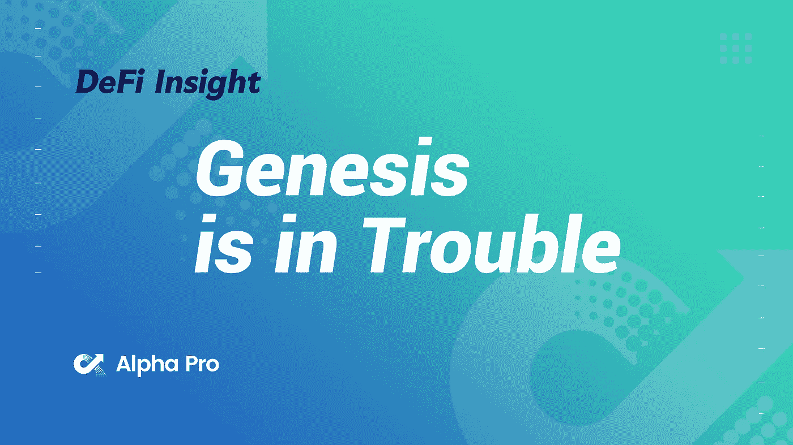
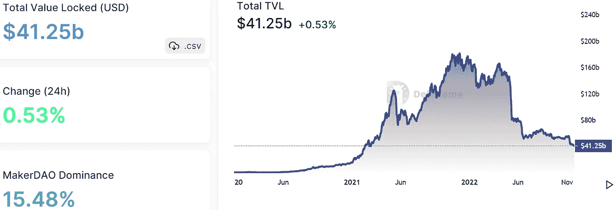
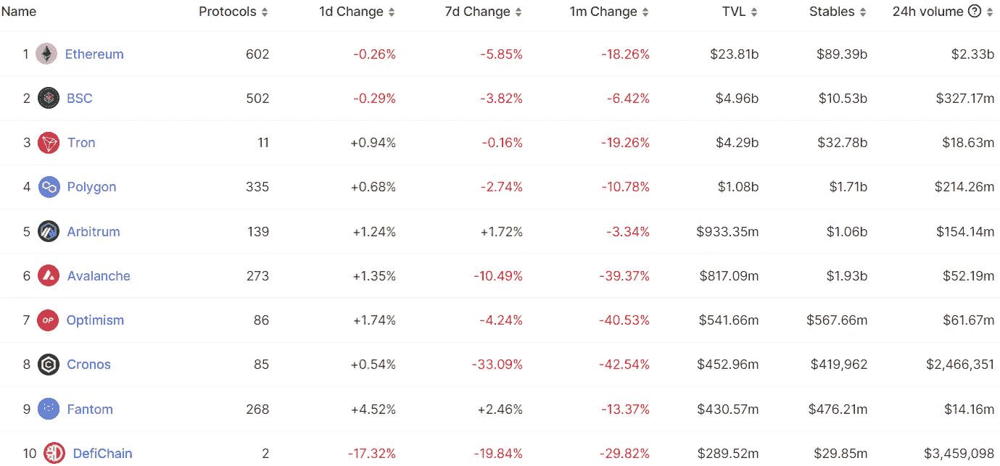
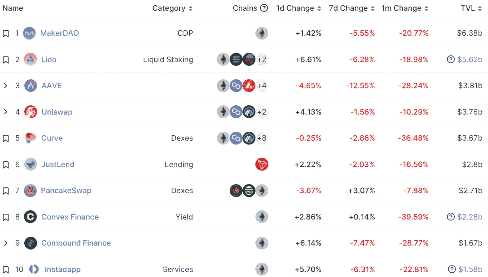
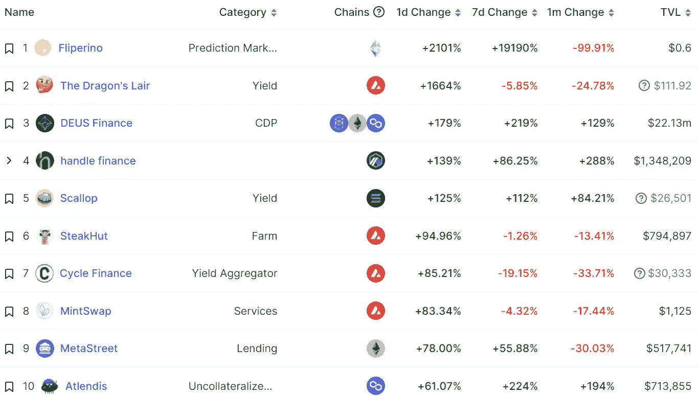
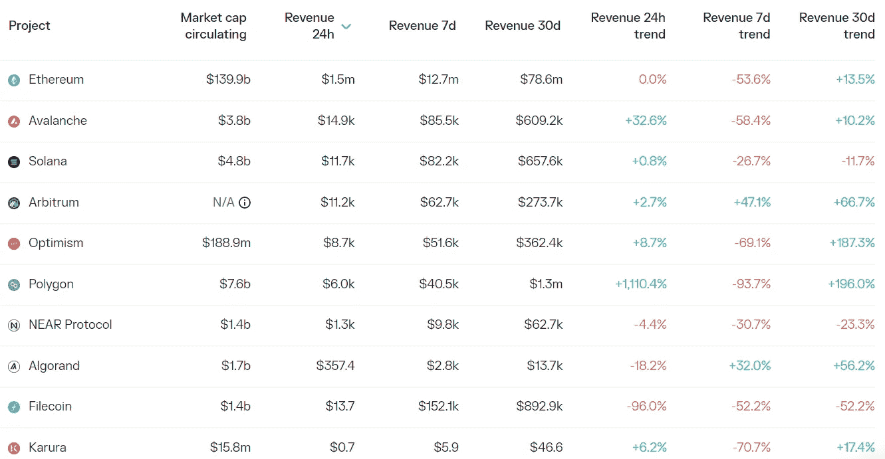
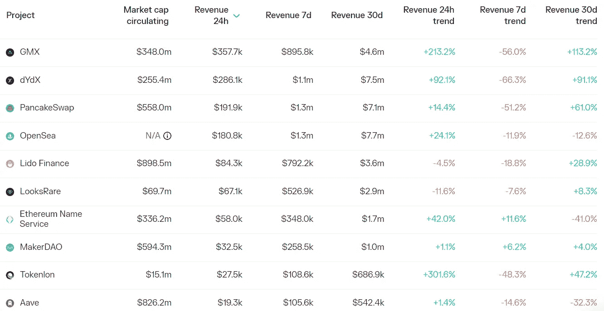

# DeFi Insight |创世纪有麻烦了

> 原文：<https://medium.com/coinmonks/defi-insight-genesis-is-in-trouble-a07abd5e9f70?source=collection_archive---------15----------------------->

2022 年 11 月 23 日

*今日 DeFi 数据&由 DeFi Insight 为您带来的新闻*

> *"* 虽然还不清楚 Genesis 的传奇将如何结束，但更广泛的加密行业的近期命运再次取决于另一家黑盒 CeFi 实体的偿付能力。如果 Genesis 失败，将会产生巨大的负面影响，特别是考虑到该公司在机构投资加密方面的作用。*“@*[*来源*](https://newsletter.banklesshq.com/p/genesis-is-in-trouble-22c?utm_source=%2Finbox&utm_medium=reader2)

# 最新消息

## 第一层

**Ankr 提供了首批 [Sui](https://www.ankr.com/blog/ankr-offers-the-first-sui-blockchain-connection/) 区块链连接之一**

## **贷款/CDP**

**电子邮件显示,**[BlockFi](https://www.theblock.co/post/189335/blockfi-puts-client-loans-into-forbearance-email-shows)让客户贷款延期****

******密码 ATM 运营商币云从[创世纪](https://www.bloomberg.com/news/articles/2022-11-22/crypto-atm-operator-coin-cloud-discussed-equity-from-genesis)谈股权******

******资产负债表揭示了希尔伯特帝国的贷款网络******

******陷入困境的加密贷款公司 Genesis 雇佣了一名重组顾问******

******Aave :大多数 CRV 抵押品头寸已经被清算，留下了 160 万美元的坏账******

## ******德克斯/CEX/AMM******

********红杉资本为 [FTX 损失](https://www.wsj.com/articles/sequoia-capital-apologizes-to-limited-partners-for-ftx-investment-11669144914)向其基金投资者道歉********

********[比特币基地 CEO](https://twitter.com/brian_armstrong/status/1595126425371414528) :公司财务公开，持有 200 万 BTC，请谨防虚假信息********

********[班克曼-弗里德](https://www.coindesk.com/business/2022/11/22/bankman-fried-apologizes-to-ftx-employees-details-amount-of-leverage-in-internal-letter/)向 FTX 员工道歉，内部信详细说明杠杆数额********

## ******稳定币******

********Curve 为其 [stablecoin](https://www.theblock.co/post/189140/curve-releases-whitepaper-and-official-code-for-its-stablecoin?utm_source=twitter&utm_medium=social) 发布白皮书和官方代码********

## ******衍生产品******

********[dYdX](https://dydx.exchange/blog/v4-milestone-2-is-complete)宣布 dYdX 链进展:内部测试网已经发布，涵盖杠杆、费用、清算等核心功能********

## ******|令牌******

********DMCC 通过 comtech [金条的令牌化将黄金交易数字化](https://www.wam.ae/en/details/1395303104316)********

## ******空投******

********[**跨步**](https://twitter.com/stride_zone/status/1595196195818848258?s=20&t=6LP06fPqw7mL8f91UK4D2g)**空投治理令牌 STRD 已开放申请**********

## ******鲸鱼******

******以太坊的大鲸鱼(持有 1090 万美元至 10.9 亿美元)又增加了 947940 美元，价值约 10.3 亿美元******

## ******|警报******

******分不实资本创始人沈波:价值 4200 万美元的个人钱包资产被盗******

## ******NFT******

********、** RogueBlox Alpha 测试[活动](/@OpenBlox/rogueblox-alpha-test-campaign-1a3acae28b93)******

******,**[NFT](https://techcrunch.com/2022/11/22/nft-marketplace-magic-eden-integrates-with-polygon-to-grow-blockchain-gaming/?guccounter=1&guce_referrer=aHR0cHM6Ly93d3cudGhlYmxvY2tiZWF0cy5pbmZvLw&guce_referrer_sig=AQAAAFYynzSxkOOnJmqEpcS0rQo578yxBIO2C7hvrHa5EL9b0g00PxH3BfI8YADECy3QMbrnFbATeu8V4eW41_Wt6QDDe13xc1LUXLgOy06QGaWPNBDPvqgCId55-Lh7m4I6oj_01OMi2JmIpTXiB7W8YF-Z9zzLo2rW_DhxgxlI5o1L)市场魔术伊甸园与多边形整合发展区块链游戏****

## ****基金****

******[**DCG CEO**](https://twitter.com/Crypto_Plato/status/1595181012291502080?s=20&t=q_BH9pYJlVgM78wMIEAMHw)**致股东的信:相信会走出这个密码寒冬，今年营收可能达到 8 亿美元********

## ******观点******

********倒下的对冲基金三箭资本的创始人说 [FTX](https://www.bloomberg.com/news/articles/2022-11-22/fallen-hedge-fund-3ac-s-founder-says-ftx-set-crypto-back-years) 设定了多年前的密码********

## ******政策与法规******

******币安美国带着新的竞选 PAC 步入国家政治******

******英国央行副行长: [FTX](https://news.bitcoin.com/bank-of-england-deputy-governor-ftx-collapse-highlights-urgent-need-for-tighter-crypto-regulation/) 崩溃凸显了加强加密监管的迫切需要******

******小牧从迪拜虚拟资产管理局获得 MVP 许可******

## ******锁定的总价值(TVL)******

******目前全网 DeFi 总锁定量为 412.5 亿美元，24 小时增长 0.53%。******

************

## ******TVL 评出的十大连锁酒店******

************

## ******|最新 TVL 十大项目******

************

## ******|过去 24 小时内 TVL 增长的前 10 个项目******

************

## ******协议收入******

## ******|累计总收入最高的项目(24H)_ 区块链(L1)******

************

## ******|累计总收入最高的项目(24H) _Dapps (L2)******

************

# ******深潜******

********如何双倍下注** [**DeFi**](https://newsletter.banklesshq.com/p/defi-crypto-maker-aave-uniswap-saver?utm_source=%2Finbox&utm_medium=reader2)******

**** [## 如何在 DeFi 上加倍下注

### 提升你的区块链审计水平👨‍💻亲爱的无银行国家，今年最大的…

newsletter.banklesshq.com](https://newsletter.banklesshq.com/p/defi-crypto-maker-aave-uniswap-saver?utm_source=%2Finbox&utm_medium=reader2) 

**寻找 [NFT](https://metaversal.banklesshq.com/p/finding-nft-mints-with-gem?utm_source=%2Finbox&utm_medium=reader2) 带宝石的薄荷糖**

** [## 寻找带宝石的 NFT 薄荷糖💎

### 亲爱的无银行国家，Gem 是一个 NFT 市场聚合器。该平台帮助先锋“扫荡”，或购买非功能性食物…

metaversal.banklesshq.com](https://metaversal.banklesshq.com/p/finding-nft-mints-with-gem?utm_source=%2Finbox&utm_medium=reader2)** 

# **报告**

****扩张 [Uniswap 的](https://messari.io/report/expanding-uniswaps-addressable-market?referrer=all-research)目标市场 **_** messari****

*   ****为了保持目前的增长势头，Uniswap 必须想方设法扩大其潜在市场。****
*   ****Uniswap 已成功启动第 2 层扩展解决方案的部署，占 2022 年第 3 季度第 2 层 DEX 总量的 65%。****
*   ****一些项目利用了 Uniswap 的软件开发工具包，或者整合了 Uniswap 协议，或者增加了其功能。****
*   ****对于 Uniswap 的增长，是否打开收费开关是一个大争论。问题是，一个新的成长型投资资金池是否会抵消与流动性提供者的竞争地位下降。****

******[**NFT 洗盘交易入门**](https://members.delphidigital.io/reports/a-primer-on-nft-wash-trading)_ 德尔福数码******

******生成性** [**艺术 NFTs**](https://www.theblockresearch.com/the-uncoupling-of-generative-art-nfts-188385)**_**block research 的解耦****

******分析潘迪拉的** [**投资组合**](https://www.theblockresearch.com/analyzing-panteras-investment-portfolio-183889)**_**the block research****

******Defi 101:**[**曲线金融**](https://research.thetie.io/defi-101-curve-finance/) **_** thetie****

******FTX 的** [**涟漪效应**](https://messari.io/report/the-ripple-effects-of-ftx-and-alameda-s-off-chain-arrangements?referrer=all-research) **和阿拉米达的链外安排 _** 梅萨里****

******我们是** [**所有失败者**](https://messari.io/report/we-re-all-losers-here-just-some-less-than-others?referrer=all-research) **在这里，只是比别人少一些而已 _** messari****

******关于:******

****DeFi Insight 是顶级 DeFi 和加密新闻和更新的来源。****

******https://twitter.com/AlphaPro_io 推特:******

********❤RSS:**[**https://medium.com/feed/@alphapro.project**](https://medium.com/feed/@alphapro.project)******

****提供的信息应被视为发展新闻，而不是投资建议。****

> ****交易新手？尝试[加密交易机器人](/coinmonks/crypto-trading-bot-c2ffce8acb2a)或[复制交易](/coinmonks/top-10-crypto-copy-trading-platforms-for-beginners-d0c37c7d698c)********