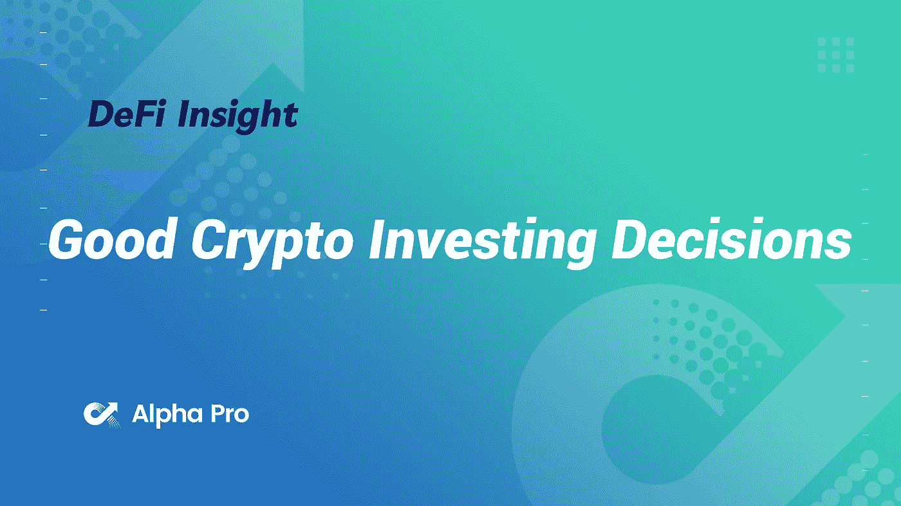
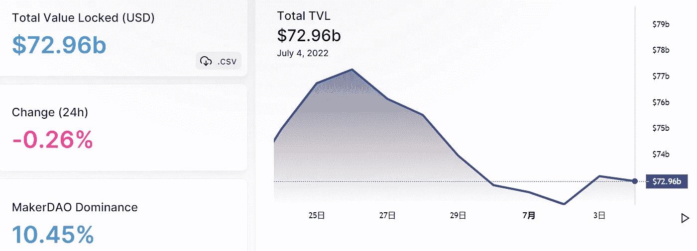
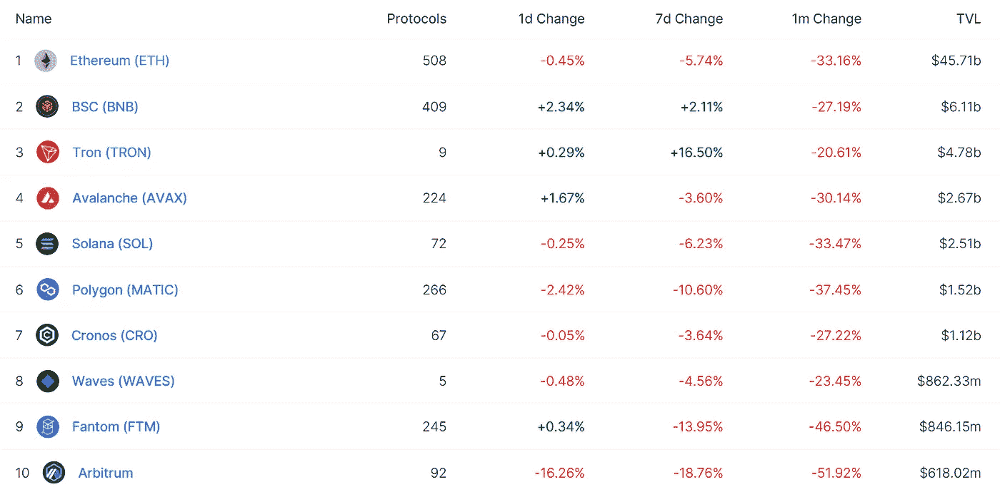
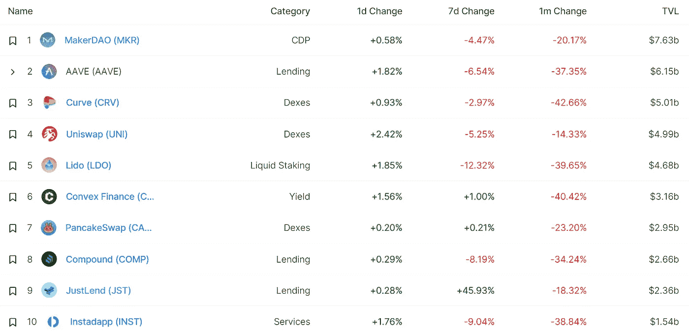
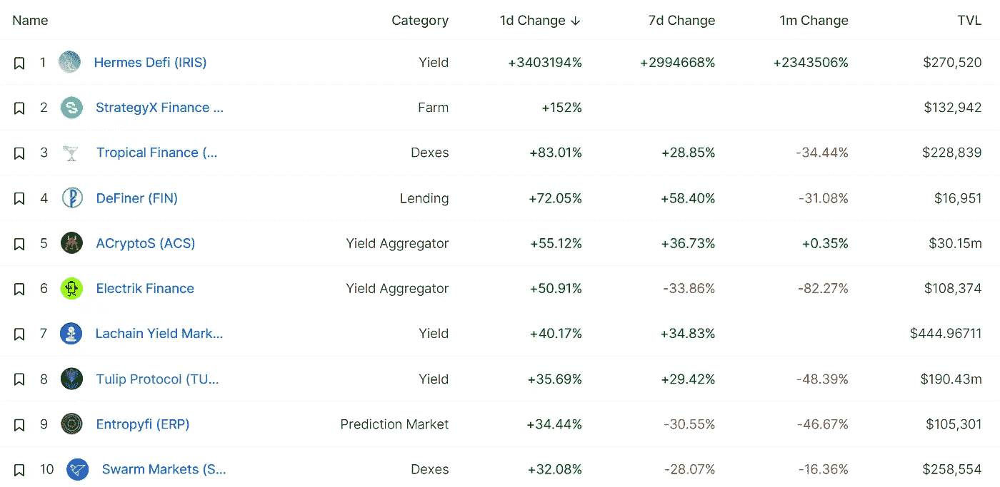
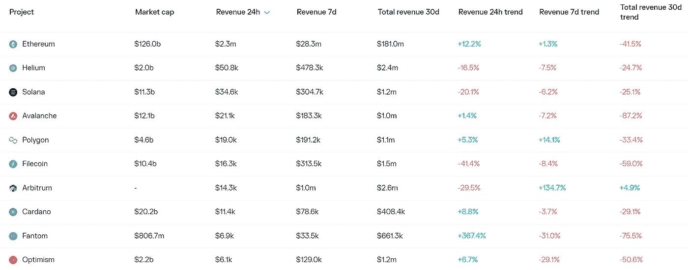
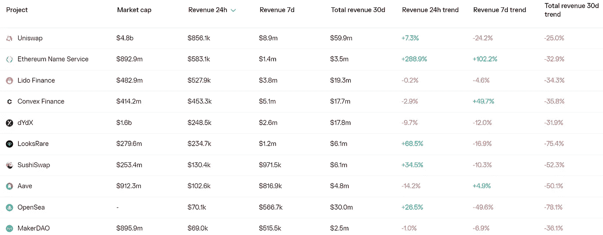
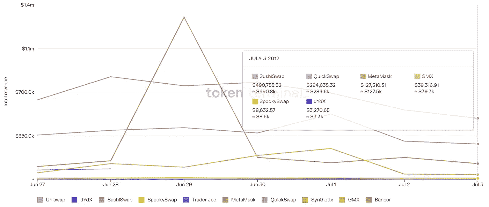
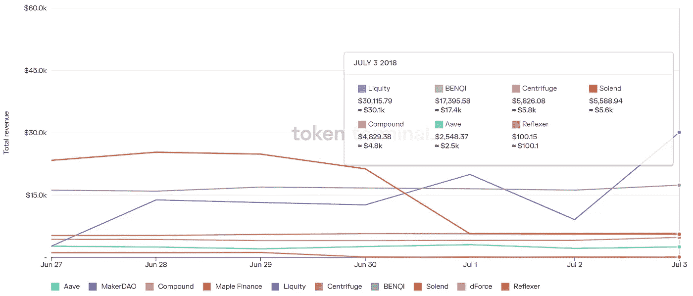

# DeFi Insight |良好的加密投资决策

> 原文：<https://medium.com/coinmonks/defi-insight-good-crypto-investing-decisions-98ff670a05b0?source=collection_archive---------33----------------------->

2022 年 7 月 4 日

*今日 DeFi 数据&由 DeFi Insight 为您带来的新闻*

> *"* 上周，我发表了一篇文章，讲述了我在过去一年半的时间里深陷于加密中所犯下的重大错误。
> 
> 然而，很多事情也进行得很顺利，这绝对是一个成功的时期。那么，除了出错的事情，还有什么是对的呢？或者有哪些我很高兴自己做出的谨慎的决定？
> 
> 这是最突出的部分。*“@*[*来源*](https://crypto.nateliason.com/p/good-crypto-investing-decisions-20?utm_source=%2Finbox&utm_medium=reader2)

# 最新消息

## 贷款

**[Vaul](https://www.theblock.co/post/155679/vauld-halts-withdrawals-hires-legal-financial-advisors?utm_source=cryptopanic&utm_medium=rss%3Futm_source%3Dblockworks-research)d 停止客户提款，并为潜在的重组雇佣顾问**

**Solend 方正披露其巨鲸清算事件的幕后真相**

**BlockFi 与山姆·班克曼-弗里德的 FTX 的交易将优先考虑客户**

> **交易新手？尝试[加密交易机器人](/coinmonks/crypto-trading-bot-c2ffce8acb2a)或[复制交易](/coinmonks/top-10-crypto-copy-trading-platforms-for-beginners-d0c37c7d698c)**

## **指标**

****介绍[丛林指数](https://twitter.com/beniaminmincu/status/1542835011308736512):web 3 创新的游乐场****

## ****稳定币****

****福音传道者坚持认为稳定的货币有充足的储备作为后盾。投资者并不信服****

****阿根廷经济部长辞职后，美元稳定，阿根廷货币溢价飙升****

## ****市场****

******[被解雇](https://beincrypto.com/fired-3500-crypto-specialists-without-work-more-layoffs-to-come/):3500 名密码专家失业，更多裁员即将到来******

## ******资产管理******

********[旅行者](https://twitter.com/investvoyager/status/1543620855804166144)持有约 16.5 亿美元的加密资产和现金，对三箭资本索赔超过 6.5 亿美元********

## ******叉子******

********[Cardano Testnet](https://twitter.com/InputOutputHK/status/1543692218799718401)完成 Vasil 硬叉********

## ******采矿******

********[三星生产 3 纳米芯片](https://forkast.news/headlines/samsung-produces-3nm-chips-bitcoin-mining/?utm_source=blockworks-research)可用于比特币挖矿********

******如果矿工向国外出售铸造硬币，俄罗斯银行准备将加密采矿合法化******

## ******政策与法规******

********[桑戈](https://www.youtube.com/watch?v=MMFCAvv50UU)硬币起源事件——中非共和国支持的项目********

## ******NFT******

********[币安 NFT](https://www.binance.com/en/support/announcement/f6e38dfd42dd4d0395904b52a49f8519) 推出“波尔图:第 30 届冠军”NFT 神秘盒子系列和 NFT 发电站，分享 2000 张波尔图球迷代币！********

## ******基金******

********[三个箭头](https://www.coindesk.com/markets/2022/07/02/three-arrows-paper-trail-leads-to-trading-desk-obscured-via-offshore-entities/)通过离岸实体，文件线索通向模糊的交易台********

******尽管逆风，东方投资公司仍然看好印尼和东南亚******

## ******观点******

******维塔利克·布特林的妈妈解释了在加密领域取得成功需要什么******

********,**层压这个:对[的加密憎恨者说什么](https://decrypt.co/101448/laminate-this-what-to-say-to-crypto-haters)******

# ****数据和分析****

## ****锁定的总价值(TVL)****

****目前全网 DeFi 总锁定量为 729.6 亿美元，24 小时下降 0.26%。****

********

## ****TVL 评出的十大连锁酒店****

********

## ****|最新 TVL 十大项目****

********

## ****|过去 24 小时内 TVL 增长的前 10 个项目****

********

## ****协议收入****

## ****|累计总收入最高的项目(24H)_ 区块链(L1)****

********

## ****|累计总收入最高的项目(24H) _Dapps (L2)****

********

## ****|前 10 大交易所的每日收入****

********

## ****|十大贷款协议的每日收入****

********

# ****深潜****

******什么样的** [**美国独立**](https://bitcoinmagazine.com/culture/american-independence-secured-by-bitcoin) **用比特币担保时的样子******

**** [## 用比特币担保的美国独立是什么样子

### 这是布鲁斯·芬顿的观点社论，他是美国参议员候选人，也是链石实验室的创始人兼首席执行官…

bitcoinmagazine.com](https://bitcoinmagazine.com/culture/american-independence-secured-by-bitcoin) 

**美国和英国关于** [**无人托管的钱包**](https://www.trmlabs.com/post/the-united-states-and-the-united-kingdom-on-unhosted-wallets-an-ocean-apart)**——一洋之隔？**

 [## 美国和英国在无人托管的钱包上——隔着一片海洋？| TRM 洞察

### 根据英国财政部对英国反洗钱/CFT 相关咨询的最终回应，我们将了解金融…

www.trmlabs.com](https://www.trmlabs.com/post/the-united-states-and-the-united-kingdom-on-unhosted-wallets-an-ocean-apart) 

**一个狂野的**[**Uniswap**](https://defieducation.substack.com/p/a-wild-uniswap-appeared)**出现了！**

 [## 一个狂野的 Uniswap 出现了！

### 欢迎头像！上周，Uniswap 收购了 Genie，这是一个让你可以在市场间买卖 NFT 的聚合器…

defieducation.substack.com](https://defieducation.substack.com/p/a-wild-uniswap-appeared) 

**[**令牌化的真实资产**](https://twitter.com/ChainLinkGod/status/1543323712325267456) **是 DeFi 将如何扩展到全球水平****

# **报告**

****[**导航 Crypto 的波峰波谷**](https://www.nansen.ai/research/a-sentiment-indicator-for-nfts) **:我们能为 NFTs 制定一个情感指标吗？**_ 南森****

> ****可替代的令牌周期:南森分析了投资者情绪和宏观经济指标，得出以下结论:****
> 
> ****投资者情绪在 2022 年 5 月转向“恐慌”，标志着长期加密价格整合的开始(见图 1)
> 加密价格要退出整合阶段并触底反弹，基本面的不确定性必须降低
> 这种情况的主要情景是美联储越来越关注失业、通胀
> 实际增长急剧放缓， 这意味着这种情况越来越近
> 历史分析表明，美联储在 Q1 2023 年之前暂停货币紧缩的可能性更大(见图 6)
> NFT 周期:NFT 与可互换代币的相关性弱于可互换代币间的相关性，南森基于两个链上指标开发了一个专门针对 NFT 市场的投资者情绪指标:****
> 
> ****NFT 价格的跟踪已实现波动率:更高的已实现波动率->更高的远期周回报率
> 蓝筹股 NFTs 与所有 NFTs 销售的数量:更高的比率- >更低的远期周回报率(参见图 21 进行回测)****

******[**NFT 市场**](https://messari.io/article/comparative-analysis-of-nft-marketplaces) **的比较分析** _messari******

******[**名词**](https://www.theblockresearch.com/nouns-a-pioneer-in-the-proliferation-of-culture-155499) **:文化扩散的先驱** _theblockresearch******

******[**乐观主义 vs .武断**](https://tokeninsight.com/en/research/market-analysis/optimism-vs.-arbitrum-a-complete-comparison) **—完全比较** _tokeninsight******

******关于:******

****DeFi Insight 是顶级 DeFi 和加密新闻和更新的来源。****

******https://twitter.com/AlphaPro_io******

********https://medium.com/feed/@alphapro.project**[**RSS:**](https://medium.com/feed/@alphapro.project)******

****提供的信息应被视为发展新闻，而不是投资建议。********