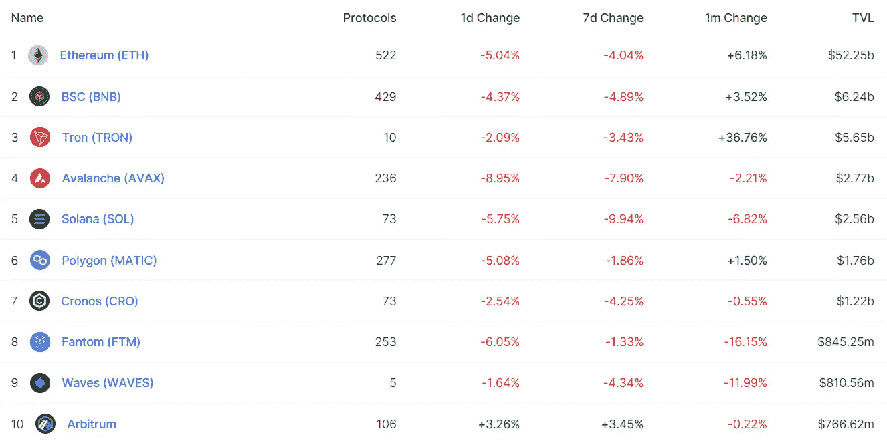

# 我们对 2022 年稳定币的预测经受住了时间的考验吗？

> 原文：<https://medium.com/coinmonks/defi-insight-have-our-stablecoin-predictions-for-2022-stood-the-test-of-time-89b529b82e4d?source=collection_archive---------39----------------------->

2022 年 7 月 26 日

*今日 DeFi 数据&由 DeFi Insight 为您带来的新闻*

> *"* 让我们把时钟倒回到更光明的时代，那时并非短暂的通胀尚未完全释放所有风险资产、更高利率的敌人，在过去几个月的动荡尚未发生之前——即 2021 年底。
> 
> 奥妙研究公司随后发布的一份报告提出了一系列对来年的预测。2022 年上半年过去了，让我们重温一下三个 stablecoin 预测。到目前为止，它们经得起时间的考验吗？*“@*[*来源*](https://arcane.no/research/a-revisit-of-arcanes-stablecoin-predictions-for-2022-have-they-stood-the)

# 最新消息

## 外汇

**、** Web3 交易平台[弹弓集成赛车场](https://mobile.twitter.com/SlingshotCrypto/status/1551640052530221056)

币安 CZ 对彭博提起诽谤诉讼

## 打桩

**[霍普尔](/hoprnet/hopr-staking-4-0-21e66a2bf752)锁定 4.0**

## **稳定币**

**为什么 [Tether](https://decrypt.co/105931/why-tether-and-bitfinex-are-launching-a-p2p-video-chat-app-called-keet) 要推出一款名为 Keet 的 P2P 视频聊天应用**

## **交叉链**

****[thor chain](/thorchain/thorchains-next-phase-adoption-growth-scaling-b82062b19569)的下一阶段:采用、成长、&扩展****

## ****第二层****

******,**Drippie:乐观主义[如何自动化以太坊](https://dev.optimism.io/drippie-how-optimism-automates-ethereum/)****

******[Tezos](https://xtz.news/events/tezos-developer-event-attracts-record-numbers-ahead-of-wasm-and-evm-roll-up-upgrades-announces-1000000-tps-goal/)开发者大会在 WASM 和 EVM 升级之前吸引了创纪录的人数，宣布了 100 万 tps 的目标******

## ******支付******

********[Ripple](https://u.today/ripple-inks-major-partnership-with-singapore-based-payment-institution)Inks 与新加坡的支付机构建立了主要合作关系********

## ******空投******

******我们正在[给村上赠送 T 恤衫。花架](https://twitter.com/takashipom/status/1551764664899424257)截至 2022 年 7 月 10 日晚 11 点 59 分(格林威治时间)拍摄的快照。******

## ******甲骨文******

********监管合规[定价神谕](https://cryptoslate.com/regulatory-compliant-pricing-oracles-to-allow-new-institutional-investment-opportunities/)允许新的机构投资机会********

## ******政策与法规******

******菲律宾中央银行行长解释加密政策——“我不希望它被禁止”******

******立法者赶在八月休会前发布稳定货币法案的草案******

## ******NFT******

********迪拜警方将在 2022 年 GITEX 环球展上推出[第二个 NFT 系列](https://coinquora.com/dubai-police-to-unveil-second-nft-collection-at-gitex-global-2022/)********

********[屈服公会游戏](/yield-guild-games/yield-guild-games-one-year-on-and-looking-to-the-future-1d6b6f9e70b9):一年过去，展望未来********

## ******基金******

******Aptos 从 FTX 风投公司 Jump Crypto 融资 1.5 亿美元******

******Coinzix 筹集了 30 万美元的资金******

********,**隐世:什么危机？风险投资家[在密码上押了大注](https://www.reuters.com/technology/cryptoverse-what-crisis-venture-capitalists-bet-big-crypto-2022-07-26/)******

## ****观点****

****FTX 首席执行官山姆·班克曼·弗里德相信加密技术将在拉美蓬勃发展****

# ****数据和分析****

## ****锁定的总价值(TVL)****

****目前全网 DeFi 总锁定量为 817.9 亿美元，24 小时下降 4.78%。****

********

## ****TVL 评出的十大连锁酒店****

********

## ****|最新 TVL 十大项目****

********

## ****|过去 24 小时内 TVL 增长的前 10 个项目****

********

## ****协议收入****

## ****|累计总收入最高的项目(24H)_ 区块链(L1)****

********

## ****|累计总收入最高的项目(24H) _Dapps (L2)****

********

## ****|前 10 大交易所的每日收入****

********

## ****|十大贷款协议的日收入****

********

# ****深潜****

******[**定罪**](https://insights.glassnode.com/the-week-onchain-week-30-2022/) **通过合流********

**** [## 合流定罪

### 在围绕 2 万美元区域盘整一个月后，比特币价格经历了一轮期待已久的轻松反弹…

insights.glassnode.com](https://insights.glassnode.com/the-week-onchain-week-30-2022/) 

**[**分析最近 NFT 不和谐的黑客攻击**](https://www.trmlabs.com/post/trms-analysis-of-recent-surge-in-discord-hacks-shows-some-attacks-are-connected) **显示一些攻击是有联系的****

** [## 对最近 NFT 不和谐黑客攻击的分析显示，一些攻击是有联系的

### 2022 年 7 月 25 日社交媒体平台 Discord 被流行的不可伪造令牌(NFT)项目广泛使用，已经…

www.trmlabs.com](https://www.trmlabs.com/post/trms-analysis-of-recent-surge-in-discord-hacks-shows-some-attacks-are-connected) 

**[**如何将**](https://dappradar.com/blog/how-to-integrate-the-open-defi-notification-protocol-into-your-defi-project) **开放 DeFi 通知协议集成到您的 DeFi 项目中****

** [## 如何将开放式 DeFi 通知协议整合到您的 DeFi 项目中

### 开放定义通知协议是一个免费使用的、由社区驱动的项目，由 Summary:DeFi.org 提供支持

dappradar.com](https://dappradar.com/blog/how-to-integrate-the-open-defi-notification-protocol-into-your-defi-project)** 

# **报告**

****[**公共部门调查预览**](https://blog.chainalysis.com/reports/cryptocurrency-north-america-public-sector-survey-2022/)**:chan analysis 2022 年加密货币调查状况**_ chan analysis****

> ****加密货币给公共部门带来了独特的挑战。在执法方面，加密货币正在触及各种形式的犯罪:毒品、盗窃、欺诈、洗钱——只要你能想到的。但加密货币案件与涉及传统金融的案件有很大不同，需要新的工具和方法来解决。从监管机构的角度来看，加密货币在不到十年的时间里已经从一个小众爱好发展成为一个万亿美元的资产类别，带来了对消费者保护、市场操纵、反洗钱/CTF 执法等问题的担忧。****

******[**花粉和氦气**](https://members.delphidigital.io/reports/pollen-and-helium-the-race-to-bootstrap-a-5g-network)**:5G 网络的竞赛** _delphidigital******

******[**尤尼斯瓦普编年史**](https://messari.io/article/the-chronicles-of-uniswap-the-token-the-switch-and-the-wardrobe) **:令牌、开关、衣柜**_ 梅萨里******

******[**航海家号数字第十一章**](https://www.theblockresearch.com/voyager-digital-chapter-11-analyzing-ftxs-proposal-159301) **:解析 FTX 的提议** _theblockresearch******

******关于:******

****DeFi Insight 是顶级 DeFi 和加密新闻和更新的来源。****

******https://twitter.com/AlphaPro_io 推特:******

********❤RSS:**[**https://medium.com/feed/@alphapro.project**](https://medium.com/feed/@alphapro.project)******

****提供的信息应被视为发展新闻，而不是投资建议。****

> ****交易新手？试试[加密交易机器人](/coinmonks/crypto-trading-bot-c2ffce8acb2a)或[复制交易](/coinmonks/top-10-crypto-copy-trading-platforms-for-beginners-d0c37c7d698c)**********