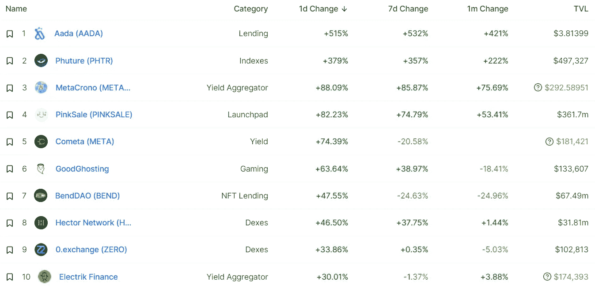

# 以太坊合并如何影响加密生态系统

> 原文：<https://medium.com/coinmonks/defi-insight-how-the-ethereum-merge-may-impact-the-crypto-ecosystem-fd5ea539c1b6?source=collection_archive---------18----------------------->

2022 年 9 月 8 日

*今日 DeFi 数据&由 DeFi Insight 为您带来的新闻*

> *"* 大约在 2022 年 9 月 15 日，以太坊区块链将会将其共识机制从工作证明(PoW)切换到利益证明(PoS)。在 PoS 下，验证者通过将区块链的本地加密货币发送到智能合同来“下注”，加密货币在智能合同中保持锁定，随机选择一个验证者来确认每个新块并获得相关奖励。在以太坊的情况下，验证者必须下注 32 以太，但用户可以通过加入赌注池获得更少的赌注奖励。PoS 比 PoW 共识机制更环保，在 PoW 共识机制下，矿商通过消耗大量计算能力和电力来竞争验证新区块。除了环境影响之外，许多人认为转换到 PoS 可以降低过度集中的风险，因为它将验证者的角色开放给任何有利害关系的人，而不仅仅是那些拥有昂贵采矿设备的人。*“@*[*来源*](https://blog.chainalysis.com/reports/ethereum-merge/)

# 最新消息

## 打桩

**[SEBA 银行](https://cryptotvplus.com/2022/09/seba-bank-allows-ether-staking/)允许乙醚打桩**

## **第二层**

****、**作为加密卷轴，[多边形](https://www.bloomberg.com/news/articles/2022-09-08/as-crypto-reels-one-company-deploys-cash-hoard-in-hiring-binge#xj4y7vzkg)在雇佣狂欢中部署现金储备**

****BNB 链条规模取得重大突破:[引进 zkBNB](https://www.bnbchain.org/en/blog/bnb-chain-makes-significant-scaling-breakthrough-introducing-zkbnb/)****

## ****|令牌****

****与 OpenSea 合作，Fair.xyz 很高兴宣布 [Minter Token](https://twitter.com/fairxyz/status/1567590004305629187)****

******埃隆马斯克 2580 亿美元 [Dogecoin 官司](https://www.reuters.com/markets/us/elon-musk-258-billion-dogecoin-lawsuit-expands-2022-09-07/)扩大******

## ****市场****

****加密崩溃后，DeFi 项目寻求补充国库****

## ****钱包****

******苹果屏蔽[加密钱包 App 诉讼](https://news.bitcoin.com/apple-shielded-from-crypto-wallet-app-lawsuit-judge-rules/)，法官裁决******

## ******甲骨文******

********[switch board Labs](https://twitter.com/switchboardxyz/status/1567679134444449794)在 Aptos 上推出首个免许可、可定制的 oracle devnet 实现********

## ******鲸鱼******

********[涟鲸洗牌](https://thecryptobasic.com/2022/09/08/ripple-whales-shuffle-nearly-543-million-xrp-worth-180m-in-24-hours/)24 小时内近 5.43 亿 XRP 价值 1.8 亿美元********

## ******采矿******

********[Copium 矿](https://cryptonews.com/news/copium-mining-presale-invest-more-mining-buy-back-burn-coins.htm)预售就是多投矿，回购，烧币********

## ******政策与法规******

******40 个州的监管者正在翻开 Celsius 的账本寻找欺诈******

********[财政部长](https://timesofindia.indiatimes.com/business/india-business/finance-minister-imf-chief-talk-of-common-crypto-norm/articleshow/94062516.cms)，国际货币基金组织总裁谈共同密码规范********

## ******NFT******

******NFT 收藏家:嗡嗡声和无聊之间的细微差别******

******NFT 游戏顾问说穷人可以成为 NPC******

## ******基金******

******新兴“定义即服务”基础设施市场的先驱 ULTRADE 获得 240 万美元的种子资金******

## ******观点******

******阿瑟·海斯看好这次合并，认为埃特波会失败******

********[美联储副主席布雷纳德呼吁](https://www.coindesk.com/business/2022/09/07/fed-vice-chair-brainard-calls-for-crypto-specific-regulations-notes-stablecoin-risks/)针对特定密码的监管，注意稳定密码风险********

# ******数据和分析******

## ******锁定的总价值(TVL)******

******目前全网 DeFi 总锁定量为 580.1 亿美元，24 小时增长 1.31%。******

************

## ******TVL 评出的十大连锁酒店******

************

## ******|最新 TVL 十大项目******

************

## ******|过去 24 小时内 TVL 增长的前 10 个项目******

************

## ******协议收入******

## ******|累计总收入最高的项目(24H)_ 区块链(L1)******

************

## ******|累计总收入最高的项目(24H) _Dapps (L2)******

************

# ******深潜******

********[**乐观派的空投**](https://members.delphidigital.io/reports/was-optimisms-airdrop-a-success) **成功了吗？**********

**** [## 乐观派的空投成功了吗？-德尔福数码

### 2022 年 9 月 7 日* 16 分钟阅读我们团队的成员已经收到了 OP 空投。本声明旨在披露任何…

members.delphidigital.io](https://members.delphidigital.io/reports/was-optimisms-airdrop-a-success) 

**[**主权加密本**](https://newsletter.banklesshq.com/p/the-sovereign-crypto-native?utm_source=%2Finbox&utm_medium=reader2)**

** [## 主权秘密原生

### 亲爱的无银行的国家，自我主权是一种哲学理想。纵观历史，它是…

newsletter.banklesshq.com](https://newsletter.banklesshq.com/p/the-sovereign-crypto-native?utm_source=%2Finbox&utm_medium=reader2) 

**[**以太坊合并**](/coinmonks/enough-about-the-ethereum-merge-what-comes-next-9d70c81f4cef) **…接下来呢？！****

** [## 以太坊合并已经说得够多了…接下来会发生什么？！

### 我不知道你，但我开始有点厌倦看到和听到“以太坊合并”这个术语…

medium.com](/coinmonks/enough-about-the-ethereum-merge-what-comes-next-9d70c81f4cef) 

**[**链上可信**](https://a16zcrypto.com/on-chain-trusted-setup-ceremony/) **设置仪式****

** [## 链上可信设置仪式

### 可信设置仪式是加密社区的痛苦和兴奋之一。仪式的目的是…

a16zcrypto.com](https://a16zcrypto.com/on-chain-trusted-setup-ceremony/)** 

# **报告**

****[**乔氏新 AMM**](https://research.thetie.io/trader-joes-new-amm-binned-liquidity-book/) **:入仓流动性书** _thetie****

> ****分散交易所(dex)是 DeFi 的一个基本组成部分，它可以在没有中间人的情况下促进加密货币的交易。dex 是新加密货币实现价格发现的主要媒介，因为交易者用现有货币交换新兴项目。dex 还提供两种或多种加密货币之间的本地汇率。****
> 
> ****一般来说，部署在区块链网络上的最大项目往往是自动做市商(AMM)dex。AMM 风格的指数是订单簿指数的替代品，在订单簿指数中，买家和卖家是一对一匹配的。在 AMM 中，被称为流动性提供者(LP)的金融行为者向可交换资产对或池提供加密货币，以换取池中交易产生的按比例分配的费用。然后，买方和卖方能够使用有限合伙人提供的资产池来交换加密货币。****
> 
> ****自然，这种对有限合伙人的依赖需要强有力的激励机制，通过最大化回报和降低风险来鼓励他们的参与。本文将介绍当前的行业标准 AMM 协议 Uniswap V3，并研究 Trader Joe 推出的名为 Liquidity Book 的新 AMM，它提供了新的效用并降低了当前标准中存在的非永久性损失的风险。****

******[**比特币价格展望**](https://coinshares.com/research/the-bitcoin-price-outlook-against-a-strong-usd) **兑强势美元** _coinshares******

******[**DappRadar X BGA 区块链游戏**](https://dappradar.com/blog/dappradar-x-bga-blockchain-games-report-7) **报告#7** _dappradar******

******[**分散式游戏**](https://www.theblockresearch.com/decentral-games-a-profitable-metaverse-based-casino-167918) **:一种盈利的元宇宙扑克游戏** _theblockresearch******

******[**索拉纳项目收益周报**](https://mirror.xyz/0x9b7e7c5B53081d0C6d09b91F13783D58B772b011/N5ud7JxSd2dsdKySVqkuXqzHASbXgPGKKlt14He9rY4)**9/8/2022**_ Alpha Pro******

******关于:******

****DeFi Insight 是顶级 DeFi 和加密新闻和更新的来源。****

******https://twitter.com/AlphaPro_io 推特:******

********❤RSS:**[**https://medium.com/feed/@alphapro.project**](https://medium.com/feed/@alphapro.project)******

****提供的信息应被视为发展新闻，而不是投资建议。****

> ****交易新手？尝试[加密交易机器人](/coinmonks/crypto-trading-bot-c2ffce8acb2a)或[复制交易](/coinmonks/top-10-crypto-copy-trading-platforms-for-beginners-d0c37c7d698c)************