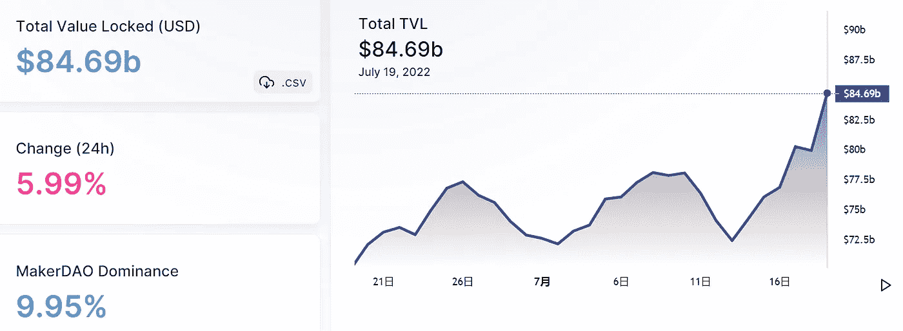
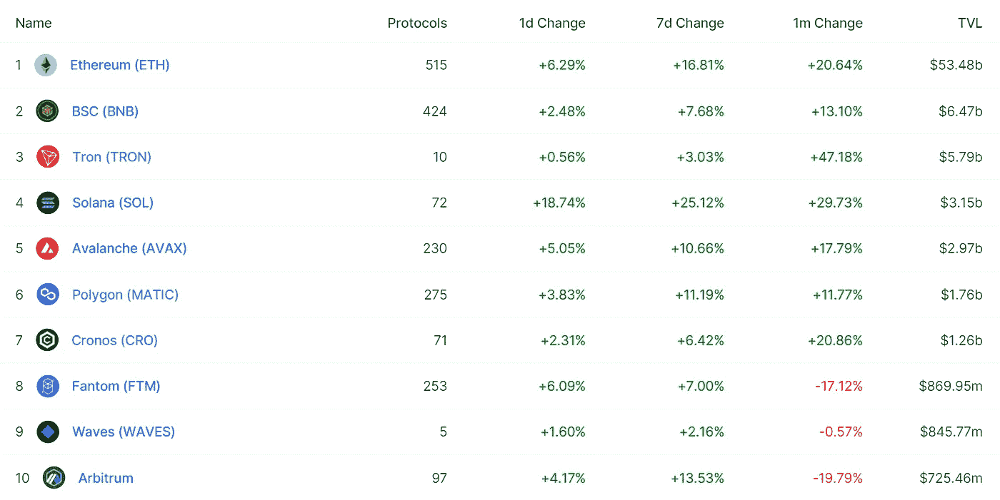
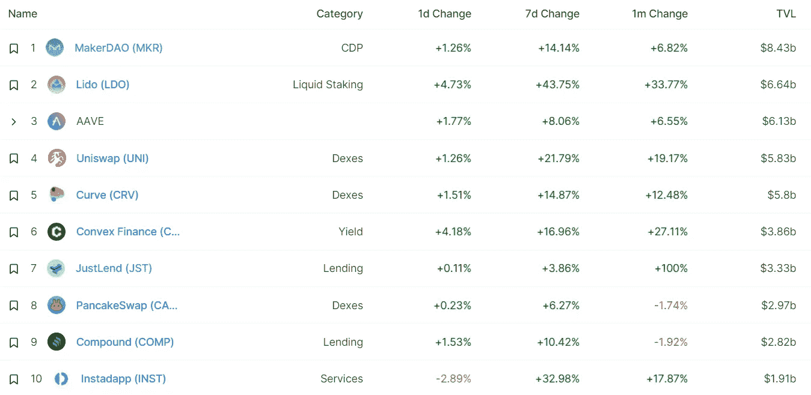
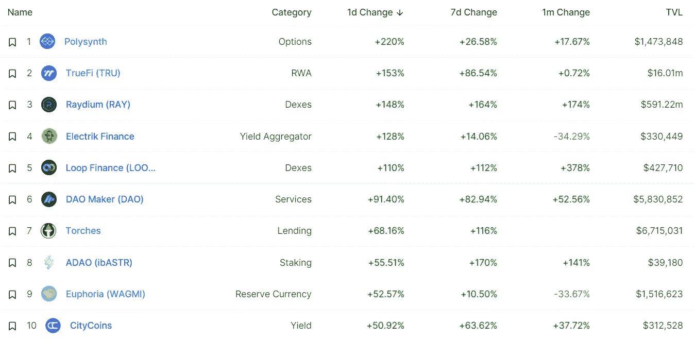
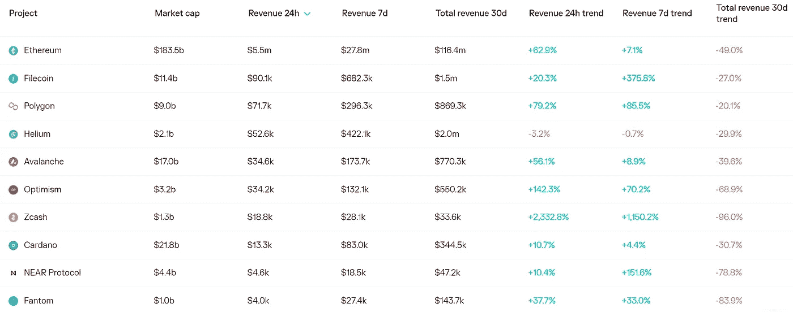
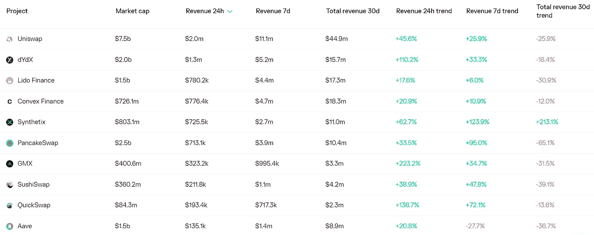
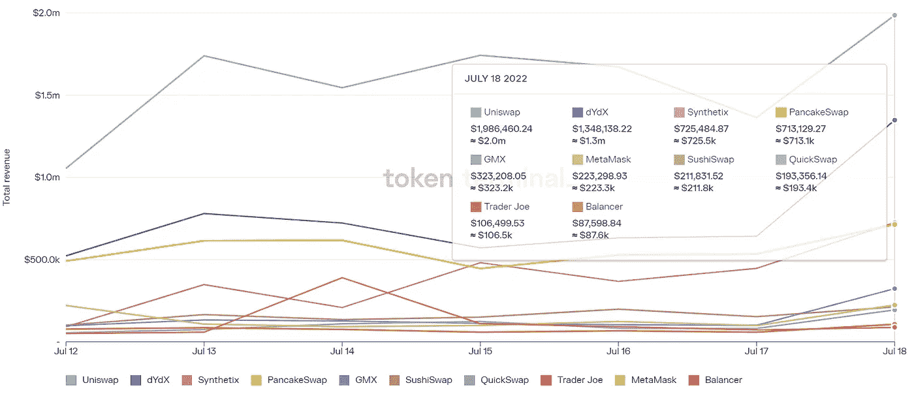
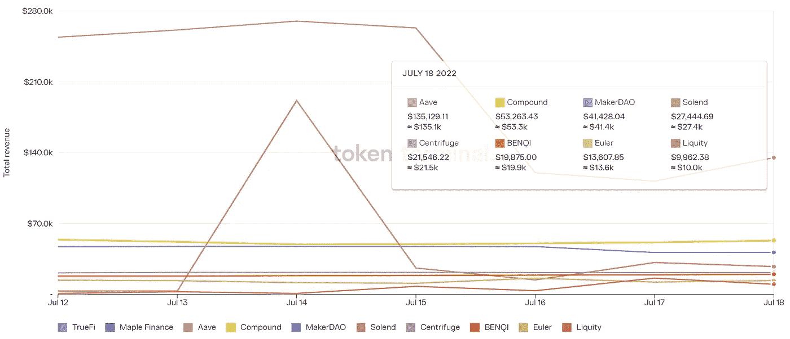

# DeFi Insight |如何购买蘸酱

> 原文：<https://medium.com/coinmonks/defi-insight-how-to-buy-the-dip-22e6d89b82ac?source=collection_archive---------34----------------------->

2022 年 7 月 19 日

*今日 DeFi 数据&由 DeFi Insight 为您带来的新闻*

> *"*2022 年的熊市对许多人来说代表着痛苦和损失，但对其他人来说也是机遇。熊市期间的繁荣通常是少数幸运儿的专利。但是今天努力工作可以在未来带来好时光。
> 大多数人都听说过“买蘸酱”这个词。但是，发现廉价资产远不止是坐等价格下跌，然后把它们吸起来，看着钱滚滚而来。*“@*[*来源*](https://dappradar.com/blog/how-to-buy-the-dip)

# 最新消息

## 贷款

Nexo 有一张加密卡，可以让你在不出售资产的情况下消费

## 外汇

在裁员 10%后不到两个月，双子星开始了第二轮裁员

**[比特币基地](https://thecryptobasic.com/2022/07/19/has-coinbase-halted-customer-withdrawals-as-users-reportedly-facing-withdrawal-issues/)停止客户取款了吗？因为据报道使用者面临戒断问题**

**币安被荷兰中央银行罚款 300 多万欧元**

## **稳定币**

****稳定的资本提供者[圈子](https://decrypt.co/105337/stablecoin-provider-circle-eyes-public-listing-in-q4-this-year-cfo)着眼今年第四季度上市:首席财务官****

## ****桥梁****

******[桥接协议](https://blockworks.co/bridge-protocols-race-to-win-consumer-trust/)赢得消费者信任的竞赛******

## ******市场******

******随着以太坊合并的临近，以太坊经典即将爆发******

## ******|选项******

********[期权信号乙醚强度](https://www.coindesk.com/markets/2022/07/18/options-signal-ether-strength-for-first-time-in-6-months/)6 个月来首次********

## ******测试网******

********宣布[卷轴预测试网](https://mirror.xyz/scroll.eth/XQyXDgyxoefag6hcBgGJFz8qrb10rmSU-zUBvY3Q9_A)********

## ******基础设施******

********[Ankr 2.0 白皮书](/ankr-network/the-ankr-2-0-whitepaper-8bd1423263d8)********

## ******政策与法规******

******印度储备银行希望禁止加密，寻求全球支持******

********[FBI 警告](https://siliconangle.com/2022/07/18/fbi-warns-fake-cryptocurrency-apps-defrauding-investors/)假冒加密货币应用正在欺骗投资者********

******美国参议员称太多的加密公司能够欺骗客户——敦促证券交易委员会进行监管******

********支付[稳定货币政策](https://www.circle.com/blog/payment-stablecoin-policy-principles)原则********

## ******NFT******

********宣布 [OpenSea 的 Solana Launchpad](https://opensea.io/blog/announcements/opensea-solana-launchpad/)********

******两个月来，以太坊的底价首次突破 10 万美元******

********[志那都红豆](https://beincrypto.com/azuki-nft-sales-hit-2022-low-falling-after-slipping-more-than-200-million/) NFT 销售额下滑超过 2 亿美元，创下 2022 年新低********

## ******基金******

********密码装备[喵](https://www.finextra.com/pressarticle/93418/crypto-outfit-meow-raises-22m)筹集了 2200 万美元********

## ******观点******

********、**2022 年之前，Crypto Winter 将结束— [Korbit](https://cryptonews.com/news/crypto-winter-will-end-before-2022-is-out-korbit.htm)******

> ****交易新手？尝试[加密交易机器人](/coinmonks/crypto-trading-bot-c2ffce8acb2a)或[复制交易](/coinmonks/top-10-crypto-copy-trading-platforms-for-beginners-d0c37c7d698c)****

# ****数据和分析****

## ****锁定的总价值(TVL)****

****目前全网 DeFi 总锁定量为 846.9 亿美元，24 小时增长 3.61%。****

********

## ****TVL 评出的十大连锁酒店****

********

## ****|最新 TVL 十大项目****

********

## ****|过去 24 小时内 TVL 增长的前 10 个项目****

********

## ****协议收入****

## ****|累计总收入最高的项目(24H)_ 区块链(L1)****

********

## ****|累计总收入最高的项目(24H) _Dapps (L2)****

********

## ****|前 10 大交易所的每日收入****

********

## ****|十大贷款协议的日收入****

********

# ****深潜****

**********政府如何查封资产，为什么比特币对统计学家来说是个问题**********

**** [## 政府如何没收资产，为什么比特币对统计学家来说是个问题

### 当大多数人听到“冻结银行账户”或“资产没收”这些词时，他们可能会想到一个复杂的…

bitcoinmagazine.com](https://bitcoinmagazine.com/legal/bitcoin-is-a-problem-for-government-seizure) 

**[**令牌补偿**](/dragonfly-research/the-comprehensive-guide-to-token-compensation-a3dd0b571c5d) 综合指南**

** [## 代币补偿综合指南

### 设计基于令牌的补偿是一个困难的问题，特别是考虑到令牌的流动性和加密算法的不稳定性

medium.com](/dragonfly-research/the-comprehensive-guide-to-token-compensation-a3dd0b571c5d) 

**[**BTC 生产成本**](https://members.delphidigital.io/reports/btc-production-cost-market-insights-and-fuel-deep-dive) **，比特币作为通胀对冲，以及燃油深潜****

** [## BTC 生产成本，比特币作为通货膨胀的对冲，并燃料深潜-德尔福数码

### 披露:德尔福风险投资公司和我们团队的成员在 BTC、ETH 和 SOL 都有投资。德尔福风险投资公司也投资了…

members.delphidigital.io](https://members.delphidigital.io/reports/btc-production-cost-market-insights-and-fuel-deep-dive)** 

# **报告**

****[**熊市**](https://grayscale.com/wp-content/uploads/2022/07/Bear-Markets-in-Perspective-FINAL-Designed.pdf) **透视**_ 灰度****

> ****像传统的经济和金融市场一样，加密也有起起落落的周期。密码市场周期平均持续约 4 年或约 1275 天。
> 虽然识别加密市场周期的方法各不相同，但我们可以使用比特币价格作为代理，通过实际价格低于市场价格(
> 资产的当前交易价格)来定量定义周期。注:我们
> 排除了 2021 年 3 月已实现价格低于市场价格的交叉，原因是
> 新冠肺炎疫情导致市场极度波动。****

******[**海德拉**](https://messari.io/article/state-of-hedera-q2-2022)**Q2 2022**_ 梅萨里******

******交易** [**低于**](https://insights.glassnode.com/the-week-onchain-week-29-2022/) **已实现价格** _glassnode****

******[**缩放比特币**](https://www.theblockresearch.com/scaling-bitcoin-rsk-156274)**:RSK**_ the block research******

******关于:******

****DeFi Insight 是顶级 DeFi 和加密新闻和更新的来源。****

******https://twitter.com/AlphaPro_io 推特:******

********❤RSS:**[**https://medium.com/feed/@alphapro.project**](https://medium.com/feed/@alphapro.project)******

****提供的信息应被视为发展新闻，而不是投资建议。**********