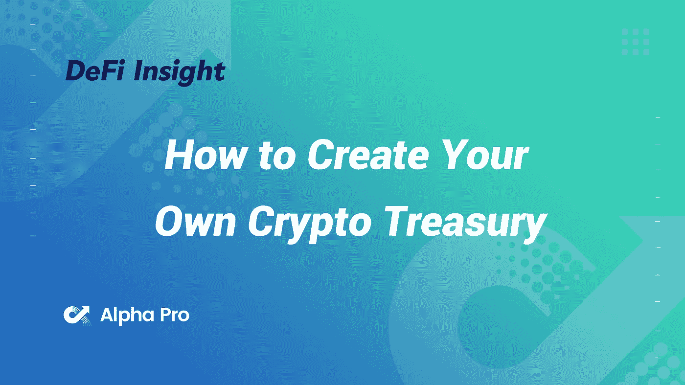
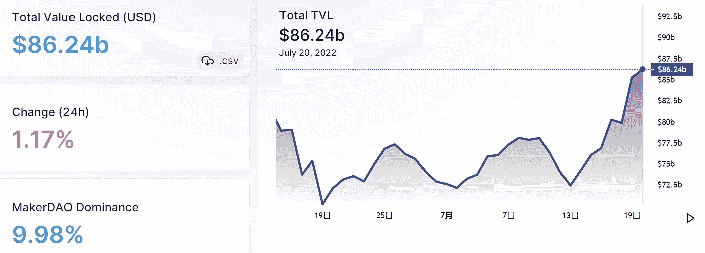
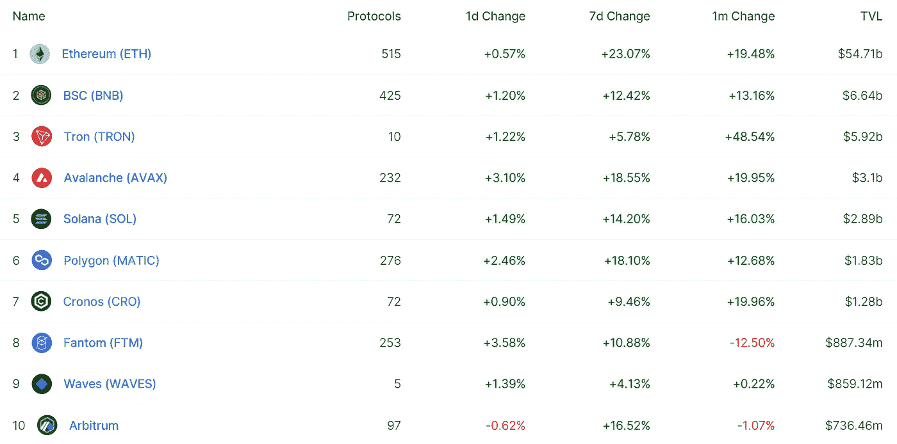
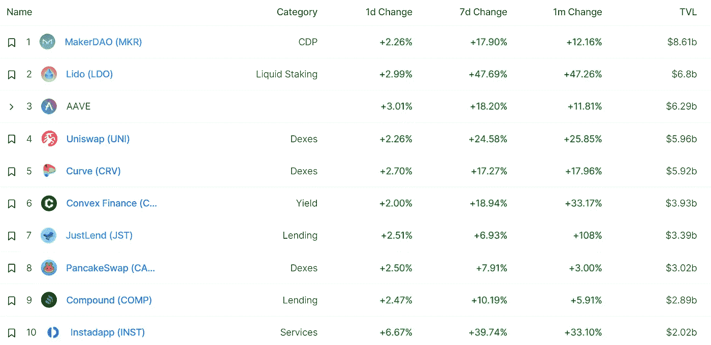
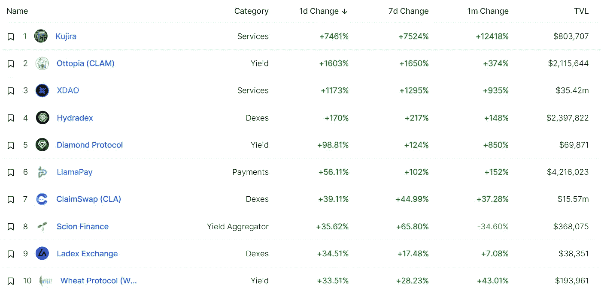
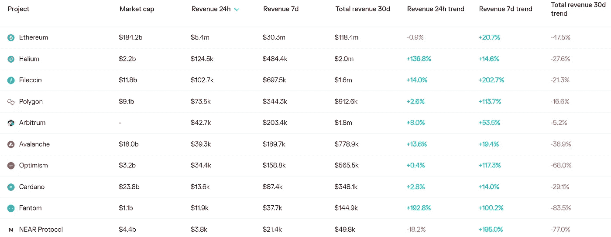
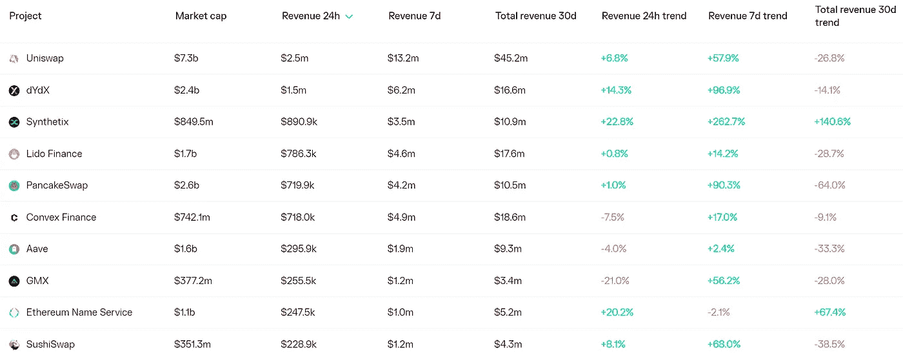
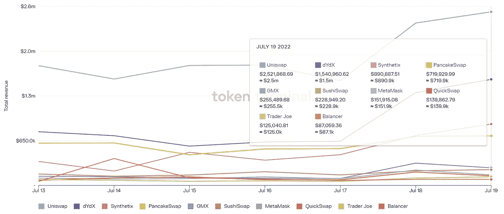
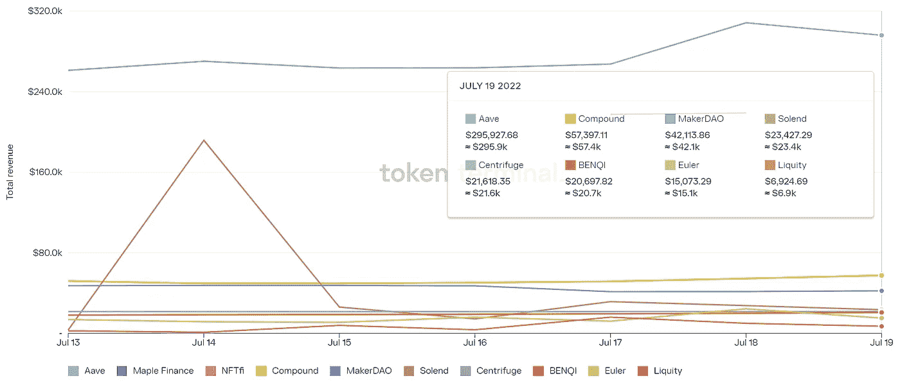

# DeFi Insight |如何创建自己的加密库

> 原文：<https://medium.com/coinmonks/defi-insight-how-to-create-your-own-crypto-treasury-d14f8a429e31?source=collection_archive---------32----------------------->

2022 年 7 月 20 日

*今日 DeFi 数据&由 DeFi Insight 为您带来的新闻*

> *"* Juicebox 是以太坊上的一个协议，它简化了可编程金库的建立和管理。
> 
> 这种无银行策略将带您了解 Juicebox 的来龙去脉，并带您了解如何使用该平台创建自己的加密库。
> 
> 目标:学习如何使用 Juicebox
> 
> 技能:中级
> 
> 努力:30 分钟用于研究+ 30 分钟用于设置
> 
> 投资回报:体验现成的 web3 财务解决方案 *"@* [*来源*](https://newsletter.banklesshq.com/p/crypto-treasury-management-juicebox)

# 最新消息

## 贷款

**[Aave](https://forkast.news/headlines/aave-pocket-blockchain-dapp-developers/)与 Pocket 合作，增加 dApp 开发者在区块链的访问权限**

## **打桩**

****[丽都金融](https://cryptodaily.co.uk/2022/07/lido-finance-unveils-plans-to-expand-to-ethereum-l2-space)公布扩张至以太坊 L2 空间的计划****

****以太坊合并后，Staking 公司[figure](https://decrypt.co/105481/staking-company-figment-will-support-mev-after-ethereum-merge)将支持 MEV****

## ****|令牌****

******跨‘推荐计划’现已直播:今天您可以如何农场 [$ACX 代币](/across-protocol/across-referral-program-is-now-live-how-you-can-farm-acx-tokens-today-695019797820)******

********康赛斯推出[回合令牌](https://consensys.net/blog/press-release/consensys-launches-turn-token/)********

********[俄罗斯发行的数字代币](https://news.bitcoin.com/digital-token-issued-in-russia-to-facilitate-investments-in-palladium/)方便投资钯********

******这是柴犬爆炸性上涨 30%的买入信号******

## ******钱包******

********、**浪人集成到[信任钱包](https://community.trustwallet.com/t/ronin-integrated-to-trust-wallet/510532)******

## ****资产管理****

******[对称协议](https://www.cryptopolitan.com/symmetry-protocol-releases-solanas-first-asset-management-infra/)发布 Solana 首个资产管理基础设施******

## ******政策与法规******

********[SEC](https://thecryptobasic.com/2022/07/20/sec-requests-court-that-john-deaton-and-xrp-holders-be-stripped-of-amici-status-in-ripple-case/)请求法庭剥夺约翰·迪顿和 XRP·霍尔德在瑞波案中的法庭之友地位********

******Lummis-Gillibrand 加密法案可能推迟到明年******

********[哥伦比亚](https://decrypt.co/105497/colombia-advances-regulatory-framework-for-local-crypto-industry)推进本地密码产业的监管框架********

******英国开启后英国退出欧盟时代的金融“转型”******

## ******NFT******

********[3D NFTs](https://beincrypto.com/3d-nfts-buy-a-ready-to-go-villa-or-zen-garden-for-multiple-metaverses/):买一栋现成的别墅或禅宗花园，换多个元诗句********

## ******基金******

********、**凯西伍德方舟百叶窗透明度 [ETF](https://www.bloomberg.com/news/articles/2022-07-19/cathie-wood-s-ark-shutters-transparency-etf-in-first-closure#xj4y7vzkg) 在第一次关闭时******

## ****观点****

******/**是以太坊‘合并’[带动了这场拉力赛](https://www.coindesk.com/layer2/2022/07/19/is-the-ethereum-merge-driving-this-rally/)？****

******Crypto[有可能将](https://cryptoslate.com/crypto-is-likely-to-integrate-with-future-financial-system/)与未来的金融系统整合******

******顶级密码策略师表示，如果满足两个条件，比特币有望突破 3 万美元******

> ******交易新手？试试[加密交易机器人](/coinmonks/crypto-trading-bot-c2ffce8acb2a)或者[复制交易](/coinmonks/top-10-crypto-copy-trading-platforms-for-beginners-d0c37c7d698c)******

# ******数据和分析******

## ******锁定的总价值(TVL)******

******目前全网 DeFi 总锁定量为 846.9 亿美元，24 小时增长 3.61%。******

************

## ******TVL 评出的十大连锁酒店******

************

## ******|最新 TVL 十大项目******

************

## ******|过去 24 小时内 TVL 增长的前 10 个项目******

************

## ******协议收入******

## ******|累计总收入最高的项目(24H)_ 区块链(L1)******

************

## ******|累计总收入最高的项目(24H) _Dapps (L2)******

************

## ******|前 10 大交易所的每日收入******

************

## ******|十大贷款协议的日收入******

************

# ******深潜******

********[**工作证明背后的工作证明**](https://bitcoinmagazine.com/business/bitcoin-mining-profitability-not-easy) **—比特币挖矿盈利来之不易**********

**** [## 工作证明背后的工作证明——比特币挖矿盈利并不容易

### 这篇文章的灵感来自与尼克·福斯特共度的一个周末。在过去的几年里，有…

bitcoinmagazine.com](https://bitcoinmagazine.com/business/bitcoin-mining-profitability-not-easy) 

**[**的当前风景**](https://josephliow.substack.com/p/the-current-landscape-of-soulbound)**

** [## 灵魂绑定令牌的当前状况

### 今年早些时候，Vitalik 通过他的“Soulbound”文章开创了 NFTs 的新时代。这导致了很多…

josephliow.substack.com](https://josephliow.substack.com/p/the-current-landscape-of-soulbound) 

**[**解构 DeFi 收益**](https://www.treehouse.finance/insights/deconstructing-defi-returns-harvesting-risk-premia) **:收获风险溢价****

** [## 解构 DeFi 回报:收获风险溢价

### 风险溢价代表一项资产超过无风险回报率的预期回报。如果一只股票…

www.treehouse.finance](https://www.treehouse.finance/insights/deconstructing-defi-returns-harvesting-risk-premia)** 

# **报告**

****[**Uniswap vs Curve**](https://members.delphidigital.io/reports/uniswap-vs-curve-which-is-the-best-dex)**:哪个是最好的 DEX？**_ 德尔福数码****

> ****Uniswap 和 Curve 是所有 crypto 中最大的两个交易所。虽然这两家公司并不总是竞争对手，但 Curve 进军非挂钩资产和 Uniswap 降低稳定货币交易费用的举措，让这两家公司变成了竞争对手。在 v3 中，Uniswap 从其流行的常数产品(XYK)流动性曲线转移到一个更动态的模型，在该模型中，有限合伙人决定他们希望提供流动性的价格范围。这个概念后来被称为“集中流动性”，因为它有效地允许有限合伙人将他们的流动性曲线压缩在一个更紧的区间内。****

******[**重访艺术街区**](https://messari.io/article/revisiting-art-blocks)_ 梅萨里******

******[**Q2 最活跃的区块链投资者**](https://www.theblockresearch.com/an-overview-of-the-most-active-blockchain-investors-in-q222-157820) **概述’22**_ the block research******

******关于:******

****DeFi Insight 是顶级 DeFi 和加密新闻和更新的来源。****

******https://twitter.com/AlphaPro_io 推特:******

********❤RSS:**[**https://medium.com/feed/@alphapro.project**](https://medium.com/feed/@alphapro.project)******

****提供的信息应被视为发展新闻，而不是投资建议。**********