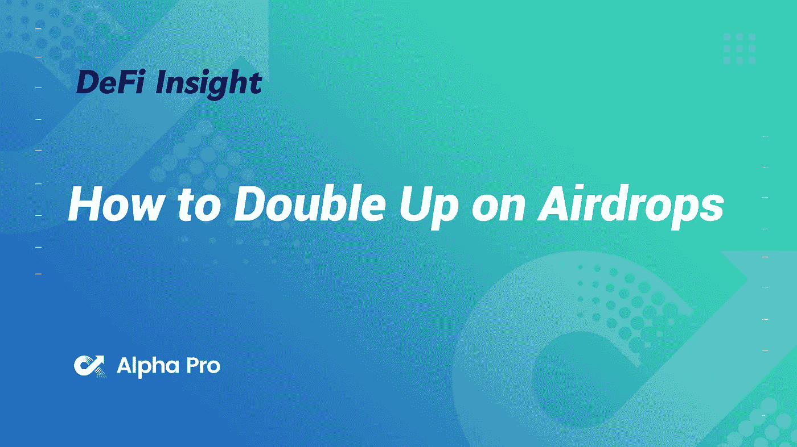
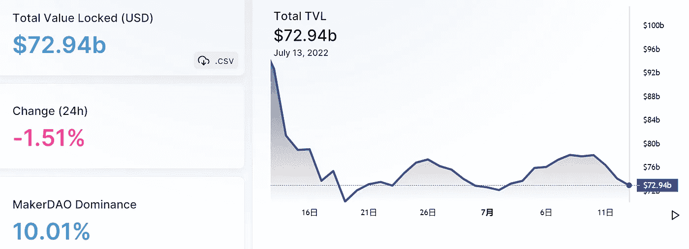
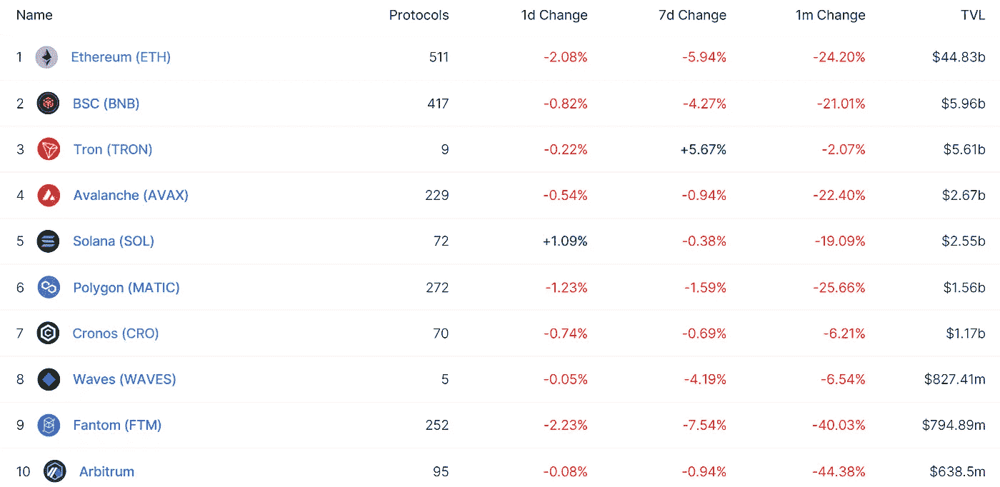
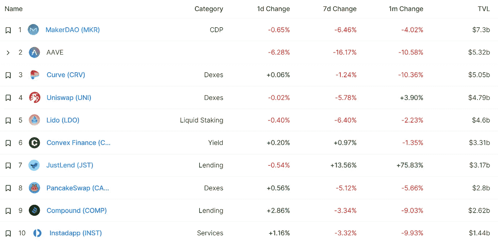
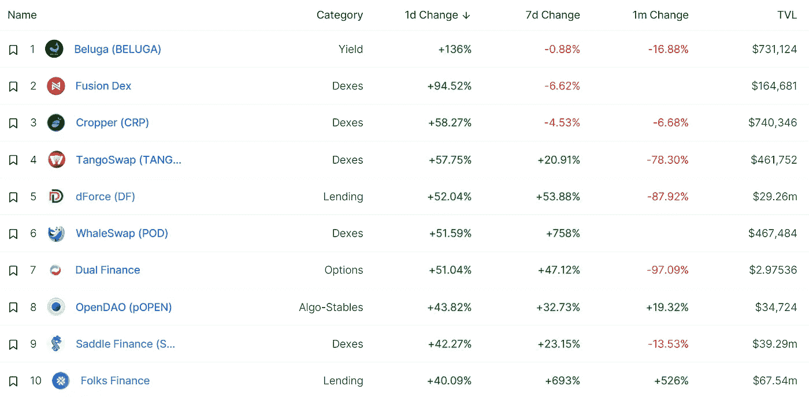
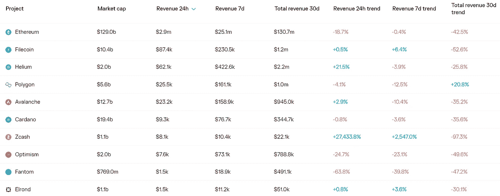
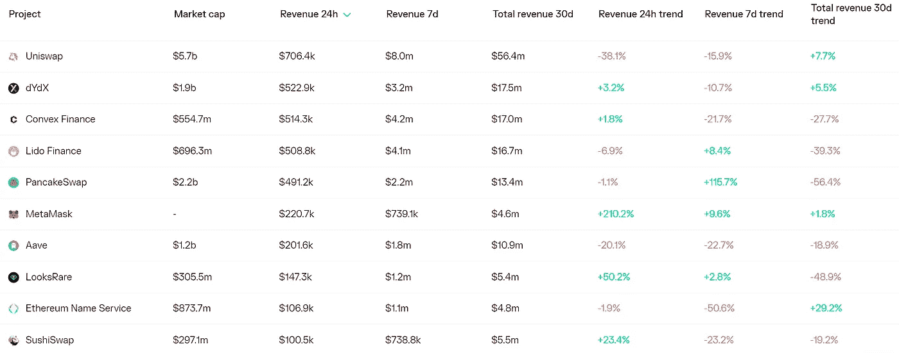
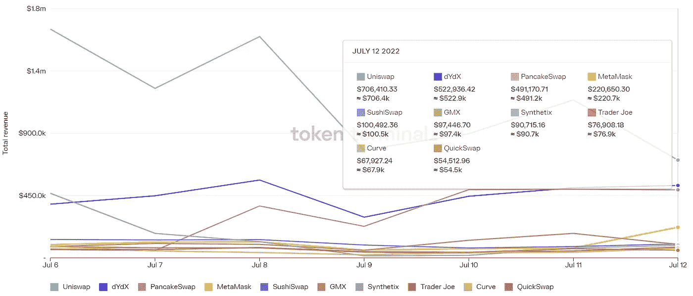
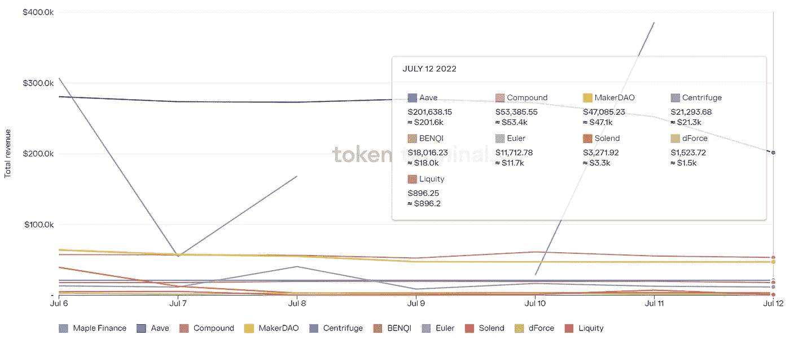

# DeFi Insight |如何加倍空投

> 原文：<https://medium.com/coinmonks/defi-insight-how-to-double-up-on-airdrops-5f73139f495?source=collection_archive---------8----------------------->

2022 年 7 月 13 日

*今日 DeFi 数据&由 DeFi Insight 为您带来的新闻*

> *"* 你可以用艰难的方式或简单的方式来积累财富。
> 
> 熊市充满了艰难度日的机会。
> 
> 但是如果你足够仔细地观察，你会发现多汁、低垂的果实正等着你去采摘。*“@*[*来源*](https://newsletter.banklesshq.com/p/how-to-double-up-on-airdrops-)

# 最新消息

## 外汇

**为什么[比特币基地](https://cointelegraph.com/news/why-coinbase-is-banning-slide-decks-and-endless-meetings)禁止滑梯甲板和“无休止的会议”**

## **稳定币**

****以下是国际清算银行和国际证监会组织对[【稳定货币安排】](https://cryptonews.com/news/bis-says-stablecoin-issuers-must-provide-information-management-structure-status-of-reserves.htm)的“最终指导”****

## ****市场****

****尼日利亚成年人中活跃的加密交易者的比例是世界上最高的****

****虾和鲸:尽管熊市，但它们都买入比特币****

## ****第二层****

****DEX 聚合器在 Arbitrum 上运行****

## ****经纪人****

****航海家号的密码崩溃对体育界和迈阿密热火队来说意味着头痛****

## ****EVM****

******[Cronos 链](https://www.altcoinbuzz.io/cryptocurrency-news/cronos-chain-updates-covalent-integrates-cronos-july-week-2/)更新******

## ******|令牌******

********[柴犬](https://coinquora.com/shiba-inu-continues-to-grow-overtakes-polygon-in-market-cap/)继续增长，市值超过多边形********

## ******采矿******

********哈总统签署法律[增加地下采矿者的税收负担](https://news.bitcoin.com/kazakhstan-president-signs-law-increasing-tax-burden-for-crypto-miners/)********

## ******政策与法规******

********,**美国财政部要求[公众就加密的好处和风险发表意见](https://beincrypto.com/us-treasury-public-input-crypto-benefits-arisks/?utm_source=blockworks-research)******

## ****NFT****

****宇迦起诉的“巨魔”聘请青蛙创造者佩佩做律师****

******/**[不可变 X](https://mobile.twitter.com/0xferg/status/1547100434674118656) 为 ApeCoin 持有者铸造 100K NFTs****

****GameStop 的 NFT 市场在第一天只为公司赚了 4.5 万美元****

## ****基金****

******加密对冲基金[三支箭](https://www.reuters.com/technology/crypto-hedge-fund-three-arrows-liquidators-get-ok-claim-us-assets-2022-07-12/?rpc=401&)清算人获准认领美国资产******

********[never mined](https://www.theblockchaindomain.io/news/2022/07/12/9637197.htm)募集€300 万种子基金，让开发者和创造者更容易开发 Web3********

## ******观点******

******MicroStrategy 的迈克尔·塞勒认为以太坊可以被归类为一种证券******

******查理·芒格:每个人都应该避免加密,“就好像它是一个开放的下水道，充满了恶意的有机体”******

# ******数据和分析******

## ******锁定的总价值(TVL)******

******目前全网 DeFi 总锁定量为 729.4 亿美元，24 小时下降 1.51%。******

************

## ******TVL 评出的十大连锁酒店******

************

## ******|最新 TVL 十大项目******

************

## ******|过去 24 小时内 TVL 增长的前 10 个项目******

************

## ******协议收入******

## ******|累计总收入最高的项目(24H)_ 区块链(L1)******

************

## ******|累计总收入最高的项目(24H) _Dapps (L2)******

************

## ******|前 10 大交易所的每日收入******

************

## ******|十大贷款协议的日收入******

************

# ******深潜******

************熊市何时结束？************

**** [## 熊市何时结束？

### 以下节选自比特币杂志 Pro 的最近一期，比特币杂志的高级市场时事通讯…

bitcoinmagazine.com](https://bitcoinmagazine.com/markets/when-will-the-bear-market-end) 

**[**分权**](https://blockworks.co/decentralization-could-cure-cryptos-current-ills/) **能否根治 Crypto 目前的顽疾****

** [## 去中心化可以治愈加密目前的弊病——阻塞工作

### 对行业领导者信心的丧失正在损害加密行业。当前的保管解决方案使用户易受攻击…

blockworks.co](https://blockworks.co/decentralization-could-cure-cryptos-current-ills/) 

**[**第一层链条**](https://chainlinkgod.medium.com/the-layer-1-chain-rotation-thesis-a-retrospective-analysis-3cbd2dcdc1f8) **旋转论文:回顾性分析****

** [## 第一层链旋转论题:回顾性分析

### 对区块链资本循环游戏和不可持续增长战略的回顾性分析…

chainlinkgod.medium.com](https://chainlinkgod.medium.com/the-layer-1-chain-rotation-thesis-a-retrospective-analysis-3cbd2dcdc1f8) 

**[**为什么**](https://dinoeggs.substack.com/p/why-rollups-hit-the-sweet-spot?showWelcome=true) **上篮命中甜蜜点****

** [## 为什么上卷达到了最佳点

### 第一层。2s 层。侧链。汇总。Web3 充满了行话，所以让我们先搭建舞台，提供一个简单的方法来…

dinoeggs.substack.com](https://dinoeggs.substack.com/p/why-rollups-hit-the-sweet-spot?showWelcome=true)** 

# **报告**

****[**难以捉摸的底部**](https://www.coinbase.com/institutional/research-insights/research/monthly-outlook/the-elusive-bottom-july-2022) _coinbase****

> ****在我们看来，最近几周导致市场波动的风险是信贷特有的，而不是加密特有的。我们认为，在 Celsius 和 Three Arrows Capital 发行比特币之后，围绕比特币矿工和稳定币发行商的偿付能力担忧有些被夸大了。
> 基于 onchain 分析的头寸数据看起来支持长期比特币持有者保持高度集中的供应，而不是在最近的弱势中抛售。****

******[**web 3 基础设施**](https://messari.io/article/web3-infrastructure-q2-22-revenue-report)**Q2 22 年收入报告** _messari******

******[**春晚游戏**](https://www.theblockresearch.com/gala-games-permissioned-gaming-blockchain-156822) **:授权游戏区块链** _theblockresearch******

******[**Arbitrum 流动性开采**](https://members.delphidigital.io/reports/arbitrum-liquidity-mining-bridge-farms-nft-yield-and-retroactive-airdrops) **、大桥农场、NFT 产量和追溯空投** _delphidigital******

> ****交易新手？尝试[加密交易机器人](/coinmonks/crypto-trading-bot-c2ffce8acb2a)或[复制交易](/coinmonks/top-10-crypto-copy-trading-platforms-for-beginners-d0c37c7d698c)****

******关于:******

****DeFi Insight 是顶级 DeFi 和加密新闻和更新的来源。****

******https://twitter.com/AlphaPro_io**❤[t27】](https://twitter.com/AlphaPro_io)****

******❤RSS:**[**https://medium.com/feed/@alphapro.project**](https://medium.com/feed/@alphapro.project)****

****提供的信息应被视为发展新闻，而不是投资建议。****

> ****加入 Coinmonks [电报频道](https://t.me/coincodecap)和 [Youtube 频道](https://www.youtube.com/c/coinmonks/videos)了解加密交易和投资****

# ****另外，阅读****

*   ****[投资印度的最佳密码](https://coincodecap.com/best-crypto-to-invest-in-india-in-2021)|[WazirX P2P](https://coincodecap.com/wazirx-p2p)|[Hi Dollar Review](https://coincodecap.com/hi-dollar-review)****
*   ****[加拿大最佳加密交易机器人](https://coincodecap.com/5-best-crypto-trading-bots-in-canada) | [库币评论](https://coincodecap.com/kucoin-review)****
*   ****[密码交易信号为 Huobi](https://coincodecap.com/huobi-crypto-trading-signals) | [HitBTC 审核](/coinmonks/hitbtc-review-c5143c5d53c2)****
*   ****[TraderWagon 回顾](https://coincodecap.com/traderwagon-review) | [北海巨妖 vs 双子星 vs BitYard](https://coincodecap.com/kraken-vs-gemini-vs-bityard)****
*   ****[如何在 FTX 交易所交易期货](https://coincodecap.com/ftx-futures-trading)************