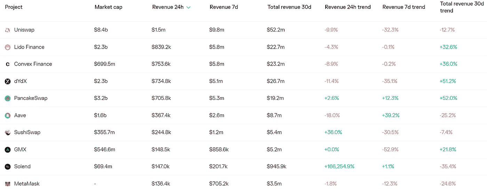
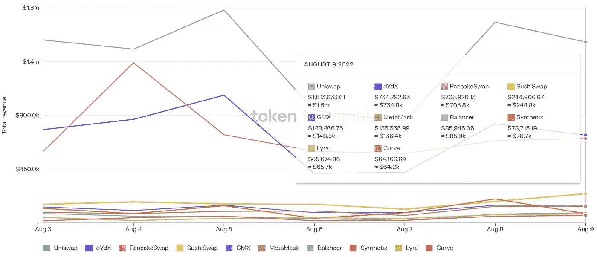

# DeFi Insight |如何在熊市中赚钱(NFT 版)

> 原文：<https://medium.com/coinmonks/defi-insight-how-to-earn-in-a-bear-market-nft-edition-c3060e80d5e1?source=collection_archive---------21----------------------->

2022 年 8 月 10 日

*今日 DeFi 数据&由 DeFi Insight 为您带来的新闻*

> *在熊市中，密码价格从历史高点暴跌。*
> 
> *然而，这些低迷时期不一定是你赚钱的机会也减少的时期。这种无银行策略将带你通过五种不同的方法，你可以在熊市期间使用或围绕 NFT 赚钱。*“@*[*来源*](https://newsletter.banklesshq.com/p/bear-market-investing-strategy-make-money-nft)*

# *最新消息*

## *外汇*

*塞舌尔重组的加密交换文件*

***德国密码交易所 [Nuri](https://www.coindesk.com/business/2022/08/09/german-crypto-exchange-nuri-files-for-insolvency/) 破产文件***

*****关于[穿山甲](https://pangolindex.medium.com/subgraph-issues-on-pangolin-explained-d97c00b76f86)的子图问题解释*****

*****哈勃交易所推出雪崩式的本土永久期货*****

*****ParaSwap 推出新的多链限价单协议*****

## *****打桩*****

*******[比特币基地](https://decrypt.co/107130/coinbase-staking-ethereum-merge)在以太坊合并前押下重注*******

*********新 [ANKR 令牌锁定](/ankr-network/new-ankr-token-staking-how-to-get-started-ae1e8ef8bcba):如何入门*********

## *******稳定币*******

*********[usd₮](https://tether.to/en/usdt-supports-eth-proof-of-stake-transition/)支持 ETH 证据转换*********

## *******市场*******

*******伊朗秘密进口价值 1000 万美元的货物*******

*********[以太坊投资者](https://www.newsbtc.com/news/ethereum/ethereum-futures-loses-300k-long-rally-stop-soon/)在 Bitfinex 上平仓 30 万多头，涨势即将停止？*********

## *******|警报*******

*********以太币兑换[曲线遭受前端黑客攻击](https://decrypt.co/107120/ethereum-defi-exchange-curve-frontend-hack-hijack)*********

## *******采矿*******

*********[CleanSpark](https://www.cleanspark.com/blog/cleanspark-reports-third-quarter-fy2022-financial-results/)报告 2022 财年第三季度财务业绩*********

## *******政策与法规*******

*********,**有人通过[从龙卷风汇款](https://www.coindesk.com/policy/2022/08/09/someone-is-trolling-celebs-by-sending-eth-from-tornado-cash/)来跟踪名人*******

## *****NFT*****

*******[魔幻伊甸园](https://www.theblock.co/post/162535/magic-eden-submits-proposal-to-build-apecoindao-an-nft-marketplace)提交建设 ApeCoinDAO NFT 市场的提案*******

## *******基金*******

*********[coin switch](https://economictimes.indiatimes.com/tech/technology/coinswitch-launches-web3-discovery-fund-for-emerging-blockchain-startups/articleshow/93452732.cms)为新兴的区块链创业公司推出 Web3 探索基金*********

*********DeFi 钱包创业[势不可挡的金融](https://www.theblock.co/post/160936/defi-wallet-startup-unstoppable-finance-raises-e12-5-million?utm_source=twitter&utm_medium=social)融资€1250 万*********

# *******数据和分析*******

## *******锁定的总价值(TVL)*******

*******目前全网 DeFi 总锁定量为 668 亿美元，24 小时增长 1.59%。*******

**************

## *******TVL 评出的十大连锁酒店*******

**************

## *******|最新 TVL 十大项目*******

**************

## *******|过去 24 小时内 TVL 增长的前 10 个项目*******

**************

## *******协议收入*******

## *******|累计总收入最高的项目(24H)_ 区块链(L1)*******

**************

## *******|累计总收入最高的项目(24H) _Dapps (L2)*******

**************

## *******|前 10 大交易所的每日收入*******

**************

## *******|十大贷款协议的日收入*******

**************

# *******深潜*******

*********[**eth pow 与 ETH2**](https://arcane.no/research/ethpow-and-eth2-the-story-of-miners-vs-social-consensus-and-trading) **:矿工的故事 vs .社会共识与交易机会***********

***** [## ETHPoW 和 ETH2:矿工的故事与社会共识和交易机会

### 不是每个人都欢迎合并，eth PoW——代表可能继续存在的战俘链的标志——是…

神秘，不](https://arcane.no/research/ethpow-and-eth2-the-story-of-miners-vs-social-consensus-and-trading) 

**[**代币经济**](https://research.thetie.io/the-token-economy-and-policy/) **—代币政策框架介绍****

** [## 代币经济——代币政策框架介绍——纽带研究

### 当讨论和分析项目令牌组学时，投资者倾向于集中在三个主要领域:-令牌分配&…

研究. thetie.io](https://research.thetie.io/the-token-economy-and-policy/) 

**绘制出** [**Aptos 的生态系统**](https://www.theblockresearch.com/mapping-out-aptos-ecosystem-162141)

 [## 描绘 Aptos 的生态系统

### 2022 年 8 月 8 日，美国东部时间下午 1:34 Quick Take Aptos 是一个新的第 1 层区块链，它利用 Move 语言试图…

www.theblockresearch.com](https://www.theblockresearch.com/mapping-out-aptos-ecosystem-162141) 

**[**分散交易所基本面分析**](https://messari.io/report/decentralized-exchange-fundamental-analysis-and-relative-value-comparison) **和相对价值比较****

** [## 加密研究、数据和工具

### 借助专业级数据、工具和研究，在加密市场中获得优势。

梅萨里·io](https://messari.io/report/decentralized-exchange-fundamental-analysis-and-relative-value-comparison)** 

# **报告**

****以太坊上的** [**气**](https://5264302.fs1.hubspotusercontent-na1.net/hubfs/5264302/coinmetrics-research_gas-on-ethereum.pdf) **是什么，为什么需要，还有
我怎么才能得到一些？**_ 货币计量**

> **以太坊交易费市场的核心是“气”这个重要概念。在这份报告中，从计算理论的角度给出了对 gas 的需求的理论解释，以及如何在以太坊上实现它。**

****[**乐观压倒了随机**](https://members.delphidigital.io/reports/optimism-overtakes-arbitrum-complete-guide-to-rollups) **，总结完全指南** _delphidigital****

******密码比较** [**资产报告**](https://data.cryptocompare.com/reports/cryptocompare-asset-report-july-2022)**2022 年 7 月**_ 密码比较****

******[**以太坊如何将规模扩大到**](https://coinshares.com/research/ethereum-1million-tsp) **每秒一百万次交易** _coinshares******

******【达普拉达 x** [**BGA 游戏报道**](https://dappradar.com/blog/dappradar-x-bga-games-report-6)**# 6**_ 达普拉达****

******关于:******

****DeFi Insight 是顶级 DeFi 和加密新闻和更新的来源。****

******https://twitter.com/AlphaPro_io 推特:******

********❤RSS:**[**https://medium.com/feed/@alphapro.project**](https://medium.com/feed/@alphapro.project)******

****提供的信息应被视为发展新闻，而不是投资建议。****

> *****加入 Coinmonks* [*电报频道*](https://t.me/coincodecap) *和* [*Youtube 频道*](https://www.youtube.com/c/coinmonks/videos) *了解加密交易和投资*****

# ****另外，阅读****

*   ****[3 商业评论](/coinmonks/3commas-review-an-excellent-crypto-trading-bot-2020-1313a58bec92) | [Pionex 评论](https://coincodecap.com/pionex-review-exchange-with-crypto-trading-bot) | [Coinrule 评论](/coinmonks/coinrule-review-2021-a-beginner-friendly-crypto-trading-bot-daf0504848ba)****
*   ****[莱杰 vs n rave](/coinmonks/ledger-vs-ngrave-zero-7e40f0c1d694)|[莱杰 nano s vs x](/coinmonks/ledger-nano-s-vs-x-battery-hardware-price-storage-59a6663fe3b0) | [币安评论](/coinmonks/binance-review-ee10d3bf3b6e)****
*   ****[加密交易机器人](/coinmonks/crypto-trading-bot-c2ffce8acb2a) | [Bingbon 评论](https://coincodecap.com/bingbon-review)****
*   ****[Bybit Exchange 审查](/coinmonks/bybit-exchange-review-dbd570019b71) | [Bityard 审查](https://coincodecap.com/bityard-reivew) | [Jet-Bot 审查](https://coincodecap.com/jet-bot-review)****
*   ****[3 commas vs crypto hopper](/coinmonks/3commas-vs-pionex-vs-cryptohopper-best-crypto-bot-6a98d2baa203)|[赚取加密利息](/coinmonks/earn-crypto-interest-b10b810fdda3)***********