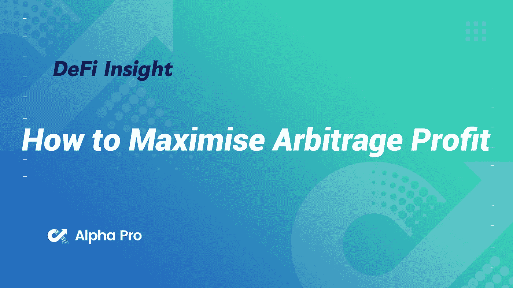
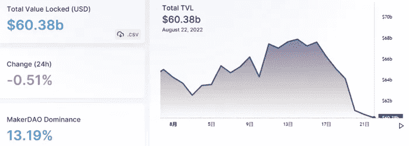
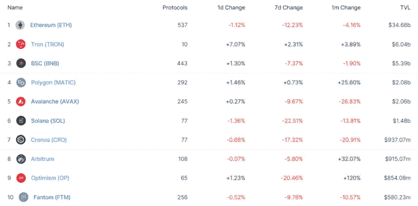
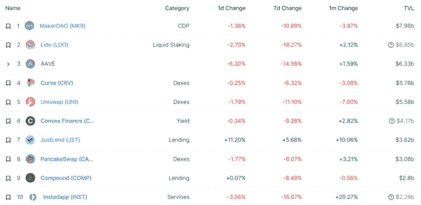
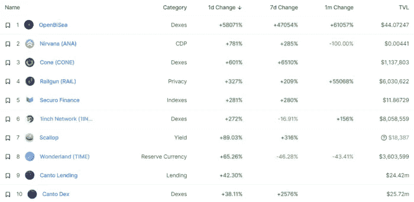
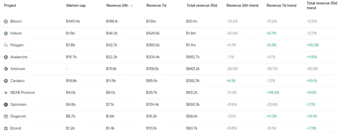
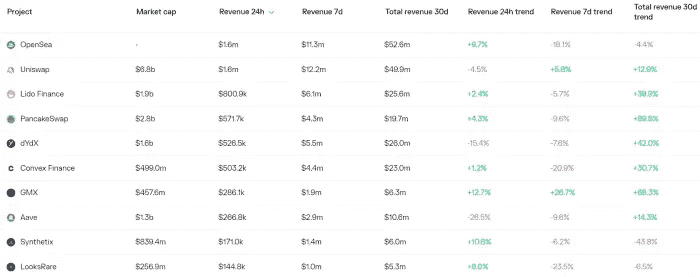
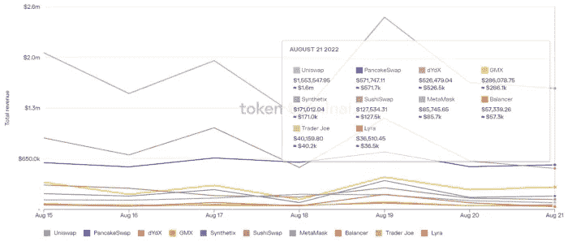
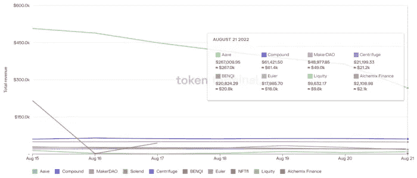

# DeFi Insight |如何最大化套利利润

> 原文：<https://medium.com/coinmonks/defi-insight-how-to-maximise-arbitrage-profit-103b71d1e9de?source=collection_archive---------22----------------------->

2022 年 8 月 23 日

*今日 DeFi 数据&由 DeFi Insight 为您带来的新闻*

> *迄今为止，MEV 链上最大的形式是套利。这个概念很简单，找出交易所之间给定代币的价格差异，执行交易，赚取一些利润，并在这个过程中使交易所的代币价格相互一致。
> 尽管这个概念很简单，但在一大堆交易所和代币中寻找收益率最高的套利机会可能很难。
> 在寻找最佳套利机会时，你是在和链条的阻塞时间赛跑，而且链条上有很多移动的部分。mempool 中的新交易、中央交易所参考价格的变化等。幸运的是，对于 Uniswap、Sushiswap、Balancer 等常数函数做市商(CFMMs)来说，这种最优套利是一个“凸优化”问题。*“@*[*来源*](https://noxx.substack.com/p/dex-arbitrage-mathematical-optimisations)*

# *最新消息*

## *打桩*

***[膨胀守护启动](https://blog.swellnetwork.io/mainnet-soft-launch-announcement/) —以太坊主网公告***

## ***测试网***

*****,**隐私封锁链 [Aleo](https://twitter.com/AleoHQ/status/1561745029584011264) 宣布 Testnet 3 上线***

## ***市场***

*****DBS 交易所称[比特币交易在全球抛售中激增](https://www.bloomberg.com/news/articles/2022-08-23/dbs-exchange-says-bitcoin-trading-surged-amid-global-selloff?srnd=cryptocurrencies-v2#xj4y7vzkg)*****

## *****商业*****

*****FTX 只需 1500 万美元就能买下 BlockFi 或者更多，如果密码出借人达到大目标的话*****

*****收购 NFT 市场 KnownOrigin 两个月后，易贝以 2 . 95 亿美元收购 TCGplayer*****

## *****空投*****

*******[$代码令牌](https://devdao.mirror.xyz/lGRLUA7wXZP2Rs5TxPRDks7Ho4yjSRUFLGNRfxeAz80)*******

## *******支付*******

*******PayPal 加入比特币基地的信任网络*******

## *******鲸鱼*******

*********[3.17 亿 XRP 在涟漪、交易所、无名钱包中洗牌](https://thecryptobasic.com/2022/08/23/317-million-xrp-shuffled-among-ripple-exchanges-and-unknown-wallets/)*********

## *******叉子*******

*********[ETHW 核心](https://twitter.com/EthereumPoW/status/1561814915374977025)刚刚发布了第二次代码更新*********

## *******采矿*******

*********拉美的[新的地下采矿“应许之地”](https://cryptonews.com/news/latams-new-crypto-mining-promised-land-pluses-minuses-for-paraguay.htm):巴拉圭加分&减分*********

## *******政策与法规*******

*******随着政府计划在对外贸易中广泛使用加密技术，伊朗协会呼吁制定稳定的加密法规*******

## *******NFT*******

*******NFT 银行本道银行试图避免另一场流动性危机*******

*********[矮胖企鹅](https://decrypt.co/107974/pudgy-penguins-ethereum-nfts-pump-83-as-meta-nansen-execs-join-advisory-board)以太坊 NFTs 泵 83%为 Meta，南森高管加入顾问委员会*********

## *******基金*******

*********华尔街，密码巨头排队[支持初创公司 Prime Broker](https://www.bloomberg.com/news/articles/2022-08-22/wall-street-crypto-giants-line-up-to-back-startup-prime-broker#xj4y7vzkg)*********

*******Saison Capital 支持 SG Web3 media startup 的 200 万美元种子前融资*******

## *******观点*******

*******密码安全专家的薪水高达六位数，原因如下*******

*******T2 证券交易委员会对待加密技术就像对待其他资本市场一样*******

*********密码评论家[彼得·希夫声称](https://beincrypto.com/crypto-critic-peter-schiff-mark-cuban-knew-voyager-scam/)马克·库班知道航海家是个骗局*********

# *******数据和分析*******

## *******锁定的总价值(TVL)*******

*******目前全网 DeFi 总锁定量为 603.8 亿美元，24 小时下降 0.51%。*******

**************

## *******TVL 评出的十大连锁酒店*******

**************

## *******|最新 TVL 十大项目*******

**************

## *******|过去 24 小时内 TVL 增长的前 10 个项目*******

**************

## *******协议收入*******

## *******|累计总收入最高的项目(24H)_ 区块链(L1)*******

**************

## *******|累计总收入最高的项目(24H) _Dapps (L2)*******

**************

## *******|前 10 大交易所的每日收入*******

**************

## *******|十大贷款协议的日收入*******

**************

# *******深潜*******

*********/**[**比特币未来会消耗多少能量**](https://arcane.no/research/how-much-energy-will-bitcoin-consume-in-the-future) **？*********

***** [## 比特币未来会消耗多少能源？

### 这篇文章估计了到 2040 年比特币能源使用的发展。它会变得如此庞大以至于比特币…

神秘，不](https://arcane.no/research/how-much-energy-will-bitcoin-consume-in-the-future) 

**一个** [**熊市的幻影**](https://insights.glassnode.com/the-week-onchain-week-34-2022/)

 [## 熊市的幻影

### 比特币市场最近经历了一波短暂的缓解，价格交易高于 23…

insights.glassnode.com](https://insights.glassnode.com/the-week-onchain-week-34-2022/) 

**[**【NFT】十大最佳实用范例和创意**](/@tropee/10-best-nft-utility-examples-and-ideas-b735ab7eb48b#id_token=eyJhbGciOiJSUzI1NiIsImtpZCI6IjE3MjdiNmI0OTQwMmI5Y2Y5NWJlNGU4ZmQzOGFhN2U3YzExNjQ0YjEiLCJ0eXAiOiJKV1QifQ.eyJpc3MiOiJodHRwczovL2FjY291bnRzLmdvb2dsZS5jb20iLCJuYmYiOjE2NjEyMzU5NTksImF1ZCI6IjIxNjI5NjAzNTgzNC1rMWs2cWUwNjBzMnRwMmEyamFtNGxqZGNtczAwc3R0Zy5hcHBzLmdvb2dsZXVzZXJjb250ZW50LmNvbSIsInN1YiI6IjExODA3Nzg2Njg5MjY5NjU3OTU5MiIsImVtYWlsIjoiYWxwaGFwcm8ucHJvamVjdEBnbWFpbC5jb20iLCJlbWFpbF92ZXJpZmllZCI6dHJ1ZSwiYXpwIjoiMjE2Mjk2MDM1ODM0LWsxazZxZTA2MHMydHAyYTJqYW00bGpkY21zMDBzdHRnLmFwcHMuZ29vZ2xldXNlcmNvbnRlbnQuY29tIiwibmFtZSI6IkFscGhhIFBybyIsInBpY3R1cmUiOiJodHRwczovL2xoMy5nb29nbGV1c2VyY29udGVudC5jb20vYS0vQUZkWnVjcnAtYmRURHNYYmczay1JSUs5WDJwS3VudVJXUWlfeERJcFN6TXA9czk2LWMiLCJnaXZlbl9uYW1lIjoiQWxwaGEiLCJmYW1pbHlfbmFtZSI6IlBybyIsImlhdCI6MTY2MTIzNjI1OSwiZXhwIjoxNjYxMjM5ODU5LCJqdGkiOiI4ZGRhMmFkZGE3NzYyZGY3OGZiMjM2ZmQ2ODhhMDY3NGJiZDc4YTMwIn0.YlHHyDd3MC6lCpWW5ksla_4xjyRdrhKrYpJj9ntEwrs4B7rVdCy13t_bLzqISW4wZSk_EPcOZHztfDLQrZPzd_Ppn4C9T_pRq3v1mYeOjJe8twkEpPVo9N1f5ShFgF48doJhagcQy04l80buVYZZu7ElUl156yxNJeMgsDe9AlVzqJRQDdZmfKecg-n-tr_H8s6FpwGcNbrE2aY8XGmX7RLqupb1jb7FqRFAOxTPmwhSqtxua1dKaxP-URSIX-72julDA9U6vHeiGwwuBtcafSS7j8DS05--oeiC42nVnCG9YCHrAmojYzoIOtxUFYuH7NYlOLaeTCklnSwq--bGkw)**

** [## 10 个最佳 NFT 公用事业范例和创意

### 渴望让你的 NFT 持有者更有粘性和忠诚度吗？想要在不确定的熊市中存活下来，持有人可能只是…

medium.com](/@tropee/10-best-nft-utility-examples-and-ideas-b735ab7eb48b) 

**百无聊赖的 Ape 游艇俱乐部创作者解释斯蒂芬·库里&比伯如何获得他们的 NFT&**[**BAYC 如何价值 4B**](https://www.youtube.com/watch?v=UeeEFDLaMYY)** 

# **报告**

****[**桥梁**](https://coinshares.com/research/bridge-sector-report) **部门报告** _coinshares****

> ****对桥梁的需求显示了 DeFi 不断增长的价值和信息流。****
> 
> ****这份报告的重点包括:****
> 
> ****桥梁是密码产业发展的基础。促进价值和数据的转移，推动增长和创新。
> TVL 跨越不同链、层和资产类型的桥梁的增长强烈指向历史和当前以太坊的主导地位。
> 有大量的风险需要克服，即智能合同和技术风险。****

******[**行长注**](https://messari.io/report/governor-note-lido-and-l2) **:利多与 L2 流动性之争** _messari******

******龙卷风现金余波** [**可能蔓延到**](https://dappradar.com/blog/tornado-cash-fallout-could-spread-to-bitcoin) **比特币** _dappradar****

******[**魔法伊甸园**](https://www.theblockresearch.com/magic-eden-company-intelligence-164431) **公司情报** _theblockresearch******

******关于:******

****DeFi Insight 是顶级 DeFi 和加密新闻和更新的来源。****

******https://twitter.com/AlphaPro_io 推特:******

********❤RSS:**[**https://medium.com/feed/@alphapro.project**](https://medium.com/feed/@alphapro.project)******

****提供的信息应被视为发展新闻，而不是投资建议。****

> ****交易新手？尝试[加密交易机器人](/coinmonks/crypto-trading-bot-c2ffce8acb2a)或[复制交易](/coinmonks/top-10-crypto-copy-trading-platforms-for-beginners-d0c37c7d698c)*********