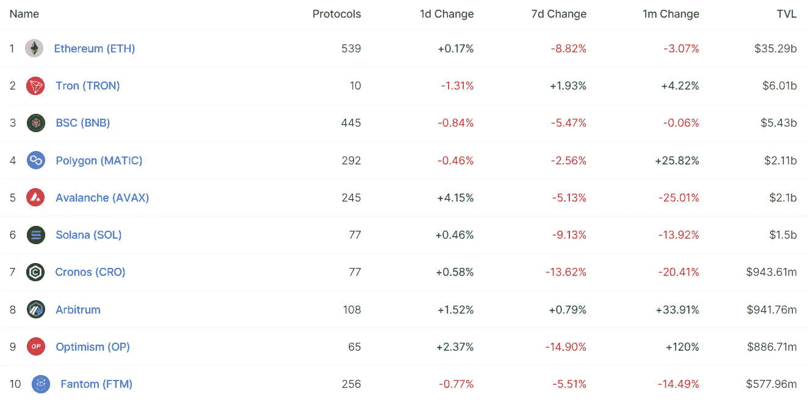

# DeFi Insight |谦逊农民的诗歌指南

> 原文：<https://medium.com/coinmonks/defi-insight-humble-farmers-canto-guide-c221127cc7a4?source=collection_archive---------16----------------------->

2022 年 8 月 24 日

*今日 DeFi 数据&由 DeFi Insight 为您带来的新闻*

> *“*过去几天市场一直很无聊，看起来我们将在 26 日进入杰克逊霍尔之前度过一个波涛汹涌的星期。我刚在显示器上贴了一张便条，上面写着“DONT 超越贸易！！！“提醒自己不要做傻事。与此同时，我一直在佩珀和坎托舒适地耕作，今天我将集中讨论后者。有兴趣赚取 600%+4%的稳定收益吗？继续读*@* [*来源*](https://thefarmersclub.substack.com/p/humble-farmers-canto-guide)

# 最新消息

## 贷款

**[Nexo 的](https://twitter.com/Nexo/status/1562077369682231298?s=20&t=ZYv6R5Ds6g-FoLnWzvTvlw)合并方法**

## **外汇**

****[uni swap](https://twitter.com/Scott_eth/status/1562075758885244928)是所有 nft 流动性的接口****

****比特币基地首席执行官表示，crypto exchange 正在计划削减成本，并积极与监管机构合作****

## ****桥梁****

******、**下水[交换桥](https://twitter.com/PancakeSwap/status/1562039374627635204?s=20&t=gmMl6F-4HU7JDGCRK1eU3A)****

## ****交叉链****

******十字链**BNB 链[顺序&混乱](/@ordernchaos_fi/crosschain-order-chaos-on-bnb-smart-chain-be47a3ff2b9e)****

******、**基于 Solana 的项目团队合作制定[跨链消息传递标准](https://www.coindesk.com/business/2022/08/23/solana-based-projects-team-up-to-make-cross-chain-messaging-standard/)****

## ****第二层****

****mainnet 上的**、** 66 天到 [zkSync 2.0](https://twitter.com/zksync/status/1562105912743014400)****

## ****支付****

****拉丁美洲加密公司在巴西推出预付费加密卡****

## ****|令牌****

******[$ DC 币](https://twitter.com/DogechainFamily/status/1562279343992086528)来了！Dogechain 上的本机令牌启动******

## ******空投******

********[OP 空投](https://mirror.xyz/rubicon.eth/_Zg8UoWLRVXL9Ljadh9VVqmXN4VRHhh6Jlwa8UnTbCM)给早期用户********

********[sweat emple NFT](https://mirror.xyz/0x9537A66F2119Fb7517e856C78772c62a4cBB69e0/xQ2keSPK-MLTzFsRp_fAprwmJycOUBm012h0s2MKvf4)零件箱空投详情********

## ******政策与法规******

******安大略省证券监管机构在最新警报中对 Kucoin 发出警告******

## ******NFT******

********/**100 个允许赢得[3 面造币厂](https://twitter.com/LooksRare/status/1562079378019794944?s=20&t=QiL4srDS72aqGI2f30V0dQ)的名额******

## ****基金****

******[分布式金融](https://www.theblock.co/post/164800/distributed-finance-acquires-algorand-nft-marketplace-rand-gallery)收购阿尔格兰德 NFT 市场兰德画廊******

******Y Combinator 校友为 DAO 筹集 8000 万美元以支持初创公司******

## ******观点******

******卡尔达诺创始人查尔斯·霍金森为龙卷风现金开发商辩护******

# ******数据和分析******

## ******锁定的总价值(TVL)******

******目前全网 DeFi 总锁定量为 616.5 亿美元，24 小时增长 0.17%。******

************

## ******TVL 评出的十大连锁酒店******

************

## ******|最新 TVL 十大项目******

************

## ******|过去 24 小时内 TVL 增长的前 10 个项目******

************

## ******协议收入******

## ******|累计总收入最高的项目(24H)_ 区块链(L1)******

************

## ******|累计总收入最高的项目(24H) _Dapps (L2)******

************

## ******|前 10 大交易所的每日收入******

************

## ******|十大贷款协议的日收入******

************

# ******深潜******

********[**教**](https://cryptohayes.medium.com/teach-me-daddy-33e7a66dfe76) **我的爸爸**********

**** [## 教我，爸爸

### (下面表达的任何观点都是作者的个人观点，不应构成制定……

cryptohayes.medium.com](https://cryptohayes.medium.com/teach-me-daddy-33e7a66dfe76) 

**[**如何在你的 NFTs** 上获得流动性](https://newsletter.banklesshq.com/p/sudoswap-nftx-nft-liquidity?utm_source=%2Finbox&utm_medium=reader2)**

**** [## 如何获得你的非金融资产的流动性

### 亲爱的无银行国家，无聊猿人和密码朋克的兴起为狂热的收藏家创造了大量财富。非功能性测试是…

newsletter.banklesshq.com](https://newsletter.banklesshq.com/p/sudoswap-nftx-nft-liquidity?utm_source=%2Finbox&utm_medium=reader2) 

**[**DeFi 利用**](https://tokenterminal.substack.com/p/defi-exploits-trends-patterns-and?utm_source=%2Finbox&utm_medium=reader2) **:趋势、模式和经验教训****

** [## DeFi 利用:趋势、模式和经验教训

### 尽管 DeFi 呈现爆炸式增长，但在过去两年中，由于缺乏安全性，已有超过 42 亿美元被盗…

tokenterminal.substack.com](https://tokenterminal.substack.com/p/defi-exploits-trends-patterns-and?utm_source=%2Finbox&utm_medium=reader2) 

**[**2022 年分散稳定状态**](/@Ignas_defi_research/state-of-decentralized-stablecoins-in-2022-analysis-of-25-projects-8fbdd458ecdd)**:25+项目分析****

** [## 2022 年分散稳定资本状况:25+项目分析

### 稳定密码占 1.07 万亿美元密码市场的 14.2%。

medium.com](/@Ignas_defi_research/state-of-decentralized-stablecoins-in-2022-analysis-of-25-projects-8fbdd458ecdd)** 

# **报告**

****CoinMarketCap 和 Footprint Analytics:2022**[**GameFi 行业**](https://coinmarketcap.com/alexandria/article/coinmarketcap-and-footprint-analytics-2022-gamefi-industry-report) **报告** _coinmarketcap**

> **虽然 crypto 在过去十年中经历了几次起伏，但 GameFi 作为一个新的细分市场只是在 2020 年底才出现，2022 年上半年是区块链博彩业的第一个熊市周期。**
> 
> **这份报告借此机会浏览数据，分析该行业在用户行为、连锁交易、筹资和价格表现方面的表现。我们还讨论了该行业面临的几个难题。**

****[**筒仓财务**](https://research.thetie.io/permissionless-lending-silo/) **:孤立优势** _thetie****

******[**长期比特币投资者**](https://coinshares.com/research/long-term-bitcoin-investors-continue-to-restrict-available-supply) **继续限制可用供应量** _coinshares******

******[**缩放状态**](https://www.theblockresearch.com/state-of-scaling-issue-3-polygon-scroll-and-zkevm-164928) **问题 3:多边形、滚动和 zkEVM** _theblockresearch******

******关于:******

****DeFi Insight 是顶级 DeFi 和加密新闻和更新的来源。****

******https://twitter.com/AlphaPro_io 推特:******

********❤RSS:**[**https://medium.com/feed/@alphapro.project**](https://medium.com/feed/@alphapro.project)******

****提供的信息应被视为发展新闻，而不是投资建议。****

> ****交易新手？尝试[加密交易机器人](/coinmonks/crypto-trading-bot-c2ffce8acb2a)或[复制交易](/coinmonks/top-10-crypto-copy-trading-platforms-for-beginners-d0c37c7d698c)**************