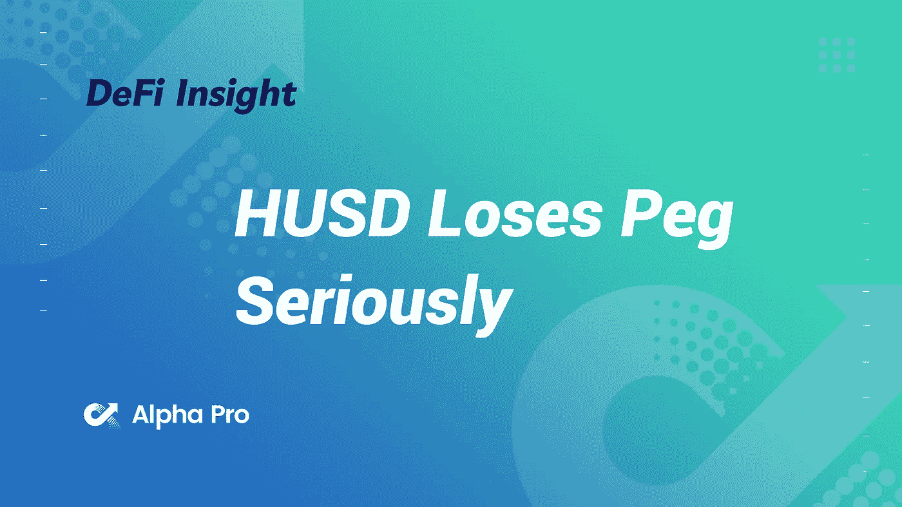
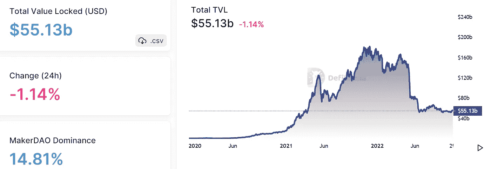
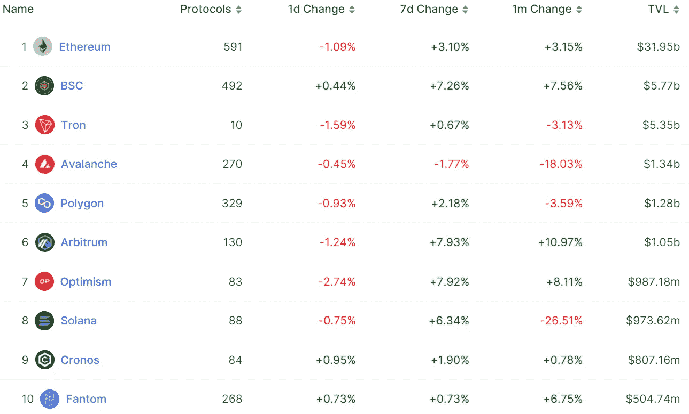
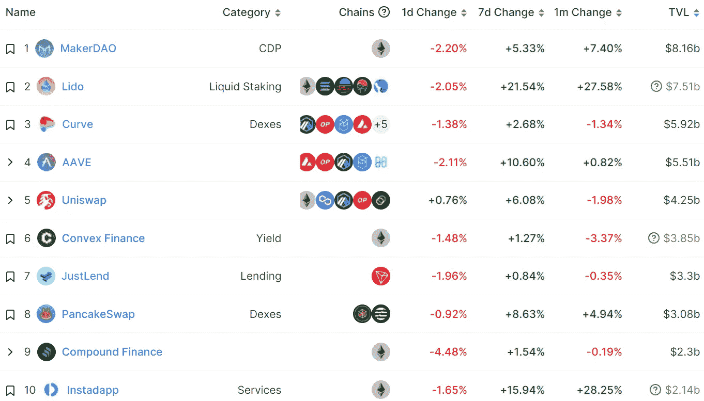
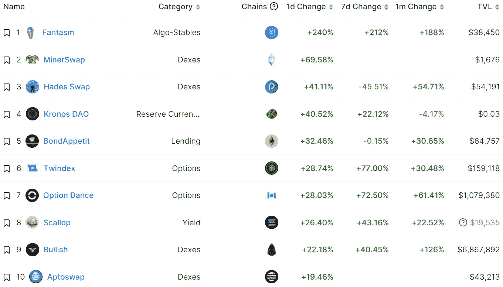
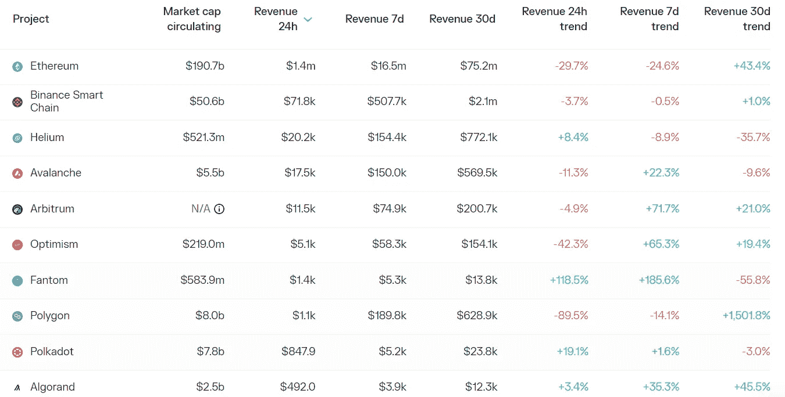
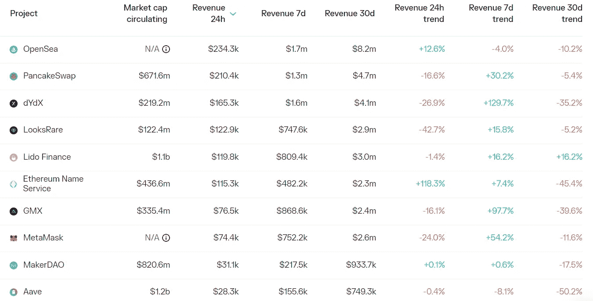

# DeFi Insight | HUSD 被火币退市后失去 Peg 严重

> 原文：<https://medium.com/coinmonks/defi-insight-husd-loses-peg-seriously-after-being-delisted-by-huobi-575135dae183?source=collection_archive---------23----------------------->

2022 年 10 月 31 日

*今日 DeFi 数据&由 DeFi Insight 为您带来的新闻*

> *曾经流行的 [HUSD 稳定币](https://coinmarketcap.com/currencies/husd/)已经从 1 美元大幅下跌，在加密交易所 Huobi 宣布周五将该资产摘牌后，跌至 28 美分的低点。*
> 
> *HUSD 目前的市值仅为 6300 万美元，远低于 2021 年超过 10 亿美元的历史最高水平。*“@*[*来源*](https://news.coincu.com/138218-husd-loses-peg-seriously-after-delisted/)*

# *最新消息*

## *第二层*

***以太坊二层总锁定量上升至51.9 亿美元，7 日上涨 9.48%***

*****zkSync 2.0 Mainnet[Baby Alpha](https://mobile.twitter.com/zksync/status/1586053698672656384)上线，2023 年初对用户开放*****

*****StarkNet 将在 Goerli 上发射第二次试验网*****

## *****第三层*****

*****基于 zkSync 的第三层区块链[机遇](https://blog.matter-labs.io/baby-alpha-has-arrived-5b10798bc623)可能于 2023 年在 Q1 推出*****

## *****指数/交易所/AMM*****

*****来源: [FTX 美国公司](https://www.theblock.co/post/181248/ftx-us-staff-relocate-miami-headquarters)鼓励员工搬迁到新的迈阿密总部*****

*****全球最大的加密平台在爱尔兰成立了另一家公司*****

*****自 2019 年以来，全球 68 家加密货币交易所已经关闭*****

## *****贷款/CDP*****

*******部署 [Aave](https://snapshot.org/#/aave.eth/proposal/0x8257d8c7681a3587a61f0d97997045c4d35815031d56386c854afa66f0d04351) V3 到 zkSync 2.0 Testnet*******

*********创世纪[贷款](https://www.theblock.co/post/181018/genesis-loan-originations-down-79-during-crypto-winter)在神秘的冬季，贷款发放量下降了 79%*********

## *******|令牌*******

*********实时摧毁的 [BNB](https://www.bnbburn.info/) 数量已经超过 13 万*********

*******62%的狗在推特整合的希望中获利*******

*********/**令牌供应总量的 1%将用于激励测试网和奖励社区的早期成员— [Sei](https://twitter.com/SeiNetwork/status/1586102864295829504)*******

## *****NFT*****

*****运动鞋游戏制造商 NFT 将在香港政府所有的数码港设立首个办事处作为地区总部*****

*******[ape coin](https://forum.apecoin.com/t/aip-134-bug-bounty-program-for-aip-21/8792)社区提出百万美元臭虫赏金计划*******

## *******政策与法规*******

*********,**[Vitalik buter in](https://twitter.com/VitalikButerin/status/1586560123287506944?s=20&t=lqd_2Gv0jcGi9wHuTjvyng)分享对监管政策目标的看法*******

*******不会反对密码社区关于[法规](https://twitter.com/SBF_FTX/status/1586402361496702976?s=20&t=TL0sUZCpBFWD3iN8J36BBg)——SBF 的政策*******

*******香港政府。重新考虑对虚拟资产交易所交易基金、令牌化证券和散户投资者的立场*******

# *******数据和分析*******

## *******锁定的总价值(TVL)*******

*******目前全网 DeFi 总锁定量为 551.3 亿美元，24 小时下降 1.14%。*******

**************

## *******TVL 评出的十大连锁酒店*******

**************

## *******|最新 TVL 十大项目*******

**************

## *******|过去 24 小时内 TVL 增长的前 10 个项目*******

**************

## *******协议收入*******

## *******|累计总收入最高的项目(24H)_ 区块链(L1)*******

**************

## *******|累计总收入最高的项目(24H) _Dapps (L2)*******

**************

# *******深潜*******

*********[**以太坊审查**](https://newsletter.banklesshq.com/p/ethereum-censored-flashbots-centralization-lido?utm_source=%2Finbox&utm_medium=reader2)*********

***** [## 以太坊审查初学者指南

### 📲使用推送协议从加密应用程序获取推送通知，Web3 的通信层打开 Web3 通知…

newsletter.banklesshq.com](https://newsletter.banklesshq.com/p/ethereum-censored-flashbots-centralization-lido?utm_source=%2Finbox&utm_medium=reader2) 

**看好** [**OPCraft**](https://metaversal.banklesshq.com/p/optimistic-on-opcraft?utm_source=%2Finbox&utm_medium=reader2)

 [## 乐观看待⛏️飞机

### 亲爱的无银行国家，本周早些时候我写了一篇关于 NFT 游戏设计有多难的文章。然而，并不是每个游戏都应该是完美的…

metaversal.banklesshq.com](https://metaversal.banklesshq.com/p/optimistic-on-opcraft?utm_source=%2Finbox&utm_medium=reader2) 

# 报告

**层层:回顾**[**Aptos**](https://www.theblockresearch.com/layer-by-layer-a-review-of-aptos-since-launch-181054)**自推出** _theblockresearch

> 基于 Move 的 L1 连锁店 Aptos 和 Sui 的预期推出在 2022 年引起了市场的极大关注，部分原因是对 MoveVM 实现的预期性能增强和新颖用户体验的好奇。
> 
> 由于 APT tokenomics 缺乏清晰度，最初推出了混乱的 token 和 mainnet，现在 Aptos 生态系统在构建实现资本灵活性和用户增长所需的核心 DeFi 产品方面进展顺利。
> 
> 在推出后的短短时间内，一些关键的基础设施已经使资本能够自由流入生态系统，同时也揭示了一些需要解决的独特挑战，以促进用户和开发者从 EVM 链迁移。

**层层:** [**BNB 链**](https://www.theblockresearch.com/layer-by-layer-bnb-chain-holds-steady-in-evolving-market-conditions-181133) **在不断变化的市场环境中保持稳定** _theblockresearch

**token insight x coin Market cap**[**Crypto 市场报告 2022 年第三季度**](https://tokeninsight.com/en/research/reports/tokeninsight-x-coinmarketcap-crypto-market-report-2022-q3)**_ token insight**

****[**索拉纳**](https://messari.io/report/state-of-solana-q3-2022?referrer=all-research)**Q3 2022**_ 梅萨里****

******[**之书【MEV】**](https://messari.io/report/the-book-of-mev-current-landscape-future-solutions-and-key-considerations?referrer=all-research)**:当前格局、未来解决方案及重点考虑** _messari******

******/**[**区块链行为**](https://dappradar.com/blog/crypto-adoption-on-the-rise-reddit-showing-the-way) **报告— Crypto 采用率上升:Reddit 指路** _dappradar****

******关于:******

****DeFi Insight 是顶级 DeFi 和加密新闻和更新的来源。****

******https://twitter.com/AlphaPro_io 推特:******

********❤RSS:**[**https://medium.com/feed/@alphapro.project**](https://medium.com/feed/@alphapro.project)******

****提供的信息应被视为发展新闻，而不是投资建议。****

> ****交易新手？尝试[加密交易机器人](/coinmonks/crypto-trading-bot-c2ffce8acb2a)或[复制交易](/coinmonks/top-10-crypto-copy-trading-platforms-for-beginners-d0c37c7d698c)*********